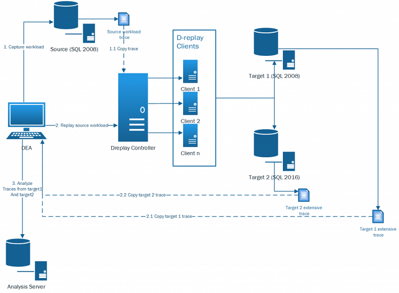

# Overview of Database Experimentation Assistant

Database Experimentation Assistant (DEA) is an experimentation solution for SQL Server upgrades. DEA can help you evaluate a targeted version of SQL Server for a specific workload. Customers who are upgrading from earlier SQL Server versions (starting with 2005) to a more recent version of SQL Server can use the analysis metrics that the tool provides. 

DEA analysis metrics include:
- Queries that have compatibility errors
- Degraded queries and query plans
- Other workload comparison data

Comparison data can lead to higher confidence and a successful upgrade experience.

For a 19-minute introduction to DEA and a demonstration, watch the following video:

> [!VIDEO https://channel9.msdn.com/Shows/Data-Exposed/Introducing-the-Database-Experimentation-Assistant/player]

## Get DEA

To install DEA, [download](https://www.microsoft.com/download/details.aspx?id=54090) the latest version of the tool. Then, run the **DatabaseExperimentationAssistant.exe** file.

## Solution architecture for comparing workloads

The following diagram shows the solution architecture for a workload comparison. The workload comparison uses DEA and Distributed Replay during an upgrade from SQL Server 2008 to SQL Server 2016.

## DEA prerequisites

Following are some prerequisites for running DEA:
- Minimum hardware requirement: A single-core machine with 3.5 GB of RAM.
- Ideal hardware requirement: An eight-core CPU (with 3.5 GB of RAM or more). Processors that have more than eight cores don't improve DEA runtimes.
- An additional 33% of performance trace size is needed to store A, B, and report analysis databases.

## Configure DEA

In the prerequisite environment architecture, we recommend that you install DEA *on the same machine as the Distributed Replay controller*. This practice avoids cross-machine calls and simplifies configuration.

### Required configuration for workload comparison by using DEA

DEA connects to database servers by using Windows authentication. Be sure that a user running DEA can connect to database servers (source, target, and analysis) by using Windows authentication.

**Capture configuration requirements**:

*   User running DEA can connect to the source database server by using Windows authentication.
*   User running DEA has sysadmin rights on the source database server.
*   Service account running the source database server has write access to the trace folder path.

For more information, see the [capture FAQ](database-experimentation-assistant-capture-trace.md#frequently-asked-questions-about-trace-capture)

**Replay configuration requirements**: 

*   User running DEA can connect to the target database server by using Windows authentication.
*   User running DEA has sysadmin rights on the target database server.
*   Service account running the target database servers has write access to the trace folder path.
*   Service account running Distributed Replay clients can connect to the target database server by using Windows authentication.
*   DEA communicates with the Distributed Replay controller by using COM interfaces. Make sure that TCP ports are opened for incoming requests on the Distributed Replay controller.

For more information, see the [replay FAQ](database-experimentation-assistant-replay-trace.md#frequently-asked-questions-about-trace-replay)

**Analysis configuration requirements**: 

*   User running DEA can connect to the analysis database server by using Windows authentication.
*   User running DEA has sysadmin rights on the source database server.

For more information, see the [analysis FAQ](database-experimentation-assistant-create-report.md#frequently-asked-questions-about-analysis-reports)

## Set up telemetry

DEA has an internet-enabled feature that can send telemetry information to Microsoft. Microsoft collects telemetry to enhance the product experience. Telemetry is optional. The information that's collected is also saved on your computer for local audit. You can always see what's collected. All log files from DEA are saved in the %temp%\\DEA folder.

You can decide which events are collected. You also decide whether collected events are sent to Microsoft. There are four types of events:

*   **TraceEvent**: Usage events for the application (for example, "triggered stop capture").
*   **Exception**: Exception thrown during application usage.
*   **DiagnosticEvent**: An event log to assist with diagnosis when problems occur (*not* sent to Microsoft).
*   **FeedbackEvent**: User feedback that's submitted through the application.

These steps show you how to choose which events are collected and whether the events are sent to Microsoft:

1.  Go to the location where DEA is installed (for example, C:\\Program Files (x86)\\Microsoft Corporation\\Database Experimentation Assistant).
2.  Open the two .config files: DEA.exe.config (for the application) and DEACmd.exe.config (for the CLI).
3.  To stop collecting a type of event, set the value of *event* (for example, **TraceEvent**) to **false**. To start collecting the event again, set the value to **true**.
4.  To stop saving local copies of events, set the value of **TraceLoggerEnabled** to **false**. To start saving local copies again, set the value to **true**.
5.  To stop sending events to Microsoft, set the value of **AppInsightsLoggerEnabled** to **false**. To start sending events to Microsoft again, set the value to **true**.

DEA is governed by the [Microsoft Privacy Statement](https://aka.ms/dea-privacy).

## Next steps

[Get started](database-experimentation-assistant-get-started.md) walks you through the steps required to capture, replay, and analyze a trace.
