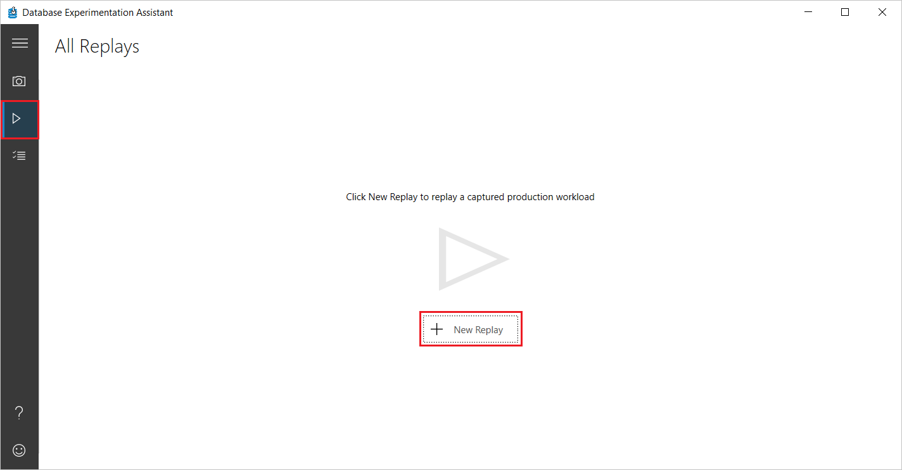
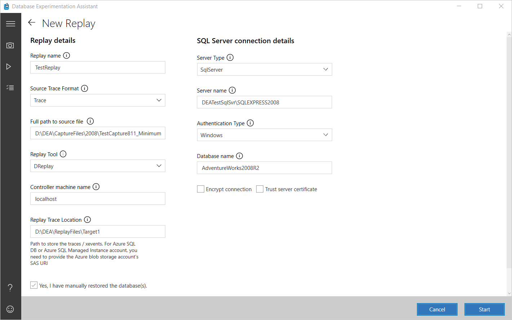
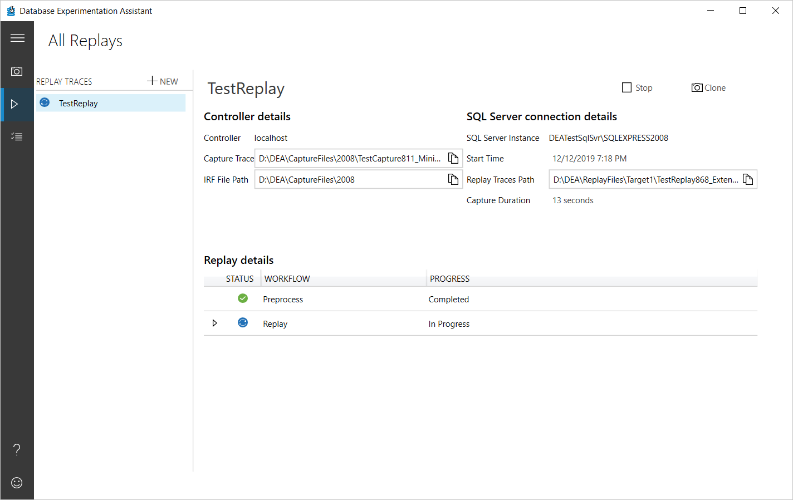
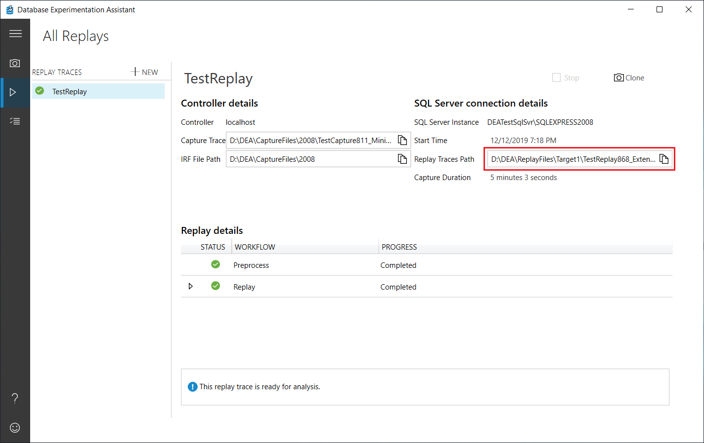

# Replay a trace in Database Experimentation Assistant

In Database Experimentation Assistant (DEA), you can replay a captured trace file against an upgraded test environment. For example, consider a production workload that runs on SQL Server 2008 R2. The trace file for the workload must be replayed twice: one time on an environment with the same version of SQL Server that runs in production and a second time on an environment that has the upgrade target SQL Server version, such as SQL Server 2016.

> [!NOTE]
> Replaying a trace requires that you manually set up virtual machines or physical computers to run Distributed Replay traces. For more information, see [Configure Distributed Replay for Database Experimentation Assistant](database-experimentation-assistant-configure-replay.md).
>

## Configure a trace replay for target 1

First, you need to perform a trace replay against target 1, which represents your existing production environment.

1. In DEA, on the left-hand navigation bar, select the arrow icon, and then on the **All Replays** page, select **New Replay**.

    

    > [!NOTE]
    > The Distributed Replay controller computer requires permissions to the user account that you use to remotely connect.

2. On the **New Replay** page, under **Replay details**, enter or select the following information:

    - **Replay name**: Enter a name for the trace replay.
    - **Source Trace Format**: Specify the format (Trace or XEvents) of the source trace file.
    - **Full path to source file**: Specify the full path to the source trace file. If using DReplay, the file must  exist on the computer serving as the DReplay Controller and the user account requires access to the file and folder.
    - **Replay Tool**: Specify the replay tool (DReplay or InBuilt).
    - **Controller machine name**: Specify the name of the computer serving as the Distributed Replay Controller.
    - **Replay Trace Location**: Specify the path to store trace files/XEvents associated with the trace replay.

        > [!NOTE]
        > For an Azure SQL Database or an Azure SQL Managed Instance, you need to provide the SAS URI of the Azure Blob Storage account.

3. Verify that you have restored the database(s) by selecting the **Yes, I have manually restored the database(s)** check box.

4. Under **SQL Server connection details**, enter or select the following information:

    - **Server Type**: Specify the type of the SQL server (**SqlServer**, **AzureSqlDb**, **AzureSqlManagedInstance**).
    - **Server name**: Specify the server name or IP address of your SQL Server.
    - **Authentication Type**: For the authentication type, select **Windows**.
    - **Database name**: Enter a name for a database on which to start a server-side trace. If you don't specify a database, trace is captured on all the databases on the server.

5. Select or deselect the **Encrypt connection** and **Trust server certificate** check boxes as appropriate for your scenario.

    

## Start the trace replay on target 1

- After you enter or select the required information, select **Start** to initiate the trace replay.

  If the information you entered is valid, the Distributed Replay process starts. Otherwise, the text boxes that have incorrect information are highlighted with red. Make sure that the values you entered are correct, and then select **Start**.

  

  You can monitor the process as necessary. When the replay is finished running, DEA will store the results in a file at the location you specified.

  

## Perform the trace replay against target 2

After you finish performing the trace replay against target 1, you need to do the same against your second target, which represents the intended upgrade environment.

1. Configure a trace replay, this time using details associated with your target 2 environment.
2. Start the trace replay on target 2.

   You can monitor the process as necessary. When the replay is finished running, DEA will store the results in a file at the location you specified.

## Frequently asked questions about trace replay

**Q: What security permissions do I need to start a replay capture on my target server?**

- The Windows user that's running the trace operation in the DEA application must have sysadmin rights on the target computer running SQL Server. These user rights are required to start a trace.
- The service account under which the target computer running SQL Server is running must have write access to the specified trace file path.
- The service account under which the Distributed Replay Client services are running must have user rights to connect to the target computer running SQL Server and to execute queries.

**Q: Can I start more than one replay in the same session?**

Yes, you can start multiple replays and track them to completion in the same session.

**Q: Can I start more than one replay in parallel?**

Yes, but not with the same set of computers selected in **Controller plus Clients**. The controller and clients will be busy. Set up a separate set of computers under **Controller plus Client** to start a parallel replay.

**Q: How long does a replay typically take to finish?**

A replay typically takes the same amount of time as the source trace plus the amount of time it takes to preprocess the source trace. However, if the client computers that are registered with the controller aren't sufficient to manage the load that's produced from the replay, the replay might take longer to complete. You can register up to 16 client computers with the controller.

**Q: How large are the target trace files?**

The target trace files can be between 5 and 15  times the size of the source trace. The file size is based on how many queries are run. For instance, query plan blobs might be large. If the statistics for these queries change often, more events are captured.

**Q: Why do I need to restore databases?**

SQL Server is a stateful relational database management system. To properly run an A/B test, the state of the database must be retained at all times. Otherwise, you might see errors in queries during replay that won't appear in production. To prevent these errors, we recommend that you take a backup right before the source capture. Similarly, restoring the backup on the target computer running SQL Server is required to prevent errors during replay.

**Q: What does "pass %" on the replay page mean?**

**Pass %** means that only a percentage of queries passed. You can diagnose whether the number of errors is expected. The errors might be expected, or the errors might occur because the database has lost its integrity. If the value for **pass %** isn't what you expect, you can stop the trace and look at the trace file in SQL Profiler to see which queries didn't succeed.

**Q: How can I look at the trace events that were collected during replay?**

Open a target trace file and view it in SQL Profiler. Or, if you want to make modifications to the replay capture, all the SQL Server scripts are available at C:\\Program Files (x86)\\Microsoft Corporation\\Database Experimentation Assistant\\Scripts\\StartReplayCapture.sql.

**Q: What trace events does DEA collect during replay?**

DEA captures trace events that contain performance-related information. The capture configuration is in the StartReplayCaptureTrace.sql script. These events are typical SQL Server trace events that are listed in the [sp_trace_setevent (Transact-SQL) reference documentation](../relational-databases/system-stored-procedures/sp-trace-setevent-transact-sql.md).

## Troubleshoot trace replay

**Q: Why can't I connect to the computer that's running SQL Server?**

- Confirm that the name of the computer running SQL Server is valid. To confirm, try to connect to the server by using SQL Server Management Studio (SSMS).
- Confirm that the firewall configuration doesn't block connections to the computer running SQL Server.
- Confirm that the user has the required user rights.
- Confirm that the Distributed Replay client's service account has access to the computer running SQL Server.

You can get more details in the logs in %temp%\\DEA. If the problem persists, contact the product team.

**Q: Why can't I connect to the Distributed Replay controller?**

- Verify that the Distributed Replay controller service is running on the controller machine. To verify, use the Distributed Replay Management Tools (run the command `dreplay.exe status -f 1`).
- If the replay is started remotely:
  - Confirm that the computer running DEA can successfully ping the controller. Confirm that firewall settings allow connections per the instructions on the **Configure Replay Environment** page. For more information, see the article [SQL Server Distributed Replay](../tools/distributed-replay/sql-server-distributed-replay.md).
  - Make sure that DCOM Remote Launch and Remote Activation are allowed for the user of the Distributed Replay controller.
  - Make sure that DCOM Remote Access user rights are allowed for the user of the Distributed Replay controller.

**Q: The trace file path exists on my computer. Why can't Distributed Replay controller find it?**

Distributed Replay can access only local disk resources. You must copy source trace files to the Distributed Replay controller machine before you start the replay. Also, you must provide the path on the DEA **New Replay** page.

UNC paths aren't compatible with Distributed Replay. Distributed Replay paths must be local, absolute paths to the first source trace file, including extension.

**Q: Why can't I browse for files on the New Replay page?**

Because we can't browse folders on a remote computer, browsing for files isn't useful. It's more efficient to copy and paste the absolute paths.

**Q: I started replay with a trace but Distributed Replay didn't replay any events. Why?**

This issue might occur because the trace file doesn't have either the replayable events or the have information about how to replay events. Confirm whether the trace file path provided points to a source trace file. The source trace file is created by using the configuration provided in the StartCaptureTrace.sql script.

**Q: I see "Unexpected error occurred!" when I try to preprocess my trace files by using the SQL Server 2017 Distributed Replay controller. Why?**

This issue is known in the RTM version of SQL Server 2017. For more information, see [Unexpected error when you use the DReplay feature to replay a captured trace in SQL Server 2017](https://support.microsoft.com/help/4045678/fix-unexpected-error-when-you-use-the-dreplay-feature-to-replay-a).  
  
The issue has been addressed in the latest Cumulative Update 1 for SQL Server 2017. Download the latest version of [Cumulative Update 1 for SQL Server 2017](https://support.microsoft.com/help/4038634/cumulative-update-1-for-sql-server-2017).

## See also

- To create an analysis report that helps you gain insights on proposed changes, see [Create reports](database-experimentation-assistant-create-report.md).
