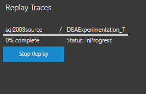

# Replay a trace in Database Experimentation Assistant

In Database Experimentation Assistant (DEA), you can replay a captured trace file against an upgraded test environment. For example, consider a production workload that runs on SQL Server 2008 R2. The trace file for the workload must be replayed twice: once on an environment with the same version of SQL Server that runs on production and again on an environment that has the upgrade target SQL Server version, such as SQL Server 2016.

> [!NOTE]
> To run this action, you must manually set up virtual machines or physical machines to run Distributed Replay traces. For more information, see [Distributed Replay controller and clients setup](https://blogs.msdn.microsoft.com/datamigration/distributed-replay-controller-and-client-setup/).
>
>

## Create a trace replay

In DEA, select the menu icon. In the expanded menu, select **Replay Traces** next to the play icon.

> [!NOTE]
> The Distributed Replay controller machine requires permissions to the user account that you use to remote.
>

### Grant access to the Distributed Replay controller

1. At a command prompt, enter **dcomcnfg** to open the **Component Services** interface.
1. Expand **Component Services** > **Computers** > **My Computer** > **DCOM Config** > **DReplayController**.
1. Right-click **DReplayController**, and then select **Properties**.
1. On the **Security** tab, select **Edit** to add the user account.
1. Select **OK**.

### Verify setup

1.  **SQL Server install path**: Enter the path to where SQL Server is installed. For example, C:\\Program Files (x86)\\Microsoft SQL Server\\120.
1.  **Controller machine name**: Enter a name for the machine that has been set up as the controller. This machine is running the Windows service named SQL Server Distributed Replay controller. The Distributed Replay controller orchestrates the actions of the Distributed Replay clients. There can only be one controller instance in each Distributed Replay environment.
1.  **Client machine names**: Enter a name for each client machine, separated by commas. Example: client1, client2. You can have up to five client controllers. Clients are one or more machines, either physical or virtual, that run the Windows service named SQL Server Distributed Replay client. The Distributed Replay clients work together to simulate workloads against an instance of SQL Server. There can be one or more clients in each Distributed Replay environment.
1.  Select **Next**.

### Select a trace

1.  **Path to trace file**: Enter the path to the input trace (.trc) file.
1.  **Path to store replay preprocess output**:  
    \- If you don't already have the IRF file, enter the path to the location where you want to store the IRF file and other preprocess outputs.  
    \- If you already have the IRF file, enter the path to the IRF files.
1. Select **Next**.

### Replay a trace

1.  **Trace file name**: Enter a trace file name.
1.  **Max file size (MB)**: Enter a trace file rollover size value. The default is 200 MB. You can enter a custom value.
1.  **Path to store replay trace output**: Enter the path for the output .trc file.
1.  **SQL Server instance name**:  Enter the name of the SQL Server instance on which to replay traces.
1.  Select **Start**.

If the information you entered is valid, the Distributed Replay process starts. Otherwise, the text boses that have incorrect information are highlighted with red. Make sure that the values you entered are correct, and then select **Start**.

Wait until the replay is finished running to see the location that you specified. Select the bell icon at the bottom of the left menu to monitor the replay progress.

## Frequently asked questions about trace replay

### What security permissions do I need to start a replay capture on my target server?

- The Windows user that's running the trace operation in the DEA application must have sysadmin rights on the target computer running SQL Server. These user rights are required to start a trace.
- The service account under which the target computer running SQL Server is running must have write access to the specified trace file path.
- The service account under which the Distributed Replay Client services are running must have user rights to connect to the target computer running SQL Server and to execute queries.

### Can I start more than one replay in the same session?

Yes, you can start multiple replays and track them to completion in the same session.

### Can I start more than one replay in parallel?

Yes, but not with the same set of machines selected in **Controller plus Clients**. The controller and clients will be busy. Set up a separate set of machines under **Controller plus Client** to start a parallel replay.

### How long does a replay typically take to finish?

A replay typically takes the same amount of time as the source trace plus the amount of time it takes to preprocess the source trace. However, if the client machines that are registered with the controller aren't sufficient to manage the load that's produced from the replay, the replay might take longer to complete. You can register up to 16 client machines with the controller.

### How large do target trace files get?

The target trace files might be between 5 and 15 times the size of the source trace. The file size is based on how many queries are run. For instance, query plan blobs might be large. If the statistics for these queries change often, more events are captured.

### Why do I need to restore databases?

SQL Server is a stateful relational database management system. To properly run an A/B test, the state of the database must be retained at all times. Otherwise, you might see errors in queries during replay that won't appear in production. To prevent these errors, we recommend that you take a backup right before the source capture. Similarly, restoring the backup on the target computer running SQL Server is required to prevent errors during replay.

### What does "pass %" on the replay page mean?

**Pass %** means that only a percentage of queries passed. You can diagnose whether the number of errors is expected. The errors might be expected, or the errors might occur because the database has lost its integrity. If the value for **pass %** isn't what you expect, you can stop the trace and look at the trace file in SQL Profiler to see which queries didn't succeed.

### How can I look at the trace events that were collected during replay?

Open a target trace file and view it in SQL Profiler. Or, if you want to make modifications to the replay capture, all the SQL Server scripts are available at C:\\Program Files (x86)\\Microsoft Corporation\\Database Experimentation Assistant\\Scripts\\StartReplayCapture.sql.

### What trace events does DEA collect during replay?

DEA captures trace events that contain performance-related information. The capture configuration is in the StartReplayCaptureTrace.sql script. These events are typical SQL Server trace events that are listed in the [sp_trace_setevent (Transact-SQL) reference documentation](https://docs.microsoft.com/sql/relational-databases/system-stored-procedures/sp-trace-setevent-transact-sql).

## Troubleshoot trace replay

### I can't connect to the computer that's running SQL Server

- Confirm that the name of the computer running SQL Server is valid. To confirm, try to connect to the server by using SQL Server Management Studio (SSMS).
- Confirm that the firewall configuration doesn't block connections to the computer running SQL Server.
- Confirm that the user has the required user rights.
- Confirm that the Distributed Replay client's service account has access to the computer running SQL Server.

You can get more details in the logs in %temp%\\DEA. If the problem persists, contact the product team.

### I can't connect to the Distributed Replay controller

- Verify that the Distributed Replay controller service is running on the controller machine. To verify, use the Distributed Replay Management Tools (run the command `dreplay.exe status -f 1`).
- If the replay is started remotely:
  - Confirm that the machine running DEA can successfully ping the controller. Confirm that firewall settings allow connections per the instructions on the **Configure Replay Environment** page. For more infomation, see the article [SQL Server Distributed Replay](https://docs.microsoft.com/sql/tools/distributed-replay/sql-server-distributed-replay?view=sql-server-2017).
  - Make sure that DCOM Remote Launch and Remote Activation are allowed for the user of the Distributed Replay controller.
  - Make sure that DCOM Remote Access user rights are allowed for the user of Distributed Replay controller.

### The trace file path exists on my machine. Why can't Distributed Replay controller find it?

Distributed Replay can access only local disk resources. You must copy source trace files to the Distributed Replay controller machine before you start the replay. Also, you must provide the path on the DEA **New Replay** page. 

UNC paths aren't compatible with Distributed Replay. Distributed Replay paths must be local, absolute paths to the first source trace file, including extension.

### Why can't I browse for files on the New Replay page?

Because we can't browse a remote machine's folders, browsing for files isn't useful. Copying and pasting the absolute paths is more efficient.

### I started replay with a trace but Distributed Replay didn't replay any events

This issue might occur because the trace file either doesn't have replayable events or it doesn't have information about how to replay events. Confirm whether the trace file path provided is a source trace file. The source trace file is created by using the configuration provided in the StartCaptureTrace.sql script.

### I see "Unexpected error occurred!" when I try to preprocess my trace files by using the SQL Server 2017 Distributed Replay controller

This issue is known in the RTM version of SQL Server 2017. For more information, see [Unexpected error when you use the DReplay feature to replay a captured trace in SQL Server 2017](https://support.microsoft.com/help/4045678/fix-unexpected-error-when-you-use-the-dreplay-feature-to-replay-a).  
  
The issue has been addressed in the latest Cumulative Update 1 for SQL Server 2017. Download the latest version of [Cumulative Update 1 for SQL Server 2017](https://support.microsoft.com/help/4038634/cumulative-update-1-for-sql-server-2017).

## Next steps

- To create an analysis report that helps you gain insights on proposed changes, see [Create reports](database-experimentation-assistant-create-report.md).

- For a 19-minute introduction to DEA and demonstration, watch the following video:

  > [!VIDEO https://channel9.msdn.com/Shows/Data-Exposed/Introducing-the-Database-Experimentation-Assistant/player]
