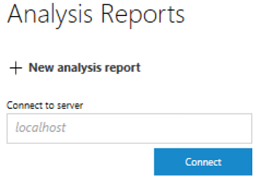
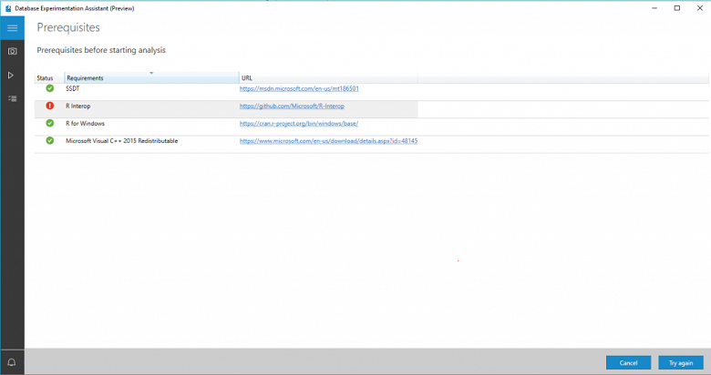
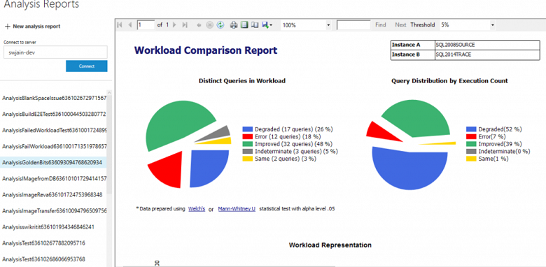
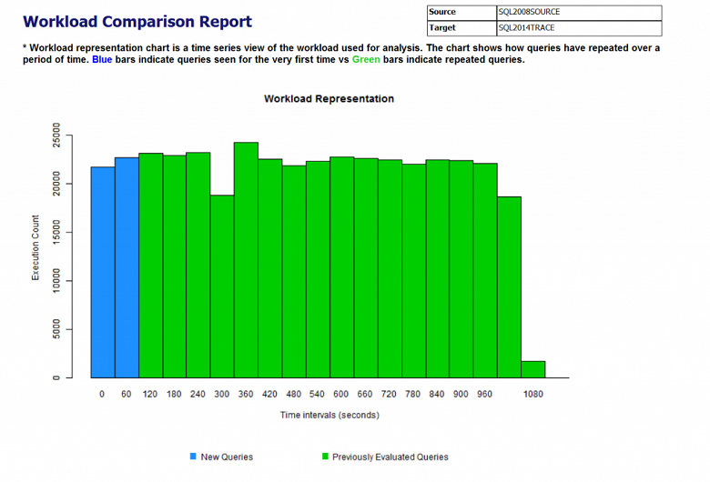
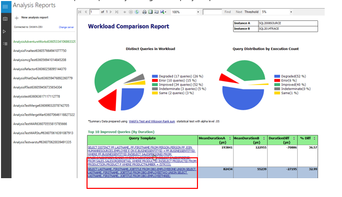
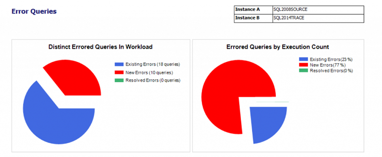

# View analysis reports in Database Experimentation Assistant

After you [create your analysis report](database-experimentation-assistant-create-report.md) in Database Experimentation Assistant (DEA), complete the steps described in this article to view the report and gain performance insights provided by your A/B test.

## Select a server

In DEA, select the menu icon. In the expanded menu, select **Analysis Reports** next to the checklist icon to open the Analysis Reports window.

Under **Analysis Reports**, enter the name of a computer running SQL Server that has an analysis database. Select **Connect**. 

If you're missing any dependencies, the **Prerequisites** page prompts you with links to install them. Install the prerequisites, and then select **Try again**.

## Select an analysis report to view

In the list of analysis reports, double-click a report to open it.

You can get insights into how well your workload is represented, as shown in this example chart:

## View and understand the analysis report

This section walks you through the analysis report.

### Query categories

Select different slices of the left pie chart to show only the queries that fall under that category.

- **Degraded queries**: Queries that performed better in A than in B.  
- **Errors**: Queries that show errors in instance B but not in instance A.  
- **Improved queries**: Queries that ran better in instance B than in instance A.  
- **Indeterminate queries**: Queries that had an indeterminate performance change.  
- **Same**: Queries in which performance stayed the same across instances A and B.

### Individual query drill-down

You can select the query template links to see more detailed information about specific queries.

Select a specific query to open a comparison summary for the query.

You can see the A and B instances that the query ran on. You can also see a template of what the query might look like. A table displays query information that is specific to instances A and B.

### Error queries

The comparison summary report has expandable **Error Information** and **Query Plan Information** sections. The sections show the errors and plan information for both instances.

Select the error (red) pie to show these types of errors:
- **Existing errors**: Errors that were in A.
- **New errors**: Errors that were in B.
- **Resolved errors**: Errors that were in A but not in B.

## Next steps

- To learn how to generate an analysis report at a command prompt, see [Run at command prompt](database-experimentation-assistant-run-command-prompt.md).

- For a 19-minute introduction to DEA and demonstration, watch the following video:

  > [!VIDEO https://channel9.msdn.com/Shows/Data-Exposed/Introducing-the-Database-Experimentation-Assistant/player]
