# Assess an application's data access layer with Data Migration Assistant

Applications typically connect and persist data to a database. The data access layer of the application provides simplified access to this data. Data Migration Assistant (DMA) enables you to assess your databases and related objects. The latest version of DMA (v5.0) introduces support for analyzing database connectivity and embedded SQL queries in the application code.

Consider this C# code segment:

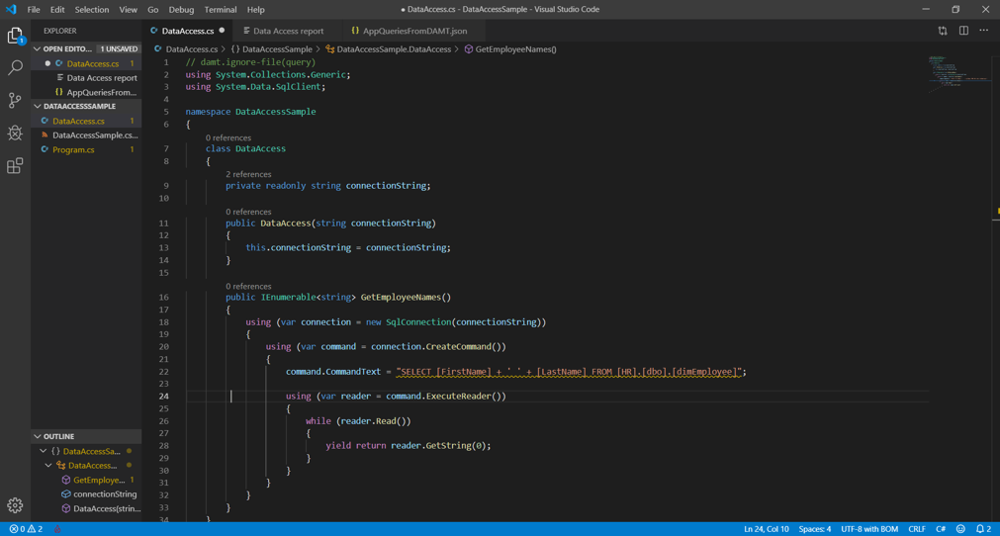

In this case, you can see that the application is using a SQL query to get the name of an employee.

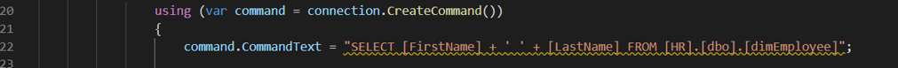

As an application owner, you need to be able to identify the various databases that the application can connect to and the queries embedded in the application's data access layer. In addition, you need to identify any changes required to modernize the application to Azure Data services.

## Assess an application with Data Access Migration Toolkit

To enable this assessment, use the Data Access Migration Toolkit (DAMT), a Visual Studio Code extension. The latest version of this extension (v 0.2) adds support for .NET applications and T-SQL dialect.

1. Download and install [VS Code](https://code.visualstudio.com/download).
2. Enable the [Data Access Migration Toolkit extension](https://marketplace.visualstudio.com/items?itemName=ms-databasemigration.data-access-migration-toolkit) from the Extensions Marketplace.

   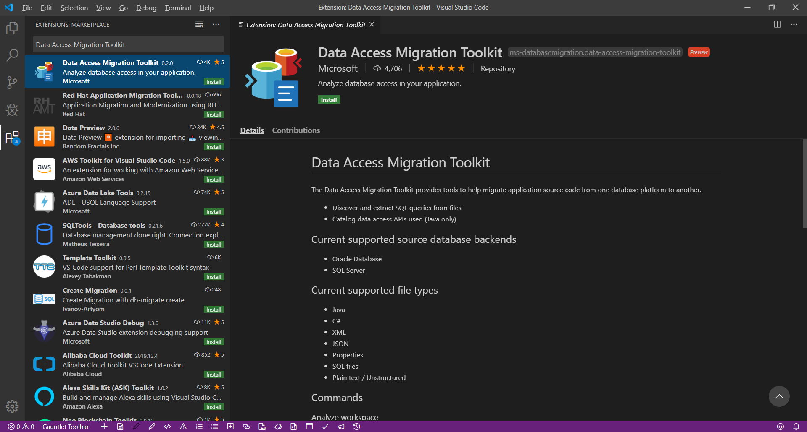

3. Open the application project in Visual Studio Code.

   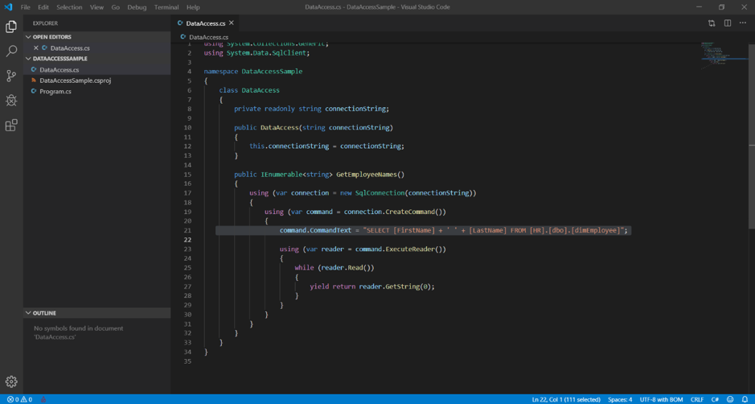

4. Press **Ctrl**+**Shift**+**P** to start the extension console and then run the **Data Access: Analyze Workspace** command.

   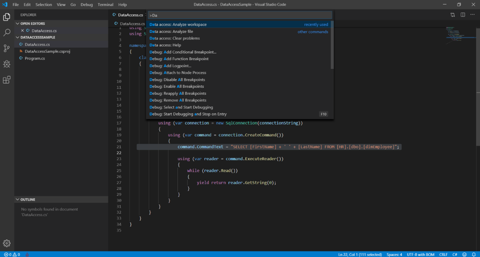

5. Select the SQL Server dialect.

   

   At the end of the analysis, the command produces a report of SQL connectivity commands and queries.

   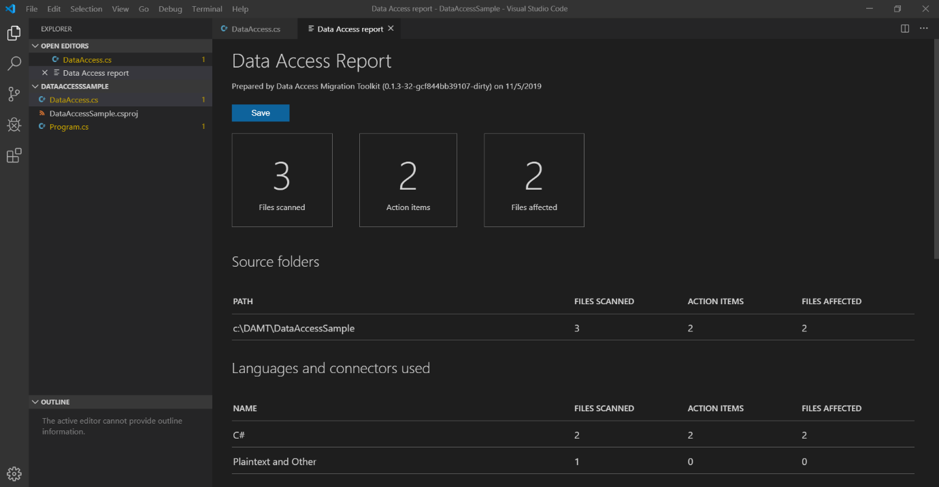

6. Review the report for data connectivity components and for SQL queries embedded in the application code. These elements appear highlighted.

   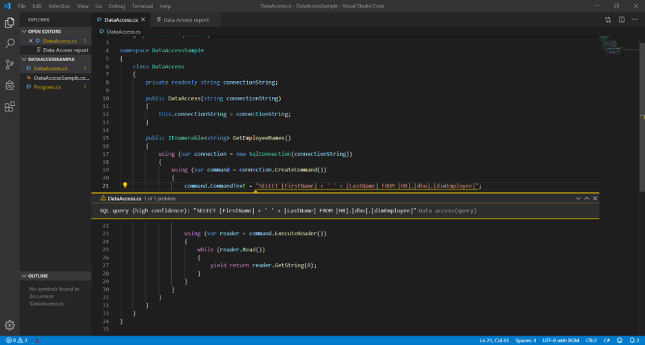

   These queries can be analyzed through DMA for compatibility and feature parity issues based on the target SQL platform.

7. To assess the application's data layer, export the report in JSON format.

   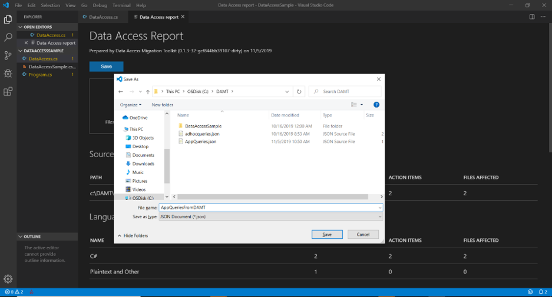

   In this case, the generated file has these contents:

   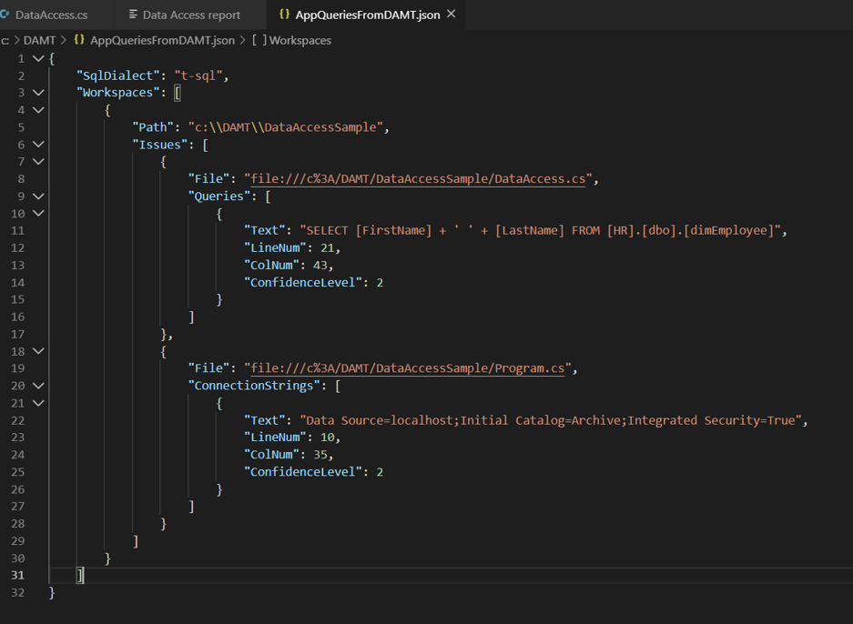

   Data Migration Assistant enables assessing the queries identified in the application within the context of modernizing the database to Azure Data platform.

8. Start Data Migration Assistant, and then create an assessment project.

   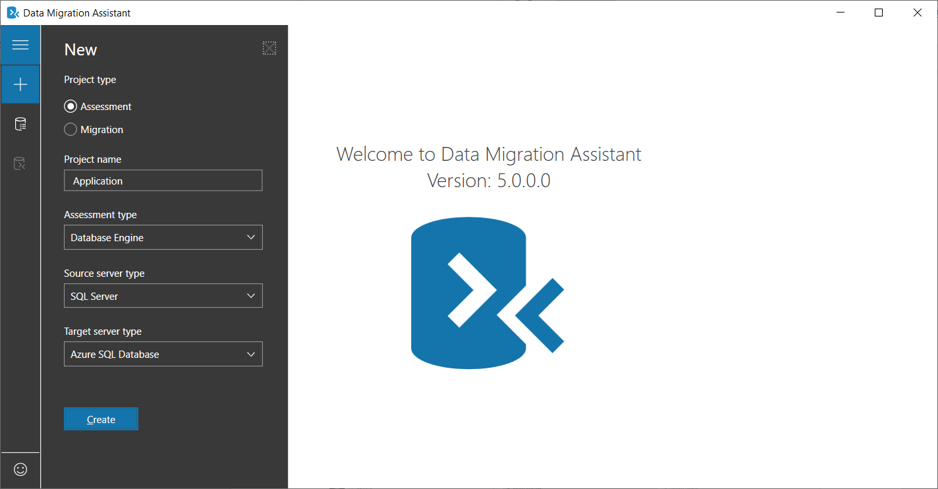

9. Select the source SQL Server instance.

   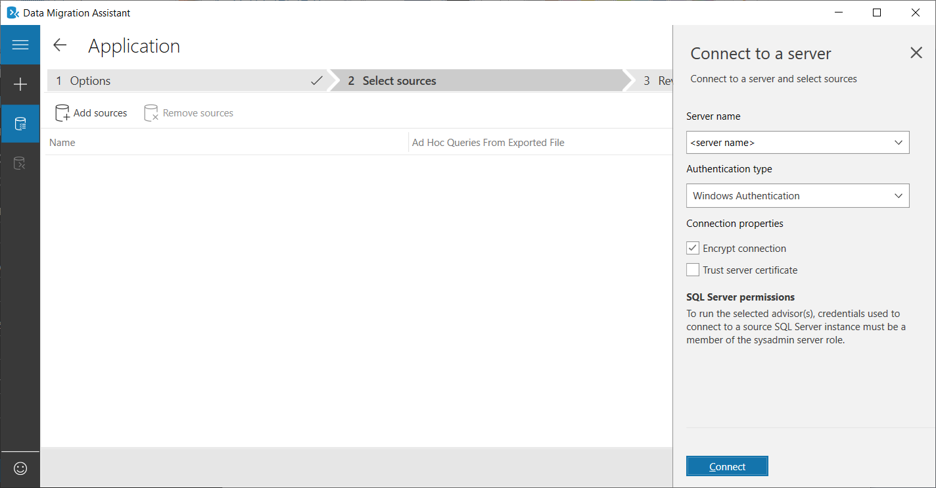

10. Select the database to which the application is connecting.

    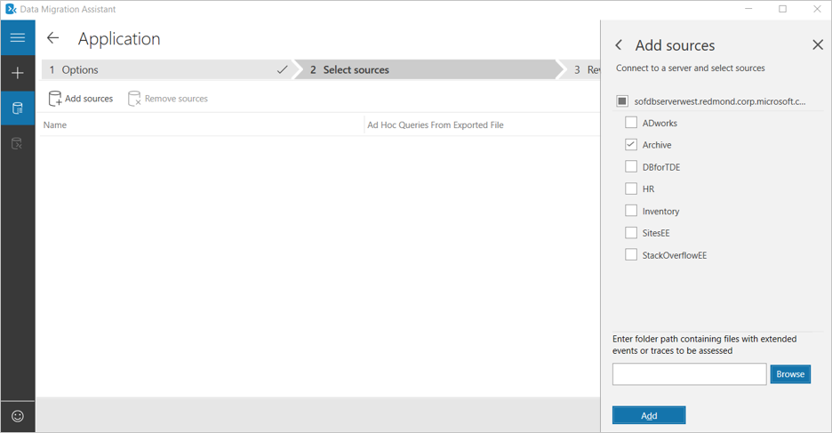

    To facilitate data access assessment, DMA introduces the ability to include JSON files with application queries. Next, include the JSON file created earlier with the application queries.

11. Select the database and browse to the JSON file exported from Data Access Migration Toolkit to include the queries from the application for the assessment.

    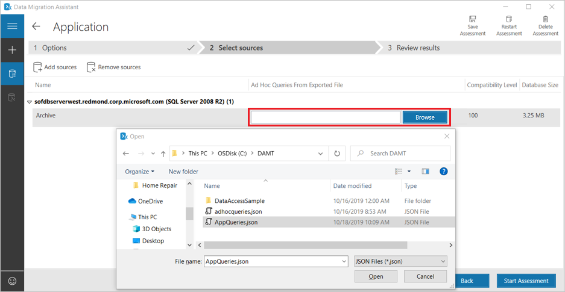

12. Select **Start Assessment**.

    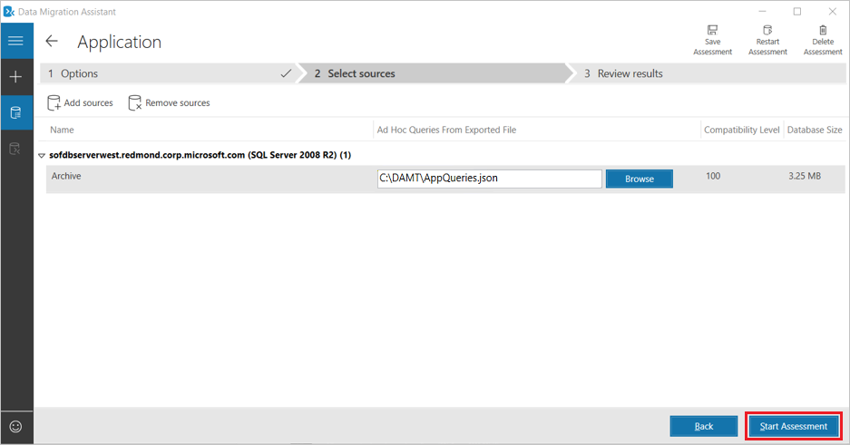

13. Review the assessment report. The generated report includes any compatibility or feature parity issues detected in the application queries as shown below.

    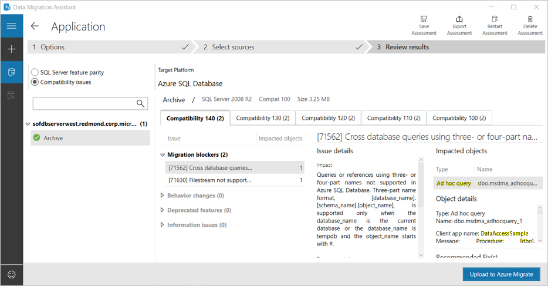

Now, in addition to having the database perspective of the migration, users also have a view from the application perspective.

## See also

* [Overview of Data Migration Assistant](../dma/dma-overview.md)
* [Data Migration Assistant: Configuration settings](../dma/dma-configurationsettings.md)
* [Data Migration Assistant: Best Practices](../dma/dma-bestpractices.md)
* [Data Access Migration Toolkit](https://marketplace.visualstudio.com/items?itemName=ms-databasemigration.data-access-migration-toolkit)
