# Assess the readiness of a SQL Server data estate migrating to Azure SQL Database using the Data Migration Assistant

Migrating hundreds of SQL Server instances and thousands of databases to Azure SQL Database or Azure SQL Managed Instance, our Platform as a Service (PaaS) offerings, is a considerable task. To streamline the process as much as possible, you need to feel confident about your relative readiness for migration. Identifying low-hanging fruit, including the servers and databases that are fully ready or that require minimal effort to prepare for migration, eases and accelerates your efforts.

This article provides step-by-step instructions for leveraging the [Data Migration Assistant](./dma-overview.md) to summarize readiness results and surface them on the [Azure Migrate](https://portal.azure.com/?feature.customPortal=false#blade/Microsoft_Azure_Migrate/AmhResourceMenuBlade/overview) hub.

[!INCLUDE [online-offline](../includes/azure-migrate-to-assess-sql-data-estate.md)]

> [!VIDEO https://channel9.msdn.com/Shows/Data-Exposed/Data-Migration-Assistant/player?WT.mc_id=dataexposed-c9-niner]

## Create a project and add a tool

Set up a new Azure Migrate project in an Azure subscription, and then add a tool.

An Azure Migrate project is used to store discovery, assessment, and migration metadata collected from the environment you're assessing or migrating. You also use a project to track discovered assets and to orchestrate assessment and migration.

1. Sign in to the Azure portal, select **All services**, and then search for Azure Migrate.
2. Under **Services**, select **Azure Migrate**.

   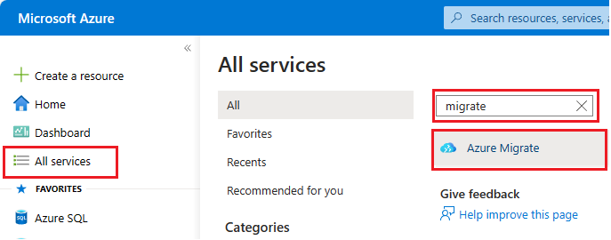

3. On the **Overview** page, select **Assess and migrate databases**.

   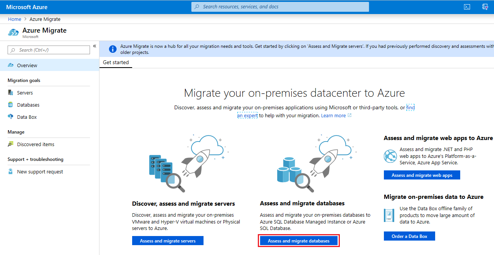

4. In **Databases**, under **Getting started**, select **Add tool(s)**.

   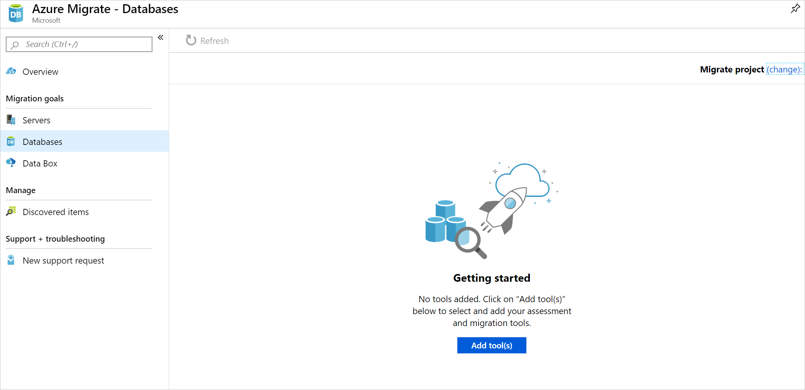

5. On the **Migrate project** tab, select your Azure subscription and resource group (if you don't already have a resource group, create one).
6. Under **Project Details**, specify the project name and the geography in which you want to create the project.

    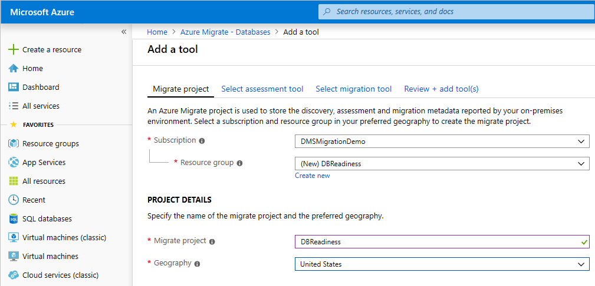

    You can create an Azure Migrate project in any of these geographies.

    | **Geography**  | **Storage location region** |
    | ------------- | ------------- |
    | Asia | Southeast Asia or East Asia |
    | Europe | South Europe or West Europe |
    | United Kingdom | UK South or UK West |
    | United States | Central US or West US 2 |

    The geography specified for the project is only used to store the metadata gathered from on-premises VMs. You can select any target region for the actual migration.

7. Select **Next**, and then add an assessment tool.

   > [!NOTE]
   > When you create a project, you must add at least one assessment or migration tool.

8. On the **Select assessment tool** tab, **Azure Migrate: Database Assessment** appears as the assessment tool to add. If you don't currently need an assessment tool, select the **Skip adding an assessment tool for now** check box. Select **Next**.

    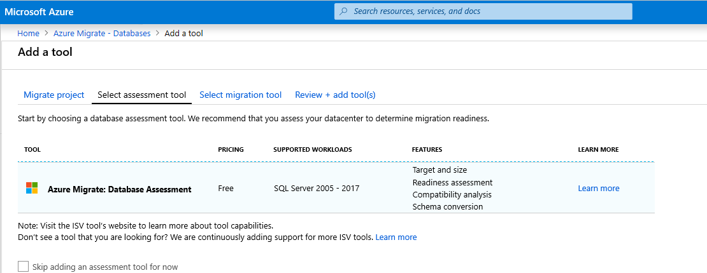

9. On the **Select migration tool** tab, **Azure Migrate: Database Migration** appears as the migration tool to add. If you don't currently need a migration tool, select the **Skip adding a migration tool for now**. Select **Next**.

    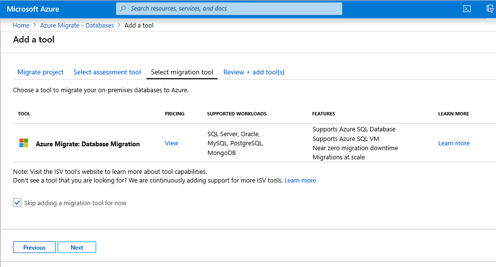

10. In **Review + add tools**, review the settings, and the select **Add tools**.

    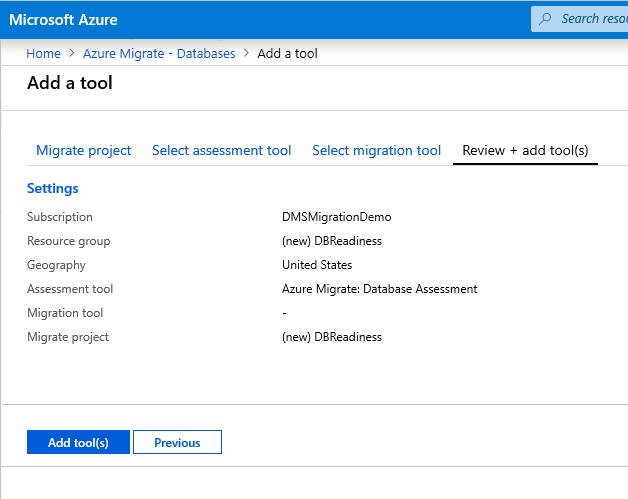

    After creating the project, you can select additional tools for assessment and migration of servers and workloads, databases, and web apps.

## Assess and upload assessment results

After you successfully create a migration project, under **Assessment tools**, in the **Azure Migrate: Database Assessment** box, instructions for downloading and using the Data Migration Assistant tool display.

   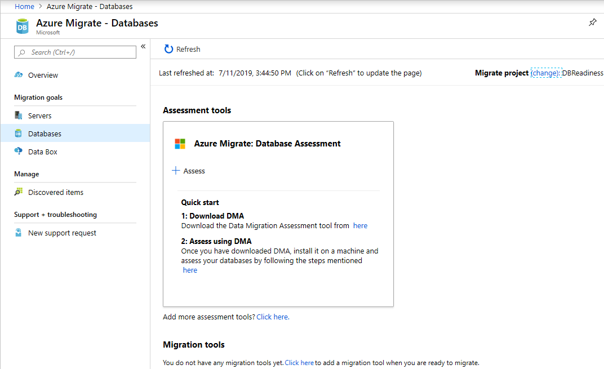

1. Download Data Migration Assistant using the link provided, and then install it on a computer with access to your source SQL Server instances.
2. Start Data Migration Assistant.

### Create an assessment

1. On the left, select the **+** icon, and then select the assessment **Project type**
2. Specify the project name, and then select the source server and target server types.

    If you're upgrading your on-premises SQL Server instance to a later version of SQL Server or to SQL Server hosted on an Azure VM, set the source and target server type to **SQL Server**. Set the target server type to **Azure SQL Managed Instance** for an Azure SQL Database (PaaS) target readiness assessment.

3. Select **Create**.

   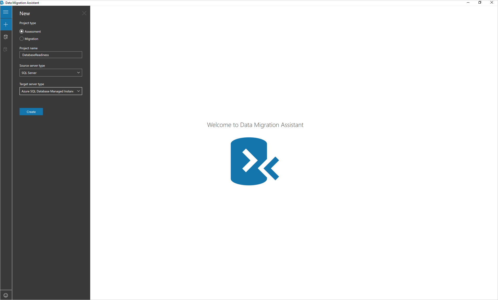

### Choose assessment options

1. Select the report type.

    You can choose one or both of the following report types:
    * Check database compatibility
    * Check feature parity

   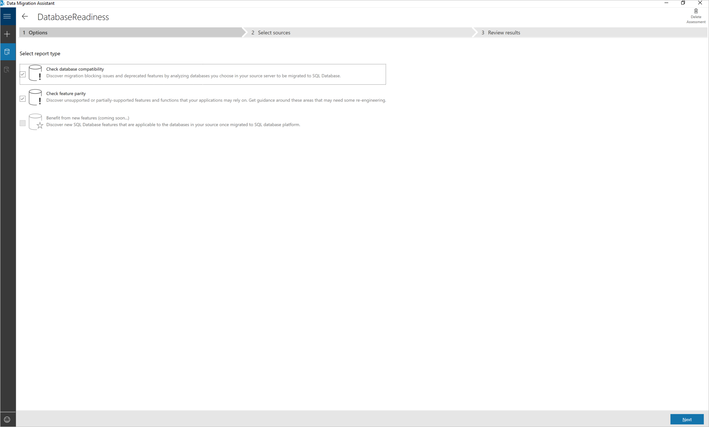

2. Select **Next**.

### Add databases to assess

1. Select **Add Sources** to open the connection fly out menu.
2. Enter the SQL server instance name, choose the authentication type, set the correct connection properties, and then select **Connect**.
3. Select the databases to assess, and then select **Add**.

   > [!NOTE]
   > You can remove multiple databases by selecting them while holding the Shift or Ctrl key, and then clicking Remove Sources. You can also add databases from multiple SQL Server instances by using the Add Sources button.

4. Select **Next** to start the assessment.

   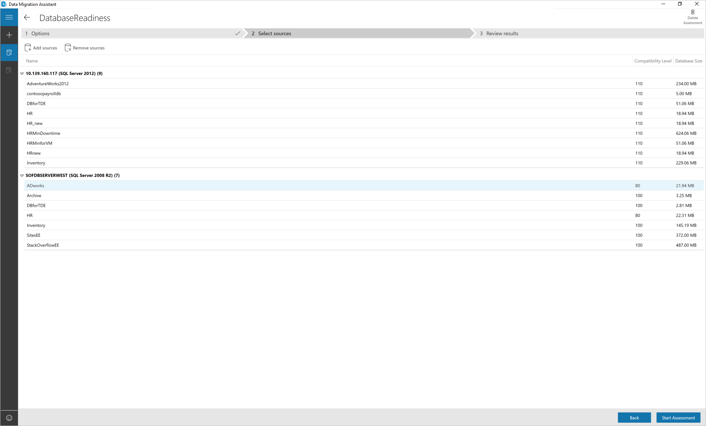

5. After the assessment completes, select **Upload to Azure Migrate**.

   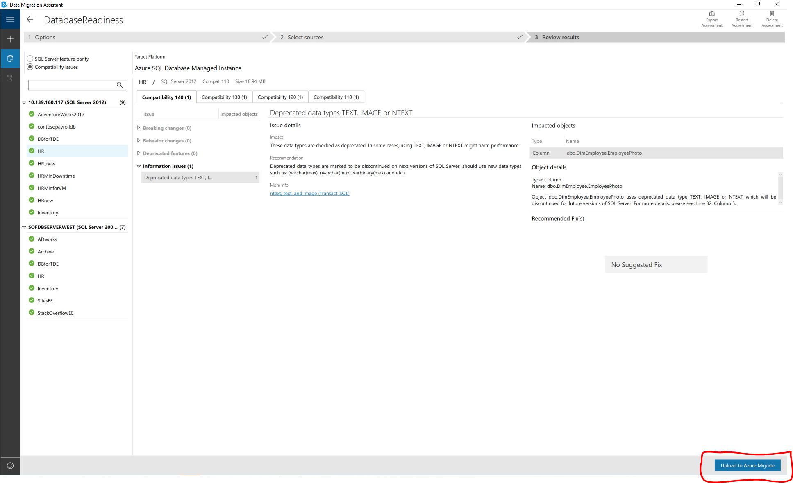

6. Sign in to the Azure portal.

   

7. Select the subscription and Azure Migrate project into which you want to upload the assessment results, and then select **Upload**.

   Wait for the Assessment upload confirmation.

## View target readiness assessment results

1. Sign in the Azure portal, search for Azure migrate, and the select **Azure Migrate**.

   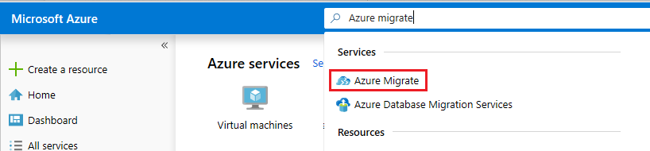

2. Select **Assess and migrate databases** to get to the assessment results.

   

    You can view the SQL Server readiness summary, make sure that you are on the right migration project, otherwise, use change option to select a different migration project.

    Each time you update the assessment results to Azure migrate project, Azure migrate hub consolidate all the results and provide the summary report.  You can execute several Data Migration Assistant assessments in parallel and upload the results to the single migration project to get the consolidated readiness report.

   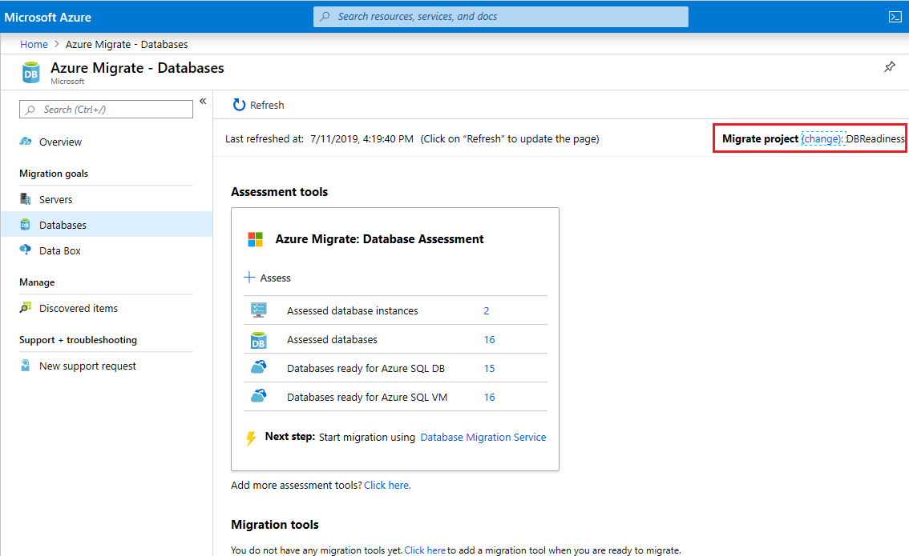

    **Assessed database instances**:  The number of SQL Server instances assessed so far.
    **Assessed databases**: Total number of databases assessed across one or more SQL Server instances assessed
    **Databases ready for SQL Database**:  Number of databases ready to migrate to Azure SQL Database (PaaS).
    **Databases ready for Azure SQL VM**:  Number of databases consist one or more migration blockers to Azure SQL Database (PaaS), but ready to migrate to Azure SQL Server VMs.

3. Select **Assessed database instances** to get to SQL Server instance level view.

   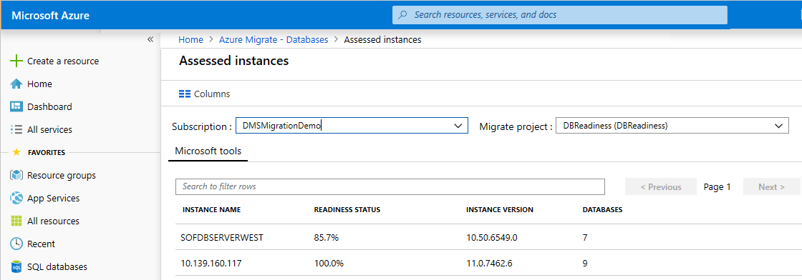

    You can find the percentage readiness status of each SQL Server instance migrating to Azure SQL Database (PaaS).

4. Select a specific instance to get to the database readiness view.

   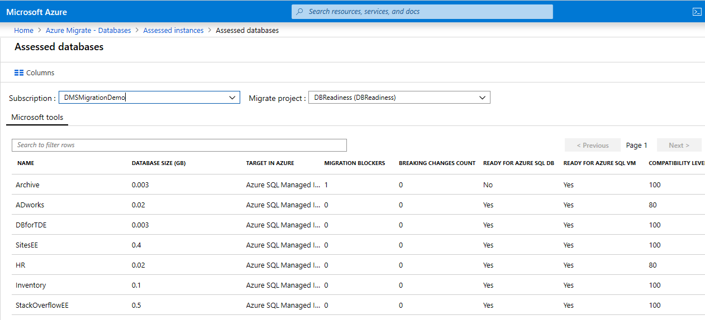

    You can see the number of migration blockers per each database, the recommended target per each database in the above view.

5. Review the DMA assessment results to get more details around the migration blockers.

   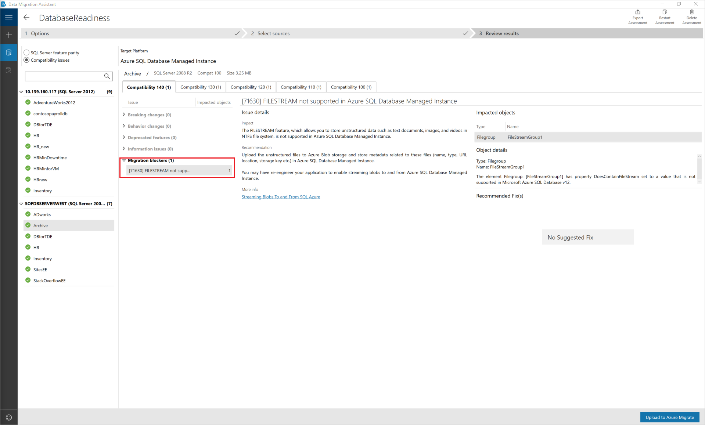

## See also

* [Data Migration Assistant (DMA)](../dma/dma-overview.md)
* [Data Migration Assistant: Configuration settings](../dma/dma-configurationsettings.md)
* [Data Migration Assistant: Best Practices](../dma/dma-bestpractices.md)
