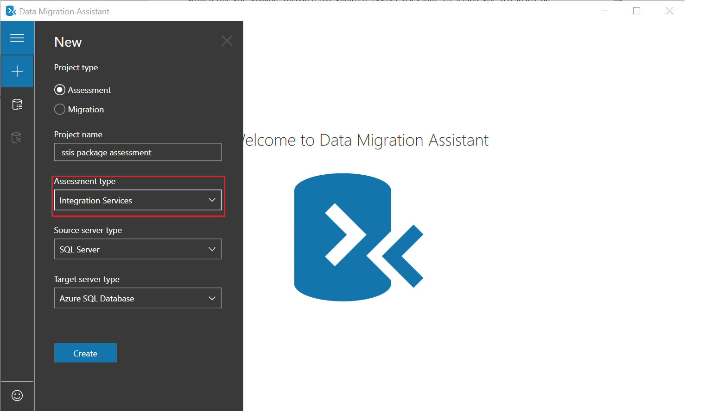
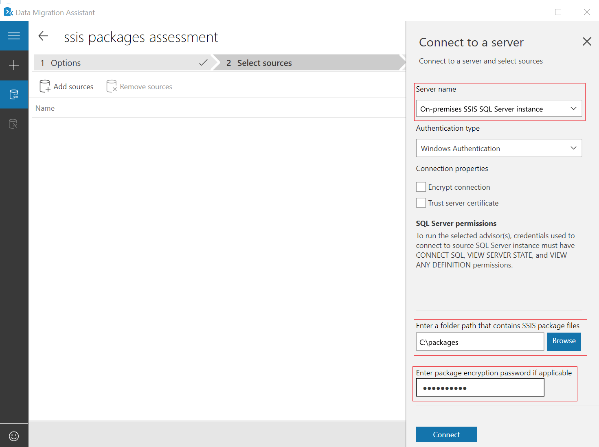
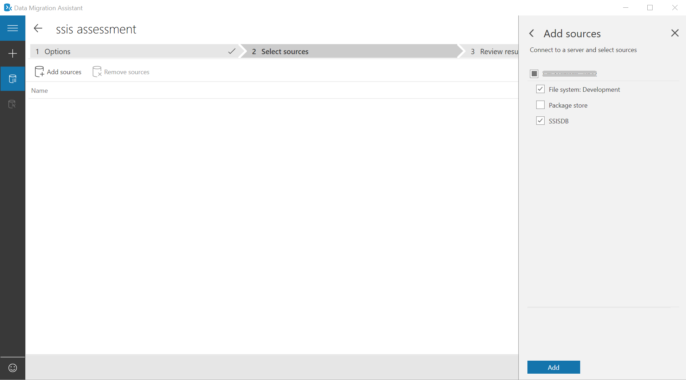
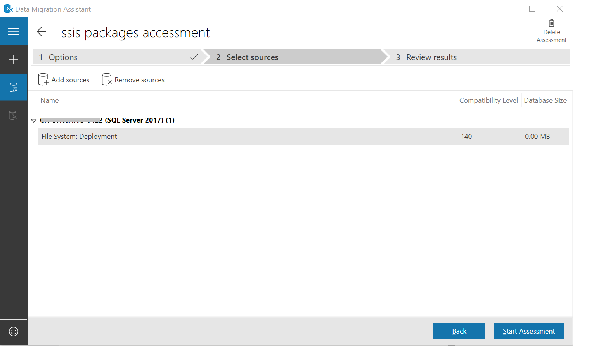
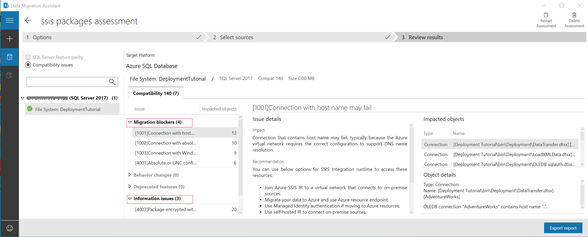

# Perform a SQL Server Integration Service migration assessment with Data Migration Assistant

## Prerequisites

To assess SQL Server Integration Service(SSIS) packages, below components need to be installed with Data Migration Assistant:

- SQL Server Integration Service with the same version as the SSIS packages to assess.
- Azure Feature Pack or other third party components if SSIS packages to assess have these components.  

DMA needs to run with **administrator** access to assess SSIS packages in Package Store.

> [!NOTE]
> Source to SQL Server version 2019 and above are not supported.

## Performance assessments

The following step-by-step instructions help you perform your first assessment for migrating SQL Server Integration Service (SSIS) packages to Azure SQL Database or Azure SQL Managed Instance, by using Data Migration Assistant.

[!INCLUDE [online-offline](../includes/azure-migrate-to-assess-sql-data-estate.md)]

## Create an assessment

1. Select the **New** (+) icon, and then select the **Assessment** project type as **Integration Service**.

1. Set the source and target server type.

    Select the source as **SQL Server**, and set the target server type as **Azure SQL Database** or **Azure SQL Managed Instance**.

1. Click **Create**.

    

## Connect to a server

1. Follow the default option, and click **Next** towards **Select sources**.
1. Enter the SQL server instance name, choose the Authentication type, set the correct connection properties.
1. (Optional) Enter a folder path that contains SSIS packages.
1. (Optional) Enter package encryption password if applicable.
1. Click **Connect** to the source SQL server.
  

## Add sources to assess

1. Select the SSIS package storage types to assess, and then select **Add**.

1. Select **Add Sources** to open the connection flyout menu, if need assess multiple folders.
1. Click **Start Assessment**.
  

## View results

The Compatibility issues category provides partially supported or unsupported features that block migrating on-premises SSIS packages to Azure-SSIS Integration Runtime. It then provides recommendations to help you address those issues.

## Next steps

- [Migrate on-premises SSIS workloads to SSIS in ADF overview](/azure/data-factory/scenario-ssis-migration-overview)
- [Migrate SQL Server Integration Services packages to an Azure SQL Managed Instance](/azure/dms/how-to-migrate-ssis-packages-managed-instance)
- [Redeploy SQL Server Integration Services packages to Azure SQL Database](/azure/dms/how-to-migrate-ssis-packages)