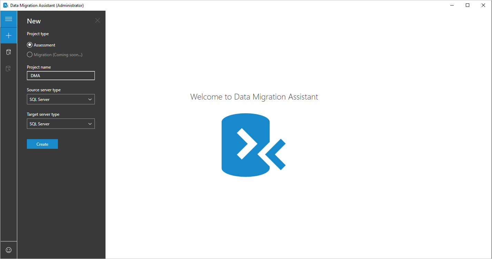
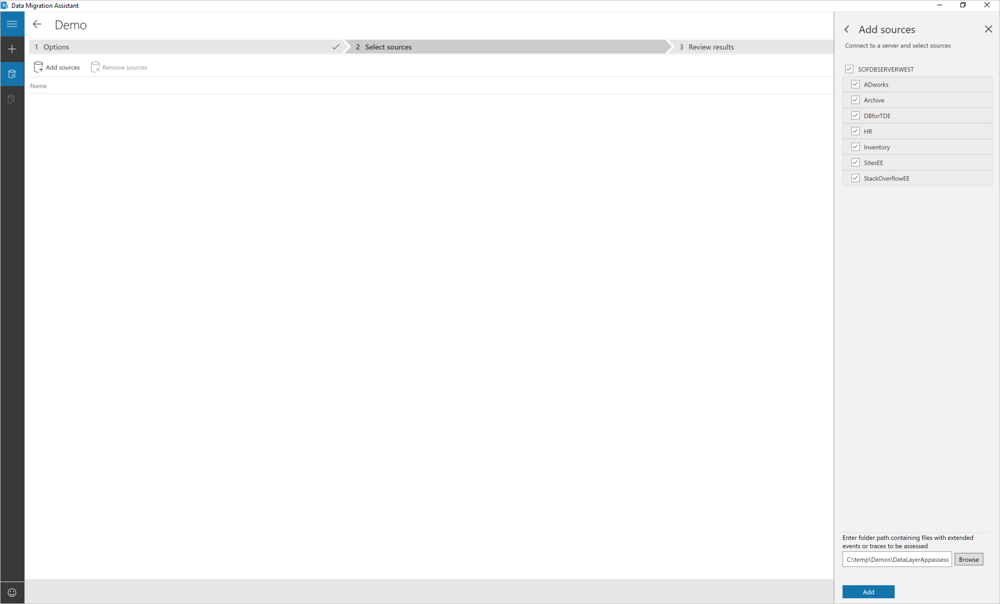
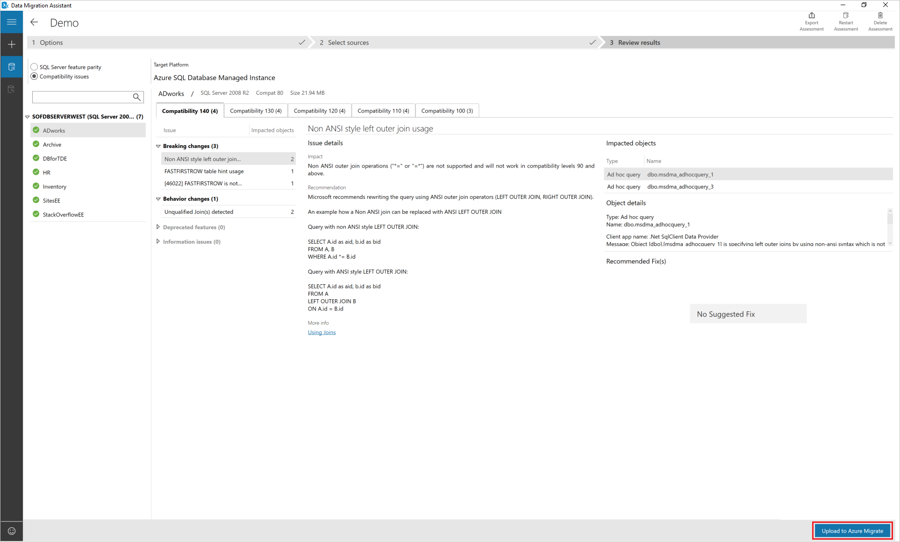

# Perform a SQL Server migration assessment with Data Migration Assistant

The following step-by-step instructions help you perform your first assessment for migrating to on-premises SQL Server, SQL Server running on an Azure VM, or Azure SQL Database by using Data Migration Assistant.

Data Migration Assistant v5.0 introduces support for analyzing database connectivity and embedded SQL queries in the application code. For more information, see the blog post [Using Data Migration Assistant to assess an application's data access layer](https://techcommunity.microsoft.com/t5/Microsoft-Data-Migration/Using-Data-Migration-Assistant-to-assess-an-application-s-data/ba-p/990430).

[!INCLUDE [online-offline](../includes/azure-migrate-to-assess-sql-data-estate.md)]

## Create an assessment

1. Select the **New** (+) icon, and then select the **Assessment** project type.

2. Set the source and target server type.

    If you're upgrading your on-premises SQL Server instance to a modern on-premises SQL Server instance or to SQL Server hosted on an Azure VM, set the source and target server type to **SQL Server**. If you're migrating to Azure SQL Database, instead set the target server type to **Azure SQL Database**.

3. Click **Create**.

   

## Choose assessment options

1. Select the target SQL Server version to which  you plan to migrate.

2. Select the report type.

   When you're assessing your source SQL Server instance for migrating to on-premises SQL Server or to SQL Server hosted on Azure VM targets, you can choose one or both of the following assessment report types:

    - **Compatibility Issues**
    - **New features' recommendation**

   

   When assessing your source SQL Server instance for migrating to Azure SQL Database, you can choose one or both of the following assessment report types:

    - **Check database compatibility**
    - **Check feature parity**

    

## Add databases and extended events trace to assess

1. Select **Add Sources** to open the connection flyout menu.

2. Enter the SQL server instance name, choose the Authentication type, set the correct connection properties, and then select **Connect**.

3. Select the databases to assess, and then select **Add**.

    > [!NOTE]
    > You can remove multiple databases by selecting them while holding the Shift or Ctrl key, and then clicking **Remove Sources**. You can also add databases from multiple SQL Server instances by selecting **Add Sources**.

4. If you have any ad hoc or dynamic SQL queries or any DML statements initiated through the application data layer, then enter the path to the folder in which you placed all the extended events session files that you collected to capture the workload on the source SQL Server.

     The following example shows how to create an extended event session on your source SQL Server to capture the application data layer workload.  Capture the workload for the duration that represents your peak workload.

    ```
    DROP EVENT SESSION [DatalayerSession] ON SERVER
    go
    CREATE EVENT SESSION [DatalayerSession] ON SERVER  
    ADD EVENT sqlserver.sql_batch_completed( 
        ACTION (sqlserver.sql_text,sqlserver.client_app_name,sqlserver.client_hostname,sqlserver.database_id))
    ADD TARGET package0.asynchronous_file_target(SET filename=N'C:\temp\Demos\DataLayerAppassess\DatalayerSession.xel')  
    WITH (MAX_MEMORY=2048 KB,EVENT_RETENTION_MODE=ALLOW_SINGLE_EVENT_LOSS,MAX_DISPATCH_LATENCY=3 SECONDS,MAX_EVENT_SIZE=0 KB,MEMORY_PARTITION_MODE=NONE,TRACK_CAUSALITY=OFF,STARTUP_STATE=OFF)
    go
    ---Start the session
    ALTER EVENT SESSION [DatalayerSession]
          ON SERVER
        STATE = START;
    ---Wait for few minutes
    
    ---Query events
        
        SELECT 
        object_name,
        CAST(event_data as xml) as event_data,
        file_name, 
        file_offset
    FROM sys.fn_xe_file_target_read_file('C:\temp\Demos\DataLayerAppassess\DatalayerSession*xel', 
                'C:\\temp\\Demos\\DataLayerAppassess\\DatalayerSession*xem', 
                null,
                null)
    ---Stop the session after capturing the peak load.
    ALTER EVENT SESSION [DatalayerSession]
          ON SERVER
        STATE = STOP;
        
        go
    ```

5. Click **Next** to start the assessment.

    

> [!NOTE]
> You can run multiple assessments concurrently and view the state of the assessments by opening the **All Assessments** page.

## View results

The duration of the assessment depends on the number of databases added and the schema size of each database. Results are displayed for each database as soon as they're available.

1. Select the database that has completed the assessment, and then switch between **Compatibility issues** and **Feature recommendations** by using the switcher.

2. Review the compatibility issues across all compatibility levels supported by the target SQL Server version that you selected on the **Options** page.

You can review compatibility issues by analyzing the affected object, its details, and potentially a fix for every issue identified under **Breaking changes**, **Behavior changes**, and **Deprecated features**.


Similarly, you can review feature recommendation across **Performance**, **Storage**, and **Security** areas.

Feature recommendations cover different kinds of features such as In-Memory OLTP, columnstore, Always Encrypted, Dynamic Data Masking, and Transparent Data Encryption.


For Azure SQL Database, the assessments provide migration blocking issues and feature parity issues. Review the results for both categories by selecting the specific options.

- The **SQL Server feature parity** category provides a comprehensive set of recommendations, alternative approaches available in Azure, and mitigating steps. It helps you plan this effort in your migration projects.

  

- The **Compatibility issues** category provides partially supported or unsupported features that block migrating on-premises SQL Server databases to Azure SQL databases. It then provides recommendations to help you address those issues.

  

## Assess a data estate for target readiness

If you want further extend these assessments to the entire data estate and find the relative readiness of SQL Server instances and databases for migration to Azure SQL Database, upload the results to the Azure Migrate hub by selecting **Upload to Azure Migrate**.

Doing so allows you to view the consolidated results on the Azure Migrate hub project.

Detailed, step-by-step guidance for target readiness assessments is available [here](./dma-assess-sql-data-estate-to-sqldb.md).

   

## Export results

After all databases finish the assessment, select **Export report** to export the results to either a JSON file or a CSV file. You can then analyze the data at your own convenience.

## Save and load assessments

In addition to exporting the results of an assessment, you can save assessment detail to a file and load an assessment file for later review.  For more information, see the article [Save and load assessments with Data Migration Assistant](../dma/dma-save-load-assessments.md).
