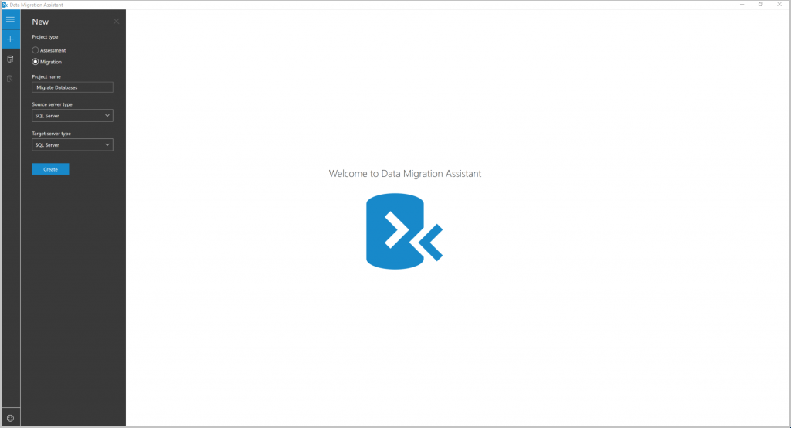
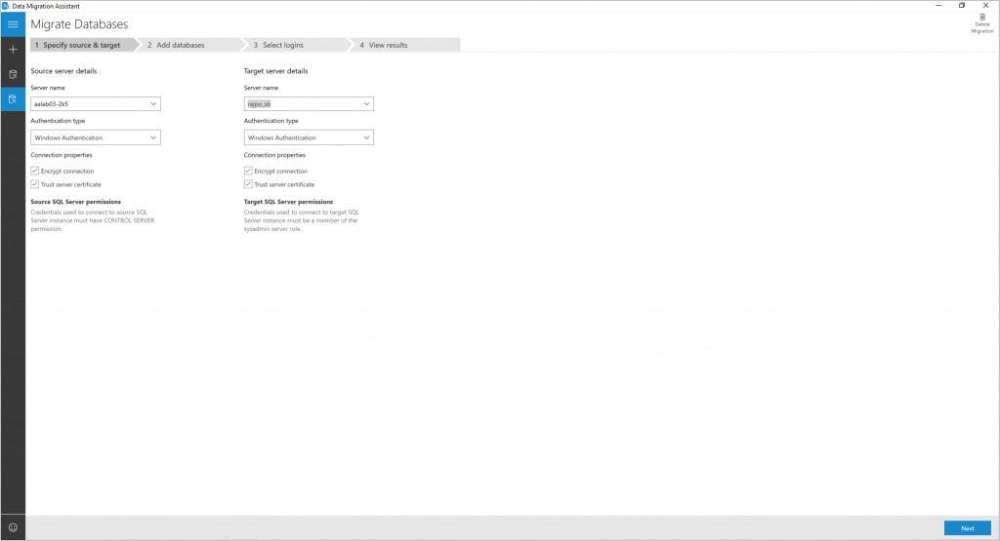
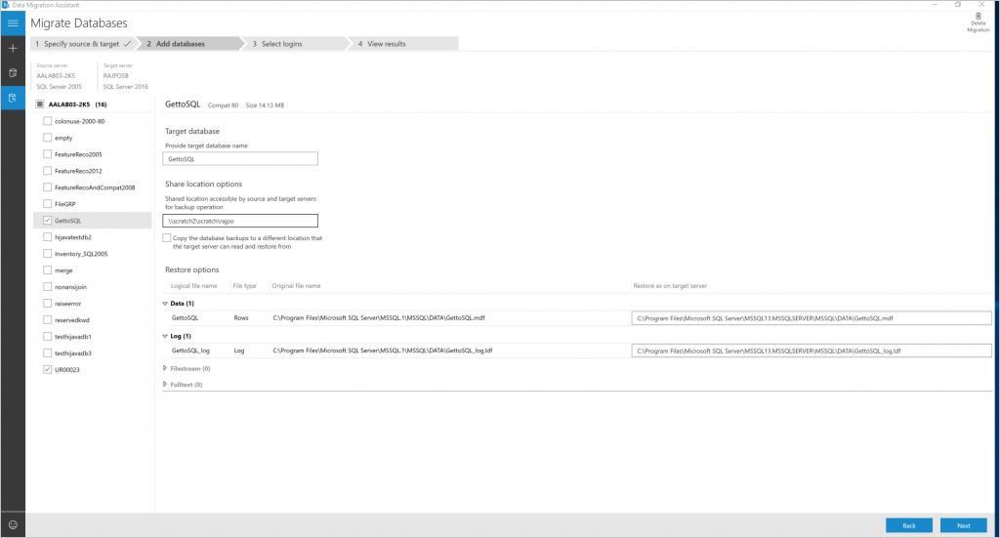
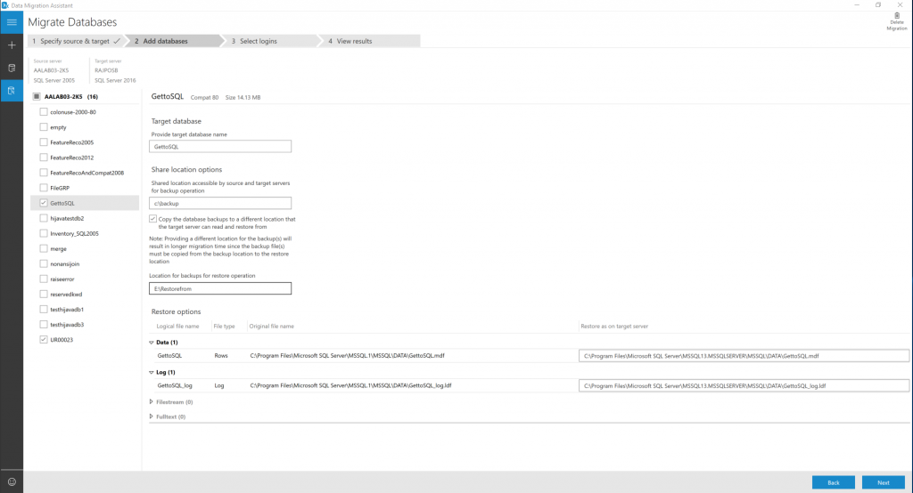
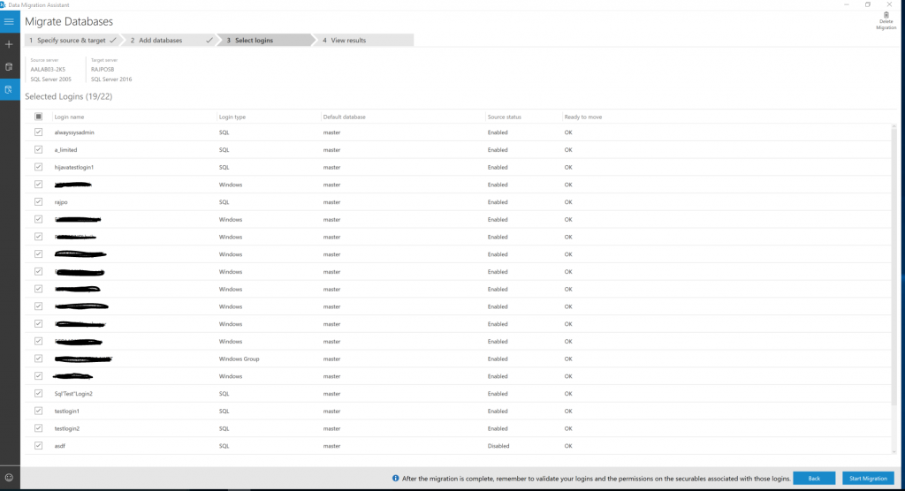
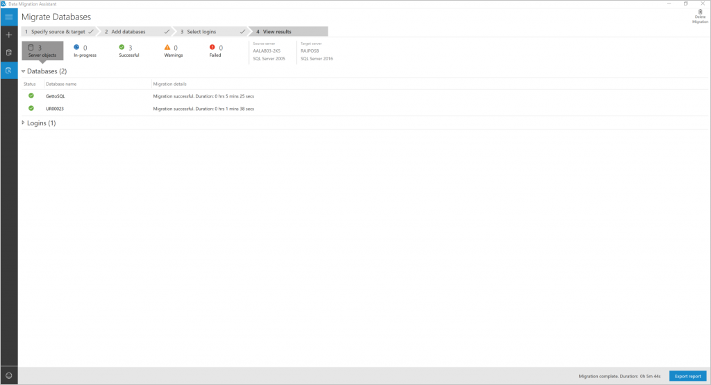

# Migrate on-premises SQL Server using Data Migration Assistant

This article provides step-by-step instructions for migrating SQL Server using Data Migration Assistant.

Data Migration Assistant provides seamless assessments and migrations to modern on-premises SQL Server and SQL Azure VM data platforms.  

Complete the following tasks to perform the migration.

- [Create a new migration project](#create-a-new-migration-project)
- [Specify the source and target](#specify-source-and-target)
- [Add databases](#add-databases)
- [Select logins](#select-logins)

## Create a new migration project

1. Click **New** (+) on the left pane and select the **Migration** project type.

1. Set the source and target server type to **SQL Server** if you're upgrading an on-premises SQL Server to a modern on-premises SQL Server.

1. Click **Create**.

   

## Specify the source and target

1. For the source, enter the SQL Server instance name in the **Server name** field in the **Source server details** section. 

1. Select the **Authentication type** supported by the source SQL Server instance.

1. For the target, enter the SQL Server instance name in the **Server name** field in the **Target server details** section. 

1. Select the **Authentication type** supported by the target SQL Server instance.

1. It is recommended that you encrypt the connection by selecting **Encrypt connection**  in the **Connection properties** section.

1. Click **Next**.

   

## Add databases

1. Choose the specific databases that you want to migrate by only selecting those databases, in the left pane of the **Add databases** page.

   By default all the user databases on the source SQL Server instance are selected for migration

1. Use the migration settings on the right side of the page to set the migration options that are applied to the databases, by doing the following.

   > [!NOTE]
   > You can apply the migration settings to all the
   > databases that you're migrating, by selecting the
   > server in the left pane. You can also configure an
   > individual database with specific settings by
   > selecting the database in the left pane.

 1. Specify the **Shared location accessible by source and target SQL servers for backup operation**. Make sure that the service account running the source SQL Server instance has write privileges on the shared location and the target service account has read privileges on the shared location.

 1. Specify the location to restore the data and transactional log files on the target server.

    

1. Enter a shared location that the source and target SQL Server instances have access to, in the **Share location options** box.

1. If you can’t provide a shared location that both the source and target SQL Servers have access to, select **Copy the database backups to a different location that the target server can read and restore from**. Then, enter a value for the **Location for backups for restore option** box. 

   Make sure that the user account running Data Migration Assistant has read privileges to the backup location and write privileges to the location from which the target server restores.

   

1. Click **Next**.

Data Migration Assistant performs validations on the backup folders, data and log file locations. If any validation fails, please fix the options and Click **Next**.

## Select logins

1. Select specific logins for migration.

   > [!IMPORTANT]
   > Make sure to select the logins that are mapped to one or more users
   > in the databases selected for migration.   

   By default, all the SQL Server and Windows logins that qualify for migration are selected for migration.

1. Click **Start Migration**.

   

## View results

You can monitor the migration progress on the **View results** page.

## Export migration results

1. Click **Export report** at the bottom of the **View results** page to save the migration results to a CSV file.

1. Review the saved file for details about the login migration, and then verify the changes.

## See also

[Data Migration Assistant (DMA)](../dma/dma-overview.md)

[Data Migration Assistant: Configuration settings](../dma/dma-configurationsettings.md)

[Data Migration Assistant: Best Practices](../dma/dma-bestpractices.md)
