# Analyze consolidated assessment reports created by Data Migration Assistant with Power BI

This article describes how to create a Power BI report to analyze consolidated migration assessments.

For information about consolidating migration assessments created by the Data Migration Assistant, see [Consolidate Assessment Reports](../dma/dma-consolidatereports.md).

## Sample Power BI reports

You can download examples of Power BI reports for consolidated migration assessments from this [Github repository](https://github.com/Microsoft/sql-server-samples/tree/master/samples/features/data-migration-assistant).

The following reports are included: 

- [Dashboard](#dashboard--details)

  Includes snapshot stats and a drill-down report.

- [On-premises upgrade readiness](#on-premises-upgrade-readiness--details)

  The data source is the UpgradeSuccessRanking view in the DMAReporting database.  This report shows the percentage upgrade success for your assessed databases.

- [On-premises feature parity](#on-premise-feature-parity--details)

  Shows the feature recommendations for the target SQL Server version.

- [Azure SQL DB upgrade readiness](#azure-sql-db-upgrade-readiness--details)

  The data source is the UpgradeSuccessRanking view in the DMAReporting database.  This report shows the percentage upgrade success for databases assessed for Azure SQL DB migrations.

- [Azure SQL DB unsupported features](#azure-sql-db-unsupported-features--details)

  Shows features in your existing databases that aren't supported in Azure SQL DB (V12).

You can modify these reports to work with your environment by changing the data source in Power BI. 

1. Select the down arrow next to **Edit Queries**, and select
**Data source settings**.

   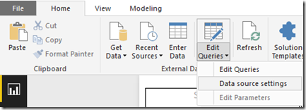

1. Select **Change Source...**, and enter the server and database values.

   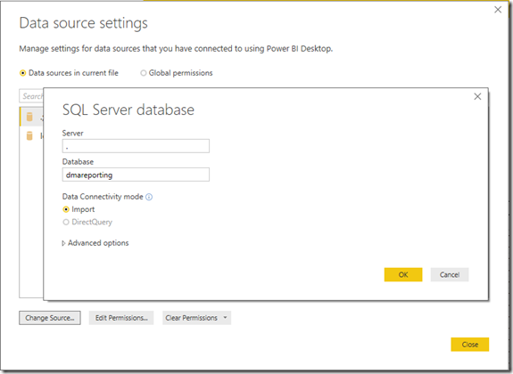

1. Select **OK**, and then select **Close**.

1. Refresh your reports.

   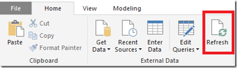

### Dashboard report

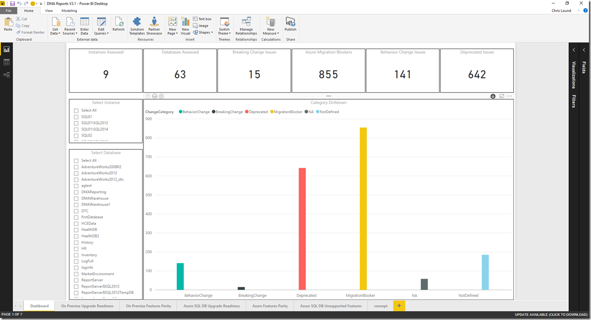

The dashboard shows details about all of your assessments. You can use the slicers on the left-hand side to filter by instance or database. You can use the bar chart to drill down into specific categories to see where the issues lie.

To drill down, select the circle with the down arrow at the top-right corner of the bar chart.

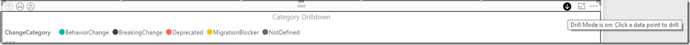

The drilldown sequence is set as shown in the following image (under **Axis**). To change the sequence, drag columns to the desired order.

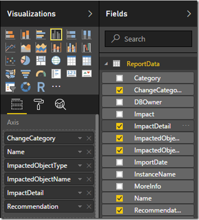

This view becomes even more powerful when you first filter by a specific database and then drill down to the specific category issues. In the following example, the HR database is selected for instance **SQL01** to view all objects that are preventing migrations (breaking changes).

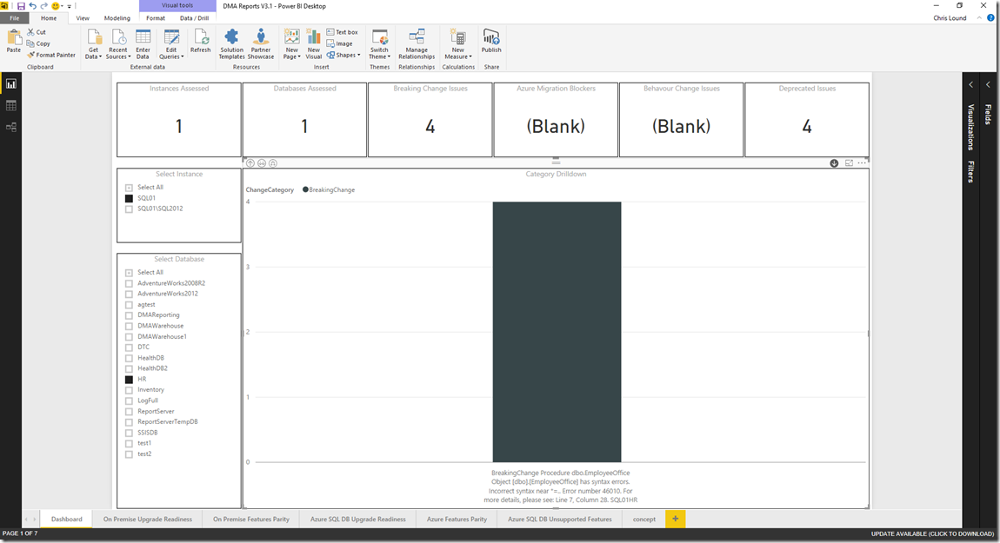

### On-premises upgrade readiness report

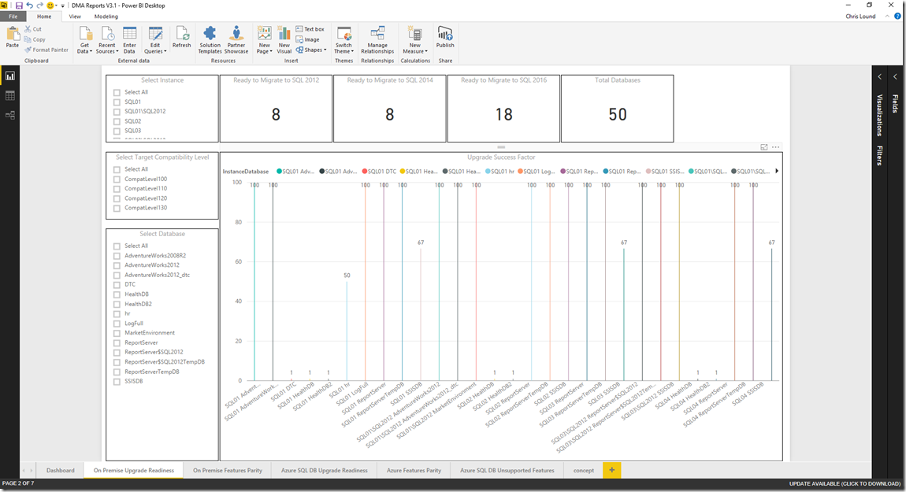

This report shows a snapshot of how ready your databases are to migrate to a later version of SQL Server. The data in this report comes from the dbo.UpgradeSuccessFactor\_OnPrem view in the DMAReporting database.

Filtering by instance and database name, and using the score cards at the top, you can see which version the database could be migrated too. For example, if you filter by the AdventureWorks 2012 database, you can see that the database is ready to move to all the SQL Server versions listed in the report. This is determined by ensuring there are no breaking changes for that database and compatibility level.

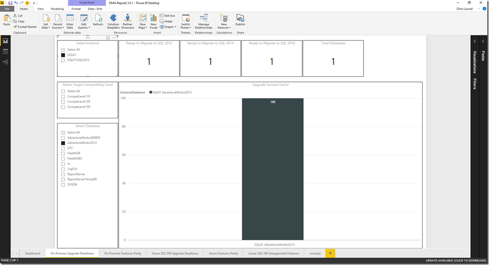

### On-premises feature parity report

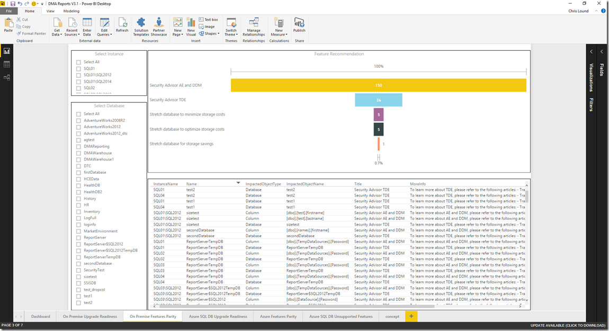

Use this report to highlight new features that can be used for the database in the target SQL Server version.

When you select a feature in the funnel chart, the data at the bottom highlights which objects are affected by the feature. In the following example, the **Stretch database for storage savings** feature is selected, and a table is listed that could benefit from this feature.

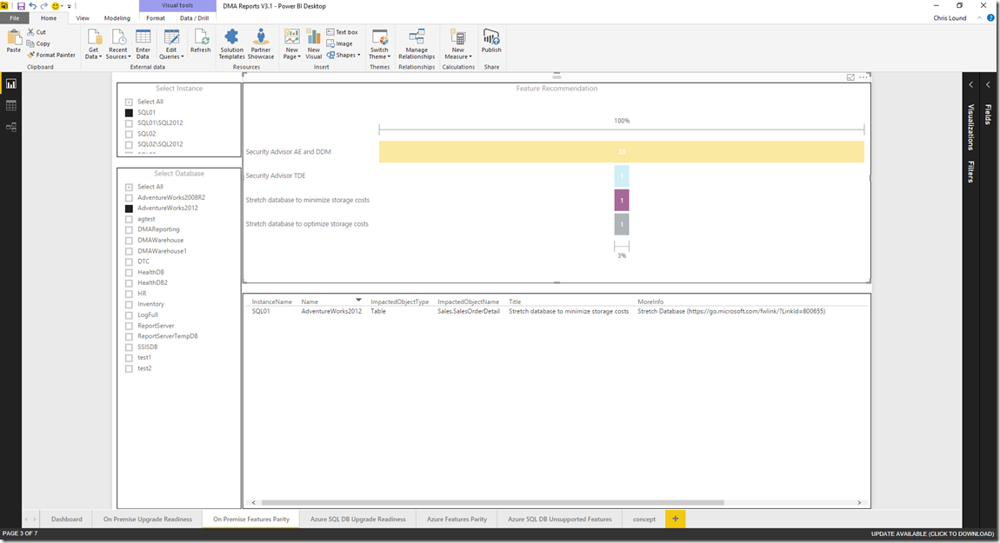

### Azure SQL DB upgrade readiness report

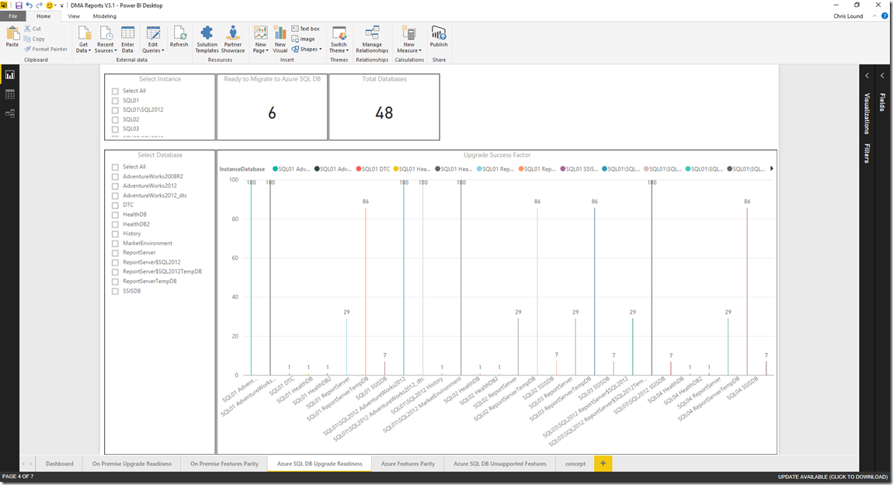

This report shows the database readiness to migrate to Azure SQL Database V12. The data from this report comes from the dbo.UpgradeSuccessRanking view in the DMAReporting database.

### Azure features parity report

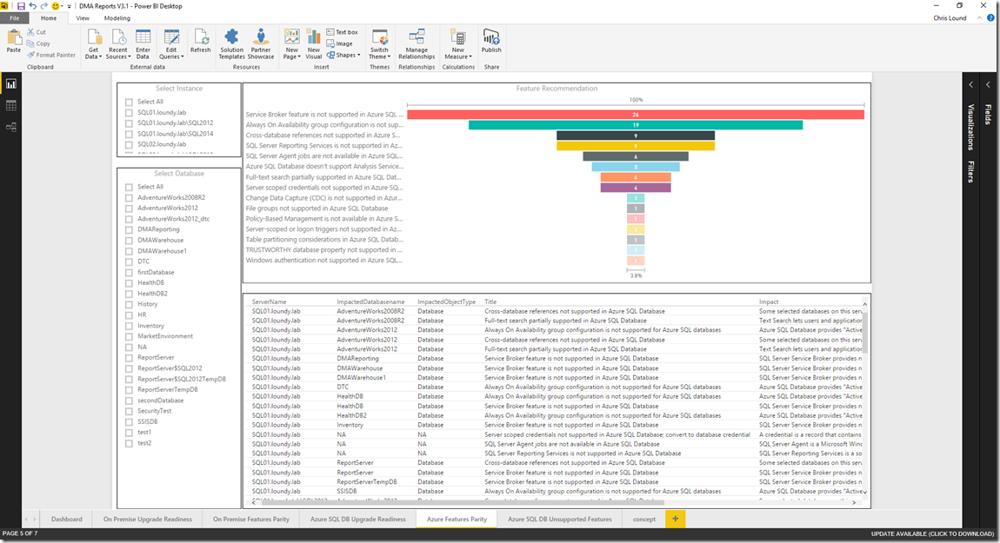

Use this report to highlight the *instance level features* that are not supported by Azure SQL Database V12.

When you select a feature in the funnel chart, the data at the bottom lists the instances and database features that aren't supported. In the following example, this feature is selected: **Always on Availability group configuration is not supported in Azure SQL Database**.  

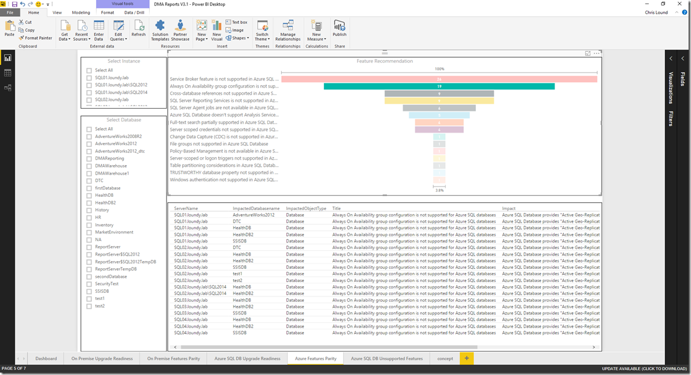

 
### Azure SQL DB unsupported features report

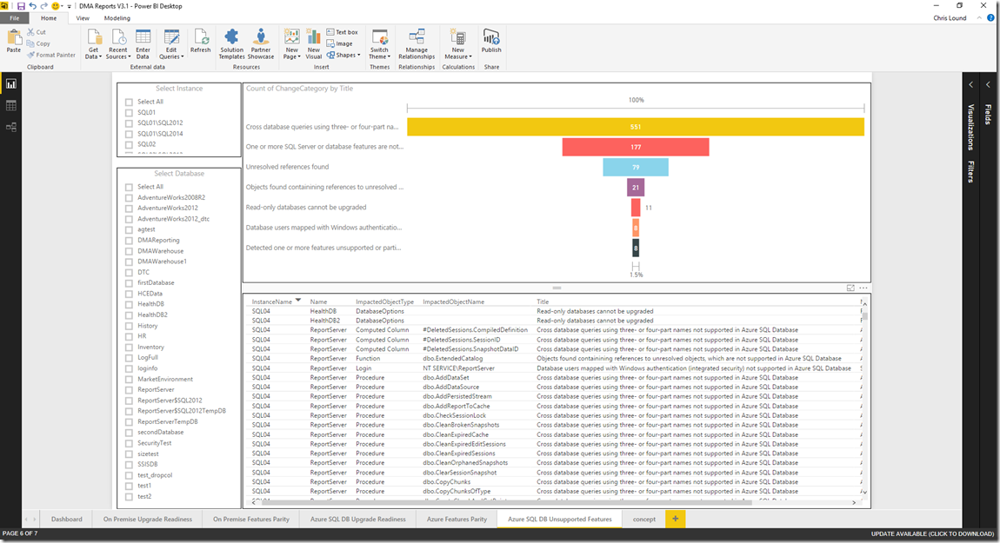

This report highlights which features aren't supported for a given **database** when the target is Azure SQL Database (V12).

By filtering by the database name and feature value in the funnel chart, you can see details on the unsupported feature. Details include which object is affected and recommendations for addressing the problem.

For example, filtering by the DTC database and **Read-only databases cannot be upgraded**, you can see a list of objects that are affected.

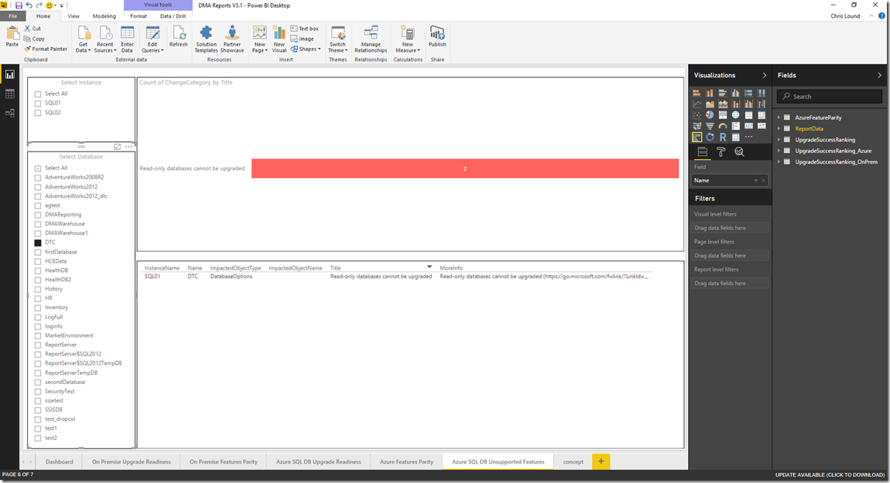

## See also

[Overview of Data Migration Assistant](../dma/dma-overview.md)

[Data Migration Assistant download](https://www.microsoft.com/download/details.aspx?id=53595)

[Power BI download](https://powerbi.microsoft.com/)
