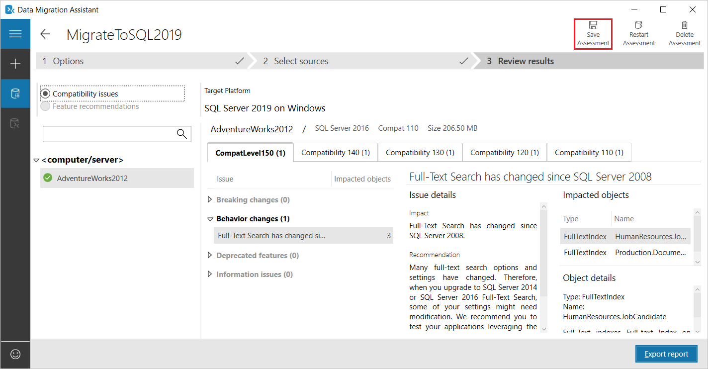
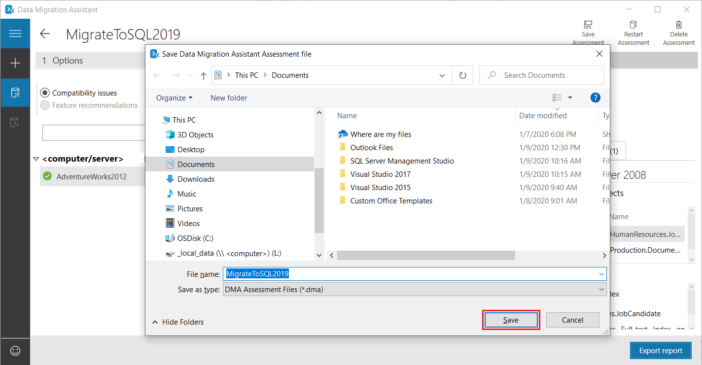
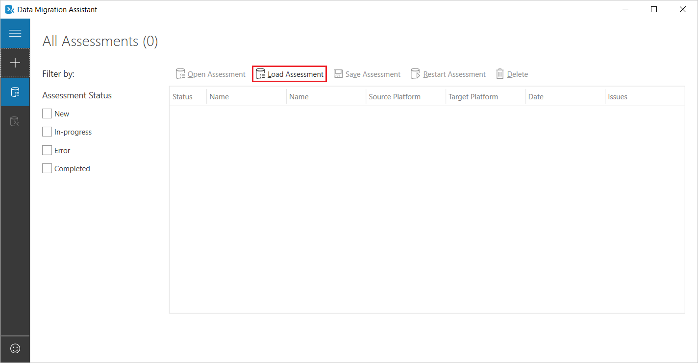
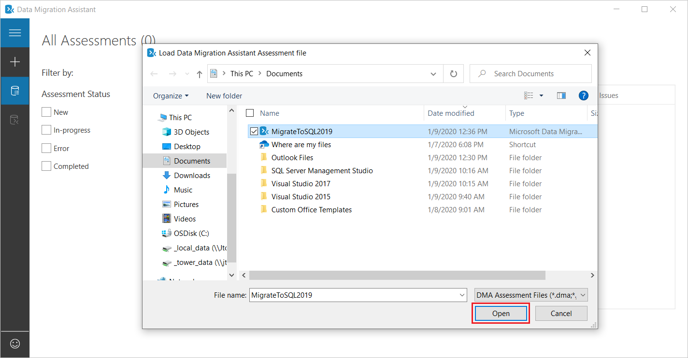
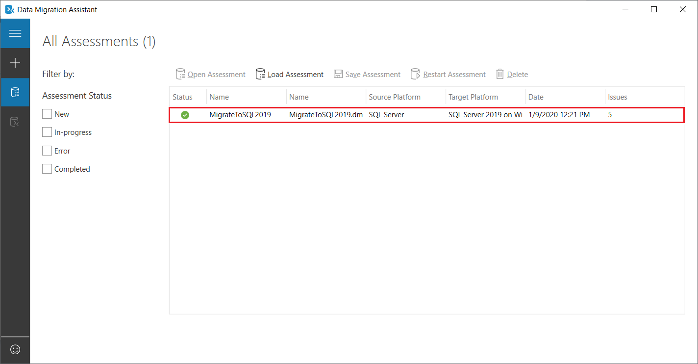
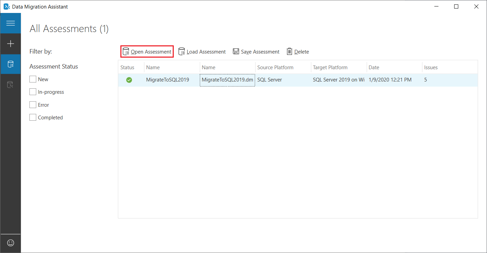
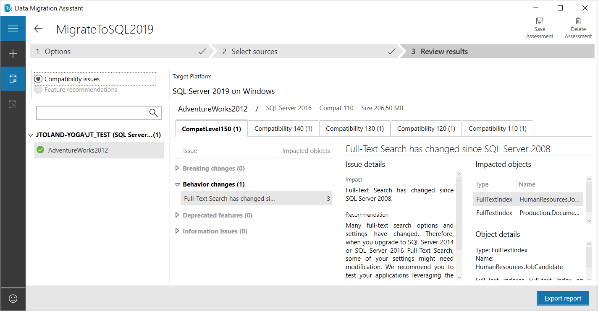

# Save and load assessments with Data Migration Assistant

The following step-by-step instructions help you use the Data Migration Assistant v5.0 or later to save a database assessment to a file, and then to load an assessment from a file.

> [!NOTE]
> In addition to loading assessments saved using the latest version of DMA, users can also leverage this feature to load assessments exported as .json files from previous versions of Data Migration Assistant to view the results in v5.0 and later.

## Saving an assessment to a file

1. After running an assessment using Data Migration Assistant, select **Save Assessment**.

   

   The standard **Save…** dialog box appears.

   > [!NOTE]
   > For more information about how to run an assessment in Data Migration Assistant, see the article [Perform a SQL Server migration assessment with Data Migration Assistant](../dma/dma-assesssqlonprem.md).

2. Specify a name for the file, and then select **Save**.

   

## Loading an assessment saved to a file

1. To load an assessment you've previously saved to a file, start Data Migration Assistant, and then on the **All Assessments** tab, select **Load Assessment**.

   

2. Navigate to the saved assessment file you want to load, select the file, and then select **Open**.

   

   An entry for the assessment you loaded appears on the **All Assessments** tab.

   

3. Select the assessment entry, and then select **Open Assessment**.

   

   Data Migration Assistant now displays details of the assessment you had run previously.

   
