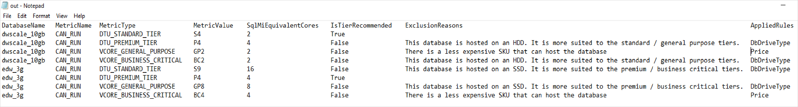

# Identify the right Azure SQL Database SKU for your on-premises database

The task of migrating your databases to the cloud is a complicated and time-consuming, involving a number of variables. Picking the right Azure database target and SKU for your database can be challenging. Our goal with the Database Migration Assistant (DMA) is to address these questions and to make your database migration experience simple and effective.

This article focuses primarily on DMA's Azure SQL Database SKU recommendations feature, which allows you to identify the minimum recommended Azure SQL Database SKU based on performance counters collected from the computer(s) hosting your databases. This feature provides recommendations related to pricing tier, compute level, and max data size, as well as estimated cost per month. It also offers the ability to provision all your databases to Azure in bulk.

> [!NOTE] 
> This functionality is currently available only via the Command Line Interface (CLI). Support for this feature via the DMA user interface will be added in an upcoming release.

The following instructions help you determine Azure SQL Database SKU recommendations and provision the associated databases to Azure, by using Data Migration Assistant.

## Prerequisites

Download Database Migration Assistant v4.0 or later, and then install it. If you already have the tool installed, close and reopen it, and you'll be prompted to upgrade the tool.

## Collect performance counters

The first step in the process is to collect performance counters for your databases. You can collect performance counters by running a PowerShell command on the computer that hosts your databases. DMA provides you with a copy of this PowerShell file, but you can also use your own method to capture performance counters from your computer.

You don't need to perform this task for each database individually. The performance counters collected from a computer can be used to recommend the SKU for all databases hosted on the computer.

> [!IMPORTANT]
> The computer from which you are running this command requires Administrator permissions to the computer hosting your databases.

1. Verify that the PowerShell file required to collect the performance counters is installed in the DMA folder.

    

2. Run the PowerShell script with the following arguments:
    - **ComputerName**: The name of the computer that hosts your databases.
    - **OutputFilePath**: The output file path to save the collected counters.
    - **CollectionTimeInSeconds**: The amount of time during which you wish to collect performance counter data.
      Capture performance counters for at least 40 minutes to get a meaningful recommendation. The longer the duration of the capture, the more accurate the recommendation will be.
    - **DbConnectionString**: The Connection string pointing to the master database hosted on the computer from which you're collecting performance counter data.
     
    Here's a sample invocation:

    ```
    .\SkuRecommendationDataCollectionScript.ps1
     -ComputerName Foobar1
     -OutputFilePath D:\counters2.csv
     -CollectionTimeInSeconds 2400
     -DbConnectionString "Server=localhost;Initial Catalog=master;Integrated Security=SSPI;"
    ```
    
    After the command executes, the process will output a file with performance counters in the location you specified. This file can be used as input for the SKU recommendation command in the next section.

## Use the DMA CLI to get SKU recommendations

Use the performance counters output file from the previous step as input for this step. DMA will provide you with recommendations for the Azure SQL Database pricing tier, the compute level, and the maximum data size for each database on your computer. DMA will also provide you with the estimated monthly cost for each database.

Run the dmacmd.exe with the following arguments:

- **/Action=SkuRecommendation**: Enter this argument to execute SKU assessments.
- **/SkuRecommendationInputDataFilePath**: The path to the counter file collected in the previous section.
- **/SkuRecommendationTsvOutputResultsFilePath**: The path to write the output results in TSV format.
- **/SkuRecommendationJsonOutputResultsFilePath**: The path to write the output results in JSON format.
- **/SkuRecommendationHtmlResultsFilePath**: Path to write the output results in HTML format.

In addition, you need to pick one of the following arguments:
- Prevent price refresh
    - **/SkuRecommendationPreventPriceRefresh**: Prevents the price refresh from occurring. Use if running in offline mode.
- Get the latest prices 
    - **/SkuRecommendationCurrencyCode**: The currency in which to display prices (e.g. "USD").
    - **/SkuRecommendationOfferName**: The offer name (e.g. "MS-AZR-0003P"). For more information, see the [Microsoft Azure Offer Details](https://azure.microsoft.com/support/legal/offer-details/) page.
    - **/SkuRecommendationRegionName**: The region name (e.g. "WestUS").
    - **/SkuRecommendationSubscriptionId**: The subscription ID.
    - **/AzureAuthenticationTenantId**: The authentication tenant.
    - **/AzureAuthenticationClientId**: The client ID of the AAD app used for authentication.
    - One of the following authentication options:
        - Interactive
            - **AzureAuthenticationInteractiveAuthentication**: Set to true for an authentication pop-up window.
        - Cert based
            - **AzureAuthenticationCertificateStoreLocation**: Set to the certificate store location (e.g. "CurrentUser").
            - **AzureAuthenticationCertificateThumbprint**: Set to the certificate thumbprint.
        - Token based
            - **AzureAuthenticationToken**: Set to the certificate token.

Here are some sample invocations:

```
.\DmaCmd.exe /Action=SkuRecommendation
/SkuRecommendationInputDataFilePath="C:\TestOut\out.csv"
/SkuRecommendationTsvOutputResultsFilePath="C:\TestOut\prices.tsv"
/SkuRecommendationJsonOutputResultsFilePath="C:\TestOut\prices.json"
/SkuRecommendationOutputResultsFilePath="C:\TestOut\prices.html"
/SkuRecommendationCurrencyCode=USD
/SkuRecommendationOfferName=MS-AZR-0044p
/SkuRecommendationRegionName=UKWest
/SkuRecommendationSubscriptionId=<Your Subscription Id>
/AzureAuthenticationInteractiveAuthentication=true
/AzureAuthenticationClientId=<Your AzureAuthenticationClientId>
/AzureAuthenticationTenantId=<Your AzureAuthenticationTenantId>
```

```
.\DmaCmd.exe /Action=SkuRecommendation
/SkuRecommendationInputDataFilePath="C:\TestOut\out.csv"
/SkuRecommendationTsvOutputResultsFilePath="C:\TestOut\prices.tsv"
/SkuRecommendationJsonOutputResultsFilePath="C:\TestOut\prices.json"
/SkuRecommendationOutputResultsFilePath="C:\TestOut\prices.html"
/SkuRecommendationPreventPriceRefresh=true
```

The TSV output file will contain the columns shown in the following graphic:

   

A description of each column follows.

- **DatabaseName** - The name of your database.
- **MetricName** - Whether or not a metric was executed.
- **MetricType** - Recommended Azure SQL Database tier.
- **MetricValue** - Recommended Azure SQL Database SKU.
- **SQLMiEquivalentCores** - If you choose to go for Azure SQL Database Managed Instance, you can use this value for core count.
- **IsTierRecommended** - We make a minimum SKU recommendation for each tier. We then apply heuristics to determine the right tier for your database. 
- **ExclusionReasons** - This value is blank if a Tier is recommended. For each tier that isn't recommended, we provide the reasons why it wasn't picked.
- **AppliedRules** - A short notation of the rules that were applied.

The recommended value is the minimum SKU required for your queries to run in Azure with a success rate similar to your on-premises databases. For example, if the recommended minimum SKU is S4 for the standard tier, then choosing S3 or below will cause queries to time out or fail to execute.

The HTML file contains this information in a graphical format. You can use the HTML file to input Azure subscription information, pick the pricing tier, compute level and Max data size for your databases, and generate a script to provision your databases. This script can be executed using PowerShell.

## Provision your databases to Azure
With just a few clicks, you can use the recommendations from the previous step to provision target databases in Azure to which you can migrate your databases. You can also make changes to the recommendations by updating the HTML file as follows.

1. Open the HTML file and enter the following information:
    - **Subscription ID** - The subscription ID of the Azure subscription to which you want to provision the databases.
    - **Region** - The region in which to provision databases. Make sure your subscription supports the select region.
    - **Resource Group** - The resource group to which you want to deploy the databases. Enter a resource group that exists.
    - **Server Name** - The Azure SQL Database server to which you want the databases deployed. If you enter a server name that doesn't exist, it will be created.
    - **Admin Username\Password** - The server admin username and password.

2. Review recommendations for each database, and modify the pricing tier, compute level, and max data size as needed. Be sure to deselect any databases that you do not currently want to provision.

3. Select **Generate Provisioning Script**, save the script, and then execute it in PowerShell.

    This process should create all the databases you selected in the HTML page.

You can perform all the steps in this process on a single computer or you can perform them on multiple computers to determine SKU recommendations at scale. DMA makes it a simple and scalable experience by supporting all these steps via the Command Line Interface. Again, support for this feature via the DMA user interface will be available later this year.

## Next steps
- Download the latest version of [Data Migration Assistant](https://aka.ms/get-dma).
- See the article [Run Data Migration Assistant from the command line](https://docs.microsoft.com/sql/dma/dma-commandline?view=sql-server-2017) for a complete listing of commands for running DMA from the CLI.
