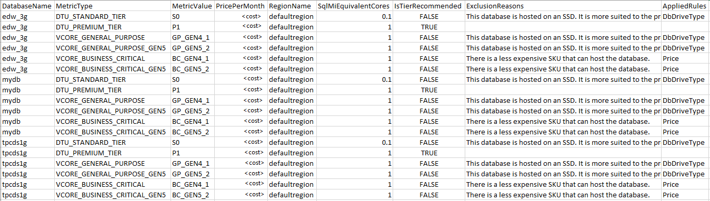
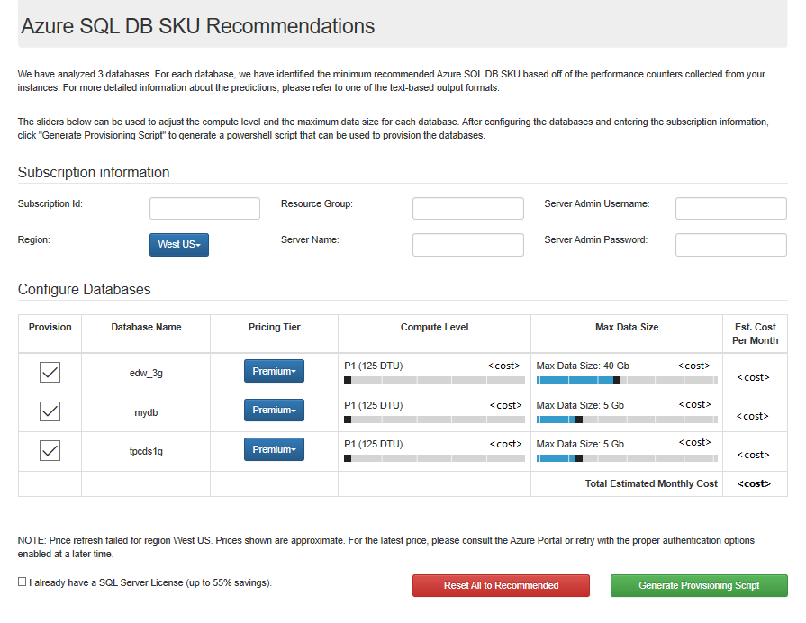
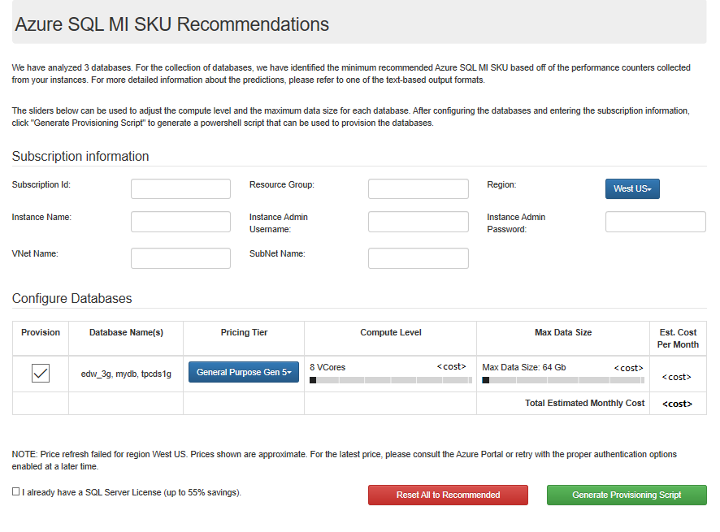

# Identify the right Azure SQL Database/Managed Instance SKU for your on-premises database

Migrating  databases to the cloud can be complicated, especially when trying to select the best Azure database target and SKU for your database. Our goal with the Database Migration Assistant (DMA) is to help address these questions and make your database migration experience easier by providing these SKU recommendations in a user-friendly output.

This article focuses on DMA's Azure SQL Database SKU recommendations feature. Azure SQL Database has several deployment options, including:

- Single database
- Elastic pools
- Managed instance

The SKU Recommendations feature allows you to identify both the minimum recommended Azure SQL Database single database or managed instance SKU based on performance counters collected from the computer(s) hosting your databases. The feature provides recommendations related to pricing tier, compute level, and max data size, as well as estimated cost per month. It also offers the ability to bulk provision single databases and managed instances in Azure for all recommended databases.

> [!NOTE]
> This functionality is currently available only via the Command Line Interface (CLI).

The following are instructions to help you determine the Azure SQL Database SKU recommendations and provision corresponding single database(s) or managed instance(s) in Azure using DMA.

## Prerequisites

- Download the latest version of DMA, and then install it. If you already have an earlier version of the  tool installed, open it and you'll be prompted to upgrade DMA.
- Verify that the PowerShell file SkuRecommendationDataCollectionScript.ps1, which is required to collect the performance counters, is installed in the DMA folder.
- Ensure that the computer on which you'll perform this process has Administrator permissions to the computer that is hosting your databases.

## Collect performance counters

The first step in the process is to collect performance counters for your databases. You can collect performance counters by running a PowerShell command on the computer that hosts your databases. DMA provides you with a copy of this PowerShell file, but you can also use your own method to capture performance counters from your computer.

You don't need to perform this task for each database individually. The performance counters collected from a computer can be used to recommend the SKU for all databases hosted on the computer.

1. In the DMA folder, locate the PowerShell file SkuRecommendationDataCollectionScript.ps1. This file is required to collect the performance counters.

    

2. Run the PowerShell script with the following arguments:
    - **ComputerName**: The name of the computer that hosts your databases.
    - **OutputFilePath**: The output file path to save the collected counters.
    - **CollectionTimeInSeconds**: The amount of time during which you wish to collect performance counter data. Capture performance counters for at least 40 minutes to get a meaningful recommendation. The longer the duration of the capture, the more accurate the recommendation will be. Also ensure the workloads are running for the desired databases to enable more accurate recommendations.
    - **DbConnectionString**: The Connection string pointing to the master database hosted on the computer from which you're collecting performance counter data.

    Here's a sample invocation:

    ```
    .\SkuRecommendationDataCollectionScript.ps1
     -ComputerName Foobar1
     -OutputFilePath D:\counters2.csv
     -CollectionTimeInSeconds 2400
     -DbConnectionString "Server=localhost;Initial Catalog=master;Integrated Security=SSPI;"
    ```

    After the command executes, the process will output a file including performance counters to the location you specified. You can use this file as input for the next part of the process, which will provide SKU recommendations for both single database and managed instances options.

## Use the DMA CLI to get SKU recommendations

Use the performance counters output file you  created as input for this process.

For the single database option, DMA will provide recommendations for the Azure SQL Database single database pricing tier, the compute level, and the maximum data size for each database on your computer. If you have multiple databases on your computer, you can also specify the databases for which you want recommendations. DMA will also provide you with the estimated monthly cost for each database.

For managed instance, the recommendations support a lift-and-shift scenario. As a result, DMA will provide you with recommendations for the Azure SQL Database managed instance pricing tier, the compute level, and the maximum data size for the set of databases on your computer. Again, if you have multiple databases on your computer, you can also specify the databases for which you want recommendations. DMA will also provide you with the estimated monthly cost for managed instance.

To use the DMA CLI to get SKU recommendations, at the command prompt, run dmacmd.exe with the following arguments:

- **/Action=SkuRecommendation**: Enter this argument to execute SKU assessments.
- **/SkuRecommendationInputDataFilePath**: The path to the counter file collected in the previous section.
- **/SkuRecommendationTsvOutputResultsFilePath**: The path to write the output results in TSV format.
- **/SkuRecommendationJsonOutputResultsFilePath**: The path to write the output results in JSON format.
- **/SkuRecommendationHtmlResultsFilePath**: Path to write the output results in HTML format.

In addition, select one of the following arguments:

- Prevent price refresh
  - **/SkuRecommendationPreventPriceRefresh**: If set to True, prevents the price refresh from occurring and assumes default prices. Use if running in offline mode. If you do not use this parameter, you must specify the parameters below to get the latest prices based on a specified region.
- Get the latest prices
  - **/SkuRecommendationCurrencyCode**: The currency in which to display prices (e.g. "USD").
  - **/SkuRecommendationOfferName**: The offer name (e.g. "MS-AZR-0003P"). For more information, see the [Microsoft Azure Offer Details](https://azure.microsoft.com/support/legal/offer-details/) page.
    - **/SkuRecommendationRegionName**: The region name (e.g., "WestUS").
    - **/SkuRecommendationSubscriptionId**: The subscription ID.
    - **/AzureAuthenticationTenantId**: The authentication tenant.
    - **/AzureAuthenticationClientId**: The client ID of the AAD app used for authentication.
    - One of the following authentication options:
      - Interactive
        - **AzureAuthenticationInteractiveAuthentication**: Set to true for an authentication pop-up window.
      - Cert based
        - **AzureAuthenticationCertificateStoreLocation**: Set to the certificate store location (e.g., "CurrentUser").
        - **AzureAuthenticationCertificateThumbprint**: Set to the certificate thumbprint.
      - Token based
        - **AzureAuthenticationToken**: Set to the certificate token.

> [!NOTE]
> To get the ClientId and TenantId for interactive authentication, you need to configure a new AAD application. For more information on authentication and getting these credentials, in the article [Microsoft Azure Billing API Code Samples: RateCard API](https://azure.microsoft.com/resources/samples/billing-python-ratecard-api/), follow the instructions under **Step 1: Configure a Native Client application in your AAD tenant**.

Lastly, there is an optional argument you can use to specify the databases for which you want recommendations: 

- **/SkuRecommendationDatabasesToRecommend**: A list of databases for which to make recommendations. The database names are case-sensitive and must (1) be found in the input .csv, (2) each be surrounded by double-quotes, and (3) each be separated by a single space between names (e.g. /SkuRecommendationDatabasesToRecommend =”Database1” “Database2” “Database3”). Omitting this parameter ensure that recommendations are provided for all user databases identified in the input .csv file.  

Below are some sample invocations:

**Sample 1: Getting recommendations with default prices. Use when running in offline mode or when you do not have authentication credentials.**

```
.\DmaCmd.exe /Action=SkuRecommendation
/SkuRecommendationInputDataFilePath="C:\TestOut\out.csv"
/SkuRecommendationTsvOutputResultsFilePath="C:\TestOut\prices.tsv"
/SkuRecommendationJsonOutputResultsFilePath="C:\TestOut\prices.json"
/SkuRecommendationOutputResultsFilePath="C:\TestOut\prices.html"
/SkuRecommendationPreventPriceRefresh=true
```

**Sample 2: Getting recommendations with latest prices for the specified region (e.g., “UKWest”).**

```
.\DmaCmd.exe /Action=SkuRecommendation
/SkuRecommendationInputDataFilePath="C:\TestOut\out.csv"
/SkuRecommendationTsvOutputResultsFilePath="C:\TestOut\prices.tsv"
/SkuRecommendationJsonOutputResultsFilePath="C:\TestOut\prices.json"
/SkuRecommendationOutputResultsFilePath="C:\TestOut\prices.html"
/SkuRecommendationCurrencyCode=USD
/SkuRecommendationOfferName=MS-AZR-0044p
/SkuRecommendationRegionName=UKWest
/SkuRecommendationSubscriptionId=<Your Subscription Id>
/AzureAuthenticationInteractiveAuthentication=true
/AzureAuthenticationClientId=<Your AzureAuthenticationClientId>
/AzureAuthenticationTenantId=<Your AzureAuthenticationTenantId>
```

**Sample 3: Getting recommendations for specific databases (e.g. “TPCDS1G,EDW_3G,TPCDS10G”).**

```
.\DmaCmd.exe /Action=SkuRecommendation 
/SkuRecommendationInputDataFilePath="C:\TestOut\out.csv" 
/SkuRecommendationTsvOutputResultsFilePath="C:\TestOut\prices.tsv" 
/SkuRecommendationJsonOutputResultsFilePath="C:\TestOut\prices.json" 
/SkuRecommendationOutputResultsFilePath="C:\TestOut\prices.html" 
/SkuRecommendationCurrencyCode=USD 
/SkuRecommendationOfferName=MS-AZR-0044p 
/SkuRecommendationRegionName=UKWest 
/SkuRecommendationSubscriptionId=<Your Subscription Id> 
/SkuRecommendationDatabasesToRecommend=“TPCDS1G” “EDW_3G” “TPCDS10G” 
/AzureAuthenticationInteractiveAuthentication=true 
/AzureAuthenticationClientId=<Your AzureAuthenticationClientId> 
/AzureAuthenticationTenantId=<Your AzureAuthenticationTenantId>
```

For single database recommendations, the TSV output file will look as follows:



For managed instance recommendations, the TSV output file will look as follows:


A description of each column in the output file follows.

- **DatabaseName** - The name of your database.
- **MetricType** - Recommended Azure SQL Database single database/managed instance tier.
- **MetricValue** - Recommended Azure SQL Database single database/managed instance SKU.
- **PricePerMonth** – The estimated price per month for the corresponding SKU.
- **RegionName** – The region name for the corresponding SKU. 
- **IsTierRecommended** - We make a minimum SKU recommendation for each tier. We then apply heuristics to determine the right tier for your database. This reflects which tier is recommended for the database. 
- **ExclusionReasons** - This value is blank if a Tier is recommended. For each tier that isn't recommended, we provide the reasons why it wasn't picked.
- **AppliedRules** - A short notation of the rules that were applied.

The final recommended tier (i.e., **MetricType**) and value (i.e., **MetricValue**) - found where the **IsTierRecommended** column is TRUE - reflects the minimum SKU required for your queries to run in Azure with a success rate similar to your on-premises databases. For managed instance, DMA currently supports recommendations for the most commonly used 8vcore to 40vcore SKUs. For example, if the recommended minimum SKU is S4 for the standard tier, then choosing S3 or below will cause queries to time out or fail to execute.

The HTML file contains this information in a graphical format. It provides a user-friendly means of viewing the final recommendation and provisioning the next part of the process. More information on the HTML output is in the following section.

## Provision recommended SKUs to Azure

With just a few clicks, you can use the recommendations identified to provision target SKUs in Azure to which you can migrate your databases. You can use the HTML file to input Azure subscription; pick the pricing tier, compute level, and Max data size for your databases; and generate a script to provision your databases. You can execute this script using PowerShell.

You can perform this process on a single computer, or you can perform it on multiple computers to determine SKU recommendations at scale. DMA currently makes it a simple and scalable experience by supporting the entire process via the Command Line Interface.

To input provisioning information and make changes to the recommendations, update the HTML file as follows.

**For single database recommendations**



1. Open the HTML file and enter the following information:
    - **Subscription ID** - The subscription ID of the Azure subscription to which you want to provision the databases.
    - **Resource Group** - The resource group to which you want to deploy the databases. Enter a resource group that exists.
    - **Region** - The region in which to provision databases. Make sure your subscription supports the select region.
    - **Server Name** - The Azure SQL Database server to which you want the databases deployed. If you enter a server name that doesn't exist, it will be created.
    - **Admin Username** - The server admin username.
    - **Admin Password** - The server admin password. The password must be at least eight characters and no more than 128 characters in length. Your password must contain characters from three of the following categories – English uppercase letters, English lowercase letters, numbers (0-9), and non-alphanumeric characters (!, $, #, %, etc.). The password cannot contain all or part (3+ consecutive letters) from the username.

2. Review recommendations for each database, and modify the pricing tier, compute level, and max data size as needed. Be sure to deselect any databases that you do not currently want to provision.

3. Select **Generate Provisioning Script**, save the script, and then execute it in PowerShell.

    This process should create all the databases you selected in the HTML page.

**For managed instance recommendations**



1. Open the HTML file and enter the following information:
    - **Subscription ID** - The subscription ID of the Azure subscription to which you want to provision the databases.
    - **Resource Group** - The resource group to which you want to deploy the databases. Enter a resource group that exists.
    - **Region** - The region in which to provision databases. Make sure your subscription supports the select region.
    - **Instance Name** – The instance of Azure SQL Managed Instance to which you want to migrate the databases. The instance name can contain only lowercase letters, numbers, and ‘-‘, but it can’t begin or end with ‘-‘ or have more than 63 characters.
    - **Instance Admin Username** – The instance admin username. Make sure your login name meets the following requirements - It's a SQL Identifier, and not a typical system name (like admin, administrator, sa, root, dbmanager, loginmanager, etc.), or a built-in database user or role (like dbo, guest, public, etc.). Make sure your name doesn't contain whitespaces, Unicode characters, or nonalphabetic characters, and that it doesn't begin with numbers or symbols. 
    - **Instance Admin Password** - The instance admin password. Your password must be at least 16 characters and no more than 128 characters in length. Your password must contain characters from three of the following categories – English uppercase letters, English lowercase letters, numbers (0-9), and non-alphanumeric characters (!, $, #, %, etc.). The password cannot contain all or part (3+ consecutive letters) from the username.
    - **Vnet Name** – The VNet name under which the managed instance should be provisioned. Enter an existing VNet name.
    - **Subnet Name** – The Subnet name under which the managed instance should be provisioned. Enter an existing Subnet name.

2. Review recommendations for each instance, and modify the pricing tier, compute level, and max data size as needed. While the recommendations are currently limited to 8vcore to 40vcore SKUs, there is still the option to provision 64vcore and 80vcore SKUs if desired. Be sure to deselect any instances that you do not currently want to provision.

    This process should create all the databases you selected in the HTML page.

    > [!NOTE]
    > Creating managed instances on a subnet (especially for the first time) may take several hours to complete. After you run the provisioning script via PowerShell, you can check the status of your deployment on Azure Portal.

## Next step

- For a complete listing of commands for running DMA from the CLI, see the article [Run Data Migration Assistant from the command line](https://docs.microsoft.com/sql/dma/dma-commandline?view=sql-server-2017).
