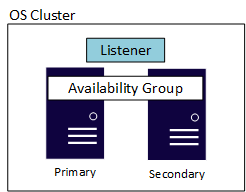
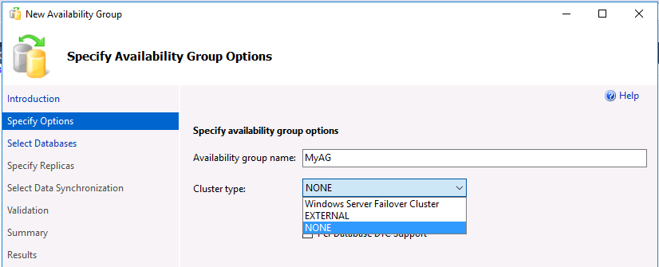
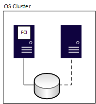
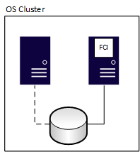
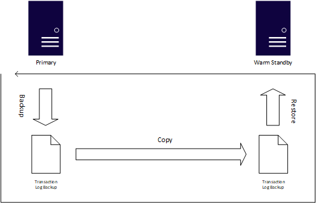
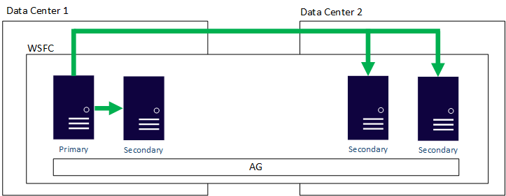
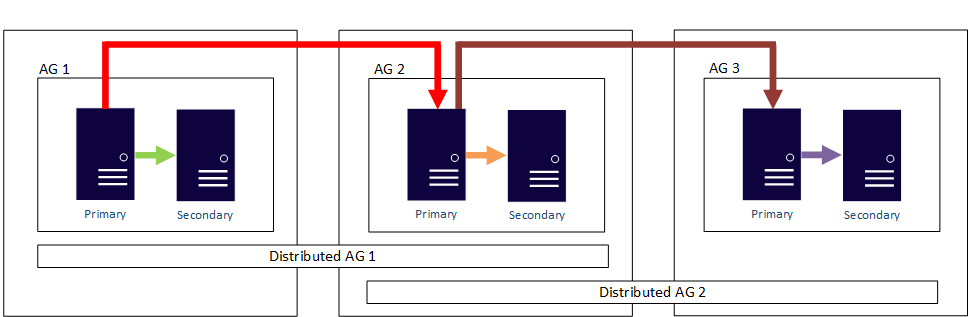
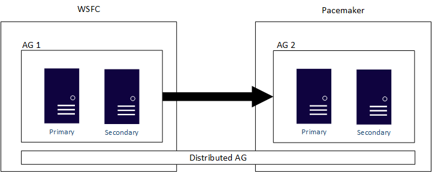
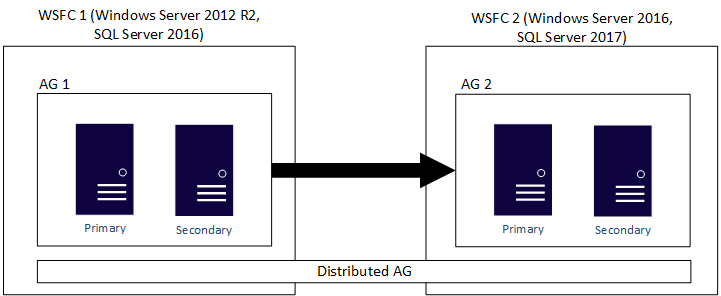

This article provides an overview of business continuity solutions for high availability and disaster recovery in SQL Server. 

One common task everyone deploying SQL Server has to account for is making sure that all mission critical SQL Server instances and the databases within them are available when the business and end users need them, whether that is 9 to 5 or around the clock. The goal is to keep the business up and running with minimal or no interruption. This concept is also known as business continuity.

SQL Server 2017 introduces many new features or enhancements to existing ones, some of which are for availability. The biggest addition to SQL Server 2017 is the support for SQL Server on Linux distributions. For a full list of the new features in SQL Server 2017, see the topic [What's new in SQL Server](https://docs.microsoft.com/sql/sql-server/what-s-new-in-sql-server-2017).

This article is focused on covering the availability scenarios in SQL Server 2017 as well as the new and enhanced availability features in SQL Server 2017. The scenarios include hybrid ones that will be able to span SQL Server deployments on both Windows Server and Linux, as well as ones that can increase the number of readable copies of a database. While this article does not cover availability options external to SQL Server, such as those provided by virtualization, everything discussed here applies to SQL Server installations inside a guest virtual machine whether in the public cloud or hosted by anon premises hypervisor server.

## SQL Server 2017 scenarios using the availability features

Availability groups, FCIs, and log shipping can be used in a variety of ways, and not necessarily just for availability purposes. There are four main ways the availability features can be used:

* High availability
* Disaster recovery
* Migrations and upgrades
* Scaling out readable copies of one or more databases

Each section will discuss the relevant features that can be used for that particular scenario. The one feature not covered is [SQL Server replication](https://docs.microsoft.com/sql/relational-databases/replication/sql-server-replication). While not officially designated as an availability feature under the Always On umbrella, it is often used for making data redundant in certain scenarios. Replication will be added to SQL Server on Linux in a future release.

> [!IMPORTANT] 
> The SQL Server availability features do not replace the requirement to have a robust, well tested backup and restore strategy, the most fundamental building block of any availability solution.

### High availability

Ensuring that SQL Server instances or database are available in the case of a problem that is local to a data center or single region in the cloud region is important. This section will cover how the SQL Server availability features can assist in that task. All of the features described are available both on Windows Server as well as on Linux. 

#### Always on availability groups

Introduced in SQL Server 2012, Always On Availability Groups (availability groups) provide database-level protection by sending each transaction of a database to another instance, known as a replica, that contains a copy of that database in a special state. An availability group can be deployed on Standard or Enterprise Editions.  The instances participating in an availability group can be either standalone or Always On Failover Cluster Instances (FCIs, described in the next section). Since the transactions are sent to a replica as they happen, availability groups are recommended where there are requirements for lower recovery point and recovery time objectives. Data movement between replicas can be synchronous or asynchronous, with Enterprise Edition allowing up to three replicas (including the primary) as synchronous. An availability group has one fully read/write copy of the database which is on the primary replica, while all secondary replicas cannot receive transactions directly from end users or applications. 

> [!NOTE] 
> Always On is an umbrella term for the availability features in SQL Server and covers both availability groups and FCIs. Always On is not the name of the availability group feature.

Because availability groups only provide database-level, and not instance-level, protection, anything not captured in the transaction log or configured in the database will need to manually synchronized for each secondary replica. Some examples of objects that must be synchronized manually are logins at the instance level, linked servers, and SQL Server Agent jobs.

An availability group also has another component called the listener, which allows applications and end users to connect without needing to know which SQL Server instance is hosting the primary replica. Each availability group would have its own listener. While the implementations of the listener are slightly different on Windows Server versus Linux, the functionality it provides and how it is used is the same. The picture below shows a Windows Server-based availability group which is using a Windows Server Failover Cluster (WSFC). An underlying cluster at the OS layer is required for availability whether it is on Linux or Windows Server. The example shows a simple two server, or node, configuration where a WSFC is the underlying cluster. 

 
Standard and Enterprise Edition have different maximums when it comes to replicas. An availability group in Standard Edition, known as a Basic Availability Group, supports two replicas (one primary and one secondary) with only a single database in the availability group. Enterprise Edition not only allows multiple databases to be configured in a single availability group, but also can have up to nine total replicas (one primary, eight secondary). Enterprise edition also provides other optional benefits such as readable secondary replicas, the ability to make backups off of a secondary replica, and more.

>[!NOTE]
> Database mirroring, which was deprecated in SQL Server 2012, is not available on the Linux version of SQL Server nor will it be added. Customers still using database mirroring should start planning to migrate to availability groups, which is the replacement for database mirroring.

When it comes to availability, availability groups can provide either automatic or manual failover. Automatic failover can occur if synchronous data movement is configured and the database on the primary and secondary replica are in a synchronized state. As long as the listener is used and the application uses a later version of .NET (3.5 with an update, or 4.0 and above), the failover should be handled with minimal to no impact to end users if a listener is utilized. Failover to make a secondary replica the new primary replica can be configured to be automatic or manual, and generally is measured in seconds.

The list below highlights some differences with availability groups on Windows Server versus Linux:
* Due to differences in the way the underlying cluster works on Linux and Windows Server, all failovers (manual or automatic) of availability groups are done via the cluster on Linux. On Windows Server-based availability group deployments, manual failovers must be done via SQL Server. Automatic failovers are handled by the underlying cluster on both Windows Server and Linux. 
* In SQL Server 2017, the recommended configuration for availability groups on Linux will be a minimum of three replicas. This is due to the way that the underlying clustering works. An improved solution for a two replica configuration will come post-release.
* On Linux, the common name used by each listener is defined in DNS and not in the cluster like it is on Windows Server.

In SQL Server 2017, there are some new features and enhancements to availability groups:

* Cluster types
* REQUIRED_SECONDARIES_TO_COMMIT
* Enhanced Microsoft Distributor Transaction Coordinator (DTC) support for Windows Server-based configurations
* Additional scale out scenarios for read only databases (described later in this article)

##### Always on availability group cluster types

The built-in availability form of clustering in Windows Server is enabled via a feature named Failover Clustering. It allows you to build a WSFC to be used with an availability group or FCI. Integration for availability groups and FCIs is provided by a cluster-aware resource DLLs shipped by SQL Server. 

Each supported Linux distribution ships its own version of the Pacemaker cluster solution. SQL Server 2017 on Linux supports the use of Pacemaker. Pacemaker is an open stack solution that each distribution can then integrate with their stack. While the distributions ship Pacemaker, it is not as integrated as the Failover Clustering feature in Windows Server.

A WSFC and Pacemaker are more similar than different. Both provide a way to take individual servers and combine them in a configuration to provide availability, and have concepts of things like resources, constraints (even if implemented differently), failover, and so on. To support Pacemaker for both availability group and FCI configurations including things like automatic failover, Microsoft provides the mssql-server-ha package, which is similar to, but not exactly the same as, the resource DLLs in a WSFC, for Pacemaker. One of the differences between a WSFC and Pacemaker is that there is no network name resource in Pacemaker, which is the component that helps to abstract the name of the listener (or the name of the FCI) on a WSFC. DNS provides that name resolution on Linux.

Because of the difference in the cluster stack, some changes needed to be made for availability groups because SQL Server has to handle some of the metadata that is natively handled by a WSFC. The most [!IMPORTANT] change is the introduction of a cluster type for an availability group. This is stored in sys.availability_groups in the cluster_type and cluster_type_desc columns. There are three cluster types:

* WSFC 
* External
* None

All availability groups that require availability must use an underlying cluster, which in the case of SQL Server 2017 means a WSFC or Pacemaker. For Windows Server-based availability groups that use an underlying WSFC, the default cluster type is WSFC and does not need to be set. For Linux-based availability groups, when creating the availability group, the cluster type must be set to External. The integration with Pacemaker is configured after the availability group is created, whereas on a WSFC, it is done at creation time.

A cluster type of None can be used with both Windows Server and Linux availability groups. Setting the cluster type to None means that the availability group does not require an underlying cluster. This means SQL Server 2017 is the first version of SQL Server to support availability groups without a cluster, but the tradeoff is that this configuration is not supported as a high availability solution. 

> [!IMPORTANT] 
> SQL Server 2017 does not allow the ability to change a cluster type for an availability group after it is created. This means that an availability group cannot be switched from None to External or WSFC, or vice versa. 

For those who are only looking to just add additional read only copies of a database, or like what an availability group provides for migration/upgrades but do not want to be tied to the additional complexity of an underlying cluster or even the replication, an availability group with a cluster type of None is a perfect solution. For more information, see the sections [Migrations and Upgrades](#Migrations) and [read-scale](#ReadScaleOut). 

The screenshot below shows the support for the different kinds of cluster types in SSMS. You must be running version 17.1 or later. The screenshot below is from version 17.2.

 
##### REQUIRED_SYNCHRONIZED_SECONDARIES_TO_COMMIT

SQL Server 2016 increased support for the number of synchronous replicas from two to three in Enterprise Edition. However, if one secondary replica was synchronized but the other was having a problem, there was no way to control the behavior to tell the primary to either wait for the misbehaving replica or to allow it to move on. This means that the primary replica at some point would continue to receive write traffic even though the secondary replica would not be in a synchronized state, which means that there is data loss on the secondary replica.
In SQL Server 2017, there is now an option to be able to control the behavior of what happens when there are synchronous replicas named REQUIRED_SYNCHRONIZED_SECONDARIES_TO_COMMIT. The option works as follows:
* There are three possible values: 0, 1, and 2
* The value is the number of secondary replicas that must be synchronized, which has implications for data loss, availability group availability, and failover
* For WSFCs and a cluster type of None, the default value is 0, and can be manually set to 1 or 2
* For a cluster type of External, by default, the cluster mechanism will set this and it can be overridden manually. For three synchronous replicas, the default value will be 1.
On Linux, the value for REQUIRED_SYNCHRONIZED_SECONDARIES_TO_COMMIT is configured on the availability group resource in the cluster. On Windows, it is set via Transact-SQL.

A value that is higher than 0 ensures higher data protection because if the required number of secondary replicas is not available, the primary will not be available until that is resolved. REQUIRED_SYNCHRONIZED_SECONDARIES_TO_COMMIT also affects failover behavior since automatic failover could not occur if the right number of secondary replicas were not in the proper state. On Linux, a value of 0 will not allow automatic failover, so on Linux, when using synchronous with automatic failover, the value must be set higher than 0 to achieve automatic failover. 0 on Windows Server is the SQL Server 2016 and earlier behavior.

##### Enhanced Microsoft distributed transaction coordinator support

Before SQL Server 2016, the only way to get availability in SQL Server for applications that require distributed transactions which use DTC underneath the covers was to deploy FCIs. A distributed transaction can be done in one of two ways:
* A transaction that spans more than one database in the same SQL Server instance
* A transaction that spans more than one SQL Server instance or possibly involves a non-SQL Server data source

SQL Server 2016 introduced partial support for DTC with availability groups that covered the latter scenario. SQL Server 2017 completes the story by supporting both scenarios with DTC.

Another enhancement to DTC support for availability groups is that in SQL Server 2016, enabling support for DTC to an availability group could only be done when the availability group was created, and could not be added later. In SQL Server 2017, DTC support can also be added to an availability group after it is created.

>[!NOTE]
> DTC support can only be configured for databases in Windows Server-based SQL Server instances. If DTC is an requirement for your application, you must use Windows Server as the OS for your SQL Server deployment, and cannot use Linux. 

#### Always on failover cluster instances
Clustered installations have been a feature of SQL Server since version 6.5. FCIs are a proven method of providing availability for the entire installation of SQL Server, known as an instance. This means that everything inside the instance, including databases, SQL Server Agent jobs, linked servers, et al., will move to another server should the underlying server encounter a problem. All FCIs require some sort of shared storage, even if it is provided via networking. The FCI's resources can only be running and owned by one node at any given time. In the picture below, the first node of the cluster owns the FCI, which also means it owns the shared storage resources associated with it denoted by the solid line to the storage.

 
After a failover, ownership changes as is seen in the picture below.

 
There is zero data loss with an FCI, but the underlying shared storage is a single point of failure since there is one copy of the data. FCIs are often combined with another availability method, such as an availability group or log shipping, to have redundant copies of databases. The additional method deployed should use physically separate storage from the FCI. When the FCI fails over to another node, it stops on one node and starts on another, not unlike powering a server off and turning it on. An FCI goes through the normal recovery process, meaning any transactions that need to be rolled forward will be, and any transactions that are incomplete will be rolled back. Therefore, the database is consistent from a data point to the time of the failure or manual failover, hence no data loss. Databases are only available after recovery is complete, so recovery time will depend on many factors, and will generally be longer than failing over an availability group. The tradeoff is that when you fail over an availability group, there may be additional tasks required to make a database usable, such as enabling a SQL Server Agent jobs job.

Like an availability group, FCIs abstract which node of the underlying cluster is hosting it. An FCI always retains the same name. Applications and end users never connect to the nodes; the unique name assigned to the FCI is used. An FCI can participate in an availability group as one of the instances hosing either a primary or secondary replica.

The list below highlights some differences with FCIs on Windows Server versus Linux:

* On Windows Server, an FCI is part of the installation process. An FCI on Linux is configured after installing SQL Server.
* Linux only supports a single installation of SQL Server per host, so all FCIs will be a default instance. Windows Server supports up to 25 FCIs per WSFC.
* The common name used by FCIs in Linux is defined in DNS, and should be the same as the resource created for the FCI.

#### Log shipping
If recovery point and recovery time objectives are more flexible, or databases are not considered to be highly mission critical, log shipping is another proven availability feature in SQL Server. Based on SQL Server's native backups, the process for log shipping automatically generates transaction log backups, copies them to one or more instances known as a warm standby, and automatically applies the transaction log backups to that standby. Log shipping uses SQL Server Agent jobs to automate the process of backing up, copying, and applying the transaction log backups. 
> [!IMPORTANT] 
> On Linux, SQL Server Agent jobs is not included as part of the installation of SQL Server itself. It is available in the package mssql-server-Agent jobs which must also be installed to use log shipping.

 
Arguably the biggest advantage of using log shipping in some capacity is that it accounts for human error. The application of transaction logs can be delayed. Therefore, if someone issues something like an UPDATE without a WHERE clause, the standby may not have the change so you could switch to that while you repair the primary system. While log shipping is easy to configure, switching from the primary to a warm standby, known as a role change, is always manual. A role change is initiated via Transact-SQL, and like an availability group, all objects not captured in the transaction log must be manually synchronized. Log shipping also needs to be configured per database, whereas a single availability group can contain multiple databases. 
Unlike an availability group or FCI, log shipping has no abstraction for a role change. Applications must be able to handle this. Techniques such as a DNS alias (CNAME) could be employed, but there are pros and cons, such as the time it takes for DNS to refresh after the switch.

## Disaster recovery

When your primary availability location experiences a catastrophic event like an earthquake or flood, the business must be prepared to have its systems come online elsewhere. This section will cover how the SQL Server availability features can assist with business continuity.

### Always on availability groups

One of the benefits of availability groups is that both high availability and disaster recovery can be configured using a single feature. Without the requirement for ensuring that shared storage is also highly available, it is much easier to have replicas that are local in one data center for high availability, and remote ones in other data centers for disaster recovery each with separate storage. Having additional copies of the database is the tradeoff for ensuring redundancy. An example of an availability group that spans multiple data centers is shown below. One primary replica is responsible for keeping all secondary replicas synchronized.

 
Outside of an availability group with a cluster type of none, an availability group requires that all replicas are part of the same underlying cluster whether it is a WSFC or Pacemaker. This means that in the picture above, the WSFC is stretched to work in two different data centers which adds complexity. regardless of the platform (Windows Server or Linux). Stretching clusters across distance adds complexity. 
Introduced in SQL Server 2016, a distributed availability group allows an availability group to span availability groups configured on different clusters. This decouples the requirement to have the nodes all participate in the same cluster, which makes configuring disaster recovery much easier. For more information on distributed availability groups, see [Distributed availability groups](https://docs.microsoft.com/sql/database-engine/availability-groups/windows/distributed-availability-groups).

 
### Always on failover cluster instances

FCIs can be used for disaster recovery. As with a normal availability group, the underlying cluster mechanism must also be extended to all locations which adds complexity. There is an additional consideration for FCIs: the shared storage. The same disks need to be available in the primary and secondary sites, so an external method such as functionality provided by the storage vendor at the hardware layer or using storage Replica in Windows Server, is required to ensure that the disks used by the FCI exist elsewhere. 

 
### Log shipping
Log shipping is one of the oldest methods of providing disaster recovery for SQL Server databases. Log shipping is often used in conjunction with availability groups and FCIs to provide cost-effective and simpler disaster recovery where other options may be challenging due to environment, administrative skills, or budget. Similar to the high availability story for log shipping, many environments will delay the loading of a transaction log to account for human error.

##  Migrations and upgrades

When deploying new instances or upgrading old ones, a business cannot tolerate long outage. This section will discuss how the availability features of SQL Server can be used to minimize the downtime in a planned architecture change, server switch, platform change (such as Windows Server to Linux or vice versa), or during patching.

> [!NOTE]
> Other methods, such as using backups and restoring them elsewhere, can also be used for migrations and upgrades. They are not discussed in this paper. 

### Always on availability groups

An existing instance containing one or more availability groups can be upgraded in place to SQL Server 2017. While this will require some amount of downtime, with the right amount of planning, it can be minimized. 

If the goal is to migrate to new servers and not change the configuration (including the operating system or SQL Server version), those servers could be added as nodes to the existing underlying cluster and added to the availability group. Once the replica or replicas are in the right state, a manual failover could occur to a new server, and then the old ones could be removed from the availability group, and ultimately, decommissioned. 

Distributed AGs are also another method to migrate to a new configuration or upgrade SQL Server. Because a distributed AG supports different underlying AGs on different architectures, for example, you could change from SQL Server 2016 running on Windows Server 2012 R2 to SQL Server 2017 running on Windows Server 2016. 

Finally, availability groups with a cluster type of None can also be used for migration or upgrading. You cannot mix and match cluster types in a typical availability group configuration, so all replicas would need to be a type of None. A distributed availability group can be used to span availability groups configured with different cluster types. This method is also supported across the different OS platforms.

All variants of availability groups for migrations and upgrades allow the most time consuming portion of the work to be done over time - data synchronization. When it comes time to initiate the switch to the new configuration, the cutover will be a brief outage versus one long period of downtime where all the work, including data synchronization, would need to be completed. 

Availability groups can provide minimal downtime during patching of the underlying OS by manually failing over the primary to a secondary replica while the patching is being completed. From an operating system perspective, doing this would be more common on Windows Server since often, but not always, servicing the underlying OS may require a reboot. Patching Linux sometimes needs a reboot, but it can be infrequent. 

[Patching SQL Server instances participating in an availability group](https://docs.microsoft.com/sql/database-engine/availability-groups/windows/upgrading-always-on-availability-group-replica-instances) can also minimize downtime depending on how complex the availability group architecture is. To patch servers participating in an availability group, a secondary replica is patched first. Once the right number of replicas are patched, the primary replica is manually failed over to another node to do the upgrade. Any remaining secondary replicas at that point can be upgraded, too. 

### Always on failover cluster instances

FCIs on their own cannot assist with a traditional migration or upgrade; an availability group or log shipping would have to be configured for the databases in the FCI and all other objects accounted for. However, FCIs under Windows Server are still a popular option for when the underlying Windows Servers need to be patched. A manual failover can be initiated, which means a brief outage instead of having the instance completely unavailable for the entire time Windows Server is being patched.
An FCI can be upgraded in place to SQL Server 2017. For information, see [Upgrade a SQL Server Failover Cluster Instance](https://docs.microsoft.com/sql/sql-server/failover-clusters/windows/upgrade-a-sql-server-failover-cluster-instance).

### Log shipping

Log shipping is still a popular option to both migrate and upgrade databases. Similar to availability groups, but this time using the transaction log as the synchronization method, the data propagation can be started well in advance of the server switch. At the time of the switch, once all traffic is stopped at the source, a final transaction log would need to be taken, copied, and applied to the new configuration. At that point, the database can be brought online. Log shipping is often more tolerant of slower networks, and while the switch may be slightly longer than one done using an availability group or a distributed availability group, it is usually measured in minutes - not hours, days, or weeks.

Similar to availability groups, log shipping can provide a way to switch to another server in the event of patching.

### Other SQL Server deployment methods and availability

There are two other deployment methods for SQL Server on Linux: containers and using Azure (or another public cloud provider). The general need for availability as presented throughout this paper exists regardless of how SQL Server is deployed. These two methods have some special considerations when it comes to making SQL Server highly available.

[Containers using Docker](https://docs.microsoft.com/sql/linux/quickstart-install-connect-docker) are a new way of deploying SQL Server, either for Windows Server or Linux. A container is a complete image of SQL Server that is ready to run. However, there is currently no native support for clustering, and thus, direct high availability or disaster recovery. Currently, the options to make SQL Server databases available using containers would be log shipping and backup and restore. While an availability group with a cluster type of None can be configured, as noted earlier, it is not considered a true availability configuration. Microsoft is looking at ways to enable availability groups or FCIs using containers. 

If you are using containers today, if the container is lost, depending on the container platform, it can be deployed again and attached to the shared storage that was used. Some of this mechanism is provided by the container orchestrator. While this does provide some resiliency, there will be some downtime associated with database recovery and is not truly highly available as it would be if using an availability group or FCI. 

Linux IaaS virtual machines can be deployed with SQL Server installed using Azure. As with on premises-based installations, a supported installation requires the use of STONITH (Shoot the Other Node in the Head) which is external to Pacemaker itself. STONITH is provided via fencing availability agents. Some distributions ship them as part of the platform, others rely on external hardware and software vendors. Check with your preferred Linux distribution to see what forms of STONITH are provided so that a supported solution can be deployed in the public cloud.

## Cross-platform and Linux distribution interoperability

With SQL Server now supported on both Windows Server and Linux, this section covers the scenarios of how they can work together for availability in addition to other purposes, as well as the story for solutions that will incorporate more than one Linux distribution.

Before covering the cross-platform and interoperability scenarios, two facts need to be stated:

* There are no scenarios where a WSFC-based FCI or availability group will work with a Linux-based FCI or availability group directly. A WSFC cannot be extended by a Pacemaker node and vice versa. 
* Mixing Linux distributions is not supported with FCIs or an availability group that has a cluster type of External. All availability group replicas in that scenario must be configured not only the same Linux distribution, but also the same version. The two supported ways that SQL Server can operate across the two platforms or multiple distributions of Linux are availability groups and log shipping.

## Distributed availability groups 

Distributed availability groups are designed to span availability group configurations, whether those two underlying clusters underneath the availability groups are two different WSFCs, Linux distributions, or one on a WSFC and the other on Linux. A distributed availability group will be the primary method of having a cross platform solution. A distributed availability group is also the primary solution for migrations such as converting from a Windows Server-based SQL Server infrastructure to a Linux-based one if that is what your company wants to do. As noted above, availability groups, and especially distributed availability groups, would minimize the time that an application would be unavailable for use. An example of a distributed availability group that spans a WSFC and Pacemaker is shown below.

 
If an availability group is configured with a cluster type of None, it can span Windows Server and Linux as well as multiple Linux distributions. Since this is not a true high availability configuration, it should not be used for mission critical deployments, but for read-scale or migration/upgrade scenarios.

## Log shipping

Since log shipping is just based on backup and restore, and there are no differences in the databases, file structures, etc., for SQL Server on Windows Server versus SQL Server on Linux. This means that log shipping can be configured between a Windows Server-based SQL Server installation and a Linux one as well as between distributions of Linux. Everything else remains the same. The only caveat is that log shipping, just like an availability group, cannot work when the source is at a higher SQL Server major version against a target that is at a lower version of SQL Server. 

##  read-scale

Since their introduction in SQL Server 2012, secondary replicas have had the ability to be used for read-only queries. There are two ways that can be achieved with an availability group: by allowing direct access to the secondary as well as [configuring read only routing](https://docs.microsoft.com/sql/database-engine/availability-groups/windows/configure-read-only-routing-for-an-availability-group-sql-server) which requires the use of the listener.  SQL Server 2016 introduced the ability to load balance read-only connections via the listener using a round robin algorithm, allowing read-only requests to be spread across all readable replicas. 

> [!NOTE]
> Readable secondary replicas is a feature only in Enterprise Edition, and each instance hosting a readable replica would need a SQL Server license.

Scaling readable copies of a database via availability groups was first introduced with distributed availability groups in SQL Server 2016. This would allow companies to have read-only copies of the database not only locally, but regionally and globally with a minimal amount of configuration and reduce network traffic and latency by having queries executed locally. Each primary replica of an availability group can seed two other availability groups even if it is not the fully read/write copy, so each distributed availability group can support up to 27 copies of the data that are readable. 

Starting with SQL Server 2017, It is possible to create a near-real time, read-only solution with availability groups configured with a cluster type of None. If the goal is to use availability groups for readable secondary replicas and not availability, doing this removes the complexity of using a WSFC or Pacemaker, and gives the readable benefits of an availability group in a simpler deployment method. 

The only major caveat is that due to no underlying cluster with a cluster type of None, configuring read only routing is a little different. From a SQL Server perspective, a listener is still required to route the requests even though there is no cluster. Instead of configuring a traditional listener, the IP address or name of the primary replica is used. The primary replica is then used to route the read only requests.

A log shipping warm standby can technically be configured for readable usage by restoring the database WITH STANDBY. However, because the transaction logs require exclusive use of the database for restoration, it means that users cannot be accessing the database while that happens. This makes log shipping a less than ideal solution - especially if near real-time data is required. 

One thing that should be noted for all read-scale scenarios with availability groups is that unlike using transactional replication where all of the data is live, each secondary replica is not in a state where unique indexes can be applied, the replica is an exact copy of the primary. This means that if any indexes are required for reporting or data needs to be manipulated, it must be done on the database(s) on the primary replica. If you need that flexibility, replication is a better solution for readable data.

## Summary

Instances and databases of SQL Server 2017 can be made highly available using the same features on both Windows Server and Linux. Besides standard availability scenarios of local high availability and disaster recovery, downtime associated with upgrades and migrations can be minimized with the availability features in SQL Server. Availability groups can also provide additional copies of a database as part of the same architecture to scale out readable copies. Whether you are deploying a new solution using SQL Server 2017 or considering an upgrade, SQL Server 2017 has the availability and reliability you require.
 
[SimpleAG]:media\sql-server-ha-story\image1.png
[SSMSAGOptions]:media\sql-server-ha-story\image2.png
[BasicFCI]:media\sql-server-ha-story\image3.png
[PostFailoverFCI]:media\sql-server-ha-story\image4.png
[LogShipping]:media\sql-server-ha-story\image5.png
[AG]:media\sql-server-ha-story\image6.png
[DAG]:media\sql-server-ha-story\image7.png
[AlwaysOnFCI]:media\sql-server-ha-story\image8.png
[BasicDAG]:media\sql-server-ha-story\image9.png
[image10]:media\sql-server-ha-story\image10.png
[DAG]:media\sql-server-ha-story\image11.png
