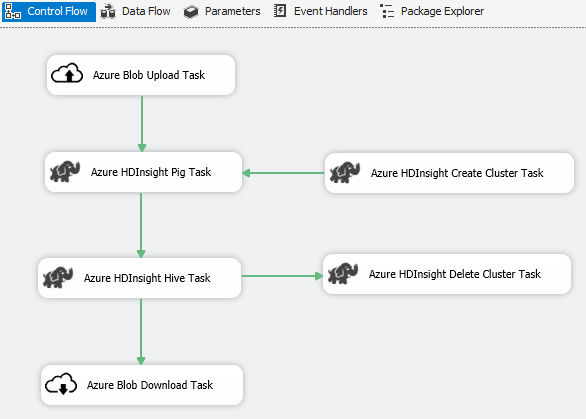
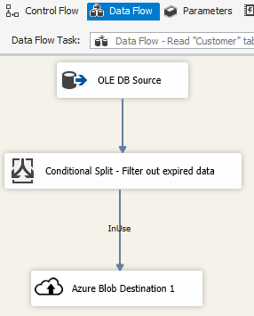
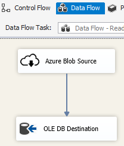

# Azure Feature Pack for Integration Services (SSIS)

[!INCLUDE[sqlserver-ssis](../includes/applies-to-version/sqlserver-ssis.md)]

SQL Server Integration Services (SSIS) Feature Pack for Azure is an extension that provides the components listed on this page for SSIS to connect to Azure services, transfer data between Azure and on-premises data sources, and process data stored in Azure.

:::image type="icon" source="../includes/media/download.svg" border="false"::: **[Download SSIS Feature Pack for Azure](https://www.microsoft.com/download/details.aspx?id=100430)**

- For SQL Server 2022 - [Microsoft SQL Server 2022 Integration Services Feature Pack for Azure](https://www.microsoft.com/download/details.aspx?id=104811)
- For SQL Server 2019 - [Microsoft SQL Server 2019 Integration Services Feature Pack for Azure](https://www.microsoft.com/download/details.aspx?id=100430)
- For SQL Server 2017 - [Microsoft SQL Server 2017 Integration Services Feature Pack for Azure](https://www.microsoft.com/download/details.aspx?id=54798)
- For SQL Server 2016 - [Microsoft SQL Server 2016 Integration Services Feature Pack for Azure](https://www.microsoft.com/download/details.aspx?id=49492)
- For SQL Server 2014 - [Microsoft SQL Server 2014 Integration Services Feature Pack for Azure](https://www.microsoft.com/download/details.aspx?id=47366)
- For SQL Server 2012 - [Microsoft SQL Server 2012 Integration Services Feature Pack for Azure](https://www.microsoft.com/download/details.aspx?id=47367)

The download pages also include information about prerequisites. Make sure you install SQL Server before you install the Azure Feature Pack on a server, or the components in the Feature Pack may not be available when you deploy packages to the SSIS Catalog database, SSISDB, on the server.

## Components in the Feature Pack
-   Connection Managers

    -   [Azure Data Lake Analytics Connection Manager](connection-manager/azure-data-lake-analytics-connection-manager.md)

    -   [Azure Data Lake Store Connection Manager](../integration-services/connection-manager/azure-data-lake-store-connection-manager.md)
    
    -   [Azure HDInsight Connection Manager](../integration-services/connection-manager/azure-hdinsight-connection-manager.md)

    -   [Azure Resource Manager Connection Manager](../integration-services/connection-manager/azure-resource-manager-connection-manager.md)
    
    -   [Azure Storage Connection Manager](../integration-services/connection-manager/azure-storage-connection-manager.md)

    -   [Azure Subscription Connection Manager](../integration-services/connection-manager/azure-subscription-connection-manager.md)
    
-   Tasks

    -   [Azure Blob Download Task](../integration-services/control-flow/azure-blob-download-task.md)

    -   [Azure Blob Upload Task](../integration-services/control-flow/azure-blob-upload-task.md)

    -   [Azure Data Lake Analytics Task](control-flow/azure-data-lake-analytics-task.md)

    -   [Azure Data Lake Store File System Task](../integration-services/control-flow/azure-data-lake-store-file-system-task.md)

    -   [Azure HDInsight Create Cluster Task](../integration-services/control-flow/azure-hdinsight-create-cluster-task.md)

    -   [Azure HDInsight Delete Cluster Task](../integration-services/control-flow/azure-hdinsight-delete-cluster-task.md)
    
    -   [Azure HDInsight Hive Task](../integration-services/control-flow/azure-hdinsight-hive-task.md)

    -   [Azure HDInsight Pig Task](../integration-services/control-flow/azure-hdinsight-pig-task.md)

    -   [Azure Synapse Analytics Task](../integration-services/control-flow/azure-sql-dw-upload-task.md)

    -   [Flexible File Task](../integration-services/control-flow/flexible-file-task.md)

-   Data Flow Components

    -   [Azure Blob Source](../integration-services/data-flow/azure-blob-source.md)

    -   [Azure Blob Destination](../integration-services/data-flow/azure-blob-destination.md)
    
    -   [Azure Data Lake Store Source](../integration-services/data-flow/azure-data-lake-store-source.md)
    
    -   [Azure Data Lake Store Destination](../integration-services/data-flow/azure-data-lake-store-destination.md)

    -   [Flexible File Source](../integration-services/data-flow/flexible-file-source.md)

    -   [Flexible File Destination](../integration-services/data-flow/flexible-file-destination.md)

-   Azure Blob, Azure Data Lake Store, and Data Lake Storage Gen2 File Enumerator. See [Foreach Loop Container](../integration-services/control-flow/foreach-loop-container.md)

## Use TLS 1.2

The TLS version used by Azure Feature Pack follows system .NET Framework settings.
To use TLS 1.2, add a `REG_DWORD` value named `SchUseStrongCrypto` with data `1` under the following two registry keys.

1. `HKEY_LOCAL_MACHINE\SOFTWARE\WOW6432Node\Microsoft\.NETFramework\v4.0.30319`
2. `HKEY_LOCAL_MACHINE\SOFTWARE\Microsoft\.NETFramework\v4.0.30319`

## Dependency on Java

Java is required to use ORC/Parquet file formats with Azure Data Lake Store/Flexible File connectors.  
The architecture (32/64-bit) of Java build should match that of the SSIS runtime to use.
The following Java builds have been tested.

- [Zulu's OpenJDK 8u192](https://www.azul.com/downloads/zulu/zulu-windows/)
- [Oracle's Java SE Runtime Environment 8u192](https://www.oracle.com/technetwork/java/javase/downloads/java-archive-javase8-2177648.html)

### Set Up Zulu's OpenJDK

1. Download and extract the installation zip package.
2. From the Command Prompt, run `sysdm.cpl`.
3. On the **Advanced** tab, select **Environment Variables**.
4. Under the **System variables** section, select **New**.
5. Enter `JAVA_HOME` for the **Variable name**.
6. Select **Browse Directory**, navigate to the extracted folder, and select the `jre` subfolder.
   Then select **OK**, and the **Variable value** is populated automatically.
7. Select **OK** to close the **New System Variable** dialog box.
8. Select **OK** to close the **Environment Variables** dialog box.
9. Select **OK** to close the **System Properties** dialog box.

> [!TIP]
> If you use Parquet format and hit error saying "An error occurred when invoking java, message: **java.lang.OutOfMemoryError:Java heap space**", you can add an environment variable *`_JAVA_OPTIONS`* to adjust the min/max heap size for JVM.
>
>
>
> Example: set variable *`_JAVA_OPTIONS`* with value *`-Xms256m -Xmx16g`*. The flag Xms specifies the initial memory allocation pool for a Java Virtual Machine (JVM), while Xmx specifies the maximum memory allocation pool. This means that JVM will be started with *`Xms`* amount of memory and will be able to use a maximum of *`Xmx`* amount of memory. The default values are min 64MB and max 1G.

### Set Up Zulu's OpenJDK on Azure-SSIS Integration Runtime

This should be done via [custom setup interface](/azure/data-factory/how-to-configure-azure-ssis-ir-custom-setup) for Azure-SSIS Integration Runtime.
Suppose `zulu8.33.0.1-jdk8.0.192-win_x64.zip` is used.
The blob container could be organized as follows.

~~~
main.cmd
install_openjdk.ps1
zulu8.33.0.1-jdk8.0.192-win_x64.zip
~~~

As the entry point, `main.cmd` triggers execution of the PowerShell script `install_openjdk.ps1` which in turn extracts `zulu8.33.0.1-jdk8.0.192-win_x64.zip` and sets `JAVA_HOME` accordingly.

**main.cmd**

~~~
powershell.exe -file install_openjdk.ps1
~~~

> [!TIP]
> If you use Parquet format and hit error saying "An error occurred when invoking java, message: **java.lang.OutOfMemoryError:Java heap space**", you can add command in *`main.cmd`* to adjust the min/max heap size for JVM. Example:
> ~~~
> setx /M _JAVA_OPTIONS "-Xms256m -Xmx16g"
> ~~~
> The flag Xms specifies the initial memory allocation pool for a Java Virtual Machine (JVM), while Xmx specifies the maximum memory allocation pool. This means that JVM will be started with *`Xms`* amount of memory and will be able to use a maximum of *`Xmx`* amount of memory. The default values are min 64MB and max 1G.

**install_openjdk.ps1**

~~~
Expand-Archive zulu8.33.0.1-jdk8.0.192-win_x64.zip -DestinationPath C:\
[Environment]::SetEnvironmentVariable("JAVA_HOME", "C:\zulu8.33.0.1-jdk8.0.192-win_x64\jre", "Machine")
~~~

### Set Up Oracle's Java SE Runtime Environment

1. Download and run the exe installer.
2. Follow the installer instructions to complete setup.

## Scenario: Processing big data
 Use Azure Connector to complete following big data processing work:

1.  Use the Azure Blob Upload Task to upload input data to Azure Blob Storage.

2.  Use the Azure HDInsight Create Cluster Task to create an Azure HDInsight cluster. This step is optional if you want to use your own cluster.

3.  Use the Azure HDInsight Hive Task or Azure HDInsight Pig Task to invoke a Pig or Hive job on the Azure HDInsight cluster.

4.  Use the Azure HDInsight Delete Cluster Task to delete the HDInsight Cluster after use if you have created an on-demand HDInsight cluster in step #2.

5.  Use the Azure HDInsight Blob Download Task to download the Pig/Hive output data from the Azure Blob Storage.

 
## Scenario: Managing data in the cloud
 Use the Azure Blob Destination in an SSIS package to write output data to Azure Blob Storage, or use the Azure Blob Source to read data from an Azure Blob Storage.

 
 

 Use the Foreach Loop Container with the Azure Blob Enumerator to process data in multiple blob files.

## Release Notes

### Version 1.21.0

#### Improvements

1. Upgraded log4j from version 1.2.17 to 2.17.1.

### Version 1.20.0

#### Improvements

1. Updated target .NET Framework version from 4.6 to 4.7.2.
1. Renamed "Azure SQL DW Upload Task" to "Azure Synapse Analytics Task".

#### Bugfixes

1. When accessing Azure Blob Storage and the machine running SSIS is in a non en-US locale, package execution will fail with error message "String not recognized as a valid DateTime value".
1. For Azure Storage Connection Manager, secret is required (and unused) even when Data Factory managed identity is used to authenticate.

### Version 1.19.0

#### Improvements

1. Added support for shared access signature authentication to Azure Storage connection manager.

### Version 1.18.0

#### Improvements

1. For Flexible File task, three are three improvements: (1) wildcard support for copy/delete operations is added; (2) user can enable/disable recursive searching for delete operation; and (3) the file name of Destination for copy operation can be empty to keep the source file name.

### Version 1.17.0

This is a hotfix version released for SQL Server 2019 only.

#### Bugfixes

1. When executing in Visual Studio 2019 and targeting SQL Server 2019, Flexible File Task/Source/Destination may fail with the error message `Attempted to access an element as a type incompatible with the array.`
1. When executing in Visual Studio 2019 and targeting SQL Server 2019, Flexible File Source/Destination using ORC/Parquet format may fail with the error message `Microsoft.DataTransfer.Common.Shared.HybridDeliveryException: An unknown error occurred. JNI.JavaExceptionCheckException.`

### Version 1.16.0

#### Bugfixes

1. In certain cases, package execution reports "Error: Could not load file or assembly 'Newtonsoft.Json, Version=11.0.0.0, Culture=neutral, PublicKeyToken=30ad4fe6b2a6aeed' or one of its dependencies."

### Version 1.15.0

#### Improvements

1. Add delete folder/file operation to Flexible File Task
1. Add External/Output data type convert function in Flexible File Source

#### Bugfixes

1. In certain cases, test connection malfunctions for Data Lake Storage Gen2 with the error message "Attempted to access an element as a type incompatible with the array"
1. Bring back support for Azure Storage Emulator