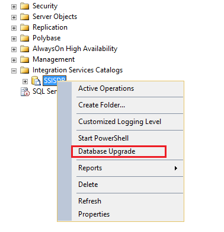
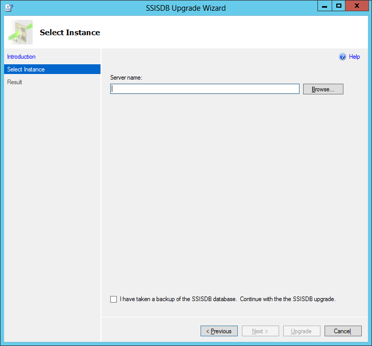
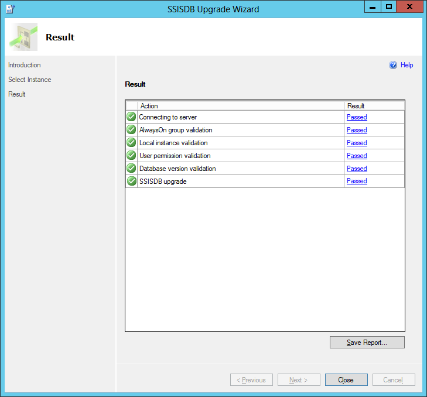
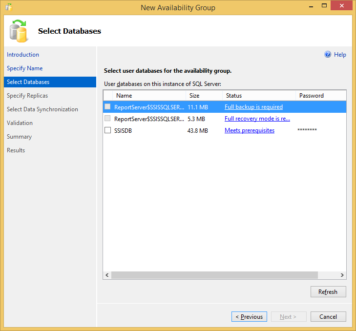
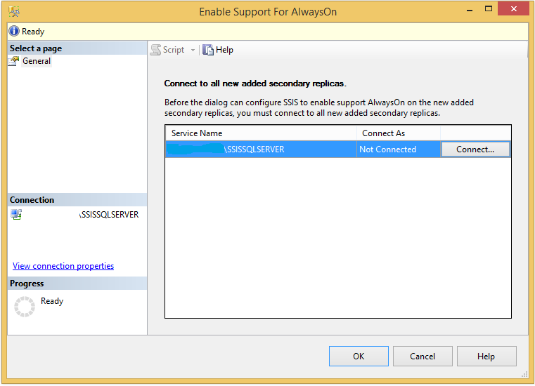

# SSIS Catalog

[!INCLUDE[sqlserver-ssis](../../includes/applies-to-version/sqlserver-ssis.md)]


  The **SSISDB** catalog is the central point for working with [!INCLUDE[ssISnoversion_md](../../includes/ssisnoversion-md.md)] (SSIS) projects that you've deployed to the [!INCLUDE[ssISnoversion_md](../../includes/ssisnoversion-md.md)] server. For example, you set project and package parameters, configure environments to specify runtime values for packages, execute and troubleshoot packages, and manage [!INCLUDE[ssISnoversion_md](../../includes/ssisnoversion-md.md)] server operations.  
 
> [!NOTE]
> This article describes the SSIS Catalog in general, and the SSIS Catalog running on premises. You can also create the SSIS Catalog in Azure SQL Database, and deploy and run SSIS packages in Azure. For more info, see [Lift and shift SQL Server Integration Services workloads to the cloud](../lift-shift/ssis-azure-lift-shift-ssis-packages-overview.md).
>
> Although you can also run SSIS packages on Linux, the SSIS Catalog is not supported on Linux. For more info, see [Extract, transform, and load data on Linux with SSIS](../../linux/sql-server-linux-migrate-ssis.md).
 
 The objects that are stored in the **SSISDB** catalog include projects, packages, parameters, environments, and operational history.  
  
 You inspect objects, settings, and operational data that are stored in the **SSISDB** catalog, by querying the views in the **SSISDB** database. You manage the objects by calling stored procedures in the **SSISDB** database or by using the UI of the **SSISDB** catalog. In many cases, the same task can be performed in the UI or by calling a stored procedure.  
  
 To maintain the **SSISDB** database, it is recommended that you apply standard enterprise policies for managing user databases. For information about creating maintenance plans, see [Maintenance Plans](../../relational-databases/maintenance-plans/maintenance-plans.md).  
  
 The **SSISDB** catalog and the **SSISDB** database support Windows PowerShell. For more information about using SQL Server with Windows PowerShell, see [SQL Server PowerShell](../../powershell/sql-server-powershell.md). For examples of how to use Windows PowerShell to complete tasks such as deploying a project, see the blog entry, [SSIS and PowerShell in SQL Server 2012](https://techcommunity.microsoft.com/t5/sql-server-integration-services/ssis-and-powershell-in-sql-server-2012/ba-p/388015), on blogs.msdn.com.  
  
 For more information about viewing operations data, see [Monitor Running Package and Other Operations](../../integration-services/performance/monitor-running-packages-and-other-operations.md).  
  
 You access the **SSISDB** catalog in [!INCLUDE[ssManStudioFull](../../includes/ssmanstudiofull-md.md)] by connecting to the [!INCLUDE[ssNoVersion](../../includes/ssnoversion-md.md)] Database Engine and then expanding the **Integration Services Catalogs** node in Object Explorer. You access the **SSISDB** database in [!INCLUDE[ssManStudioFull](../../includes/ssmanstudiofull-md.md)] by expanding the Databases node in Object Explorer.  
  
> [!NOTE]
> You cannot rename the **SSISDB** database.  
  
> [!NOTE]
> If the [!INCLUDE[ssNoVersion](../../includes/ssnoversion-md.md)] instance that the **SSISDB** database is attached to, stops or does not respond, the ISServerExec.exe process ends. A message is written to a Windows Event log.  
>   
>  If the [!INCLUDE[ssNoVersion](../../includes/ssnoversion-md.md)] resources fail over as part of a cluster failover, the running packages do not restart. You can use checkpoints to restart packages. For more information, see [Restart Packages by Using Checkpoints](../../integration-services/packages/restart-packages-by-using-checkpoints.md).  
  
## Features and capabilities  
  
-   [Catalog Object Identifiers](../../integration-services/catalog/ssis-catalog.md#CatalogObjectIdentifiers)  
  
-   [Catalog Configuration](../../integration-services/catalog/ssis-catalog.md#Configuration)  
  
-   [Permissions](../../integration-services/catalog/ssis-catalog.md#Permissions)  
  
-   [Folders](../../integration-services/catalog/ssis-catalog.md#Folders)  
  
-   [Projects and Packages](../../integration-services/catalog/ssis-catalog.md#ProjectsAndPackages)  
  
-   [Parameters](../../integration-services/catalog/ssis-catalog.md#Parameters)  
  
-   [Server Environments, Server Variables, and Server Environment References](../../integration-services/catalog/ssis-catalog.md#ServerEnvironments)  
  
-   [Executions and Validations](../../integration-services/catalog/ssis-catalog.md#Executions)  

##  <a name="CatalogObjectIdentifiers"></a> Catalog Object Identifiers  
 When you create a new object in the catalog, assign a name to the object. The object name is an identifier. [!INCLUDE[ssNoVersion](../../includes/ssnoversion-md.md)] defines rules for which characters can be used in an identifier. Names for the following objects must follow identifier rules.  
  
-   Folder  
  
-   Project  
  
-   Environment  
  
-   Parameter  
  
-   Environment Variable  
  
###  <a name="Folder"></a> Folder, Project, Environment  
 Consider the following rules when renaming a folder, project, or environment.  
  
-   Invalid characters include ASCII/Unicode characters 1 through 31, quote ("), less than (\<), greater than (>), pipe (|), backspace (\b), null (\0), and tab (\t).  
  
-   The name might not contain leading or trailing spaces.  
  
-   \@ is not allowed as the first character, but subsequent characters might use \@.  
  
-   The length of the name must be greater than 0 and less than or equal to 128.  
  
###  <a name="Parameter"></a> Parameter  
 Consider the following rules when naming a parameter.  
  
-   The first character of the name must be a letter as defined in the Unicode Standard 2.0, or an underscore (_).  
  
-   Subsequent characters can be letters or numbers as defined in the Unicode Standard 2.0, or an underscore (_).  
  
###  <a name="EnvironmentVariable"></a> Environment Variable  
 Consider the following rules when naming an environment variable.  
  
-   Invalid characters include ASCII/Unicode characters 1 through 31, quote ("), less than (\<), greater than (>), pipe (|), backspace (\b), null (\0), and tab (\t).  
  
-   The name might not contain leading or trailing spaces.  
  
-   \@ is not allowed as the first character, but subsequent characters might use \@.  
  
-   The length of the name must be greater than 0 and less than or equal to 128.  
  
-   The first character of the name must be a letter as defined in the Unicode Standard 2.0, or an underscore (_).  
  
-   Subsequent characters can be letters or numbers as defined in the Unicode Standard 2.0, or an underscore (_).  
  
##  <a name="Configuration"></a> Catalog Configuration  
 You fine-tune how the catalog behaves by adjusting the catalog properties. Catalog properties define how sensitive data is encrypted, and how operations and project versioning data is retained. To set catalog properties, use the **Catalog Properties** dialog box or call the [catalog.configure_catalog &#40;SSISDB Database&#41;](../../integration-services/system-stored-procedures/catalog-configure-catalog-ssisdb-database.md) stored procedure. To view the properties, use the dialog box or query [catalog.catalog_properties &#40;SSISDB Database&#41;](../../integration-services/system-views/catalog-catalog-properties-ssisdb-database.md). You access the dialog box by right-clicking **SSISDB** in Object Explorer.  
  
###  <a name="Cleanup"></a> Operations and Project Version Cleanup  
 Status data for many of the operations in the catalog is stored in internal database tables. For example, the catalog tracks the status of package executions and project deployments. To maintain the size of the operations data, the **SSIS Server Maintenance Job** in [!INCLUDE[ssManStudioFull](../../includes/ssmanstudiofull-md.md)] is used to remove old data. This [!INCLUDE[ssNoVersion](../../includes/ssnoversion-md.md)] Agent job is created when [!INCLUDE[ssISnoversion](../../includes/ssisnoversion-md.md)] is installed.  
  
 You can update or redeploy an [!INCLUDE[ssISnoversion](../../includes/ssisnoversion-md.md)] project by deploying it with the same name to the same folder in the catalog. By default, each time you redeploy a project, the **SSISDB** catalog retains the previous version of the project. To maintain the size of the operations data, the **SSIS Server Maintenance Job** is used to remove old versions of projects.  
 
To run the **SSIS Server Maintenance Job**, SSIS creates the SQL Server login **##MS_SSISServerCleanupJobLogin##**. This login is only for internal use by SSIS.
  
 The following **SSISDB** catalog properties define how this [!INCLUDE[ssNoVersion](../../includes/ssnoversion-md.md)] Agent job behaves. You can view and modify the properties by using the **Catalog Properties** dialog box or by using [catalog.catalog_properties &#40;SSISDB Database&#41;](../../integration-services/system-views/catalog-catalog-properties-ssisdb-database.md) and [catalog.configure_catalog &#40;SSISDB Database&#41;](../../integration-services/system-stored-procedures/catalog-configure-catalog-ssisdb-database.md).  
  
 **Clean Logs Periodically**  
 The job step for operations cleanup runs when this property is set to **True**.  
  
 **Retention Period (days)**  
 Defines the maximum age of allowable operations data (in days). Older data are removed.  
  
 The minimum value is one day. The maximum value is limited only by the maximum value of the [!INCLUDE[ssNoVersion](../../includes/ssnoversion-md.md)] **int** data. For information about this data type, see [int, bigint, smallint, and tinyint &#40;Transact-SQL&#41;](../../t-sql/data-types/int-bigint-smallint-and-tinyint-transact-sql.md).  
  
 **Periodically Remove Old Versions**  
 The job step for project version cleanup runs when this property is set to **True**.  
  
 **Maximum Number of Versions per Project**  
 Defines how many versions of a project are stored in the catalog. Older versions of projects are removed.  
  
###  <a name="Encryption"></a> Encryption Algorithm  
 The **Encryption Algorithm** property specifies the type of encryption that is used to encrypt sensitive parameter values. You can choose from the following types of encryption.  
  
-   AES_256 (default)  
  
-   AES_192  
  
-   AES_128  
  
-   DESX  
  
-   TRIPLE_DES_3KEY  
  
-   TRIPLE_DES  
  
-   DES  
  
 When you deploy an [!INCLUDE[ssISnoversion](../../includes/ssisnoversion-md.md)] project to the [!INCLUDE[ssISnoversion](../../includes/ssisnoversion-md.md)] server, the catalog automatically encrypts the package data and sensitive values. The catalog also automatically decrypts the data when you retrieve it. The SSISDB catalog uses the **ServerStorage** protection level. For more information, see [Access Control for Sensitive Data in Packages](../../integration-services/security/access-control-for-sensitive-data-in-packages.md).  
  
 Changing the encryption algorithm is a time-intensive operation. First, the server has to use the previously specified algorithm to decrypt all configuration values. Then, the server has to use the new algorithm to re-encrypt the values. During this time, there cannot be other [!INCLUDE[ssISnoversion](../../includes/ssisnoversion-md.md)] operations on the server. Thus, to enable [!INCLUDE[ssISnoversion](../../includes/ssisnoversion-md.md)] operations to continue uninterrupted, the encryption algorithm is a read-only value in the  dialog box in [!INCLUDE[ssManStudio](../../includes/ssmanstudio-md.md)].  
  
 To change the **Encryption Algorithm** property setting, set the **SSISDB** database to the single-user mode and then call the catalog.configure_catalog stored procedure. Use ENCRYPTION_ALGORITHM for the *property_name* argument. For the supported property values, see [catalog.catalog_properties &#40;SSISDB Database&#41;](../../integration-services/system-views/catalog-catalog-properties-ssisdb-database.md). For more information about the stored procedure, see [catalog.configure_catalog &#40;SSISDB Database&#41;](../../integration-services/system-stored-procedures/catalog-configure-catalog-ssisdb-database.md).  
  
 For more information about single-user mode, see [Set a Database to Single-user Mode](../../relational-databases/databases/set-a-database-to-single-user-mode.md). For information about encryption and encryption algorithms in [!INCLUDE[ssNoVersion](../../includes/ssnoversion-md.md)], see the topics in the section, [SQL Server Encryption](../../relational-databases/security/encryption/sql-server-encryption.md).  
  
 A database master key is used for the encryption. The key is created when you create the catalog.  
  
 The following table lists the property names shown in the **Catalog Properties** dialog box and the corresponding properties in the database view.  
  
|Property Name (**Catalog Properties** dialog box)|Property Name (database view)|  
|---------------------------------------------------------|-------------------------------------|  
|Encryption Algorithm Name|ENCRYPTION_ALGORITHM|  
|Clean Logs Periodically|OPERATION_CLEANUP_ENABLED​|  
|Retention Period (days)|RETENTION_WINDOW|  
|Periodically Remove Old Versions|VERSION_CLEANUP_ENABLED|  
|Maximum Number of Versions per Project|MAX_PROJECT_VERSIONS|  
|Server-wide Default Logging Level|SERVER_LOGGING_LEVEL|  
  
##  <a name="Permissions"></a> Permissions  
 Projects, environments, and packages are contained in folders that are securable objects. You can grant permissions to a folder, including the MANAGE_OBJECT_PERMISSIONS permission. MANAGE_OBJECT_PERMISSIONS enables you to delegate the administration of folder contents to a user without having to grant the user membership to the ssis_admin role. You can also grant permissions to projects, environments, and operations. Operations include initializing [!INCLUDE[ssISnoversion](../../includes/ssisnoversion-md.md)], deploying projects, creating and starting executions, validating projects and packages, and configuring the **SSISDB** catalog.  
  
 For more information about database roles, see [Database-Level Roles](../../relational-databases/security/authentication-access/database-level-roles.md).  
  
 The SSISDB catalog uses a DDL trigger, ddl_cleanup_object_permissions, to enforce the integrity of permissions information for SSIS securables. The trigger fires when a database principal, such as a database user, database role, or a database application role, is removed from the SSISDB database.  
  
 If the principal has granted or denied permissions to other principals, revoke the permissions given by the grantor, before the principal can be removed. Otherwise, an error message is returned when the system tries to remove the principal. The trigger removes all permission records where the database principal is a grantee.  
  
 It is recommended that the trigger is not disabled because it ensures that are no orphaned permission records after a database principal is dropped from the **SSISDB** database.  
  
### Managing Permissions  
 You can manage permissions by using the [!INCLUDE[ssManStudioFull](../../includes/ssmanstudiofull-md.md)] UI, stored procedures, and the <xref:Microsoft.SqlServer.Management.IntegrationServices> namespace.  
  
 To manage permissions using the [!INCLUDE[ssManStudioFull](../../includes/ssmanstudiofull-md.md)] UI, use the following dialog boxes: 
  
-   For a folder, use the **Permissions** page of the [Folder Properties Dialog Box](../../integration-services/catalog/folder-properties-dialog-box.md).  
  
-   For a project, use the **Permissions** page in the [Project Properties Dialog Box](../../integration-services/catalog/project-properties-dialog-box.md).  

 To manage permissions using Transact-SQL, call [catalog.grant_permission &#40;SSISDB Database&#41;](../../integration-services/system-stored-procedures/catalog-grant-permission-ssisdb-database.md), [catalog.deny_permission &#40;SSISDB Database&#41;](../../integration-services/system-stored-procedures/catalog-deny-permission-ssisdb-database.md), and [catalog.revoke_permission &#40;SSISDB Database&#41;](../../integration-services/system-stored-procedures/catalog-revoke-permission-ssisdb-database.md). To view effective permissions for the current principal for all objects, query [catalog.effective_object_permissions &#40;SSISDB Database&#41;](../../integration-services/system-views/catalog-effective-object-permissions-ssisdb-database.md). This topic provides descriptions of the different types of permissions. To view permissions that have been explicitly assigned to the user, query [catalog.explicit_object_permissions &#40;SSISDB Database&#41;](../../integration-services/system-views/catalog-explicit-object-permissions-ssisdb-database.md).  
  
##  <a name="Folders"></a> Folders  
 A folder contains one or more projects and environments in the **SSISDB** catalog. You can use the [catalog.folders &#40;SSISDB Database&#41;](../../integration-services/system-views/catalog-folders-ssisdb-database.md) view to access information about folders in the catalog. You can use the following stored procedures to manage folders:  
  
-   [catalog.create_folder &#40;SSISDB Database&#41;](../../integration-services/system-stored-procedures/catalog-create-folder-ssisdb-database.md)  
  
-   [catalog.delete_folder &#40;SSISDB Database&#41;](../../integration-services/system-stored-procedures/catalog-delete-folder-ssisdb-database.md)  
  
-   [catalog.rename_folder &#40;SSISDB Database&#41;](../../integration-services/system-stored-procedures/catalog-rename-folder-ssisdb-database.md)  
  
-   [catalog.set_folder_description &#40;SSISDB Database&#41;](../../integration-services/system-stored-procedures/catalog-set-folder-description-ssisdb-database.md)  
  
##  <a name="ProjectsAndPackages"></a> Projects and Packages  
 Each project can contain multiple packages. Both projects and packages can contain parameters and references to environments. You can access the parameters and environment references by using the [Configure Dialog Box](../../integration-services/catalog/configure-dialog-box.md).  
  
 You can carry out other project tasks by calling the following stored procedures: 
  
-   [catalog.delete_project &#40;SSISDB Database&#41;](../../integration-services/system-stored-procedures/catalog-delete-project-ssisdb-database.md)  
  
-   [catalog.deploy_project &#40;SSISDB Database&#41;](../../integration-services/system-stored-procedures/catalog-deploy-project-ssisdb-database.md)  
  
-   [catalog.get_project &#40;SSISDB Database&#41;](../../integration-services/system-stored-procedures/catalog-get-project-ssisdb-database.md)  
  
-   [catalog.move_project &#40;&#40;SSISDB Database&#41;](../../integration-services/system-stored-procedures/catalog-move-project-ssisdb-database.md)  
  
-   [catalog.restore_project &#40;SSISDB Database&#41;](../../integration-services/system-stored-procedures/catalog-restore-project-ssisdb-database.md)  
  
 These views provide details about packages, projects, and project versions.  
  
-   [catalog.projects &#40;SSISDB Database&#41;](../../integration-services/system-views/catalog-projects-ssisdb-database.md)  
  
-   [catalog.packages &#40;SSISDB Database&#41;](../../integration-services/system-views/catalog-packages-ssisdb-database.md)  
  
-   [catalog.object_versions &#40;SSISDB Database&#41;](../../integration-services/system-views/catalog-object-versions-ssisdb-database.md)  
  
##  <a name="Parameters"></a> Parameters  
 You use parameters to assign values to package properties at the time of package execution. To set the value of a package or project parameter and to clear the value, call [catalog.set_object_parameter_value &#40;SSISDB Database&#41;](../../integration-services/system-stored-procedures/catalog-set-object-parameter-value-ssisdb-database.md) and [catalog.clear_object_parameter_value &#40;SSISDB Database&#41;](../../integration-services/system-stored-procedures/catalog-clear-object-parameter-value-ssisdb-database.md). To set the value of a parameter for an instance of execution, call [catalog.set_execution_parameter_value &#40;SSISDB Database&#41;](../../integration-services/system-stored-procedures/catalog-set-execution-parameter-value-ssisdb-database.md). You can retrieve default parameter values by calling [catalog.get_parameter_values &#40;SSISDB Database&#41;](../../integration-services/system-stored-procedures/catalog-get-parameter-values-ssisdb-database.md).  
  
 These views show the parameters for all packages and projects, and parameter values that are used for an instance of execution.  
  
-   [catalog.object_parameters &#40;SSISDB Database&#41;](../../integration-services/system-views/catalog-object-parameters-ssisdb-database.md)  
  
-   [catalog.execution_parameter_values &#40;SSISDB Database&#41;](../../integration-services/system-views/catalog-execution-parameter-values-ssisdb-database.md)  
  
##  <a name="ServerEnvironments"></a> Server Environments, Server Variables, and Server Environment References  
 Server environments contain server variables. The variable values can be used when a package is executed or validated on the [!INCLUDE[ssISnoversion](../../includes/ssisnoversion-md.md)] server.  
  
 The following stored procedures enable you to perform many other management tasks for environments and variables.  
  
-   [catalog.create_environment &#40;SSISDB Database&#41;](../../integration-services/system-stored-procedures/catalog-create-environment-ssisdb-database.md)  
  
-   [catalog.delete_environment &#40;SSISDB Database&#41;](../../integration-services/system-stored-procedures/catalog-delete-environment-ssisdb-database.md)  
  
-   [catalog.move_environment &#40;SSISDB Database&#41;](../../integration-services/system-stored-procedures/catalog-move-environment-ssisdb-database.md)  
  
-   [catalog.rename_environment &#40;SSISDB Database&#41;](../../integration-services/system-stored-procedures/catalog-rename-environment-ssisdb-database.md)  
  
-   [catalog.set_environment_property &#40;SSISDB Database&#41;](../../integration-services/system-stored-procedures/catalog-set-environment-property-ssisdb-database.md)  
  
-   [catalog.create_environment_variable &#40;SSISDB Database&#41;](../../integration-services/system-stored-procedures/catalog-create-environment-variable-ssisdb-database.md)  
  
-   [catalog.delete_environment_variable &#40;SSISDB Database&#41;](../../integration-services/system-stored-procedures/catalog-delete-environment-variable-ssisdb-database.md)  
  
-   [catalog.set_environment_variable_property &#40;SSISDB Database&#41;](../../integration-services/system-stored-procedures/catalog-set-environment-variable-property-ssisdb-database.md)  
  
-   [catalog.set_environment_variable_value &#40;SSISDB Database&#41;](../../integration-services/system-stored-procedures/catalog-set-environment-variable-value-ssisdb-database.md)  
  
 By calling the [catalog.set_environment_variable_protection &#40;SSISDB Database&#41;](../../integration-services/system-stored-procedures/catalog-set-environment-variable-protection-ssisdb-database.md) stored procedure, you can set the sensitivity bit for a variable.  
  
 To use the value of a server variable, specify the reference between the project and the server environment. You can use the following stored procedures to create and delete references. You can also indicate whether the environment can be located in the same folder as the project or in a different folder.  
  
-   [catalog.create_environment_reference &#40;SSISDB Database&#41;](../../integration-services/system-stored-procedures/catalog-create-environment-reference-ssisdb-database.md)  
  
-   [catalog.delete_environment_reference &#40;SSISDB Database&#41;](../../integration-services/system-stored-procedures/catalog-delete-environment-reference-ssisdb-database.md)  
  
-   [catalog.set_environment_reference_type &#40;SSISDB Database&#41;](../../integration-services/system-stored-procedures/catalog-set-environment-reference-type-ssisdb-database.md)  
  
 For more details about environments and variables, query these views.  
  
-   [catalog.environments &#40;SSISDB Database&#41;](../../integration-services/system-views/catalog-environments-ssisdb-database.md)  
  
-   [catalog.environment_variables &#40;SSISDB Database&#41;](../../integration-services/system-views/catalog-environment-variables-ssisdb-database.md)  
  
-   [catalog.environment_references &#40;SSISDB Database&#41;](../../integration-services/system-views/catalog-environment-references-ssisdb-database.md)  
  
##  <a name="Executions"></a> Executions and Validations  
 An execution is an instance of a package execution. Call [catalog.create_execution &#40;SSISDB Database&#41;](../../integration-services/system-stored-procedures/catalog-create-execution-ssisdb-database.md) and [catalog.start_execution &#40;SSISDB Database&#41;](../../integration-services/system-stored-procedures/catalog-start-execution-ssisdb-database.md) to create and start an execution. To stop an execution or a package/project validation, call [catalog.stop_operation &#40;SSISDB Database&#41;](../../integration-services/system-stored-procedures/catalog-stop-operation-ssisdb-database.md).  
  
 To cause a running package to pause and create a dump file, call the catalog.create_execution_dump stored procedure. A dump file provides information about the execution of a package that can help you troubleshoot execution issues. For more information about generating and configuring dump files, see [Generating Dump Files for Package Execution](../../integration-services/troubleshooting/generating-dump-files-for-package-execution.md).  
  
 For details about executions, validations, messages that are logged during operations, and contextual information related to errors, query these views.  
  
-   [catalog.executions &#40;SSISDB Database&#41;](../../integration-services/system-views/catalog-executions-ssisdb-database.md)  
  
-   [catalog.operations &#40;SSISDB Database&#41;](../../integration-services/system-views/catalog-operations-ssisdb-database.md)  
  
-   [catalog.operation_messages &#40;SSISDB Database&#41;](../../integration-services/system-views/catalog-operation-messages-ssisdb-database.md)  
  
-   [catalog.extended_operation_info &#40;SSISDB Database&#41;](../../integration-services/system-views/catalog-extended-operation-info-ssisdb-database.md)  
  
-   [catalog.event_messages](../../integration-services/system-views/catalog-event-messages.md)  
  
-   [catalog.event_message_context](../../integration-services/system-views/catalog-event-message-context.md)  
  
 You can validate projects and packages by calling the [catalog.validate_project &#40;SSISDB Database&#41;](../../integration-services/system-stored-procedures/catalog-validate-project-ssisdb-database.md) and [catalog.validate_package &#40;SSISDB Database&#41;](../../integration-services/system-stored-procedures/catalog-validate-package-ssisdb-database.md) stored procedures. The [catalog.validations &#40;SSISDB Database&#41;](../../integration-services/system-views/catalog-validations-ssisdb-database.md) view provides details about validations such as the server environment references that are considered in the validation, whether it is a dependency validation or a full validation, and whether the 32-bit runtime or the 64-bit runtime is used to run the package.  

## Create the SSIS Catalog
  After you design and test packages in [!INCLUDE[ssBIDevStudio](../../includes/ssbidevstudio-md.md)], you can deploy the projects that contain the packages to an [!INCLUDE[ssISnoversion](../../includes/ssisnoversion-md.md)] server. Before you can deploy the projects to the [!INCLUDE[ssISnoversion](../../includes/ssisnoversion-md.md)] server, the server must contain the **SSISDB** catalog. The installation program for [!INCLUDE[ssSQL11](../../includes/sssql11-md.md)] does not automatically create the catalog; you need to manually create the catalog by using the following instructions.  
  
 You can create the SSISDB catalog in [!INCLUDE[ssManStudioFull](../../includes/ssmanstudiofull-md.md)]. You also create the catalog programmatically by using Windows PowerShell.  
  
### To create the SSISDB catalog in SQL Server Management Studio  
  
1.  Open [!INCLUDE[ssManStudioFull](../../includes/ssmanstudiofull-md.md)].  
  
2.  Connect to the [!INCLUDE[ssNoVersion](../../includes/ssnoversion-md.md)] Database Engine.  
  
3.  In Object Explorer, expand the server node, right-click the **Integration Services Catalogs** node, and then click **Create Catalog**.  
  
4.  Click **Enable CLR Integration**.  
  
     The catalog uses CLR stored procedures.  
  
5.  Click **Enable automatic execution of Integration Services stored procedure at SQL Server startup** to enable the [catalog.startup](../../integration-services/system-stored-procedures/catalog-startup.md) stored procedure to run each time the [!INCLUDE[ssIS](../../includes/ssis-md.md)] server instance is restarted.  
  
     The stored procedure performs maintenance of the state of operations for the SSISDB catalog. It fixes the status of any packages there were running if the [!INCLUDE[ssIS](../../includes/ssis-md.md)] server instance goes down.  
  
6.  Enter a password, and then click **Ok**.  
  
     The password protects the database master key that is used for encrypting the catalog data. Save the password in a secure location. It is recommended that you also back up the database master key. For more information, see [Back Up a Database Master Key](../../relational-databases/security/encryption/back-up-a-database-master-key.md).  
  
### To create the SSISDB catalog programmatically  
  
1.  Execute the following PowerShell script:  
  
    ```  
    # Load the IntegrationServices Assembly  
    [Reflection.Assembly]::LoadWithPartialName("Microsoft.SqlServer.Management.IntegrationServices")  
  
    # Store the IntegrationServices Assembly namespace to avoid typing it every time  
    $ISNamespace = "Microsoft.SqlServer.Management.IntegrationServices"  
  
    Write-Host "Connecting to server ..."  
  
    # Create a connection to the server  
    $sqlConnectionString = "Data Source=localhost;Initial Catalog=master;Integrated Security=SSPI;"  
    $sqlConnection = New-Object System.Data.SqlClient.SqlConnection $sqlConnectionString  
  
    # Create the Integration Services object  
    $integrationServices = New-Object $ISNamespace".IntegrationServices" $sqlConnection  
  
    # Provision a new SSIS Catalog  
    $catalog = New-Object $ISNamespace".Catalog" ($integrationServices, "SSISDB", "P@assword1")  
    $catalog.Create()  
  
    ```  
  
     For more examples of how to use Windows PowerShell and the <xref:Microsoft.SqlServer.Management.IntegrationServices> namespace, see the blog entry, [SSIS and PowerShell in SQL Server 2012](https://techcommunity.microsoft.com/t5/sql-server-integration-services/ssis-and-powershell-in-sql-server-2012/ba-p/388015), on blogs.msdn.com. For an overview of the namespace and code examples, see the blog entry, [A Glimpse of the SSIS Catalog Managed Object Model](https://techcommunity.microsoft.com/t5/sql-server-integration-services/a-glimpse-of-the-ssis-catalog-managed-object-model/ba-p/387892), on blogs.msdn.com.  

## Catalog Properties Dialog Box
  Use the Catalog Properties dialog box to configure the SSISDB catalog. Catalog properties define how sensitive data is encrypted, how operations and project versioning data is retained, and when validation operations time out. The SSISDB catalog is a central storage and administration point for [!INCLUDE[ssISnoversion](../../includes/ssisnoversion-md.md)] projects, packages, parameters, and environments.  
  
 You can also view catalog properties in the `catalog.catalog_properties` view, and set the properties by using the `catalog.configure_catalog` stored procedure. For more information, see [catalog.catalog_properties &#40;SSISDB Database&#41;](../../integration-services/system-views/catalog-catalog-properties-ssisdb-database.md) and [catalog.configure_catalog &#40;SSISDB Database&#41;](../../integration-services/system-stored-procedures/catalog-configure-catalog-ssisdb-database.md).  
  
 **What do you want to do?**  
  
-   [Open the Catalog Properties Dialog Box](#open_dialog)  
  
-   [Configure the Options](#options)  
  
###  <a name="open_dialog"></a> Open the Catalog Properties Dialog Box  
  
1.  Open [!INCLUDE[ssNoVersion](../../includes/ssnoversion-md.md)][!INCLUDE[ssManStudio](../../includes/ssmanstudio-md.md)].  
  
2.  Connect Microsoft SQL Server Database Engine.  
  
3.  In Object Explorer, expand the **Integration Services** node, right-click **SSISDB**, and then click **Properties**.  
  
###  <a name="options"></a> Configure the Options  
  
#### Options  
 The following table describes certain properties in the dialog box and the corresponding properties in the `catalog.catalog_properties` view.  
  
|Property Name (Catalog Properties dialog box)|Property Name (catalog.catalog_properties view)|Description|  
|-----------------------------------------------------|------------------------------------------------------|-----------------|  
|Encryption Algorithm Name|ENCRYPTION_ALGORITHM|Specifies the type of encryption that is used to encrypt the sensitive parameter values in the catalog. The following are the possible values:<br /><br /> DES<br /><br /> TRIPLE_DES<br /><br /> TRIPLE_DES_3KEY<br /><br /> DESPX<br /><br /> AES_128<br /><br /> AES_192<br /><br /> AES_256 (default)|  
|Maximum Number of Versions per Project|MAX_PROJECT_VERSIONS|Specify how many versions of a project are stored in the catalog. Older versions of projects that exceed the maximum are removed when the project version cleanup job runs.|  
|Clean Logs Periodically|OPERATION_CLEANUP_ENABLED|Set the property to True to indicate that the SQL Server Agent job, operations cleanup, runs. Otherwise, set the property to False.|  
|Retention Period (days)|RETENTION_WINDOW|Specify the maximum age of allowable operations data (in days). Data that is older than the specified number of days are removed by the SQL Agent job, operations cleanup.|  

## Back up, Restore, and Move the SSIS Catalog
[!INCLUDE[tsql-appliesto-ss2016-xxxx-xxxx-xxx_md](../../includes/tsql-appliesto-ss2016-xxxx-xxxx-xxx-md.md)]

  [!INCLUDE[ssISCurrent](../../includes/ssiscurrent-md.md)] includes the SSISDB database. You query views in the SSISDB database to inspect objects, settings, and operational data that are stored in the **SSISDB** catalog. This topic provides instructions for backing up and restoring the database.  
  
 The **SSISDB** catalog stores the packages that you've deployed to the [!INCLUDE[ssISnoversion](../../includes/ssisnoversion-md.md)] server. For more information about the catalog, see [SSIS Catalog](../../integration-services/catalog/ssis-catalog.md).  
  
###  <a name="backup"></a> To Back up the SSIS Database  
  
1.  Open [!INCLUDE[ssManStudioFull](../../includes/ssmanstudiofull-md.md)] and connect to an instance of [!INCLUDE[ssNoVersion](../../includes/ssnoversion-md.md)].  
  
2.  Back up the master key for the SSISDB database, by using the BACKUP MASTER KEY Transact-SQL statement. The key is stored in a file that you specify. Use a password to encrypt the master key in the file.  
  
     For more information about the statement, see [BACKUP MASTER KEY &#40;Transact-SQL&#41;](../../t-sql/statements/backup-master-key-transact-sql.md).  
  
     In the following example, the master key is exported to the `c:\temp directory\RCTestInstKey` file. The `LS2Setup!` password is used to encrypt the master key.  
  
    ```  
    backup master key to file = 'c:\temp\RCTestInstKey'  
           encryption by password = 'LS2Setup!'  
  
    ```  
  
3.  Back up the SSISDB database by using the **Backup Database** dialog box in [!INCLUDE[ssManStudioFull](../../includes/ssmanstudiofull-md.md)]. For more information, see [How to: Back Up a Database (SQL Server Management Studio)](../../relational-databases/backup-restore/create-a-full-database-backup-sql-server.md).  
  
4.  Generate the CREATE LOGIN script for ##MS_SSISServerCleanupJobLogin##, by doing the following things. For more information, see [CREATE LOGIN &#40;Transact-SQL&#41;](../../t-sql/statements/create-login-transact-sql.md).  
  
    1.  In Object Explorer in [!INCLUDE[ssManStudioFull](../../includes/ssmanstudiofull-md.md)], expand the **Security** node and then expand the **Logins** node.  
  
    2.  Right-click **##MS_SSISServerCleanupJobLogin##**, and then click **Script Login as** > **CREATE To** > **New Query Editor Window**.  
  
5.  If you are restoring the SSISDB database to an [!INCLUDE[ssNoVersion](../../includes/ssnoversion-md.md)] instance where the SSISDB catalog was never created, generate the CREATE PROCEDURE script for sp_ssis_startup, by doing the following things. For more information, see [CREATE PROCEDURE &#40;Transact-SQL&#41;](../../t-sql/statements/create-procedure-transact-sql.md).  
  
    1.  In Object Explorer, expand the **Databases** node and then expand the **master** > **Programmability** > **Stored Procedures** node.  
  
    2.  Right-click **dbo.sp_ssis_startup**, and then click **Script Stored Procedure as** > **CREATE To** > **New Query Editor Window**.  
  
6.  Confirm that SQL Server Agent has been started  
  
7.  If you are restoring the SSISDB database to an [!INCLUDE[ssNoVersion](../../includes/ssnoversion-md.md)] instance where the SSISDB catalog was never created, generate a script for the SSIS Server Maintenance Job by doing the following things. The script is created in [!INCLUDE[ssNoVersion](../../includes/ssnoversion-md.md)] Agent automatically when the SSISDB catalog is created. The job helps clean up cleanup operation logs outside the retention window and remove older versions of projects.  
  
    1.  In Object Explorer, expand the **SQL Server Agent** node and then expand the **Jobs** node.  
  
    2.  Right-click SSIS Server Maintenance Job, and then click **Script Job as** > **CREATE To** > **New Query Editor Window**.  
  
### To Restore the SSIS Database  
  
1.  If you are restoring the SSISDB database to an [!INCLUDE[ssNoVersion](../../includes/ssnoversion-md.md)] instance where the SSISDB catalog was never created, enable common language runtime (clr) by running the `sp_configure` stored procedure. For more information, see [sp_configure &#40;Transact-SQL&#41;](../../relational-databases/system-stored-procedures/sp-configure-transact-sql.md) and [clr enabled Option](../../database-engine/configure-windows/clr-enabled-server-configuration-option.md).  
  
    ```  
    use master   
           sp_configure 'clr enabled', 1  
           reconfigure  
  
    ```  
  
2.  If you are restoring the SSISDB database to an [!INCLUDE[ssNoVersion](../../includes/ssnoversion-md.md)] instance where the SSISDB catalog was never created, create the asymmetric key and the login from the asymmetric key, and grant UNSAFE permission to the login.  

    ```  
    Create Asymmetric Key MS_SQLEnableSystemAssemblyLoadingKey  
           FROM Executable File = 'C:\Program Files\Microsoft SQL Server\YourSQLServerDefaultCompatibilityLevel\DTS\Binn\Microsoft.SqlServer.IntegrationServices.Server.dll'  
    ```  

    You can find the value for `YourSQLServerDefaultCompatibilityLevel` from a [list of SQL Server default compatibility levels](../../t-sql/statements/alter-database-transact-sql-compatibility-level.md#arguments).
  
    [!INCLUDE[ssISnoversion](../../includes/ssisnoversion-md.md)] CLR stored procedures require UNSAFE permissions to be granted to the login because the login requires additional access to restricted resources, such as the Microsoft Win32 API. For more information about the UNSAFE code permission, see [Creating an Assembly](../../relational-databases/clr-integration/assemblies/creating-an-assembly.md).  

    ```  
    Create Login ##MS_SQLEnableSystemAssemblyLoadingUser## FROM Asymmetric Key MS_SQLEnableSystemAssemblyLoadingKey   
    Grant Unsafe Assembly to ##MS_SQLEnableSystemAssemblyLoadingUser##    
    ```  
  
3.  Restore the SSISDB database from the backup by using the **Restore Database** dialog box in [!INCLUDE[ssManStudioFull](../../includes/ssmanstudiofull-md.md)]. For more information, see the following topics:  
  
    -   [Restore Database &#40;General Page&#41;](../../relational-databases/backup-restore/restore-database-general-page.md)  
  
    -   [Restore Database &#40;Files Page&#41;](../../relational-databases/backup-restore/restore-database-files-page.md)  
  
    -   [Restore Database &#40;Options Page&#41;](../../relational-databases/backup-restore/restore-database-options-page.md)  
  
4.  Execute the scripts that you created in the [To Back up the SSIS Database](#backup) for ##MS_SSISServerCleanupJobLogin##, sp_ssis_startup, and SSIS Server Maintenance Job. Confirm that SQL Server Agent has been started.  
  
5.  Run the following statement to set the sp_ssis_startup procedure for autoexecution. For more information, see [sp_procoption &#40;Transact-SQL&#41;](../../relational-databases/system-stored-procedures/sp-procoption-transact-sql.md).  
  
    ```  
    EXEC sp_procoption N'sp_ssis_startup','startup','on'  
    ```  
  
6.  Map the SSISDB user ##MS_SSISServerCleanupJobUser## (SSISDB database) to ##MS_SSISServerCleanupJobLogin##, by using the **Login Properties** dialog box in [!INCLUDE[ssManStudioFull](../../includes/ssmanstudiofull-md.md)].  
  
7.  Restore the master key by using one of the following methods. For more information about encryption, see [Encryption Hierarchy](../../relational-databases/security/encryption/encryption-hierarchy.md).  
  
    -   **Method 1**  
  
         Use this method if you've already performed a backup of the database master key, and you have the password used to encrypt the master key.  
  
        ```  
               Restore master key from file = 'c:\temp\RCTestInstKey'  
               Decryption by password = 'LS2Setup!' -- 'Password used to encrypt the master key during SSISDB backup'  
               Encryption by password = 'LS3Setup!' -- 'New Password'  
               Force  
  
        ```  
  
        > [!NOTE]  
        >  Confirm that the [!INCLUDE[ssNoVersion](../../includes/ssnoversion-md.md)] service account has permissions to read the backup key file.  
  
        > [!NOTE]  
        >  You see the following warning message displayed in [!INCLUDE[ssManStudioFull](../../includes/ssmanstudiofull-md.md)] if the database master key has not yet been encrypted by the service master key. Ignore the warning message.  
        >   
        >  **The current master key cannot be decrypted. The error was ignored because the FORCE option was specified.**  
        >   
        >  The FORCE argument specifies that the restore process should continue even if the current database master key is not open. For the SSISDB catalog, because the database master key has not been opened on the instance where you are restoring the database, you see this message.  
  
    -   **Method 2**  
  
         Use this method if you have the original password that was used to create SSISDB.  
  
        ```  
        open master key decryption by password = 'LS1Setup!' --'Password used when creating SSISDB'  
               Alter Master Key Add encryption by Service Master Key  
        ```  
  
8.  Determine whether the SSISDB catalog schema and the [!INCLUDE[ssISnoversion](../../includes/ssisnoversion-md.md)] binaries (ISServerExec and SQLCLR assembly) are compatible, by running [catalog.check_schema_version](../../integration-services/system-stored-procedures/catalog-check-schema-version.md).  
  
9. To confirm that the SSISDB database has been restored successfully, perform operations against the SSISDB catalog such as running packages that have been deployed to the [!INCLUDE[ssISnoversion](../../includes/ssisnoversion-md.md)] server. For more information, see [Run Integration Services (SSIS) Packages](../../integration-services/packages/run-integration-services-ssis-packages.md).  
  
### To Move the SSIS Database  
  
-   Follow the instructions for moving user databases. For more information, see [Move User Databases](../../relational-databases/databases/move-user-databases.md).  
  
     Ensure that you back up the master key for the SSISDB database and protect the backup file. For more information, see [To Back up the SSIS Database](#backup).  
  
     Ensure that the Integration Services (SSIS) relevant objects are created in the new [!INCLUDE[ssNoVersion](../../includes/ssnoversion-md.md)] instance where the SSISDB catalog has not yet been created.  

## Upgrade the SSIS Catalog (SSISDB)
  Run the SSISDB Upgrade Wizard to upgrade the SSIS Catalog database, SSISDB, when the database is older than the current version of the SQL Server instance. The database may be older when one of the following conditions is true.  
  
-   You restored the database from an older version of SQL Server.  
  
-   You did not remove the database from an Always On Availability Group before upgrading the SQL Server instance. This condition prevents the automatic upgrade of the database. For more info, see [Upgrading SSISDB in an availability group](#Upgrade).  
  
 The wizard can only upgrade the database on a local  server instance.  
  
### Upgrade the SSIS Catalog (SSISDB) by running the SSISDB Upgrade Wizard  
  
1.  Back up the SSIS Catalog database, SSISDB.  
  
2.  In [!INCLUDE[ssManStudioFull](../../includes/ssmanstudiofull-md.md)], expand the local server, and then expand **Integration Services Catalogs**.  
  
3.  Right-click on **SSISDB**, and then select **Database Upgrade** to launch the SSISDB Upgrade Wizard. Or launch the SSISDB Upgrade Wizard by running `C:\Program Files\Microsoft SQL Server\140\DTS\Binn\ISDBUpgradeWizard.exe` with elevated permissions on the local server.
  
     

4.  On the **Select Instance** page, select a SQL Server instance on the local server.  
  
    > [!IMPORTANT]  
    >  The wizard can only upgrade the database on a local server instance.  
  
     Select the checkbox to indicate that you have backed up the SSISDB database before running the wizard.  
  
       
  
5.  Select **Upgrade** to upgrade the SSIS Catalog database.  
  
6.  On the **Result** page, review the results.  
  
       

## Always On for SSIS Catalog (SSISDB)
  The Always On Availability Groups feature is a high-availability and disaster-recovery solution that provides an enterprise-level alternative to database mirroring. An availability group supports a failover environment for a discrete set of user databases, known as availability databases, that fail over together. For more information,  see [Always On Availability Groups](../../database-engine/availability-groups/windows/always-on-availability-groups-sql-server.md).  
  
 In order to provide the high-availability for the SSIS catalog (SSISDB) and its contents (projects, packages, execution logs, etc.), you can add the SSISDB database (just the same as any other user database) to an Always On Availability Group. When a failover occurs, one of the secondary nodes automatically becomes the new primary node.  
 
 > [!IMPORTANT]
 > When a failover occurs, packages that were running do not restart or resume. 
 
 **In this section:**  
  
1.  [Prerequisites](#prereq)  
  
2.  [Configure SSIS support for Always On](#Firsttime)  
  
3.  [Upgrading SSISDB in an availability group](#Upgrade)  
  
###  <a name="prereq"></a> Prerequisites  
Do the following prerequisite steps before enabling Always On support for the SSISDB database.  
  
1.  Set up a Windows failover cluster. See [Installing the Failover Cluster Feature and Tools for Windows Server 2012](https://techcommunity.microsoft.com/t5/failover-clustering/installing-the-failover-cluster-feature-and-tools-in-windows/ba-p/371733) blog post for instructions. Install the feature and tools on all cluster nodes.  
  
2.  Install SQL Server 2016 with Integration Services (SSIS) feature on each node of the cluster.  
  
3.  Enable Always On Availability Groups for each SQL Server instance. See [Enable Always On Availability Groups](../../database-engine/availability-groups/windows/enable-and-disable-always-on-availability-groups-sql-server.md) for details.  
  
###  <a name="Firsttime"></a> Configure SSIS support for Always On  
  
-   [Step 1: Create Integration Services Catalog](#Step1)  
  
-   [Step 2: Add SSISDB to an Always On Availability Group](#Step2)  
  
-   [Step 3: Enable SSIS support for Always On](#Step3)  
  
> [!IMPORTANT]  
> -   You must perform these steps on the **primary node** of the availability group.
> -   You must enable **SSIS support for Always On** *after* you add SSISDB to an Always On Availability Group.  


####  <a name="Step1"></a> Step 1: Create Integration Services Catalog  
  
1.  Launch **SQL Server Management Studio** and connect to a SQL Server instance in the cluster that you want to set as the **primary node** of Always On high availability group for SSISDB.  
  
2.  In Object Explorer, expand the server node, right-click the **Integration Services Catalogs** node, and then click **Create Catalog**.  
  
3.  Click **Enable CLR Integration**. The catalog uses CLR stored procedures.  
  
4.  Click **Enable automatic execution of Integration Services stored procedure at SQL Server startup** to enable the [catalog.startup](../system-stored-procedures/catalog-startup.md) stored procedure to run each time the SSIS server instance is restarted. The stored procedure performs maintenance of the state of operations for the SSISDB catalog. It fixes the status of any packages there were running if and when the SSIS server instance goes down.  
  
5.  Enter a **password**, and then click **Ok**. The password protects the database master key that is used for encrypting the catalog data. Save the password in a secure location. It is recommended that you also back up the database master key. For more information, see [Back Up a Database Master Key](../../relational-databases/security/encryption/back-up-a-database-master-key.md).  
  
####  <a name="Step2"></a> Step 2: Add SSISDB to an Always On Availability Group  
Adding the SSISDB database to an Always On Availability Group is almost same as adding any other user database into an availability group. See [Use the Availability Group Wizard](../../database-engine/availability-groups/windows/use-the-availability-group-wizard-sql-server-management-studio.md).  
  
Provide the password that you specified while creating the SSIS Catalog in the **Select Databases** page of the **New Availability Group** wizard.

  
  
####  <a name="Step3"></a> Step 3: Enable SSIS support for Always On  
 After you create the Integration Service Catalog, right-click the **Integration Service Catalogs** node, and click **Enable Always On Support.** You should see the following **Enable Support for Always On** dialog box. If this menu item is disabled, confirm that you have all the prerequisites installed and click **Refresh**.  
  
   
  
> [!WARNING]  
>  Auto-failover of SSISDB database is not supported until you enable SSIS Support for Always On.  
  
 The newly added secondary replicas from the Always On availability group are shown in the table. Click **Connect...** button for each replica in the list and enter authentication credentials to connect to the replica. The user account must be a member of sysadmin group on each replica to enable SSIS support for Always On. After you successfully connect to each replica, click **OK** to enable SSIS support for Always On.  
 
If the **Enable Always On support** option on the context menu appears to be disabled after you've completed the other prerequisites, try these things:
1.  Refresh the context menu by clicking the **Refresh** option.
2.  Make sure you are connecting to the primary node. You have to enable Always On support on the primary node.
3.  Make sure the SQL Server version is 13.0 or higher. SSIS supports Always On only on SQL Server 2016 and later versions.

###  <a name="Upgrade"></a> Upgrading SSISDB in an availability group  
 If you're upgrading SQL Server from a previous version, and SSISDB is in an Always On availability group, your upgrade may be blocked by the "SSISDB in Always On Availability Group check" rule. This blocking occurs because upgrade runs in single-user mode, while an availability database must be a multi-user database. Therefore, during upgrade or patching, all availability databases including SSISDB are taken offline and are not upgraded or patched. To let upgrade continue, first remove SSISDB from the availability group, then upgrade or patch each node, then add SSISDB back to the availability group.  
  
 If you are blocked by the "SSISDB in Always On Availability Group check" rule, follow these steps to upgrade SQL Server.  
  
1.  Remove the SSISDB database from the availability group. For more info, see [Remove a Secondary Database from an Availability Group &#40;SQL Server&#41;](../../database-engine/availability-groups/windows/remove-a-secondary-database-from-an-availability-group-sql-server.md) and [Remove a Primary Database from an Availability Group &#40;SQL Server&#41;](../../database-engine/availability-groups/windows/remove-a-primary-database-from-an-availability-group-sql-server.md).  
  
2.  Click **Rerun** in the upgrade wizard. The "SSISDB in Always On Availability Group check" rule passes.  
  
3.  Click the **Next** to continue the upgrade.  
  
4.  After you have upgraded all the nodes, add the SSISDB database back to the Always On availability group. For more info, see [Add a Database to an Availability Group &#40;SQL Server&#41;](../../database-engine/availability-groups/windows/availability-group-add-a-database.md).  
  
 If you're not blocked when you upgrade SQL Server, and SSISDB is in an Always On availability group, upgrade SSISDB separately after you upgrade the SQL Server database engine. Use the SSIS Upgrade Wizard to upgrade the SSISDB as described in the following procedure.  
  
1.  Move the SSISDB database out of the availability group, or delete the availability group if SSISDB is the only database in the availability group. Launch **SQL Server Management Studio** on the **primary node** of the availability group to perform this task.  
  
2.  Remove the SSISDB database from all **replica nodes**.  
  
3.  Upgrade the SSISDB database on the **primary node**. In**Object Explorer** in SQL Server Management Studio, expand **Integration Services Catalogs**, right-click **SSISDB**, and then select **Database Upgrade**. Follow the instructions in the **SSISDB Upgrade Wizard** to upgrade the database. Launch the **SSIDB Upgrade Wizard** locally on the **primary node**.  
  
4.  Follow the instructions in [Step 2: Add SSISDB to an Always On Availability Group](#Step2) to add the SSISDB back to an availability group.  
  
5.  Follow the instructions in [Step 3: Enable SSIS support for Always On](#Step3).  


## SSISDB Catalog and delegation in double-hop scenarios

By default, the remote invocation of SSIS packages stored under the SSISDB catalog doesn't support the delegation of credentials, sometimes referred to as a double-hop. 

Imagine a scenario in which a user logs in to client machine A and launches SQL Server Management Studio (SSMS). From within SSMS, the user connects to a SQL server that's hosted on machine B, which has the SSISDB catalog. The SSIS package is stored under this SSISDB catalog and the package in turn connects to a SQL Server service that is running on machine C (the package could also be accessing any other services). When the user invokes the execution of the SSIS package from machine A, SSMS first successfully passes the user credentials from machine A to machine B (where the SSIS runtime process is executing the package). The SSIS execution runtime process (ISServerExec.exe) is now required to delegate the user credentials from machine B to machine C for the execution to complete successfully. However, delegation of credentials is not enabled by default.

A user can enable the delegation of credentials by granting the *Trust this user for delegation to any service (Kerberos Only)* right to the SQL Server service account (on machine B), which launches ISServerExec.exe as a child process. This process is referred to as setting up unconstrained delegation or open delegation for a SQL Server service account. Before you grant this right, consider whether it meets the security requirements of your organization.

SSISDB doesn't support constrained delegation. In a double-hop environment, if the service account of the SQL server that hosts the SSISDB catalog (machine B in our example) is set up for constrained delegation, ISServerExec.exe won't be able to delegate the credentials to the third machine (machine C). This is applicable to scenarios in which Windows Credential Guard is enabled, which mandatorily requires constrained delegation to be set up.

  
##  <a name="RelatedContent"></a> Related Content  
  
-   Blog entry, [SSIS and PowerShell in SQL Server 2012](https://techcommunity.microsoft.com/t5/sql-server-integration-services/ssis-and-powershell-in-sql-server-2012/ba-p/388015), on blogs.msdn.com.  
  
-   Blog entry, [SSIS Catalog Access Control Tips](https://techcommunity.microsoft.com/t5/sql-server-integration-services/ssis-catalog-access-control-tips/ba-p/388057), on blogs.msdn.com.  
  
-   Blog entry, [A Glimpse of the SSIS Catalog Managed Object Model](https://techcommunity.microsoft.com/t5/sql-server-integration-services/a-glimpse-of-the-ssis-catalog-managed-object-model/ba-p/387892), on blogs.msdn.com.
