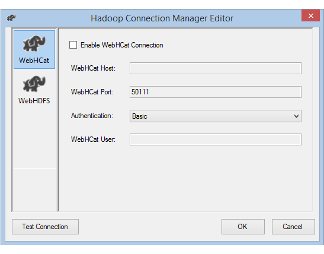
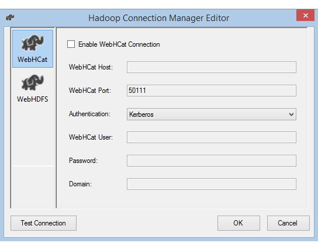

# Hadoop Connection Manager
  The Hadoop Connection Manager enables a SQL Server Integration Services (SSIS) package to connect to a Hadoop cluster, by using the values you specify for the properties.  
  
## Configure the Hadoop Connection Manager  
  
1.  In the **Add SSIS Connection Manager** dialog box, select **Hadoop** > **Add**. The **Hadoop Connection Manager Editor** dialog box opens.  
  
2.  To configure related Hadoop cluster information, choose the **WebHCat** or **WebHDFS** tab in the left pane.
  
3.  If you enable the **WebHCat** option to invoke a Hive or Pig job on Hadoop, do the following: 
  
    1.  For **WebHCat Host**, enter the server that hosts the WebHCat service.  
  
    2.  For **WebHCat Port**, enter the port of the WebHCat service, which by default is 50111.  
  
    3.  Select the **Authentication** method for accessing the WebHCat service. The available values are **Basic** and **Kerberos**.  
  
           
  
           
  
    4.  For **WebHCat User**, enter the **User** authorized to access WebHCat.  
  
    5.  If you select **Kerberos** authentication, enter the user's **Password** and **Domain**.  
  
4.  If you enable the **WebHDFS** option to copy data from or to HDFS, do the following: 
  
    1.  For **WebHDFS Host**, enter the server that hosts the WebHDFS service.  
  
    2.  For **WebHDFS Port**, enter the port of the WebHDFS service, which by default is 50070.  
  
    3.  Select the **Authentication** method for accessing the WebHDFS service. The available values are **Basic** and **Kerberos**.  
  
    4.  For **WebHDFS User**, enter the user authorized to access HDFS.  
  
    5.  If you select **Kerberos** authentication, enter the user's **Password** and **Domain**.  
  
5.  Select **Test Connection**. (Only the connection that you enabled is tested.)  
  
6.  Select **OK** to close the dialog box.  

## Connect with Kerberos authentication
There are two options to set up the on-premises environment so you can use Kerberos authentication with the Hadoop Connection Manager. You can choose the option that better fits your circumstances.
-   Option 1: [Join the SSIS computer to the Kerberos realm](#kerberos-join-realm)
-   Option 2: [Enable mutual trust between the Windows domain and the Kerberos realm](#kerberos-mutual-trust)

### <a name="kerberos-join-realm"></a>Option 1: Join the SSIS computer to the Kerberos realm

#### Requirements:

-   The gateway computer needs to join the Kerberos realm, and can't join any Windows domain.

#### How to configure:

On the SSIS computer:

1.	Run the **Ksetup** utility to configure the Kerberos Key Distribution Center (KDC) server and realm.

    The computer must be configured as a member of a workgroup, because a Kerberos realm is different from a Windows domain. Set the Kerberos realm and add a KDC server, as shown in the following example. Replace `REALM.COM` with your own respective realm, as needed.

    ```    
    C:> Ksetup /setdomain REALM.COM`
    C:> Ksetup /addkdc REALM.COM <your_kdc_server_address>
    ```

	After running these commands, restart the computer.

2.	Verify the configuration with **Ksetup** command. The output should look like the following sample:

    ```
    C:> Ksetup
    default realm = REALM.COM (external)
    REALM.com:
        kdc = <your_kdc_server_address>
    ```

### <a name="kerberos-mutual-trust"></a>Option 2: Enable mutual trust between the Windows domain and the Kerberos realm

#### Requirements:
-   The gateway computer must join a Windows domain.
-   You need permission to update the domain controller's settings.

#### How to configure:

> [!NOTE]
> Replace `REALM.COM` and `AD.COM` in the following tutorial with your own respective realm and domain controller, as needed.

On the KDC server:

1.	Edit the KDC configuration in the **krb5.conf** file. Allow KDC to trust the Windows domain by referring to the following configuration template. By default, the configuration is located at **/etc/krb5.conf**.

    ```
    [logging]
    default = FILE:/var/log/krb5libs.log
    kdc = FILE:/var/log/krb5kdc.log
    admin_server = FILE:/var/log/kadmind.log

    [libdefaults]
    default_realm = REALM.COM
    dns_lookup_realm = false
    dns_lookup_kdc = false
    ticket_lifetime = 24h
    renew_lifetime = 7d
    forwardable = true

    [realms]
    REALM.COM = {
        kdc = node.REALM.COM
        admin_server = node.REALM.COM
        }
    AD.COM = {
        kdc = windc.ad.com
        admin_server = windc.ad.com
        }

    [domain_realm]
    .REALM.COM = REALM.COM
    REALM.COM = REALM.COM
    .ad.com = AD.COM
    ad.com = AD.COM

    [capaths]
    AD.COM = {
        REALM.COM = .
        }
    ```

    Restart the KDC service after configuration.

2.	Prepare a principal named **krbtgt/REALM.COM@AD.COM** on the KDC server. Use the following command:

    `Kadmin> addprinc krbtgt/REALM.COM@AD.COM`

3.	In the **hadoop.security.auth_to_local** HDFS service configuration file, add `RULE:[1:$1@$0](.*@AD.COM)s/@.*//`.

On the domain controller:

1.	Run the following **Ksetup** commands to add a realm entry:

    ```
    C:> Ksetup /addkdc REALM.COM <your_kdc_server_address>
    C:> ksetup /addhosttorealmmap HDFS-service-FQDN REALM.COM
    ```

2.	Establish trust from the Windows domain to the Kerberos realm. In the following example, `[password]` is the password for the principal **krbtgt/REALM.COM@AD.COM**.

    `C:> netdom trust REALM.COM /Domain: AD.COM /add /realm /password:[password]`

3.	Select an encryption algorithm to use with Kerberos.

    1. Go to **Server Manager** > **Group Policy Management** > **Domain**. From there, go to **Group Policy Objects** > **Default or Active Domain Policy** > **Edit**.

    2. In the **Group Policy Management Editor** pop-up window, go to **Computer Configuration** > **Policies** > **Windows Settings**. From there, go to **Security Settings** > **Local Policies** > **Security Options**. Configure **Network security: Configure Encryption types allowed for Kerberos**.

    3. Select the encryption algorithm you want to use to connect to the KDC. Typically you can select any of the options.

        

    4. Use the **Ksetup** command to specify the encryption algorithm to be used on the specific realm.

        `C:> ksetup /SetEncTypeAttr REALM.COM DES-CBC-CRC DES-CBC-MD5 RC4-HMAC-MD5 AES128-CTS-HMAC-SHA1-96 AES256-CTS-HMAC-SHA1-96`

4.	To use the Kerberos principal in the Windows domain, create the mapping between the domain account and Kerberos principal.

    1. Go to **Administrative tools** > **Active Directory Users and Computers**.

    2. Configure advanced features by selecting **View** > **Advanced Features**.

    3. Locate the account to which you want to create mappings, right-click to view **Name Mappings**, and then select the **Kerberos Names** tab.

    4. Add a principal from the realm.

        

On the gateway computer:

Run the following **Ksetup** commands to add a realm entry.

    ```
    C:> Ksetup /addkdc REALM.COM <your_kdc_server_address>
    C:> ksetup /addhosttorealmmap HDFS-service-FQDN REALM.COM
    ```

## See also  
 [Hadoop Hive Task](../../integration-services/control-flow/hadoop-hive-task.md)   
 [Hadoop Pig Task](../../integration-services/control-flow/hadoop-pig-task.md)   
 [Hadoop File System Task](../../integration-services/control-flow/hadoop-file-system-task.md)  
  
  
