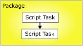
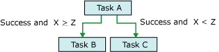

# Precedence Constraints

[!INCLUDE[ssis-appliesto](../../includes/ssis-appliesto-ssvrpluslinux-asdb-asdw-xxx.md)]

  Precedence constraints link executables, containers, and tasks in packages in a control flow, and specify conditions that determine whether executables run. An executable can be a For Loop, Foreach Loop, or Sequence container; a task; or an event handler. Event handlers also use precedence constraints to link their executables into a control flow.  
  
 A precedence constraint links two executables: the precedence executable and the constrained executable. The precedence executable runs before the constrained executable, and the execution result of the precedence executable may determine whether the constrained executable runs. The following diagram shows two executables linked by a precedence constraint.  
  
   
  
 In a linear control flow, that is, one without branching, precedence constraints alone govern the sequence in which tasks run. If a control flow branches, the [!INCLUDE[ssISnoversion](../../includes/ssisnoversion-md.md)] run-time engine determines the execution order among the tasks and containers that immediately follow the branching. The run-time engine also determines execution order among unconnected workflows in a control flow.  
  
 The nested-container architecture of [!INCLUDE[ssISnoversion](../../includes/ssisnoversion-md.md)] enables all containers, except for the task host container that encapsulates only a single task, to include other containers, each with its own control flow. The For Loop, Foreach Loop, and Sequence containers can include multiple tasks and other containers, which in turn can include multiple tasks and containers. For example, a package with a Script task and a Sequence container has a precedence constraint that links the Script task and the Sequence container. The Sequence container includes three Script tasks, and its precedence constraints link the three Script tasks into a control flow. The following diagram shows the precedence constraints in a package with two levels of nesting.  
  
   
  
 Because the package is at the top of the [!INCLUDE[ssIS](../../includes/ssis-md.md)] container hierarchy, multiple packages cannot be linked by precedence constraints; however, you can add an Execute Package task to a package and indirectly link another package into the control flow.  
  
 You can configure precedence constraints in the following ways:  
  
-   Specify an evaluation operation. The precedence constraint uses a constraint value, an expression, both, or either to determine whether the constrained executable runs.  
  
-   If the precedence constraint uses an execution result, you can specify the execution result to be success, failure, or completion.  
  
-   If the precedence constraint uses an evaluation result, you can provide an expression that evaluates to a Boolean.  
  
-   Specify whether the precedence constraint is evaluated singly or together with other constraints that apply to the constrained executable.  
  
## Evaluation Operations  
 [!INCLUDE[ssISnoversion](../../includes/ssisnoversion-md.md)] provides the following evaluation operations:  
  
-   A constraint that uses only the execution result of the precedence executable to determine whether the constrained executable runs. The execution result of the precedence executable can be completion, success, or failure. This is the default operation.  
  
-   An expression that is evaluated to determine whether the constrained executable runs. If the expression evaluates to true, the constrained executable runs.  
  
-   An expression and a constraint that combines the requirements of execution results of the precedence executable and the return results of evaluating the expression.  
  
-   An expression or a constraint that uses either the execution results of the precedence executable or the return results of evaluating the expression.  
  
 [!INCLUDE[ssIS](../../includes/ssis-md.md)] Designer uses color to identify the type of precedence constraint. The Success constraint is green, the Failure constraint is red, and the Completion constraint is blue. To display text labels in [!INCLUDE[ssIS](../../includes/ssis-md.md)] designer that show the type of the constraint, you must configure the accessibility features of [!INCLUDE[ssIS](../../includes/ssis-md.md)] Designer.  
  
 The expression must be a valid [!INCLUDE[ssIS](../../includes/ssis-md.md)] expression, and it can include functions, operators, and system and custom variables. For more information, see [Integration Services &#40;SSIS&#41; Expressions](../../integration-services/expressions/integration-services-ssis-expressions.md) and [Integration Services &#40;SSIS&#41; Variables](../../integration-services/integration-services-ssis-variables.md).  
  
## Execution Results  
 The precedence constraint can use the following execution results alone or in combination with an expression.  
  
-   Completion requires only that the precedence executable has completed, without regard to outcome, in order for the constrained executable to run.  
  
-   Success requires that the precedence executable must complete successfully for the constrained executable to run.  
  
-   Failure requires that the precedence executable fail for the constrained executable to run.  
  
> [!NOTE]  
>  Only precedence constraints that are members of the same **Precedence Constraint** collection can be grouped in a logical AND condition. For example, you cannot combine precedence constraints from two Foreach Loop containers.  
  
## Set the properties of a precedence constraint with the Precedence Constraint Editor  
  
1.  In [!INCLUDE[ssBIDevStudioFull](../../includes/ssbidevstudiofull-md.md)], open the [!INCLUDE[ssISnoversion](../../includes/ssisnoversion-md.md)] project that contains the package you want.  
  
2.  In Solution Explorer, double-click the package to open it.  
  
3.  Click the **Control Flow** tab.  
  
4.  Double-click the precedence constraint.  
  
     The **Precedence Constraint Editor** opens.  
  
5.  In the **Evaluation operation** drop-down list, select an evaluation operation.  
  
6.  In the **Value** drop-down list, select the execution result of the precedence executable.  
  
7.  If the evaluation operation uses an expression, in the **Expression** box, type an expression, and click **Test** to evaluate the expression.  
  
    > [!NOTE]  
    >  Variable names are case-sensitive.  
  
8.  If multiple tasks or containers are connected to the constrained executable, select **Logical AND** to specify that the execution results of all preceding executables must evaluate to **true**. Select **Logical OR** to specify that only one execution result must evaluate to **true**.  
  
9. Click **OK** to close the **Precedence Constraint Editor**.  
  
10. To save the updated package, click **Save Selected Items** on the **File** menu.  

## Precedence Constraint Editor
Use the **Precedence Constraint Editor** dialog box to configure precedence constraints.  
  
### Options  
 **Evaluation operation**  
 Specify the evaluation operation that the precedence constraint uses. The operations are: **Constraint**, **Expression**, **Expression and Constraint**, and **Expression or Constraint**.  
  
 **Value**  
 Specify the constraint value: **Success**, **Failure**, or **Completion**.  
  
> [!NOTE]  
>  The precedence constraint line is green for **Success**, highlighted for **Failure**, and blue for **Completion**.  
  
 **Expression**  
 If using the operations **Expression**, **Expression and Constraint**, or **Expression or Constraint**, type an expression or launch the Expression Builder to create the expression. The expression must evaluate to a Boolean.  
  
 **Test**  
 Validate the expression.  
  
 **Logical AND**  
 Select to specify that multiple precedence constraints on the same executable must be evaluated together. All constraints must evaluate to **True**.  
  
> [!NOTE]  
>  This type of precedence constraint appears as a solid green, highlighted or blue line.  
  
 **Logical OR**  
 Select to specify that multiple precedence constraints on the same executable must be evaluated together. At least one constraint must evaluate to **True**.  
  
> [!NOTE]  
>  This type of precedence constraint appears as a dotted green, highlighted, or blue line.  
  
## Set the properties of a precedence constraint in Properties window  
  
1.  In [!INCLUDE[ssBIDevStudioFull](../../includes/ssbidevstudiofull-md.md)], open the [!INCLUDE[ssISnoversion](../../includes/ssisnoversion-md.md)] project that contains the package you want to modify.  
  
2.  In Solution Explorer, double-click the package to open it.  
  
3.  Click the **Control Flow** tab. On the design surface of the **Control Flow** tab, right-click the precedence constraint, and then click **Properties**. In the Properties window, modify the property values.  
  
4.  In the **Properties** window, set the following read/write properties of precedence constraints:  
  
    |Read/write property|Configuration action|  
    |--------------------------|--------------------------|  
    |Description|Provide a description.|  
    |EvalOp|Select an evaluation operation. If the **Expression**, **ExpressionAndConstant**, or **ExpressionOrConstant** operation is selected, you can specify an expression.|  
    |Expression|If the evaluation operation includes and expression, provide an expression. The expression must evaluate to a Boolean. For more information about the expression language, see [Integration Services &#40;SSIS&#41; Expressions](../../integration-services/expressions/integration-services-ssis-expressions.md).|  
    |LogicalAnd|Set **LogicalAnd** to specify whether the precedence constraint is evaluated in concert with other precedence constraints, when multiple executables precede and are linked to the constrained executable|  
    |Name|Update the name of the precedence constraint.|  
    |ShowAnnotation|Specify the type of annotation to use. Choose **Never** to disable annotations, **AsNeeded** to enable annotation on demand, **ConstraintName** to automatically annotate using the value of the Name property, **ConstraintDescription** to automatically annotate using the value of the Description property, and **ConstraintOptions** to automatically annotate using the values of the Value and Expression properties.|  
    |Value|If the evaluation operation specified in the EvalOP property includes a constraint, select the execution result of the constraining executable.|  
  
5.  Close the Properties window.  
  
6.  To save the updated package, click **Save Selected Items** on the **File** menu.  

## Set the value of a precedence constraint with the shortcut menu  
  
1.  In [!INCLUDE[ssBIDevStudioFull](../../includes/ssbidevstudiofull-md.md)], open the [!INCLUDE[ssISnoversion](../../includes/ssisnoversion-md.md)] project that contains the package you want.  
  
2.  In Solution Explorer, double-click the package to open it.  
  
3.  Click the **Control Flow** tab.  
  
4.  On the design surface of the **Control Flow** tab, right-click the precedence constraint, and then click **Success**, **Failure**, or **Completion**.  
  
5.  To save the updated package, click **Save Selected Item** on the **File** menu.  

## Add expressions to precedence constraints
 A precedence constraint can use an expression to define the constraint between two executables: the precedence executable and the constrained executable. The executables can be tasks or containers. The expression can be used alone or in combination with the execution result of the precedence executable. The execution result of an executable is either success or failure. When you configure the execution result of a precedence constraint, you can set the execution result to **Success**, **Failure**, or **Completion**. **Success** requires that the precedence executable succeed, **Failure** requires that the precedence executable fail, and **Completion** indicates that the constrained executable should run regardless of whether the precedence task succeeds or fails. For more information, see [Precedence Constraints](../../integration-services/control-flow/precedence-constraints.md).  
  
 The expression must evaluate to **True** or **False** and it must be a valid [!INCLUDE[ssISnoversion](../../includes/ssisnoversion-md.md)] expression. The expression can use literals, system and custom variables, and the functions and operators that the [!INCLUDE[ssIS](../../includes/ssis-md.md)] expression grammar provides. For example, the expression `@Count == SQRT(144) + 10` uses the variable **Count**, the SQRT function , and the equal (==) and add (+) operators. For more information, see [Integration Services &#40;SSIS&#41; Expressions](../../integration-services/expressions/integration-services-ssis-expressions.md).  
  
 In the following illustration, task A and task B are linked by a precedence constraint that uses an execution result and an expression. The constraint value is set to **Success** and the expression is  `@X >== @Z`. Task B, the constrained task, runs only if task A completes successfully and the value of variable **X** is greater than or equal to the value of variable **Z**.  
  
   
  
 Executables can also be linked by using multiple precedence constraints that contain different expressions. For example, in the following illustration, tasks B and C are linked to task A by precedence constraints that use execution results and expressions. Both of the constraint values are set to **Success.** One precedence constraint includes the expression `@X >== @Z`, and the other precedence constraint includes the expression `@X < @Z`. Depending on the values of variable **X** and variable **Z**, either task C or task B runs.  
  
   
  
 You can add or modify an expression by using the **Precedence Constraint Editor** in [!INCLUDE[ssIS](../../includes/ssis-md.md)] Designer and the Properties window that [!INCLUDE[ssBIDevStudioFull](../../includes/ssbidevstudiofull-md.md)] provides. However, the Properties window does not provide verification of the expression syntax.  
  
 If a precedence constraint includes an expression, an icon appears on the design surface of the **Control Flow** tab, next to the precedence constraint, and the ToolTip on the icon displays the expression.  

### Add an expression to a precedence constraint  
  
1.  In [!INCLUDE[ssBIDevStudioFull](../../includes/ssbidevstudiofull-md.md)], open the [!INCLUDE[ssISnoversion](../../includes/ssisnoversion-md.md)] project that contains the package you want.  
  
2.  In Solution Explorer, double-click the package to open it.  
  
3.  Click the **Control Flow** tab.  
  
4.  On the design surface of the **Control Flow** tab, double-click the precedence constraint. The **Precedence Constraint Editor** opens.  
  
5.  Select **Expression**, **Expression and Constraint**, or **Expression or Constraint** in the **Evaluation operation** list.  
  
6.  Type an expression in the **Expression** text box or launch the Expression Builder to create an expression.  
  
7.  To validate the expression syntax, click **Test**.  
  
8.  To save the updated package, click **Save Selected Items** on the **File** menu.  
 
### Combine execution values and expressions  
 The following table describes the effects of combining an execution value constraint and an expression in a precedence constraint.  
  
|Evaluation operation|Constraint evaluates to|Expression evaluates to|Constrained executable runs|  
|--------------------------|-----------------------------|-----------------------------|---------------------------------|  
|Constraint|True|N/A|True|  
|Constraint|False|N/A|False|  
|Expression|N/A|True|True|  
|Expression|N/A|False|False|  
|Constraint and Expression|True|True|True|  
|Constraint and Expression|True|False|False|  
|Constraint and Expression|False|True|False|  
|Constraint and Expression|False|False|False|  
|Constraint or Expression|True|True|True|  
|Constraint or Expression|True|False|True|  
|Constraint or Expression|False|True|True|  
|Constraint or Expression|False|False|False|  

## Complex constraint scenarios with multiple precedence constraints 
A precedence constraint connects two executables: two tasks, two containers, or one of each. They are known as the precedence executable and the constrained executable. A constrained executable can have multiple precedence constraints. For more information, see [Precedence Constraints](../../integration-services/control-flow/precedence-constraints.md).  
  
 Assembling complex constraint scenarios by grouping constraints enables you to implement complex control flow in packages. For example, in the following illustration, Task D is linked to Task A by a **Success** constraint, Task D is linked to Task B by a **Failure** constraint, and Task D is linked to Task C by a **Success** constraint. The precedence constraints between Task D and Task A, between Task D and Task B, and between Task D and Task C participate in a logical *and* relationship. Therefore, for Task D to run, Task A must run successfully, Task B must fail, and Task C must run successfully.  
  
   
  
### LogicalAnd Property  
 If a task or a container has multiple constraints, the **LogicalAnd** property specifies whether a precedence constraint is evaluated singly or in concert with other constraints.  
  
 You can set the **LogicalAnd** property using the **Precedence Constraint Editor** in [!INCLUDE[ssIS](../../includes/ssis-md.md)] Designer, or in the Properties window that [!INCLUDE[ssBIDevStudioFull](../../includes/ssbidevstudiofull-md.md)] provides.  

## Set the default value for precedence constraints  
When you first use [!INCLUDE[ssIS](../../includes/ssis-md.md)] Designer, the default value of a precedence constraint is **Success**. Follow these steps to configure [!INCLUDE[ssIS](../../includes/ssis-md.md)] Designer to use a different default value for precedence constraints.
  
1.  Open [!INCLUDE[ssBIDevStudioFull](../../includes/ssbidevstudiofull-md.md)].  
  
2.  On the **Tools** menu, click **Options**.  
  
3.  In the **Options** dialog box, expand **Business Intelligence Designers,** and then expand **Integration Services Designers**.  
  
4.  Click **Control Flow Auto Connect** and select **Connect a new shape to the selected shape by default**.  
  
5.  In the drop-down list, choose either **Use a Failure constraint for the new shape** or **Use a Completion constraint for the new shape**.  
  
6.  Click **OK**.  
  
## Create a default precedence constraint  
  
1.  In [!INCLUDE[ssBIDevStudioFull](../../includes/ssbidevstudiofull-md.md)], open the [!INCLUDE[ssISnoversion](../../includes/ssisnoversion-md.md)] project that contains the package you want.  
  
2.  In Solution Explorer, double-click the package to open it.  
  
3.  Click the **Control Flow** tab.  
  
4.  On the design surface of the **Control Flow** tab, click the task or container and drag its connector to the executable to which you want the precedence constraint to apply.  
  
5.  To save the updated package, click **Save Selected Items** on the **File** menu.  
