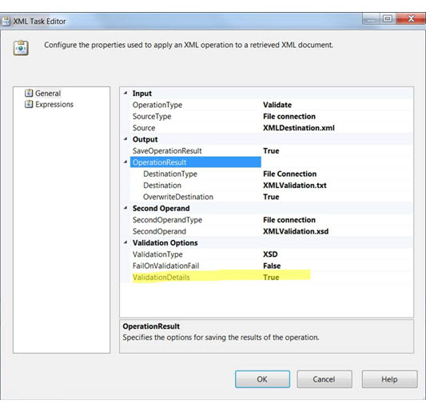
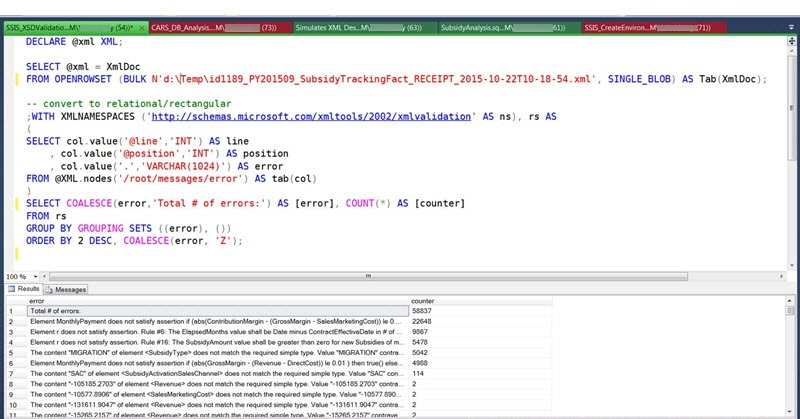

# Validate XML with the XML Task

[!INCLUDE[ssis-appliesto](../../includes/ssis-appliesto-ssvrpluslinux-asdb-asdw-xxx.md)]


  Validate XML documents and get rich error output by enabling the **ValidationDetails** property of the XML Task.  
  
 The following screen shot shows the **XML Task Editor** with the settings required for XML validation with rich error output.  
  
   
  
 Before the **ValidationDetails** property was available, XML validation by the XML Task returned only a true or false result, with no information about errors or their locations. Now, when you set **ValidationDetails** to True, the output file contains detailed information about every error including the line number and the position. You can use this information to understand, locate, and fix errors in XML documents.  
  
 The XML validation functionality scales easily for large XML documents and large numbers of errors. Since the output file itself is in XML format, you can query and analyze the output. For example, if the output contains a large number of errors, you can group the errors by using a [!INCLUDE[tsql](../../includes/tsql-md.md)] query, as described in this topic.  
  
> [!NOTE]
>  [!INCLUDE[ssNoVersion](../../includes/ssnoversion-md.md)] [!INCLUDE[ssISnoversion](../../includes/ssisnoversion-md.md)] ( [!INCLUDE[ssIS](../../includes/ssis-md.md)]) introduced the **ValidationDetails** property in [!INCLUDE[ssSQL11](../../includes/sssql11-md.md)] Service Pack 2. The property is also available in [!INCLUDE[ssSQL14](../../includes/sssql14-md.md)] and in [!INCLUDE[ssSQL15](../../includes/sssql15-md.md)].  
  
## Sample output for XML that's valid  
 Here is a sample output file with validation results for a valid XML file.  
  
```xml  
  
<root xmlns:ns="https://schemas.microsoft.com/xmltools/2002/xmlvalidation">  
    <metadata>  
        <result>true</result>  
        <errors>0</errors>  
        <warnings>0</warnings>  
        <startTime>2015-05-28T10:27:22.087</startTime>  
        <endTime>2015-05-28T10:29:07.007</endTime>  
        <xmlFile>d:\Temp\TestData.xml</xmlFile>  
        <xsdFile>d:\Temp\TestSchema.xsd</xsdFile>  
    </metadata>  
    <messages />  
</root>  
```  
  
## Sample output for XML that's not valid  
 Here is a sample output file with validation results for an XML file that contains a small number of errors. The text of the \<error> elements has been wrapped for readability.  
  
```xml  
  
<root xmlns:ns="https://schemas.microsoft.com/xmltools/2002/xmlvalidation">  
    <metadata>  
        <result>false</result>  
        <errors>2</errors>  
        <warnings>0</warnings>  
        <startTime>2015-05-28T10:45:09.538</startTime>  
        <endTime>2015-05-28T10:45:09.558</endTime>  
        <xmlFile>C:\Temp\TestData.xml</xmlFile>  
        <xsdFile>C:\Temp\TestSchema.xsd</xsdFile>  
    </metadata>  
    <messages>  
        <error line="5" position="26">The 'ApplicantRole' element is invalid - The value 'wer3' is invalid  
    according to its datatype 'ApplicantRoleType' - The Enumeration constraint failed.</error>  
        <error line="16" position="28">The 'Phone' element is invalid - The value 'we3056666666' is invalid  
     according to its datatype 'phone' - The Pattern constraint failed.</error>  
    </messages>  
</root>  
```  
  
## Analyze XML validation output with a Transact-SQL query  
 If the output of XML validation contains a large number of errors, you can use a [!INCLUDE[tsql](../../includes/tsql-md.md)] query to load the output in [!INCLUDE[ssManStudioFull](../../includes/ssmanstudiofull-md.md)]. Then you can analyze the error list with all the capabilities of the T-SQL language including WHERE, GROUP BY, ORDER BY, JOIN, and so forth.  
  
```sql  
DECLARE @xml XML;  
  
SELECT @xml = XmlDoc     
FROM OPENROWSET (BULK N'C:\Temp\XMLValidation_2016-02-212T10-41-00.xml', SINGLE_BLOB) AS Tab(XmlDoc);  
  
-- Query # 1, flat list of errors  
-- convert to relational/rectangular  
;WITH XMLNAMESPACES ('https://schemas.microsoft.com/xmltools/2002/xmlvalidation' AS ns), rs AS  
(  
SELECT col.value('@line','INT') AS line  
     , col.value('@position','INT') AS position  
     , col.value('.','VARCHAR(1024)') AS error  
FROM @XML.nodes('/root/messages/error') AS tab(col)  
)  
SELECT * FROM rs;  
-- WHERE error LIKE '%whatever_string%'  
  
-- Query # 2, count of errors grouped by the error message  
-- convert to relational/rectangular  
;WITH XMLNAMESPACES ('https://schemas.microsoft.com/xmltools/2002/xmlvalidation' AS ns), rs AS  
(  
SELECT col.value('@line','INT') AS line  
     , col.value('@position','INT') AS position  
     , col.value('.','VARCHAR(1024)') AS error  
FROM @XML.nodes('/root/messages/error') AS tab(col)  
)  
SELECT COALESCE(error,'Total # of errors:') AS [error], COUNT(*) AS [counter]  
FROM rs  
GROUP BY GROUPING SETS ((error), ())  
ORDER BY 2 DESC, COALESCE(error, 'Z');  
  
```  
  
 Here is the result in [!INCLUDE[ssManStudio](../../includes/ssmanstudio-md.md)] of the second sample query shown in the preceding text.  
  
   
  
## See Also  
 [XML Task](../../integration-services/control-flow/xml-task.md)   
 [XML Task Editor &#40;General Page&#41;](../../integration-services/control-flow/xml-task-editor-general-page.md)  
  
  
