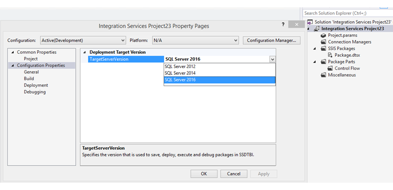

# Create Packages in SQL Server Data Tools

[!INCLUDE[ssis-appliesto](../../includes/ssis-appliesto-ssvrpluslinux-asdb-asdw-xxx.md)]

  In [!INCLUDE[ssBIDevStudioFull](../includes/ssbidevstudiofull-md.md)], you can create a new package by using one of the following methods:  
  
-   Use the package template that [!INCLUDE[ssISnoversion](../includes/ssisnoversion-md.md)] includes.  
  
-   Use a custom template  
  
     To use custom packages as templates for creating new packages, you simply copy them to the DataTransformationItems folder. By default, this folder is in C:\Program Files\Microsoft Visual Studio 10.0\Common7\IDE\PrivateAssemblies\ProjectItems\DataTransformationProject.  
  
-   Copy an existing package.  
  
     If existing packages include functionality that you want to reuse, you can build the control flow and data flows in the new package more quickly by copying and pasting objects from other packages. For more information about using copy and paste in [!INCLUDE[ssISnoversion](../includes/ssisnoversion-md.md)] projects, see [Reuse of Package Objects](../integration-services/reuse-of-package-objects.md).  
  
     If you create a new package by copying an existing package or by using a custom package as a template, the name and the GUID of the existing package are copied as well. You should update the name and the GUID of the new package to help differentiate it from the package from which it was copied. For example, if packages have the same GUID, it is more difficult to identify the package to which log data belongs. You can regenerate the GUID in the **ID** property and update the value of the **Name** property by using the Properties window in [!INCLUDE[ssBIDevStudioFull](../includes/ssbidevstudiofull-md.md)]. For more information, see [Set Package Properties](../integration-services/set-package-properties.md) and [dtutil Utility](../integration-services/dtutil-utility.md).  
  
-   Use a custom package that you have designated as a template.  
  
-   Run the [!INCLUDE[ssNoVersion](../includes/ssnoversion-md.md)] Import and Export Wizard  
  
     The [!INCLUDE[ssNoVersion](../includes/ssnoversion-md.md)] Import and Export Wizard creates a complete package for a simple import or export. This wizard configures the connections, source, and destination, and adds any data transformations that are required to let you run the import or export immediately. You can optionally save the package to run it again later, or to refine and enhance the package in [!INCLUDE[ssBIDevStudio](../includes/ssbidevstudio-md.md)]. However, if you save the package, you must add the package to an existing [!INCLUDE[ssISnoversion](../includes/ssisnoversion-md.md)] project before you can change the package or run the package in [!INCLUDE[ssBIDevStudio](../includes/ssbidevstudio-md.md)].  
  
 The packages that you create in [!INCLUDE[ssBIDevStudioFull](../includes/ssbidevstudiofull-md.md)] using [!INCLUDE[ssIS](../includes/ssis-md.md)] Designer are saved to the file system. To save a package to [!INCLUDE[ssNoVersion](../includes/ssnoversion-md.md)] or to the package store, you need to save a copy of the package. For more information, see [Save a Copy of a Package](https://msdn.microsoft.com/library/21482a20-e420-4452-b7eb-8f9fa1929f31).  

 For a video that demonstrates how to create a basic package using the default package template, see [Creating a Basic Package (SQL Server Video)](https://go.microsoft.com/fwlink/?LinkId=131023).  

## Get SQL Server Data Tools
To install SQL Server Data Tools (SSDT), see [Download SQL Server Data Tools (SSDT)](../ssdt/download-sql-server-data-tools-ssdt.md).

## Create a package in SQL Server Data Tools using the Package Template  
  
1.  In [!INCLUDE[ssBIDevStudioFull](../includes/ssbidevstudiofull-md.md)], open the [!INCLUDE[ssISnoversion](../includes/ssisnoversion-md.md)] project in which you want to create a package.  
  
2.  In Solution Explorer, right-click the **SSIS Packages** folder, and then click **New SSIS Package**.  
  
3.  Optionally, add control flow, data flow tasks, and event handlers to the package. For more information, see [Control Flow](../integration-services/control-flow/control-flow.md), [Data Flow](../integration-services/data-flow/data-flow.md), and [Integration Services &#40;SSIS&#41; Event Handlers](../integration-services/integration-services-ssis-event-handlers.md).  
  
4.  On the **File** menu, click **Save Selected Items** to save the new package.  
  
    > [!NOTE]  
    >  You can save an empty package.  
  
## Choose the target version of a project and its packages  
  
1.  In Solution Explorer, right-click on an Integration Services project and select **Properties** to open the property pages for the project.  
  
2.  On the **General** tab of **Configuration Properties**, select the **TargetServerVersion** property,  and then choose SQL Server 2016, SQL Server 2014, or SQL Server 2012.  
  
       
  
 You can create, maintain, and run packages that target SQL Server 2016, SQL Server 2014, or SQL Server 2012.  
  
  
