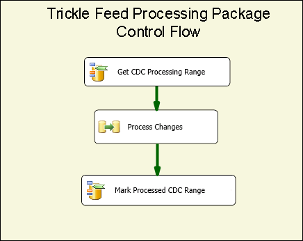
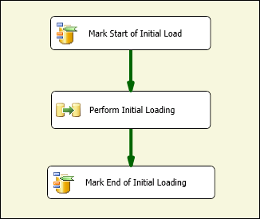

# CDC Flow Components
  The Change Data Capture Components by Attunity for Microsoft [!INCLUDE[ssISCurrent](../../includes/ssiscurrent-md.md)] help SSIS developers work with CDC and reduce the complexity of CDC packages.  
  
 The SSIS CDC components are designed to work with the [!INCLUDE[ssCurrent](../../includes/sscurrent-md.md)] CDC feature where the source tables are either the same [!INCLUDE[ssCurrent](../../includes/sscurrent-md.md)] database or an Oracle database (when using the Oracle CDC Service for [!INCLUDE[ssCurrent](../../includes/sscurrent-md.md)]). Partitioned tables are supported.  
  
 The components include Control and Data Flow components that streamline the experience of reading and processing change data in SSIS packages. The components can be added to the component library in Microsoft [!INCLUDE[ssCurrent](../../includes/sscurrent-md.md)], but are installed separately.  
  
 The following are the Change Data Capture Components by Attunity:  
  
 **CDC Control Flow Component**:  
  
 [CDC Control Task](../../integration-services/control-flow/cdc-control-task.md)  
  
 **CDC Data Flow Components**:  
  
 [CDC Source](../../integration-services/data-flow/cdc-source.md)  
  
 [CDC Splitter](../../integration-services/data-flow/cdc-splitter.md)  
  
## Installation  
 This section describes the installation procedures for the CDC Components for Microsoft [!INCLUDE[ssISCurrent](../../includes/ssiscurrent-md.md)].  
  
 The CDC Components for SSIS are packaged with the Microsoft® Change Data Capture Designer and Service for Oracle by Attunity for Microsoft SQL Server®. This download is part of the SQL Server Feature Pack. Download components of the Feature Pack from the [SQL Server 2016 Feature Pack web page](https://go.microsoft.com/fwlink/?LinkId=746297).  
  
### Version Support

#### SQL Server version support

The CDC components for SSIS are supported on all the supported versions of Microsoft SQL Server. Currently, the supported versions of SQL Server include SQL Server 2012 through SQL Server 2017.

#### Operating system version support
  
The CDC components for SSIS are supported on the following operating systems and platforms:  
  
-   Windows 8  and 8.1
-   Windows 10  
-   Windows Server 2012 and 2012 R2
-   Windows Server 2016
  
### Running the Installation Program  
 Before you run the installation wizard, be sure that the [!INCLUDE[ssCurrent](../../includes/sscurrent-md.md)][!INCLUDE[ssBIDevStudio](../../includes/ssbidevstudio-md.md)] is closed. Then follow the directions in the installation wizard.  
  
### Restart SSIS Service 
After you install the CDC components, you must restart the SSIS service to be sure that the components work correctly when developing packages in the SQL [!INCLUDE[ssBIDevStudio](../../includes/ssbidevstudio-md.md)].  
  
A message is displayed after you install the components. Click **Yes** when prompted.  
  
### Uninstalling the Microsoft CDC Components  
 You uninstall the CDC source, CDC splitter, or CDC Control task, by using the uninstall wizard. If you are using the [!INCLUDE[ssCurrent](../../includes/sscurrent-md.md)][!INCLUDE[ssBIDevStudio](../../includes/ssbidevstudio-md.md)] for package development, make sure the [!INCLUDE[ssBIDevStudio](../../includes/ssbidevstudio-md.md)] is closed before running the uninstall wizard.  
  
## Benefits  
 The CDC Components for [!INCLUDE[ssCurrent](../../includes/sscurrent-md.md)][!INCLUDE[ssISnoversion](../../includes/ssisnoversion-md.md)] components allow SSIS developers to easily build SSIS packages that process change data. These components enhance the ability of SSIS developers to deal with CDC and reduce the complexity of CDC packages.  
  
 The SSIS CDC components are used to provide the change data in a way that is easy to further process it for replication, loading a data warehouse, updating slowly changing dimensions for OLAP, auditing changes, or for additional possible uses. The type of further processing used is determined by the SSIS developer.  
  
 The SSIS CDC components are designed to work with the [!INCLUDE[ssCurrent](../../includes/sscurrent-md.md)] CDC feature with change tables that are in the same [!INCLUDE[ssCurrent](../../includes/sscurrent-md.md)] database.  
  
## Getting Started with the Change Data Capture Components  
 A typical CDC package processes changes to a group of tables. The basic control flow part of this type of CDC package is shown in the following figure. This package is called a trickle-feed processing package.  
  
   
  
 This [!INCLUDE[ssCurrent](../../includes/sscurrent-md.md)][!INCLUDE[ssISnoversion](../../includes/ssisnoversion-md.md)] Control Flow contains two CDC Control Tasks and the Data Flow task. The first task called **Get CDC Processing Range** establishes the LSN range for the changes that are processed in the data-flow task called **Process Changes**. This range is established based on what was processed during the last package run and was saved in a persistent store.  
  
 For more information about using the CDC Control Task, see [CDC Control Task](../../integration-services/control-flow/cdc-control-task.md) and [CDC Control Task Editor](../../integration-services/control-flow/cdc-control-task-editor.md).  
  
 The following figure shows the **Process Changes** data flow, which conceptually shows how the changes are processes.  
  
   
  
 The steps illustrated in this figure are:  
  
-   **Changes for Table X** is a CDC source that reads changes made to table X that were made in the CDC processing range determined in the parent control flow.  
  
-   **CDC Splitter X** is used to split the changes into inserts, deletes, and updates. In this scenario, it is assumed that the CDC Source is configured to produce Net changes so that different change types can be processed in parallel.  
  
-   The specific changes are then further processed downstream. In this illustration, the changes are inserted into tables using multiple ODBC Destinations but in actual cases the processing may be different.  
  
 For more information about the CDC Source, see:  
  
 [CDC Source](../../integration-services/data-flow/cdc-source.md)  
  
 [CDC Source Editor &#40;Connection Manager Page&#41;](../../integration-services/data-flow/cdc-source-editor-connection-manager-page.md)  
  
 [CDC Source Editor &#40;Columns Page&#41;](../../integration-services/data-flow/cdc-source-editor-columns-page.md)  
  
 [CDC Source Editor &#40;Error Output Page&#41;](../../integration-services/data-flow/cdc-source-editor-error-output-page.md)  
  
 For more information about the CDC Splitter, see:  
  
 [CDC Splitter](../../integration-services/data-flow/cdc-splitter.md)  
  
 One of the basic issues that require attention when building CDC packages is how the change processing interacts with the initial loading (or initial processing) of the data.  
  
 The CDC components support three distinct initial loading and change processing scenarios:  
  
-   Initial loading done with a database snapshot. In this case, change processing starts with the LSN of the snapshot event.  
  
-   Initial loading from a quiescent database. In this case, no changes are made during initial loading so the current LSN is sampled at sometime during the initial load and change processing starts with that LSN.  
  
-   Initial loading from an active database. In this case, as the initial load is in progress, changes are made to the database and there is no single LSN from which change processing can be precisely started. In this case, the initial load package developer can sample the source database current LSN before and after the initial load. Then, when processing changes, care should be taken when processing changes made in parallel to the initial load as some of the processed changes are already seen in the initial load (for example, an Insert change may fail with a duplicate key error because the inserted row was read by the initial load process).  
  
 The following figure shows an SSIS package that could handle the first two scenarios:  
  
   
  
 The following figure shows an SSIS package that could handle the third scenario:  
  
   
  
 Following the initial load package, a trickle-feed update package is run repeatedly according to a schedule to process changes as they become available for consumption.  
  
 Passing the state of the CDC processing from the initial load package to the trickle feed package and between different tasks within each package occurs by means of a special SSIS package string variable. The value of this variable is referred to as the CDC State, which reflects the current state of CDC processing for the groups of tables being handled by the initial load and trickle-feed packages.  
  
 The value of the CDC State variable needs to be maintained in persistent storage. It should be read before starting CDC processing and should be saved with the current state after processing completed. The task of loading and storing of the CDC state can be handled by the SSIS developer but the CDC Control component can automate this task by maintaining the CDC State value in a database table.  
  
## Security Considerations  
 This section lists some security considerations related to the use of the CDC components in SSIS.  
  
### Access Authorization to Change Data  
 Trickle-feed update packages need access to [!INCLUDE[ssCurrent](../../includes/sscurrent-md.md)] CDC functions. Such access is granted, by default, to members of the **db_owner** fixed database role. Because the **db_owner** is a powerful role, when defining capture instances within [!INCLUDE[ssCurrent](../../includes/sscurrent-md.md)] it is recommended to associate a gating security role to each capture instance that allows the SSIS CDC package to use a much more restricted user for processing the changes.  
  
### Access to CDC Database Current LSN  
 The CDC Control task operations for marking the start LSN for change processing must be able to find the CDC Database current LSN. The components find the LSN by using the procedure **sp_replincrementlsn** from the master database. Execute permission on this procedure must be given to the login used for connecting to the [!INCLUDE[ssCurrent](../../includes/sscurrent-md.md)] CDC database.  
  
### Access to CDC States Table  
 The CDC States table is used for automatically persisting CDC States that need to be updatable by the login used for connecting to the [!INCLUDE[ssCurrent](../../includes/sscurrent-md.md)] CDC database. As this table is created by the SSIS developer, set the [!INCLUDE[ssCurrent](../../includes/sscurrent-md.md)] system administrator as a user who is authorized to create [!INCLUDE[ssCurrent](../../includes/sscurrent-md.md)] databases and perform administrative and maintenance tasks. In addition, a [!INCLUDE[ssCurrent](../../includes/sscurrent-md.md)] system administrator who works with CDC enabled databases must be knowledgeable about [!INCLUDE[ssCurrent](../../includes/sscurrent-md.md)] CDC technology and implementation.  
  
## Grouping Tables for CDC Processing  
 Database projects range in size from several tables to many thousands of tables. When designing initial load and CDC packages, it is beneficial to group tables in much smaller groups for easier management and efficiency. This section lists various considerations that impact the sorting of tables into small groups, where the tables in each are initially loaded and then updated as a group.  
  
 The CDC patterns supported by the CDC components assume that this grouping is already determined. Each group defines a separate CDC context that is maintained separately from other groups. For each group, initial-load and trickle-feed update packages are created. Trickle-feed updates are scheduled for periodic runs based on the rate of change processing constraints (for example, CPU and IO consumption, impact on other systems) and the desired latency.  
  
 Tables are grouped based on the following considerations:  
  
1.  According to the target database. All tables that are written to different target databases or undergo different processing should be assigned to different CDC groups.  
  
2.  Tables that are related with referential integrity constraints should be assigned to the same group to avoid referential integrity problems at the target.  
  
3.  Tables for which higher latency can be tolerated can be grouped so they can be processed less frequently and reduce overall system load.  
  
4.  Tables for which there is a higher rate of change should be in smaller groups, and tables with a low rate of change can be grouped in larger groups.  
  
 The following two packages are created for each CDC group:  
  
-   An Initial Load package, which reads the entire range of data from the source tables and applies it to the target tables.  
  
-   A trickle-feed update package that reads changes made to the source tables and applies the changes to the target tables. This package should be executed on a regularly scheduled basis.  
  
## CDC State  
 Each CDC group has a state associated with it, which is represented by a string with a specific format. For more information, see [CDC Control Task](../../integration-services/control-flow/cdc-control-task.md). The following table shows the possible CDC state values.  
  
|State|Description|  
|-----------|-----------------|  
|0-(INITIAL)|The state that exists before any packages are run on the current CDC group. This is also the state when the CDC state is empty.   For more information about CDC Control task operations, see [CDC Control Task](../../integration-services/control-flow/cdc-control-task.md).|  
|1-ILSTART (Initial-Load-Started)|This is the state that exists when the initial load package starts. This occurs after the **MarkInitialLoadStart** operation call to the CDC Control task.   For more information about CDC Control task operations, see [CDC Control Task](../../integration-services/control-flow/cdc-control-task.md).|  
|2- ILEND (Initial-Load-Ended)|This is the state that exists when the initial load package ends successfully. This occurs after the MarkInitialLoadEnd operation call to the CDC Control task.   For more information about CDC Control task operations, see [CDC Control Task](../../integration-services/control-flow/cdc-control-task.md).|  
|3-ILUPDATE (Initial Load Update)|This is the state that exists after the first run of the Update package after the initial load while still processing the initial processing range. This occurs after the **GetProcessingRange** operation call to the CDC control task.   If using the **_$reprocessing** column, it is set to 1 to indicate that the package may be reprocessing rows already at the target.   For more information about CDC Control task operations, see [CDC Control Task](../../integration-services/control-flow/cdc-control-task.md).|  
|4-TFEND (Trickle-Feed-Update-Ended)|This is the state expected for regular CDC runs. It indicates that the previous run completed successfully and that a new run with a new processing range can be started.|  
|5-TFSTART (Trickle-Feed-Update-Started)|This is the state that exists on subsequent runs of the Update package after the **GetProcessingRange** operation call to the CDC control task.   This indicates that a regular CDC run is started, but is not finished or has not yet finished, cleanly (**MarkProcessedRange**).   For more information about CDC Control task operations, see [CDC Control Task](../../integration-services/control-flow/cdc-control-task.md).|  
|6-TFREDO (Reprocessing-Trickle-Feed-Updates)|This is the state on a **GetProcessingRange** that occurs after TFSTART. This indicates that the previous run did not complete successfully.   If using the __$reprocessing column, it is set to 1 to indicate that the package may be reprocessing rows already at the target.|  
|7-ERROR|The CDC group is in an ERROR state.|  
  
 Here is the state diagram for the CDC components. An ERROR state is reached when a state is reached that is not expected. The expected states are illustrated in the following diagram. However the diagram does not show the ERROR state.  
  
 For example, at the end of an initial load package, when trying to set the state to ILEND, if the state is TFSTART then the CDC group is in an error state and the Trickle-Feed Update package does not run (the Initial Load package does run).  
  
   
  
 Once the Initial Load package runs successfully, the Trickle-Feed Update package runs repeatedly under a predetermined schedule to process changes to the source tables. Each run of the Trickle-Feed Update package is a CDC run.  
  
## In This Section  
  
-   [CDC Source](../../integration-services/data-flow/cdc-source.md)  
  
-   [CDC Splitter](../../integration-services/data-flow/cdc-splitter.md)  
  
## Related Tasks  
  
-   [Direct the CDC Stream According to the Type of Change](../../integration-services/data-flow/direct-the-cdc-stream-according-to-the-type-of-change.md)  
  
-   [Define a State Variable](../../integration-services/data-flow/define-a-state-variable.md)  
  
## Related Content  
  
-   Blog entry, [CDC in SSIS for SQL Server 2012](https://www.mattmasson.com/2011/12/cdc-in-ssis-for-sql-server-2012-2/), on mattmasson.com.  
  
-   Blog entry on setting up the CDC service, [CDC for Oracle in SQL Server 2012](https://go.microsoft.com/fwlink/?LinkId=247827), on blogs.msdn.com.  
  
-   Technical article, [Installing Microsoft SQL Server 2012 Change Data Capture for Oracle by Attunity](https://go.microsoft.com/fwlink/?LinkId=252958), on social.technet.microsoft.com.  
  
-   Technical article, [Troubleshoot Configuration Issues in Microsoft Change Data Capture for Oracle by Attunity](https://go.microsoft.com/fwlink/?LinkId=252960), on social.technet.microsoft.com.  
  
-   Technical article, [Troubleshoot CDC Instance Errors in Microsoft Change Data Capture for Oracle by Attunity](https://go.microsoft.com/fwlink/?LinkId=252961), on social.technet.microsoft.com.  
  
-   Video, [CDC for Oracle Databases using SQL Server Integration Services 2012 (SQL Server Video)](https://technet.microsoft.com/sqlserver/jj218898), on technet.microsoft.com.  
  
## See Also  
 [CDC Control Task](../../integration-services/control-flow/cdc-control-task.md)  
  
  
