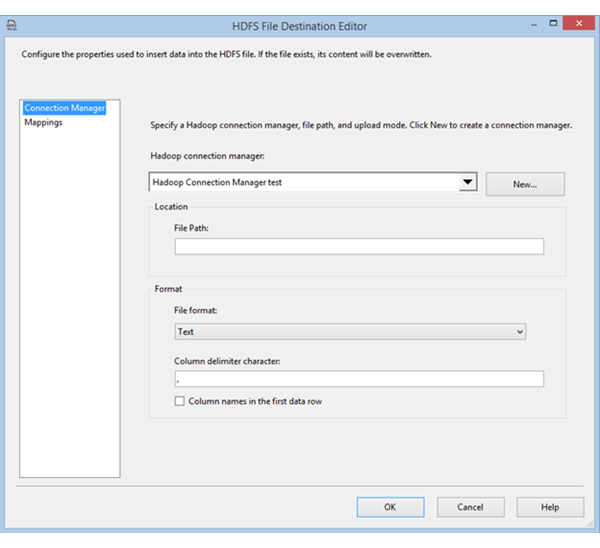

# HDFS File Destination
  The HDFS File Destination component enables an SSIS package to write data to a HDFS file. The supported file formats are Text, Avro, and ORC.

 To configure the HDFS File Destination, drag and drop the HDFS File Source on the data flow designer and double-click the component to open the editor.

 

## Options
 Configure the following options on the **General** tab of the **Hadoop File Destination Editor** dialog box.

|Field|Description|
|-----------|-----------------|
|**Hadoop Connection**|Specify an existing Hadoop Connection Manager or create a new one. This connection manager indicates  where the HDFS files are hosted.|
|**File Path**|Specify the name of the HDFS file.|
|**File format**|Specify the format for the HDFS file. The available options are Text, Avro, and ORC.|
|**Column delimiter character**|If you select Text format, specify the column delimiter character.|
|**Column  names in the first data row**|If you select Text format, specify whether the first row in the file contains column names.|

 After you configure these options, select the **Columns** tab to map source columns to destination columns in the data flow.

::: moniker range=">= sql-server-ver15"

## Prerequisite for ORC File Format
Java is required to use ORC file format.
Architecture (32/64-bit) of the Java build should match that of the SSIS runtime to use.
The following Java builds have been tested.

- [Zulu's OpenJDK 8u192](https://www.azul.com/downloads/zulu/zulu-windows/)
- [Oracle's Java SE Runtime Environment 8u192](https://www.oracle.com/technetwork/java/javase/downloads/java-archive-javase8-2177648.html)

### Set Up Zulu's OpenJDK
1. Download and extract the installation zip package.
2. From the Command Prompt, run `sysdm.cpl`.
3. On the **Advanced** tab, select **Environment Variables**.
4. Under the **System variables** section, select **New**.
5. Enter `JAVA_HOME` for the **Variable name**.
6. Select **Browse Directory**, navigate to the extracted folder, and select the `jre` subfolder.
   Then select **OK**, and the **Variable value** is populated automatically.
7. Select **OK** to close the **New System Variable** dialog box.
8. Select **OK** to close the **Environment Variables** dialog box.
9. Select **OK** to close the **System Properties** dialog box.

### Set Up Oracle's Java SE Runtime Environment
1. Download and run the exe installer.
2. Follow the installer instructions to complete setup.

::: moniker-end

## See Also
[Hadoop Connection Manager](../../integration-services/connection-manager/hadoop-connection-manager.md)  
[HDFS File Source](../../integration-services/data-flow/hdfs-file-source.md)
