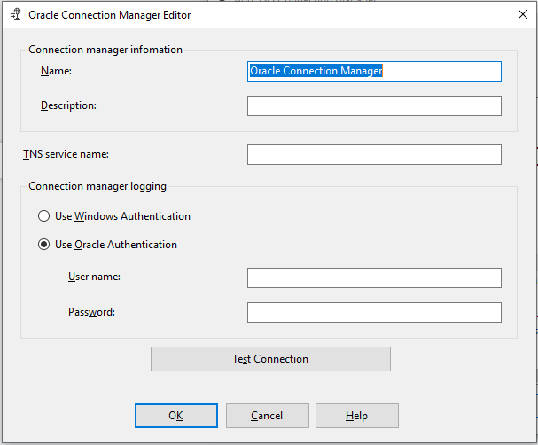

# Oracle Connection Manager

[!INCLUDE[sqlserver-ssis](../../includes/applies-to-version/sqlserver-ssis.md)]

An Oracle Connection Manager is used to enable a package to extract data from Oracle Databases and load data into Oracle Databases.

The **ConnectionManagerType** property for the Oracle Connection Manager is set to **ORACLE**.

## Configuring the Oracle Connection Manager

Oracle Connection Manager configuration changes will be resolved  by Integration Services at runtime. Use the **Oracle Connection Manager Editor** dialog box to add a connection to an Oracle data source.

### Options

#### Connection manager information

Enter information about the Oracle connection.

**Name**

Input a name for the Oracle connection. The default name is Oracle Connection Manager. 

**Description** 

Input a description of the connection. This input is optional.

**TNS service name**

Input the name of the Oracle database you work with. The TNS service name could be:

- The connect descriptor name defined in the tnsnames.ora file that located in the admin folder of the Oracle client.

- EzConnect format: [//]host[:port][/service_name]

For more information, see the Oracle documentation.

#### Connection Manager logging

Select one of the below options:

- **Use Windows Authentication**: Select this to use Windows authentication.

- **Use Oracle Authentication**: Select this to use Oracle database authentication. If you use this authentication, enter your Oracle credentials as follows:  
	**User name**: Type the user name used to connect to the Oracle database.  
	**Password**: Type the Oracle database password for the user entered in the user name field.

> [!NOTE]
>
>Windows Authentication is not supported for Oracle Server 18c.

**Test Connection**

Click **Test Connection** to verify if the information provided is correct. You will receive the message **Test connection succeeded**, if the information entered is able to connect to the Oracle database.

> [!NOTE]
>
> To specify **ConnectionString** directly, here is a sample with Oracle Authentication:
>
> `SERVER=\<YourOracleServerName or EzConnect format>;USERNAME=\<YourUserName>;PWD=\<YourPassword>;WINAUTH=0`

### Custom properties

There are following custom connection manager properties in the Oracle connection manager:

- **EnableDetailedTracing**: Not Used.

- **OracleHome**: Specify 32-bit Oracle Home name or folder to be used by the connector. (Optional)

- **OracleHome64**: Specify 64-bit Oracle Home name or folder to be used by the connector when running in 64-bit mode. (Optional)

Custom properties are not listed in Oracle Connection Manager Editor. To set the **OracleHome** and **OracleHome64** properties:

1. From the Connection Manager area, right-click the Oracle connection manager you are working with and select **Properties**.

2. In the **Properties** pane, set the **OracleHome** or **OracleHome64** property with the full path to the Oracle home directory.

## Next steps

- Configure [Oracle Source](oracle-source.md).
- Configure [Oracle Destination](oracle-destination.md).
- If you have questions, visit [TechCommunity](https://aka.ms/AA5u35j).
