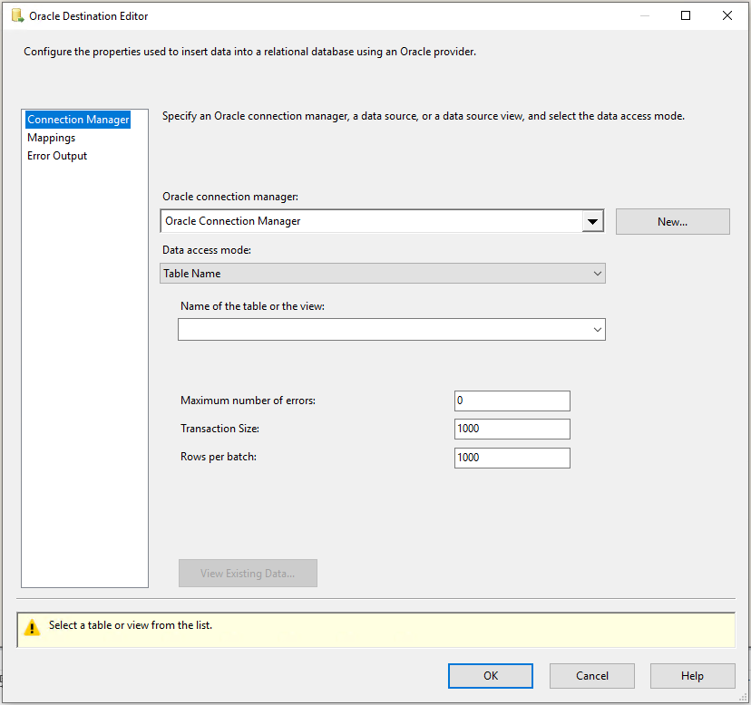

# Oracle destination

[!INCLUDE[sqlserver-ssis](../../includes/applies-to-version/sqlserver-ssis.md)]

The Oracle destination bulk loads data into Oracle Database.

The destination uses the Oracle Connection Manager to connect to a data source. For more information, see [Oracle Connection Manager](oracle-connection-manager.md).

An Oracle destination includes mappings between input columns and columns in the destination data source. You do not have to map input columns to all destination columns, but depending on the properties of the destination columns, errors can occur if no input columns are mapped to the destination columns. For example, if a destination column does not allow null values, an input column must be mapped to that column. In addition, if the input data is not compatible for the destination column type, an error occurs at runtime. Depending on the error behavior setting, the error will be ignored, cause a failure, or the row is redirected to the error output.

The Oracle destination has one regular input and one error output.

Columns of unsupported data types are deleted from columns with a warning before mapping.
For more information, see [Data Type Support](oracle-data-type-support.md).

## Load options

Two access load modes are supported. The mode can be set in the [Oracle Destination Editor (Connection Manager Page)](#oracle-destination-editor-connection-manager-page). The two modes are:

- Batch load: This mode is to load data into Oracle table in batches and the entire batch is inserted under the same transaction.
Details on how to configure this mode, see [Oracle Destination Editor (Connection Manager Page)](#oracle-destination-editor-connection-manager-page) and [Oracle Destination Custom Properties](#oracle-destination-custom-properties).

- Fast load using Direct Path: This mode is to use the direct path mode of the driver for loading Oracle table. There are restrictions when using this mode, refer to Oracle documentation for details.  
Details on how to configure this mode, see [Oracle Destination Editor (Connection Manager Page)](#oracle-destination-editor-connection-manager-page) and [Oracle Destination Custom Properties](#oracle-destination-custom-properties).

## Error handling

The Oracle destination has an error output. The component error output includes the following output columns:

- **Error Code**: A number that represents error type of the current error. The error code could be from:
    - Oracle server. See detail error description in Oracle database documentation.
    - SSIS runtime. For a list of SSIS error codes, see the SSIS Error Code and Message Reference.
- **Error Column**: The source column number that causes the conversion errors.

- **Error Data Columns**: The data that causes the error.

Types of output errors during the loading process supported are: data conversion, truncation, or constraint violation and so on. See [Oracle Destination Editor (Error Output Page)](#oracle-destination-editor-error-output-page).

**Maximum number of errors (MaxErrors)** property sets the maximum number of errors that can occur. Execution stops and returns errors when maximum number is reached. And only execution records before the maximum error number reaches are included in target table. see [Oracle Destination Editor (Connection Manager Page)](#oracle-destination-editor-connection-manager-page) for detail configuration.

## Parallelism

In batch loading mode, there is no restriction on configuration of parallel run, but the performance might be impacted by standard record locking mechanism. The amount of performance loss depends on the data and table organization.

In direct path protocol (fast load), only one Oracle destination can be configured to run against the same table at the same time, but can use Parallel mode.

A parallel direct path allows multiple direct path loads, with which multiple Oracle destinations can be configured to run concurrently against the same table at the same time. Oracle does not lock the target table exclusively to use in the fast load session, which allows running additional fast load destination components to load the same target table in parallel.
The parallel direct path is more restrictive, any use of parallelism that should be planned in advance.

There is no reason to use a single Parallel session.

See Oracle documentation regarding restrictions when using Parallel direct path loads.

For more information, see [Oracle Destination Custom Properties](#oracle-destination-custom-properties).

## Troubleshooting the Oracle destination

You can log the ODBC calls that the Oracle source makes to Oracle data sources to troubleshoot the data exporting. To log the ODBC calls that the Oracle source makes to Oracle data sources, enable the ODBC driver manager trace. For more information, see the Microsoft documentation on *How To Generate an ODBC Trace with ODBC the Data Source Administrator.*

## Oracle destination custom properties

The following table describes the custom properties of the Oracle destination. All properties are read/write.

|Property name|Data Type|Description|Loading Mode|
|:-|:-|:-|:-|
|BatchSize|Integer|The size of the batch for bulk loading. This is the number of rows loaded as a batch.|Used only in batch mode.|
|DefaultCodePage|Integer|The code page to use when data source does not have code page information.  **Note**: This property is set by **Advanced Editor** only..|Use for both modes.|
|FastLoad|Boolean|Whether Fast Loading is used. The default value is **false**. This can also be set in the [Oracle Destination Editor (Connection Manager Page)](#oracle-destination-editor-connection-manager-page). |Use for both modes.|
|MaxErrors|Integer|The number of errors that can occur before the data flow is stopped. The default value is **0**, which means no limit of error number.  If **Redirect flow** is selected in the **Error handling** page. Before the error number limit reaches, all errors are returned in the error output. For more information, see [Error Handling](#error-handling).|Used only in Fast Load mode.|
|NoLogging|Boolean|Whether database logging is disabled. The default value is **False**, which means that logging is enabled.|Use for both modes.|
|Parallel|Boolean|Whether parallel loading is allowed. **True** indicates that other loading sessions are allowed to run against the same target table.  For more information, see in [Parallelism](#parallelism).|Used only in Fast Load mode.|
|TableName|String|The name of the table with the data that is being used.|Used for both modes.|
|TableSubName|String|The subname or subpartition. This value is optional.  **Note**: This property can only be set in **Advanced Editor**.|Used only in Fast Load mode.|
|TransactionSize|Integer|The number of inserts that can be made in a single transaction. The default is the **BatchSize**.|Used only in batch mode.|
|TransferBufferSize|Integer|The size of the transfer buffer. The default value is 64 KB.|Used only in Fast Load mode.|

## Configuring the Oracle destination

Oracle destination can be configured programmatically or through the SSIS Designer.

The Oracle Destination Editor is shown in below picture. It contains Connection Manager Page, Mappings Page, and Error Output Page.

For more information, see one of the following sections:

- [Oracle Destination Editor (Connection Manager Page)](#oracle-destination-editor-connection-manager-page)
- [Oracle Destination Editor (Mappings Page)](#oracle-destination-editor-mappings-page)
- [Oracle Destination Editor (Error Output Page)](#oracle-destination-editor-error-output-page)

The **Advanced Editor** dialog box contains the properties that can be set programmatically.
To open the **Advanced Editor** dialog box:

- In the **Data Flow** screen of your Integration Services project, right-click the Oracle destination and select **Show Advanced Editor**.

For more information about the properties that you can set in the Advanced Editor dialog box, see [Oracle Destination Custom Properties](#oracle-destination-custom-properties).

## Oracle Destination Editor (Connection Manager page)

Use the **Connection Manager** page of the **Oracle Destination Editor** dialog box to select the Oracle connection manager for the destination. This page also lets you select a table or view from the database.

**To open the Oracle Destination Editor Connection Manager Page**

- In SQL Server Data Tools, open the SQL Server Integration Services (SSIS) package that has the Oracle destination.

- On the Data Flow tab, double-click the Oracle destination.

- In the Oracle Destination Editor, click Connection Manager.

### Options

**Connection manager**

Select an existing connection manager from the list, or click **New** to create a new Oracle connection manager.

**New**

Click **New**. The **Oracle Connection Manager Editor** dialog box opens where you can create a new connection manager.

**Data access mode**

Select the method for selecting data from the source. The options are shown in the following table:

|Option|Description|
|:-|:-|
|Table Name|Configure Oracle destination to work in batch mode. Options:   **Name of the table or the view**: Select an available table or view from the database from the list.   **Transaction size**: Input the number of inserts that can be in a single transaction. The default is the **BatchSize**.   **Batch size**: Type the size (number of rows loaded) of the batch for bulk loading.
|Table Name – Fast Load|Configure the Oracle destination to work in fast (Direct Path) load mode.   Options are available:   **Name of the table or the view**: Select an available table or view from the database from the list.   **Parallel load**: Whether parallel loading is enabled. For more information, see [Parallelism](#parallelism).   **No logging**: This check box to disable database logging. This logging is Oracle database used for recovery purpose, not related to tracing.   **Maximum number of errors**: Maximum number of errors that can occur before the data flow is stopped. The default value is 0, which means there is no number limit.   All errors can occur are returned in the error output.   **Transfer buffer size (KB)**: Input the size of the transfer buffer. The default size is 64 KB.|

**View Existing Data**

Click **View Existing Data** to view up to 200 rows of data for the table that you selected.

## Oracle Destination Editor (Mappings page)

Use the **Mappings** page of the **Oracle Destination Editor** dialog box to map input columns to destination columns.

**To open the Oracle Destination Editor Mappings Page**

- In SQL Server Data Tools, open the SQL Server Integration Services (SSIS) package that has the Oracle destination.

- On the Data Flow tab, double-click the Oracle destination.

- In the Oracle Destination Editor, click Mappings.

### Options

**Available Input Columns**

The list of available input columns. Drag-and-drop an input column to an available destination column to map the columns.

**Available Destination Columns**

The list of available destination columns. Drag-and-drop a destination column to an available input column to map the columns.

**Input Column**

View the input columns that you selected. You can remove mappings by selecting **< ignore >** to exclude columns from the output.

**Destination Column**

View all available destination columns, both mapped and unmapped.

> [!NOTE]
>
>Columns of unsupported data types will be deleted from mapping with a warning.

## Oracle Destination Editor (Error Output page)

Use the Error Output page of the Oracle Destination Editor dialog box to select error handling options.

**To open the Oracle Destination Editor Error Output Page**

- In SQL Server Data Tools, open the SQL Server Integration Services (SSIS) package that has the Oracle destination.

- On the Data Flow tab, double-click the Oracle destination.

- In the Oracle Destination Editor, click Error Output.

### Options

**Error behavior**

Select how the Oracle source should handle errors in a flow: ignore the failure, redirect the row, or fail the component.
**Related Section**: [Error Handling in Data](./error-handling-in-data.md)

**Truncation**

Select how the Oracle source should handle truncation in a flow: ignore the failure, redirect the row, or fail the component.

## Next steps

- Configure [Oracle Connection Manager](oracle-connection-manager.md).
- Configure [Oracle Source](oracle-source.md).
- Configure [Oracle Destination](oracle-destination.md).
- If you have questions, visit [TechCommunity](https://aka.ms/AA5u35j).
