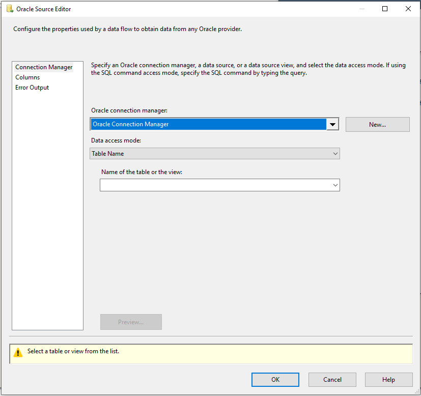

# Oracle source

[!INCLUDE[sqlserver-ssis](../../includes/applies-to-version/sqlserver-ssis.md)]

The Oracle source extracts data from Oracle Database with below modes:

- A table or view.

- The results of an SQL statement.

The source uses an Oracle Connection Manager to connect to Oracle source. For more information, see [Oracle Connection Manager](oracle-connection-manager.md).

## Error output

Error output includes the following columns:  

- **Error Code**: A number that represents error type of the current error. The error code could be from:
    - Oracle server. See detail error description in Oracle database documentation.
    - SSIS runtime. For a list of SSIS error codes, see the SSIS Error Code and Message Reference.
- **Error Column**: The source column number that causes the conversion errors.

- **Error Data Columns**: The data which causes the error.

The Oracle source returns errors occurred during loading and extraction process in the error output. For more information, see [Oracle Source Editor (Error Output Page)](#oracle-source-editor-error-output-page).

## Troubleshooting the Oracle source

You can log the ODBC calls that the Oracle source makes to Oracle data sources to troubleshoot the data exporting. To log the ODBC calls that the Oracle source makes to Oracle data sources, enable the ODBC driver manager trace. For more information, see the Microsoft documentation on *How To Generate an ODBC Trace with ODBC the Data Source Administrator.*

## Oracle source custom properties

The custom properties of the Oracle source are as below. All properties are read/write.

|Property Name|Data Type|Description|
|:-|:-|:-|
|AccessMode|Integer (enumeration)|The mode used to access the database. The possible values are **Table Name** and **SQL Command**. The default is **Table Name**.|
|BatchSize|Integer|The size of the batch for bulk loading. This is the number of records extracted as an array.  This property is set by **Advanced Editor** only|
|DefaultCodePage|Integer|The code page to use when data source does not have code page information.  This property is set by **Advanced Editor** only.|
|PreFetchCount|Integer|The number of pre-fetched rows.  This property is set by **Advanced Editor** only.|
|SqlCommand|String|The SQL command to be executed when AccessMode is set to SQL Command.|
|TableName|String|The name of the table with the data to be used when AccessMode is set to Table Name.|

## Configuring the Oracle source

You can configure the Oracle Source programmatically or through the SSIS Designer.

The Oracle Source Editor is shown in below picture. It contains Connection Manager Page, Columns Page, and Error Output Page.

For more information, see one of the following sections:

- [Oracle Source Editor (Connection Manager Page)](#oracle-source-editor-connection-manager-page)
- [Oracle Source Editor (Columns Page)](#oracle-source-editor-columns-page)
- [Oracle Source Editor (Error Output Page)](#oracle-source-editor-error-output-page)

The **Advanced Editor dialog box** contains the properties that can be set programmatically.

To open the **Advanced Editor** dialog box:

- In the **Data Flow** screen of your Integration Services project, right-click the Oracle source and select **Show Advanced Editor**.

For more information about the properties that you can set in the **Advanced Editor** dialog box, see [Oracle Source Custom Properties](#oracle-source-custom-properties).

## Oracle Source Editor (Connection Manager page)

On **Connection Manager** page, **Oracle Source Editor** dialog box is to select Oracle Database as source, table, or view from the database.

**To open the Oracle Source Editor Connection Manager Page**

- In SQL Server Data Tools, open the SQL Server Integration Services (SSIS) package that has the Oracle source.

- On the Data Flow tab, double-click the Oracle source.
### Options

**Connection manager**

Select an existing connection manager from the list or click **New** to create a new Oracle connection manager.

**New**

Click **New**. The **Oracle Connection Manager Editor** dialog box opens where you can create a new connection manager.

**Data Access Mode**

Select the method for selecting data from the source. The options are shown in the following table:

|Option|Description|
|:-|:-|
|Table or view|Retrieve data from a table or view in the Oracle data source. When this option is selected, select an available table or view from the list for **Name of the table or the view**.|
|SQL command|Retrieve data from the Oracle data source by using an SQL query. When this option is selected, enter a query in one of the following ways:  Enter the text of the SQL query in the **SQL command text** field.  Click **Browse** to load the SQL query from a text file.  Click **Parse query** to verify the syntax of the query text.|

**Preview**

Click **Preview** to view up to the first 200 rows of the data extracted from the table or view you selected.

## Oracle Source Editor (Columns page)

On **Columns** page, **Oracle Source Editor** dialog box is used to map an output column to each external (source) column.

**To open the Oracle Source Editor Columns Page**

- In SQL Server Data Tools, open the SQL Server Integration Services (SSIS) package that has the Oracle source.

- On the Data Flow tab, double-click the Oracle source.

- In the Oracle Source Editor, click Columns.

### Options

**Available External Columns**

A list of available external columns that can be selected to add to **External Column** list in the order they are selected. This table cannot be used to add or delete columns.

Select the **Select All** check box to select all the columns.

**External Columns**

The external (source) columns that you selected is listed in order.
To change the order, first clear **Available External Column" list, and then select the column(s) with a different order.

**Output Column**

The name of the selected external (source) column is the default output name. While you can input any unique name.
> [!NOTE]
>
>If there are columns with unsupported data types, there will be a warning shown the data types are not supported, and related columns will be removed from mapping columns.

## Oracle Source Editor (Error Output page)

Use the **Error Output** page of the **Oracle Source Editor** dialog box to select error handling options.

**To open the Oracle Source Editor Error Output Page**

- In SQL Server Data Tools, open the SQL Server Integration Services (SSIS) package that has the Oracle source.

- On the Data Flow tab, double-click the Oracle source.

- In the Oracle Source Editor, click Error Output.

### Options

**Error behavior**

Select how the Oracle source should handle errors in a flow: ignore the failure, redirect the row, or fail the component.
**Related section**: [Error Handling in Data](./error-handling-in-data.md)

**Truncation**

Select how the Oracle source should handle truncation in a flow: ignore the failure, redirect the row, or fail the component.

## Next steps

- Configure [Oracle Destination](oracle-destination.md).
- If you have questions, visit [TechCommunity](https://aka.ms/AA5u35j).
