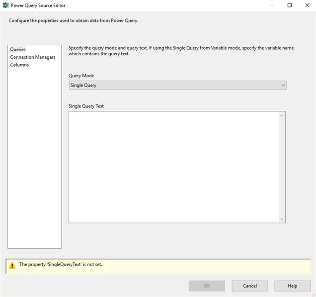
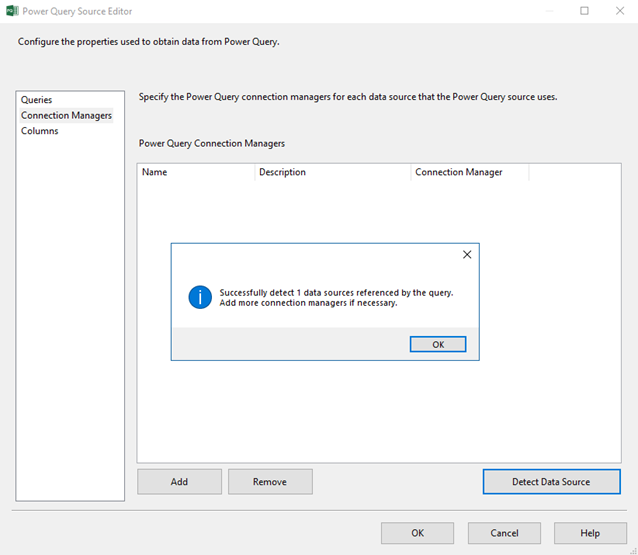
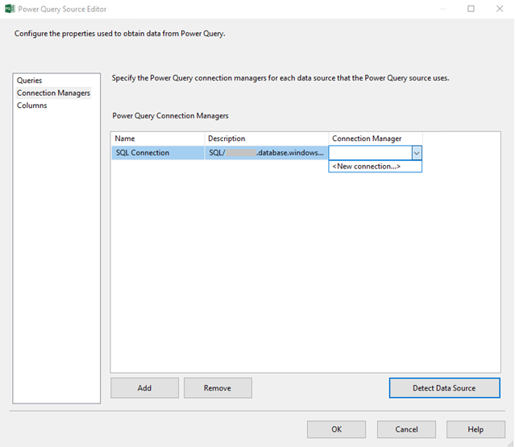
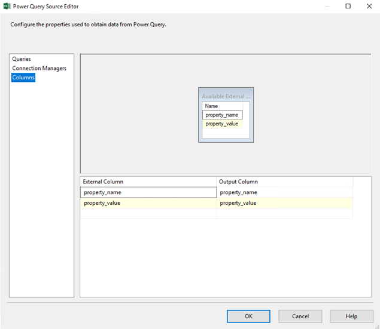
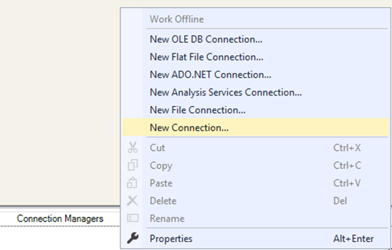
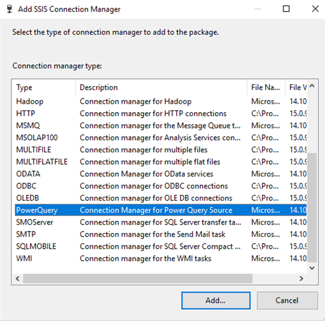
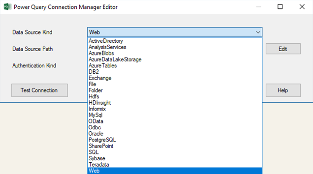
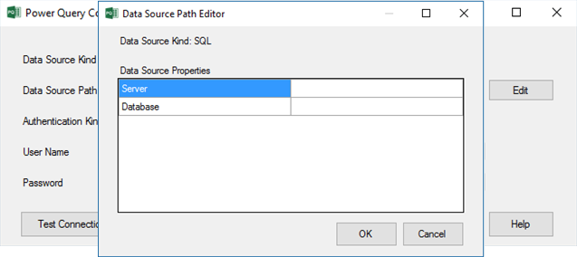
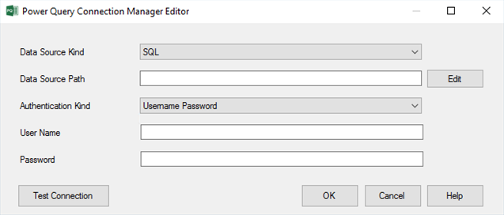

# Power Query Source (Preview)

[!INCLUDE[sqlserver-ssis](../../includes/applies-to-version/sqlserver-ssis.md)]

This article describes how to configure the properties of the Power Query Source in the SQL Server Integration Services (SSIS) data flow. Power Query is a technology that allows you to connect to various data sources and transform data using Excel/Power BI Desktop. For more info, see [Power Query - Overview and Learning](https://support.office.com/article/power-query-overview-and-learning-ed614c81-4b00-4291-bd3a-55d80767f81d) article. The script generated by Power Query can be copied & pasted into the Power Query Source in the SSIS data flow to configure it.
  
> [!NOTE]
> For the current preview release, Power Query Source can only be used on SQL Server 2017/2019 and Azure-SSIS Integration Runtime (IR) in Azure Data Factory (ADF). You can download and install the latest Power Query Source for SQL Server 2017/2019 from [here](https://www.microsoft.com/download/details.aspx?id=100619). Power Query Source for Azure-SSIS IR is already preinstalled. To provision Azure-SSIS IR, see [Provision SSIS in ADF](/azure/data-factory/tutorial-deploy-ssis-packages-azure) article.

## Configure the Power Query Source

To open **Power Query Source Editor** in SSDT, drag & drop **Power Query Source** from SSIS Toolbox onto the data flow designer and double-click on it.  

Three tabs are shown on the left side. On **Queries** tab, you can select your query mode from the dropdown menu.
-   **Single Query** mode allows you to copy & paste a single Power Query script from Excel/Power BI Desktop.
-   **Single Query from Variable** mode allows you to specify a string variable that contains your query to be executed.

On **Connection Managers** tab, you can add or remove Power Query connection managers that contain data source access credentials. Selecting the **Detect Data Source** button identifies the referenced data sources in your query and lists them for you to assign the appropriate existing Power Query connection managers or create new ones.

Finally, on **Columns** tab, you can edit the output column info.

## Configure the Power Query Connection Manager

When designing your data flow with Power Query Source on SSDT, you can create a new Power Query Connection Manager in the following ways:
- Indirectly create it on **Connection Managers** tab of Power Query Source after selecting **Add**/**Detect Data Source** button and selecting **\<New connection...\>** from the dropdown menu as described above.
- Directly create it by right-clicking on **Connection Managers** panel of your package and selecting **New Connection...** from the dropdown menu.

In **Add SSIS Connection Manager** dialog, double-click on **PowerQuery** from the list of connection manager types.

In **Power Query Connection Manager Editor**, you need to specify **Data Source Kind**, **Data Source Path**, and **Authentication Kind**, as well as assign the appropriate access credentials. For **Data Source Kind**, you can currently select one of 22 kinds from the dropdown menu.

Some of these sources (**Oracle**, **DB2**, **MySQL**, **PostgreSQL**, **Teradata**, **Sybase**) require additional installations of ADO.NET drivers that can be obtained from [Power Query Prerequisites](/power-bi/desktop-data-source-prerequisites) article. You can use the custom setup interface to install them on your Azure-SSIS IR, see [Customizing Azure-SSIS IR](/azure/data-factory/how-to-configure-azure-ssis-ir-custom-setup) article.

For **Data Source Path**, you can enter data source-specific properties forming a connection string without the authentication info. For example, the path for **SQL** data source is formed as `<Server>;<Database>`. You can select the **Edit** button to assign values to data source-specific properties forming the path.

Finally, For **Authentication Kind**, you can select **Anonymous**/**Windows Authentication**/**Username Password**/**Key** from the dropdown menu, enter the appropriate access credentials, and select the **Test Connection** button to ensure that Power Query Source has been properly configured.

### Current limitations

-   **Oracle** data source can not currently be used on Azure-SSIS IR, because Oracle ADO.NET driver can not be installed there, so please install Oracle ODBC driver instead and use **ODBC** data source to connect to Oracle for now, see **ORACLE STANDARD ODBC** example in [Customizing Azure-SSIS IR](/azure/data-factory/how-to-configure-azure-ssis-ir-custom-setup) article.

-   **Web** data source can not currently be used on Azure-SSIS IR with custom setups, so please use it on Azure-SSIS IR without custom setups for now.

## Next steps
Learn how to run SSIS packages in the Azure-SSIS IR as first-class activities in ADF pipelines. See [Execute SSIS Package activity Runtime](/azure/data-factory/how-to-invoke-ssis-package-ssis-activity) article.