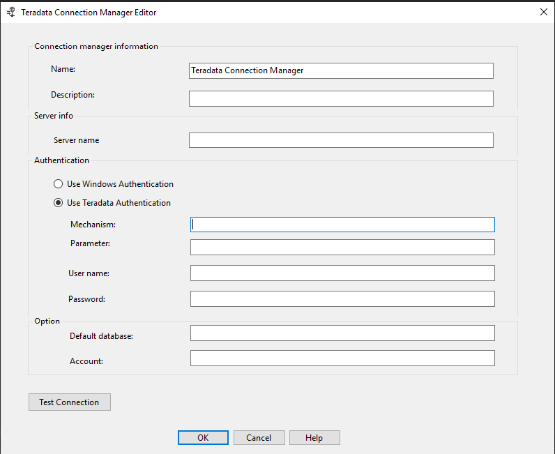

# Use the Teradata connection manager

[!INCLUDE[sqlserver-ssis](../../includes/applies-to-version/sqlserver-ssis.md)]

With the Teradata connection manager, you can enable a package to extract data from Teradata databases and load data into Teradata databases.

You set the Teradata connection manager `ConnectionManagerType` property to *TERADATA*.

## Configure the Teradata connection manager

Connection manager configuration changes are resolved by Integration Services at runtime. To add a connection to a Teradata data source, complete the information in the **Teradata Connection Manager Editor** pane.

1. In the **Name** box, enter a name for the connection. The default name is **Teradata Connection Manager**.

1. (Optional) In the **Description** box, enter a description of the connection.

1. In the **Server name** box, enter the name of the Teradata server to connect to.

1. Under **Authentication**, do either of the following:

   - To use Windows authentication, select **Use Windows Authentication**.
   - To use Teradata database authentication, select **Use Teradata Authentication**, and then enter the following credentials for this type of authentication:
     - In the **Mechanism** box, enter the security checking mechanism you want to use. Valid mechanism values include TD1, TD2, LDAP, KRB5, KRB5C, NTLM, and NTLMC.
     - In the **Parameter** box, enter the types of parameters that are required for the security checking mechanism you've entered.
     - In the **User name** box, enter the username that you use to connect to the Teradata database.  
     - In the **Password** box, enter the Teradata database password of the user.

1. (Optional) In the **Default database** drop-down list, select the Teradata database to connect to. If this database-access permission is incorrect, an error is displayed, and you can then manually enter the database name.

1. (Optional) In the **Account** box, enter the name of the account that corresponds to the user name. If this value is empty, the account for the immediate owner of the database is used.
1. Select **OK**.

## Custom property

The custom property `UseUTF8CharSet` specifies whether the UTF-8 character set is used. The default value is *True*.

To set the property:

1. Open SQL Server Data Tools (SSDT).
1. In the **Connection Manager** area, right-click **Teradata Connection Manager**, and then select **Properties**.
1. In the **Properties** pane, for the `UseUTF8CharSet` property, select either *True* or *False*.

## Troubleshoot the Teradata connection manager

To log Teradata connection manager calls to the Teradata Open Database Connectivity (ODBC) driver, enable Windows ODBC tracing in the Windows ODBC Data Source Administrator.

## Next steps

- Configure the [Teradata source](teradata-source.md).
- Configure the [Teradata destination](teradata-destination.md).
- If you have questions, visit the [Tech Community](https://aka.ms/AA5u35j).
