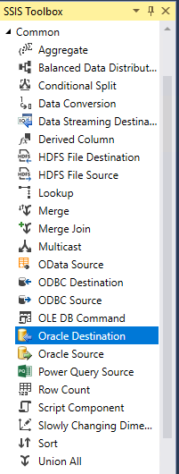
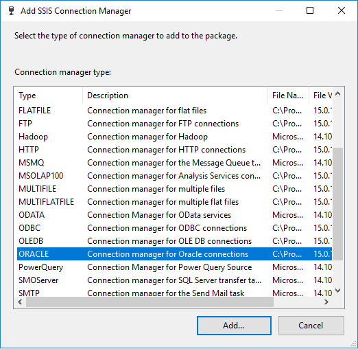

# Microsoft connector for Teradata

[!INCLUDE[sqlserver-ssis](../../includes/applies-to-version/sqlserver-ssis.md)]

Microsoft connector for Teradata enables to export data from and load data into Teradata databases in an SSIS package.

This new connector supports databases with 1MB-enabled tables.

## Version support

The following Microsoft SQL Server products are supported by Microsoft Connector for Teradata:

- Microsoft SQL Server 2019
- Microsoft SQL Server Data Tools (SSDT) 15.8.1 or later for Visual Studio 2017
- Microsoft SQL Server Data Tools (SSDT) for Visual Studio 2019

Microsoft connector for Teradata uses Teradata Parallel Transporter Application Programming Language Interface to load into and export data from the Teradata database. The following versions are supported:

- Teradata Parallel Transporter (Teradata PT) 16.10
- Teradata Parallel Transporter (Teradata PT) 16.20

The following Teradata database versions of data source are supported:

- Teradata Database 16.20
- Teradata Database 16.10
- Teradata Database 15.10
- Teradata Database 15.00

Check [Teradata documentation](https://docs.teradata.com/) for details of Teradata Parallel Transporter Application programming interface programmer guide.

## Installation

On 32-bit computers, install the following drivers from [Teradata Tools and Utilities - Windows Installation Package](https://downloads.teradata.com/download/tools/teradata-tools-and-utilities-windows-installation-package):

- Teradata ODBC driver (32-bit)
- Teradata PT API (32-bit)

On 64-bit computers, install the following drivers:

- Teradata ODBC driver (64-bit)
- Teradata PT API (64-bit)

To install the connector for Teradata database, download and run the installer from [the latest version of Microsoft connector for Teradata](https://www.microsoft.com/download/details.aspx?id=100599). Then follow the directions in the installation wizard.

After you install the connector, you must restart the SQL Server Integration Service to be sure that the Teradata source and destination works correctly.

## Design and execute SSIS packages

Microsoft Connector for Teradata provides similar user experience with Attunity Teradata Connector. User can design new packages based on previous experience, using SSDT for VS 2017 or VS 2019, with *targeting SQL server 2019*.

Teradata source and destination are under Common category.

Teradata connection manager is displayed as "TERADATA".

Existing SSIS packages that have been designed with Attunity Teradata Connector will be automatically upgraded to use Microsoft Connector for Teradata. The icons will be changed as well.

To execute SSIS package *targeting SQL Server 2017 and below*, you will need to install **Microsoft Connector for Teradata by Attunity** with corresponding version from below link:

- [SQL Server 2017: Microsoft Connector Version 5.0 for Teradata by Attunity](https://www.microsoft.com/download/details.aspx?id=55179)
- [SQL Server 2016: Microsoft Connector Version 4.0 for Teradata by Attunity](https://www.microsoft.com/download/details.aspx?id=52950)
- [SQL Server 2014: Microsoft Connector Version 3.0 for Teradata by Attunity](https://www.microsoft.com/download/details.aspx?id=44582)
- [SQL Server 2012: Microsoft Connector Version 2.0 for Teradata by Attunity](https://www.microsoft.com/download/details.aspx?id=29283)

To design SSIS package in SSDT *targeting SQL Server 2017 and below*, you will need to have **Microsoft Connector for Teradata** and install **Microsoft Connector for Teradata by Attunity** with corresponding version.

## Limitations and known issues

- Teradata Source/Destination Editor, **Default database** property does not take effective. As work-around, type database name in dropdown box to filter table or view.

- Teradata Source/Destination Editor, Mapping step does not work when type \<database>.<table/view>. As work-around, type \<database>.<table/view>, then click the drop-down button.

- Teradata Source Editor, view cannot be displayed when Data access mode is "Table Name – TPT Export". As work-around, use Advanced Editor of Teradata Source.

- Teradata Destination, attribute ‘PackMaximum’ cannot be set to ‘True’. Otherwise, error will occur.

## Uninstallation

You can run uninstall wizard to remove **Microsoft connector for Teradata**.

## Next steps

- Configure [Teradata connection manager](teradata-connection-manager.md)
- Configure [Teradata source](teradata-source.md)
- Configure [Teradata destination](teradata-destination.md)
- If you have questions, visit [Tech Community](https://aka.ms/AA6iwdw).
