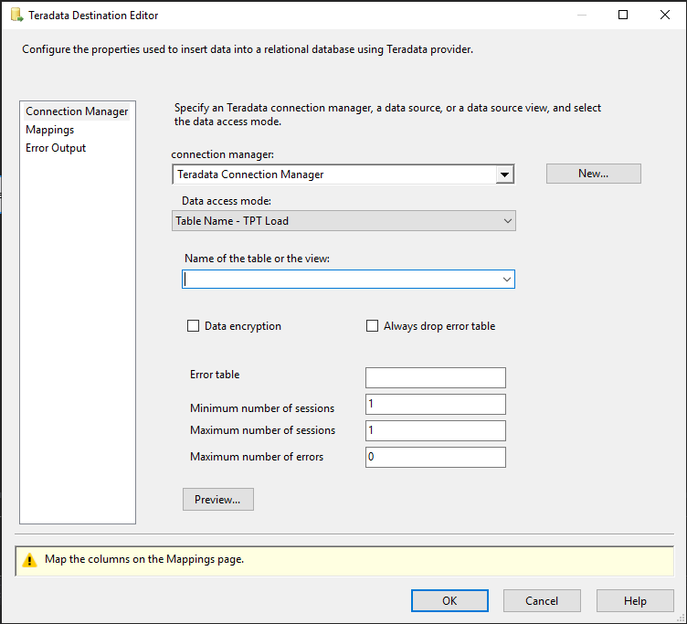

# Teradata destination

[!INCLUDE[sqlserver-ssis](../../includes/applies-to-version/sqlserver-ssis.md)]

The Teradata destination bulk loads data into Teradata Database.

The destination uses the Teradata connection manager to connect to a data source. For more information, see [Teradata connection manager](teradata-connection-manager.md).

## Load options

Teradata destination supports two data load modes:

- **TPT Stream**: This mode uses the TPT API Stream operator (Teradata TPump protocol).

- **TPT Load** (fast bulk-load): This mode uses the TPT API Load operator (Teradata FastLoad protocol) for fast bulk loading.

Fast load mode has below restrictions:

- The limit of sessions for Teradata database is determined by whichever below factor is encountered first:
    - Session limits set using the SESSIONS command
    - The Teradata Database limit of one session per AMP
    - The platform limit on maximum number of sessions per application: Defined by MaxSess variable in the communications processor (COP) Interface software file, CLISPB.DAT. You can use the TDP SET MAXSESSIONS command to specify a platform limit. The default limit is equal to the server MAXSESS.

- Join indexes are not supported.
- Foreign key references in target tables are not supported.
- Target tables defined with a secondary index are not supported.

For more information on the Teradata fast load restrictions, see Teradata's fast load reference.

You can set the mode in the [Teradata Destination Editor (Connection Manager Page)](#teradata-destination-editor-connection-manager-page).

## Error handling

Errors returned during the load process are written to temporary error tables that are locked during loading process.
**Maximum number of errors (MaxErrors)** property in Advanced Editor sets the maximum number of errors that can be written to these tables.

If the Maximum number of errors is greater than zero, error tables with unique names are generated, and informational message is printed to package log. The errors can be retrieved by standard SSIS component error output.

The temporary tables are dropped once the loading process is completed. If the temporal tables cannot be read by Teradata destination, they are not dropped unless **Always drop error table** property is checked.  If the loading process is stopped before completion, you need to manually drop these tables if needed. These tables are located in the same database with the destination table.

When the **Maximum number of errors** is reached, the target table state depends on the mode being used.

- In fast load mode, the target table is not usable. To execute again, you must truncate or drop and recreate the target table. Rollback is not supported.
- In TPT Steam operator mode, Teradata destination executes via buffered row mechanism. If job fails, all the changes that were completed (buffers were sent) at the time of failure are permanent in target table(s). There is no rollback concept. Error tables will be dropped.

The Teradata destination has an error output. For more information, see [Teradata Destination Editor (Error Output Page)](#teradata-destination-editor-error-output-page).

## Parallelism

Parallelism is restricted in fast load mode, multiple independent fast load jobs cannot access the same table at the same time. Also the number of concurrent fast load jobs is limited by database variable **MaxLoadTasks**.

There is no restriction of parallelism in TPT Stream mode. It is possible to run multiple Teradata destinations concurrently against the same table, while this may reduce the performance per Teradata. See Teradata documentation for more information.

## Troubleshooting the Teradata destination

You can log the calls that the Teradata source makes to the Teradata Parallel Transporter API (TPT API). You can enable package logging and select the **Diagnostic** event at the package level to log the calls.

You can log the ODBC calls that the Teradada source makes to the Teradata ODBC driver by enabling the ODBC driver manager trace. For more information, see the Microsoft documentation on *How To Generate an ODBC Trace with ODBC the Data Source Administrator*.

## Teradata destination custom properties

The following table describes the custom properties of the Teradata destination. All properties are read/write.

|Property name|Data Type|Description|
|:-|:-|:-|
|AlwaysDropErrorTable|Boolean|Default is **False**. Drop all error tables if **True**, even if the Teradata destination fails read.|
|ArraySupport|Boolean|Default is **True**. DML Groups use ArraySupport if **True**. Only applicable for TPT Stream. This property is in **Advanced Editor**.|
|Buffers|Integer|The number of request buffers to be increased, value can be set from 2 to 64. Only applicable for TPT Stream. This property is in **Advanced Editor**.|
|BufferMode|Boolean|Default is **True**. Must be **True** if PutBuffer feature is used. This property is in **Advanced Editor**.|
|BufferSize|Integer|The output buffer size (in KB) used for sending load parcels. The default value is 1024. Only applicable for TPT Load. This property is in **Advanced Editor**.|
|DataEncryption|Boolean|Default is **False**. Full security encryption is used if **True**.|
|DefaultCodePage|Integer|The code page to use when data source does not have code page information.  **Note**: This property is in **Advanced Editor**.|
|DetailedTracingLevel|Integer (Enumeration)|Select one of the following options for advanced tracing:   **Off**: No advanced logging.   **General**: Driver-specific activities general tracing is logged.   **CLI**: CLIv2-related activities tracing is logged.   **Notify Method**: Notify feature-related activities tracing is logged.   **Common Library**: opcommon library activities tracing is logged.   **All**: All of the above activities tracing is logged.   The advanced tracing log file is defined in the **DetailedTracingFile** property.   **DetailedTracingFile** property must be set if option is not Off.   This property is in **Advanced Editor**.|
|DetailedTracingFile|String|The path of log file that is generated automatically when **DetailedTracingLevel** is not **Off**. This property is in **Advanced Editor**.|
|DiscardLargeRow|Boolean|Default is **False**. Discard large rows (greater than 64K) if **True**|
|ErrorTableName|String|Error table name. Default is the target table name|
|ExtendedStringColumnsAllocation|Boolean|**Maximal Transfer Character Allocation Factor** is use if **True**.   This value should be set to **True** if the Teradata database **Export Width Table ID** property is set to **Maximal Defaults**.   Default is **False**.|
|FastLoad|Boolean|Fast Loading is used if **True**. The default value is **false**. This can also be set in the [Teradata Destination Editor (Connection Manager Page)](#teradata-destination-editor-connection-manager-page).|
|MaxErrors|Integer|The number of errors that can occur before the data flow is stopped. The default value is **0**, which means no limit of error number.  If **Redirect flow** is selected in the **Error handling** page. Before the error number limit reaches, all errors are returned in the error output. For more information, see [Teradata Destination Editor (Error Output Page)](#teradata-destination-editor-error-output-page).|
|MaxSessions|Integer|The maximum number of sessions that are logged on. This value must be greater than one. The default value is one session for each available AMP.|
|MinSessions|Integer|The minimum number of sessions that are logged on. This value must be greater than one. The default value is one session for each available AMP.|
|Pack|Integer|The number of statements to pack into a multi-statement request. Default is 20, maximum allowed is 2400. Only applicable for TPT Stream. This property is in **Advanced Editor**.|
|PackMaximum|Boolean|Dynamically determine the maximum pack factor for the current Stream job if **True**. Only applicable for TPT Stream. This property is in **Advanced Editor**.|
|QueryBandSessInfo|Varchar|A user defined, session-based query band expression, to enable charge-back monitoring and governance. This property must be in connection-string format. This property is in **Advanced Editor**.|
|ReplicationOveride|Integer (enumeration)|Options:   **Default**: No SET SESSION OVERRIDE REPLICATION statement is sent to the database. The database default settings are used.   **On**: The normal replication service controls are overridden.   **Off**: The normal replication service controls are used.   This property is only applicable for TPT Stream.   This property is in **Advanced Editor**.|
|Robust|Boolean|Robust restart logic is used for recovery and restart operations if **True**. This property is only applicable for **TPT Stream**. This property is in **Advanced Editor**.|
|TableName|String|The name of the table with the data that is being used.|
|TenacityHours|Integer|The number of hours the TPT driver attempts to log on when the maximum number of load/export operations are already running. The default is 4 hours. This property is in **Advanced Editor**|
|TenacitySleep|Integer|Minutes the TPT driver pauses before attempting to log on when limit is reached. Limit is defined by the **MaxSessions** and **TenacityHours** properties. Default is six minutes. This property is in **Advanced Editor**|
|UnicodePassThrough|Boolean|Off (default): Disable the Unicode Pass Through.  On: Enable the Unicode Pass Through.|

## Configuring the Teradata destination

Teradata destination can be configured programmatically or through the SSIS Designer.

The Teradata Destination Editor is shown in below picture. It contains Connection Manager Page, Mappings Page, and Error Output Page.

For more information, see one of the following topics:

- [Teradata Destination Editor (Connection Manager Page)](#teradata-destination-editor-connection-manager-page)
- [Teradata Destination Editor (Mappings Page)](#teradata-destination-editor-mappings-page)
- [Teradata Destination Editor (Error Output Page)](#teradata-destination-editor-error-output-page)

The **Advanced Editor** dialog box contains the properties that can be set programmatically.
To open the **Advanced Editor** dialog box:

- In the **Data Flow** screen of your Integration Services project, right click the Teradata destination and select **Show Advanced Editor**.

For more information about the properties that you can set in the Advanced Editor dialog box, see [Teradata destination custom properties](#teradata-destination-custom-properties).

## Teradata Destination Editor (Connection Manager Page)

Use the **Connection Manager** page of the **Teradata Destination Editor** dialog box to select the Teradata connection manager for the destination. This page also lets you select a table or view from the database.

To open the Teradata Destination Editor Connection Manager Page

- In SQL Server Data Tools, open the SQL Server Integration Services (SSIS) package that has the Teradata destination.

- On the Data Flow tab, double-click the Teradata destination.

- In the Teradata Destination Editor, click Connection Manager.

### Options

**Connection manager**

Select an existing connection manager from the list, or click **New** to create a new Teradata connection manager.

**New**

Click **New**. The **Teradata Connection Manager Editor** dialog box opens where you can create a new connection manager.

**Data access mode**

Select the method for selecting data from the source. The options are shown in the following table:

|Option|Description|
|:-|:-|
|Table Name - TPT Stream|Incremental mode using the TPT Stream operator.  **Name of the table or the vie**: Select an existing table or view from the list. This list only shows the first 1000 tables. You can type table name prefix or use any part of the name with the (*) wildcard to list the table or tables you want to use.|
|Table Name – TPL Load|Fast (Direct Path) load mode using the TPT API Load operator (Teradata FastLoad protocol), which requires target table to be empty.  **Name of the table or the view**: Select an existing table or view from the list. This list only shows the first 1000 tables. You can type table name prefix or use any part of the name with the (*) wildcard to list the table or tables you want to use.|

**Data encryption**
Check box to enable data encryption. Default is not selected.

**Always drop error table**
Check box to drop error tables in all instances.

**Error table**
Name of the table that errors are written to.

**Minimum number of sessions**
The minimum number of sessions that are logged on. The default value is one session for each available AMP. The value must be greater than one.

**Maximum number of sessions**
The maximum number of sessions that are logged on. The default value is one session for each available AMP. The value must be greater than one.

**Maximum number of errors**
The maximum number of errors that can be returned before the data flow is stopped or redirected. 

## Teradata Destination Editor (Mappings Page)

Use the **Mappings** page of the **Teradata Destination Editor** dialog box to map input columns to destination columns.

To open the Teradata Destination Editor Mappings Page

- In SQL Server Data Tools, open the SQL Server Integration Services (SSIS) package that has the Teradata destination.

- On the Data Flow tab, double-click the Teradata destination.

- In the Teradata Destination Editor, click Mappings.

### Options

**Available Input Columns**

The list of available input columns. Drag-and-drop an input column to an available destination column to map the columns.

**Available Destination Columns**

The list of available destination columns. Drag-and-drop a destination column to an available input column to map the columns.

**Input Column**

View the input columns that you selected. You can remove mappings by selecting **< ignore >** to exclude columns from the output.

**Destination Column**

View all available destination columns, both mapped and unmapped.

>[!NOTE]
>
>Columns of unsupported data types will be deleted from mapping with a warning.

## Teradata Destination Editor (Error Output Page)
Use the Error Output page of the Teradata Destination Editor dialog box to select error handling options.

**To open the Teradata Destination Editor Error Output Page**

- In SQL Server Data Tools, open the SQL Server Integration Services (SSIS) package that has the Teradata destination.

- On the Data Flow tab, double-click the Teradata destination.

- In the Teradata Destination Editor, click Error Output.

### Options

**Error behavior**

Select how the Teradata destination should handle errors in a flow: ignore the failure, redirect the row, or fail the component.

**Related Topics**: [Error Handing in Data](./error-handling-in-data.md)

**Truncation**

Select how the Teradata destination should handle truncation in a flow: ignore the failure, redirect the row, or fail the component.

## Next steps

- Configure [Teradata connection manager](teradata-connection-manager.md)
- Configure [Teradata source](teradata-source.md)
- Configure [Teradata destination](teradata-destination.md)
- If you have questions, visit [Tech Community](https://aka.ms/AA6iwdw).
