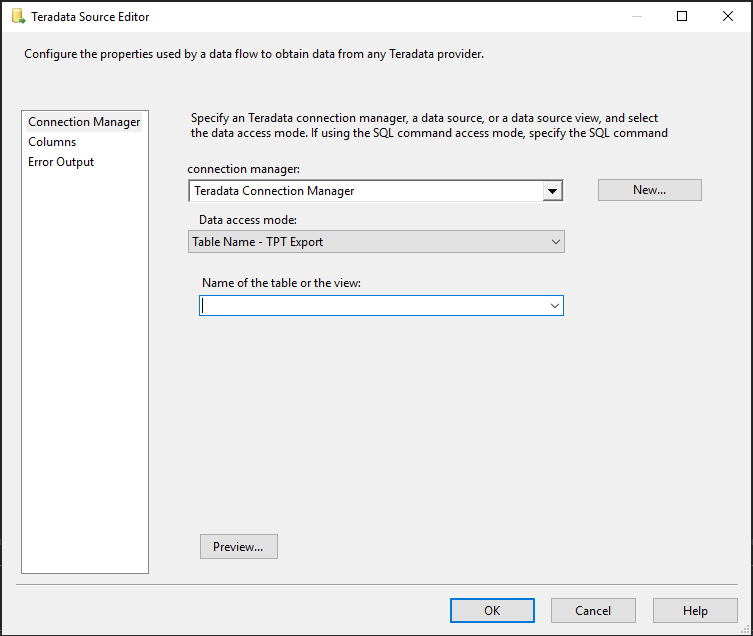

# Teradata source

[!INCLUDE[ssis-appliesto](../../includes/ssis-appliesto-ssvrpluslinux-asdb-asdw-xxx.md)]

The Teradata source extracts data from Teradata databases by using:

- a table or a view.
- The results of an SQL statement.

The source uses Teradata Connection Manager to connect to the Teradata source. For more information, see [Teradata Connection Manager](teradata-connection-manager.md).

## Troubleshoot the Teradata source

You can log the calls that the Teradata source makes to the Teradata Parallel Transporter API (TPT API). To do so, you enable package logging and select the **Diagnostic** event at the package level.

You can log the Open Database Connectivity (ODBC) calls that the Teradata source makes to the Teradata ODBC driver by enabling the ODBC driver manager trace. For more information, see the Microsoft documentation on *How To Generate an ODBC Trace with the ODBC Data Source Administrator*.

## Parallelism

The Teradata source supports parallelism, the idea that export jobs can access the same table or different tables at same time. A database variable called `MaxLoadTasks` sets the limit of the number of export jobs that can run at the same time. You can define this maximum number by using this `MaxLoadTasks` variable.

## Teradata source custom properties

The custom properties of the Teradata source listed in the following table. All properties are read/write.

|Property name|Data type|Description|
|:-|:-|:-|
|AccessMode|Integer (enumeration)|The mode used to access the database. The possible values are *Table Name* and *SQL Command*. The default value is *Table Name*.|
|BlockSize|Integer|The block size, in bytes, that's used when returning data to the client. The default value is 1048576 (1 MB). The minimum value is 256 bytes. The maximum value is 16775168 bytes.  This property is in the **Advanced Editor** pane.|
|BufferMaxSize|Integer|The total maximum size for the data buffer returned by the GetBuffer function. The total maximum size of the data buffer must be large enough to hold at least one row of data, including the row header, the actual row of data, and the buffer trailer. The default total maximum size of the data buffer is 16775552.  For more information, see Teradata documentation (Export Data from a Teradata Database using GetBuffer).|
|BufferMode|Boolean|Default value is *True*. The value must be *True* if the PutBuffer feature is used. This property is in the **Advanced Editor** pane.|
|DataEncryption|Boolean|Default value is *False*. Full security encryption is used if the value is *True*.|
|DefaultCodePage|Integer|The code page to use when the data source does not have code page information. This property is in the **Advanced Editor** pane.|
|DetailedTracingLevel|Integer (enumeration)|Select one of the following options for advanced tracing:   *Off*: No advanced logging.   *General*: Driver-specific activities general tracing is logged.   *CLI*: CLIv2-related activities tracing is logged.   *Notify Method*: Notify feature-related activities tracing is logged.   *Common Library*: Common library activities tracing is logged.   *All*: All the above activities tracing is logged.   The advanced tracing log file is defined in the `DetailedTracingFile` property.   The `DetailedTracingFile` property must be set if the option is not *Off*. This property is in the **Advanced Editor** pane.|
|DetailedTracingFile|String|The path of the log file that is generated automatically when *DetailedTracingLevel* is not *Off*. This property is in the **Advanced Editor** pane.|
|DiscardLargeRow|Boolean|Default value is *False*. Discard large rows (greater than 64 KB) if the value is *True*.|
|ExtendedStringColumnsAllocation|Boolean|*Maximal Transfer Character Allocation Factor* is used if the value is *True*.   This value should be set to *True* if the Teradata database `Export Width Table ID` property is set to *Maximal Defaults*.   Default value is *False*.|
|JobMaxRowSize|Integer|Maximum row size can be supported. This value is needed if `DiscardLargeRow` value is *True*. Valid values:  64 (default value): 2-byte row lengths can be supported.  1024: 4-byte row lengths can be supported.|
|MaxSessions|Integer|The maximum number of sessions that are logged on. This value must be greater than one. The default value is one session for each available AMP.|
|MinSessions|Integer|The minimum number of sessions that are logged on. This value must be greater than one. The default value is one session for each available AMP.|
|QueryBandSessInfo|Varchar|A user-defined, session-based query band expression in a connection-string format. Charge-back monitoring and governance with this property. This property is in the **Advanced Editor** pane.|
|SpoolMode|Varchar|Valid values are:  *Spool*: Default value. Use *Spool*.   *NoSpool*: Do not use *Spool*. This value is valid only if the DBS supports *NoSpool*.    *NoSpoolOnly*:  Do not use *Spool* in any case. The job will be terminated with an error if the DBS does not support *NoSpool*.|
|SqlCommand|String|The SQL command to be executed when AccessMode is set to *SQL Command*.|
|TableName|String|The name of the table with the data to be used when AccessMode is set to *Table Name*.|
|TenacityHours|Integer|The number of hours the TPT driver attempts to log in when the maximum number of load/export operations are already running. The default value is *4 hours*. This property is in the **Advanced Editor** pane.|
|TenacitySleep|Integer|The number of minutes the TPT driver pauses before attempting to log in when the limit is reached. The limit is defined by the `MaxSessions` and `TenacityHours` properties. Default value is 6 minutes. This property is in the **Advanced Editor** pane.|
|UnicodePassThrough|Boolean|*Off* (default value): Disable Unicode pass-through.  *On*: Enable Unicode pass-through.|

## Configure the Teradata source

You can configure the Teradata source programmatically or by using SSIS Designer.

Teradata Source Editor is shown in the following image. For more information, go to each of the following Teradata Source Editor sections:

- [The Connection Manager pane](#the-connection-manager-pane)
- [The Columns pane](#the-columns-pane)
- [The Error Output pane](#the-error-output-pane)

The **Advanced Editor** pane contains properties that can be set programmatically. To open the pane:
- On the **Data Flow** page of your Integration Services project, right-click the Oracle source, and then select **Show Advanced Editor**.

For more information about the properties that you can set in the **Advanced Editor** pane, see [Teradata source custom properties](#teradata-source-custom-properties).

## The Connection Manager pane

Use the **Connection Manager** pane to select the Teradata Connection Manager instance for the source. In this pane, you can also select a table or a view from the database. To open the pane:

1. In SQL Server Data Tools, open the SQL Server Integration Services (SSIS) package that has the Teradata source.

1. On the **Data Flow** tab, double-click the Teradata source.

1. In Teradata Source Editor, select the **Connection Manager** tab.

### Options

**Connection manager**

* Select an existing connection manager from the list, or select **New** to create a new Teradata connection manager instance.

**New**

* Select **New**. The **Teradata Connection Manager Editor** pane opens. From this pane, you can create a new connection manager.

**Data Access Mode**

* Choose a method for selecting data from the source. The options are shown in the following table:

    |Option|Description|
    |:-|:-|
    |Table name - TPT Export|Retrieve data from a table or a view in the Teradata data source. When this option is selected, select an available table or view from the list for **Name of the table or the view**.|
    |SQL command - TPT Export|Retrieve data from the Teradata data source by using an SQL query. When this option is selected, enter a query in one of the following ways: <ul><li>Enter the text of the SQL query in the **SQL command text** field.</li><li>Select **Browse** to load the SQL query from a text file.</li><li>Select **Parse query** to verify the syntax of the query text.</li></ul>|

**Preview**

* Select **Preview** to view up to the first 200 rows of the data extracted from the table or view you selected.

## The Columns pane

Use the **Columns** pane to map an output column to each external (source) column. To open the pane:

1. In SQL Server Data Tools, open the SQL Server Integration Services (SSIS) package that has the Teradata source.

1. On the **Data Flow** tab, double-click the Teradata source.

1. In Teradata Source Editor, select the **Columns** tab.

### Options

**Available External Columns**

A list of available external columns that you can select to add to the **External Column** list in the order you choose. You can't use this table to add or delete columns.

* To choose all the columns, select the **Select All** check box.

**External Columns**

The external (source) columns that you selected are listed in order. To change the order, first clear the **Available External Column** list, and then select the columns in a different order.

**Output Column**

Although the name of the selected external (source) column is the default output name, you can enter any unique name.

>[!NOTE]
>>If there are columns that contain unsupported data types, you'll receive a warning that displays those unsupported data types, and the relevant columns will be removed from the mapping columns.

## The Error Output pane

Use the **Error Output** pane to select error-handling options. To open the pane:

1. In SQL Server Data Tools, open the SQL Server Integration Services (SSIS) package that has the Teradata source.

1. On the **Data Flow** tab, double-click the Teradata source.

1. In Teradata Source Editor, select the **Error Output** tab.

### Options

**Error behavior**

* Select how the Teradata source should handle errors in a flow: 
  * Ignore the failure
  * Redirect the row
  * Fail the component

**Related topics**: See [Error handling in data](error-handling-in-data.md).

**Truncation**

* Select how the Teradata source should handle truncation in a flow: 
  * Ignore the failure
  * Redirect the row
  * Fail the component

## Next steps

- Configure the [Teradata destination](teradata-destination.md).
- If you have questions, visit the [Tech Community](https://aka.ms/AA6iwdw).
