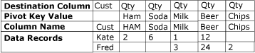

# Unpivot Transformation

[!INCLUDE[sqlserver-ssis](../../../includes/applies-to-version/sqlserver-ssis.md)]

  The Unpivot transformation makes an unnormalized dataset into a more normalized version by expanding values from multiple columns in a single record into multiple records with the same values in a single column. For example, a dataset that lists customer names has one row for each customer, with the products and the quantity purchased shown in columns in the row. After the Unpivot transformation normalizes the data set, the data set contains a different row for each product that the customer purchased.  
  
 The following diagram shows a data set before the data is unpivoted on the Product column.  
  
   
  
 The following diagram shows a data set after it has been unpivoted on the Product column.  
  
   
  
 Under some circumstances, the unpivot results may contain rows with unexpected values. For example, if the sample data to unpivot shown in the diagram had null values in all the Qty columns for Fred, then the output would include only one row for Fred, not five. The Qty column would contain either null or zero, depending on the column data type.  
  
## Configuration of the Unpivot Transformation  
 The Unpivot transformation includes the **PivotKeyValue** custom property. This property can be updated by a property expression when the package is loaded. For more information, see [Integration Services &#40;SSIS&#41; Expressions](../../../integration-services/expressions/integration-services-ssis-expressions.md), [Use Property Expressions in Packages](../../../integration-services/expressions/use-property-expressions-in-packages.md), and [Transformation Custom Properties](../../../integration-services/data-flow/transformations/transformation-custom-properties.md).  
  
 This transformation has one input and one output. It has no error output.  
  
 You can set properties through [!INCLUDE[ssIS](../../../includes/ssis-md.md)] Designer or programmatically.  
  
 For more information about the properties that you can set in the **Advanced Editor** dialog box or programmatically, click one of the following topics:  
  
-   [Common Properties](../set-the-properties-of-a-data-flow-component.md)  
  
-   [Transformation Custom Properties](../../../integration-services/data-flow/transformations/transformation-custom-properties.md)  
  
 For more information about how to set the properties, see [Set the Properties of a Data Flow Component](../../../integration-services/data-flow/set-the-properties-of-a-data-flow-component.md).  
  
## Unpivot Transformation Editor
  Use the **Unpivot Transformation Editor** dialog box to select the columns to pivot into rows, and to specify the data column and the new pivot value output column.  
  
> [!NOTE]  
>  This topic relies on the Unpivot scenario described in [Unpivot Transformation](../../../integration-services/data-flow/transformations/unpivot-transformation.md) to illustrate the use of the options.  
  
### Options  
 **Available Input Columns**  
 Using the check boxes, specify the columns to pivot into rows.  
  
 **Name**  
 View the name of the available input column.  
  
 **Pass Through**  
 Indicate whether to include the column in the unpivoted output.  
  
 **Input Column**  
 Select from the list of available input columns for each row. Your selections are reflected in the check box selections in the **Available Input Columns** table.  
  
 In the Unpivot scenario described in [Unpivot Transformation](../../../integration-services/data-flow/transformations/unpivot-transformation.md), the Input Columns are the **Ham**, **Soda**, **Milk**, **Beer**, and **Chips** columns.  
  
 **Destination Column**  
 Provide a name for the data column.  
  
 In the Unpivot scenario described in [Unpivot Transformation](../../../integration-services/data-flow/transformations/unpivot-transformation.md), the Destination Column is the quantity (**Qty**) column.  
  
 **Pivot Key Value**  
 Provide a name for the pivot value. The default is the name of the input column; however, you can choose any unique, descriptive name.  
  
 The value of this property can be specified by using a property expression.  
  
 In the Unpivot scenario described in [Unpivot Transformation](../../../integration-services/data-flow/transformations/unpivot-transformation.md), the Pivot Values will appear in the new Product column designated by the **Pivot Key Value Column Name** option, as the text values **Ham**, **Soda**, **Milk**, **Beer**, and **Chips**.  
  
 **Pivot Key Value Column Name**  
 Provide a name for the pivot value column. The default is "Pivot Key Value"; however, you can choose any unique, descriptive name.  
  
 In the Unpivot scenario described in [Unpivot Transformation](../../../integration-services/data-flow/transformations/unpivot-transformation.md), the Pivot Key Value Column Name is **Product** and designates the new **Product** column into which the **Ham**, **Soda**, **Milk**, **Beer**, and **Chips** columns are unpivoted.  
  
## See Also  
 [Integration Services Error and Message Reference](../../../integration-services/integration-services-error-and-message-reference.md)   
 [Pivot Transformation](../../../integration-services/data-flow/transformations/pivot-transformation.md)  
  
