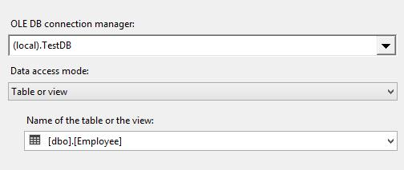
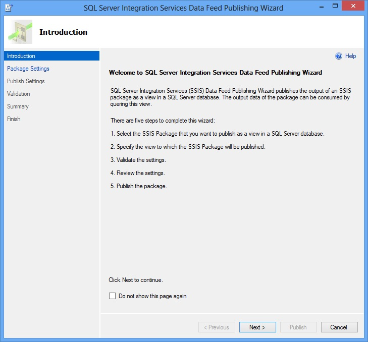
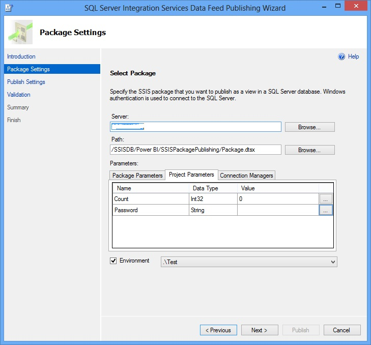
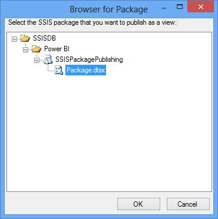
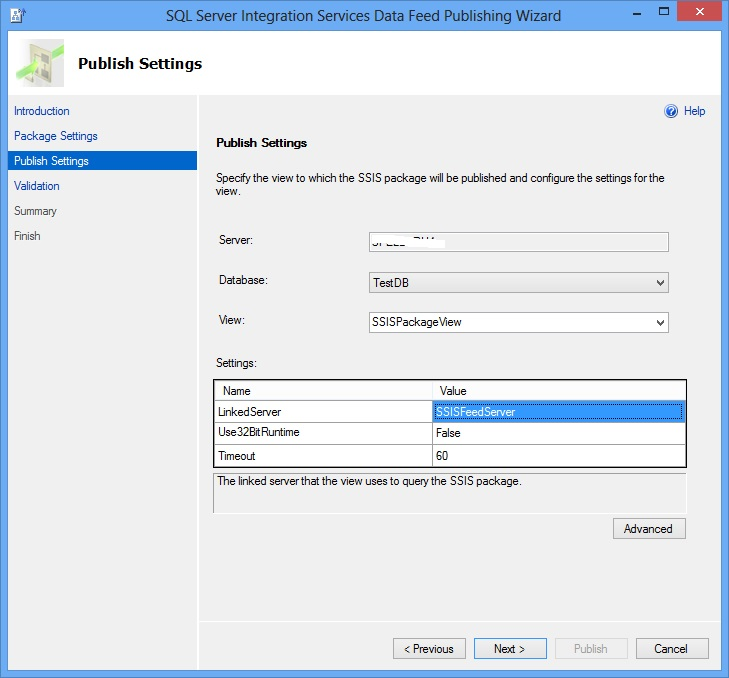
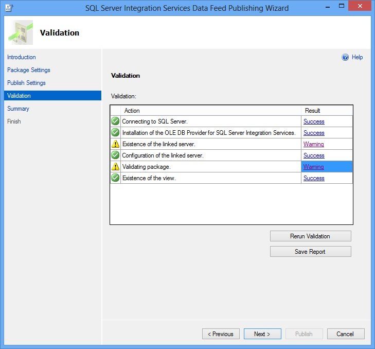
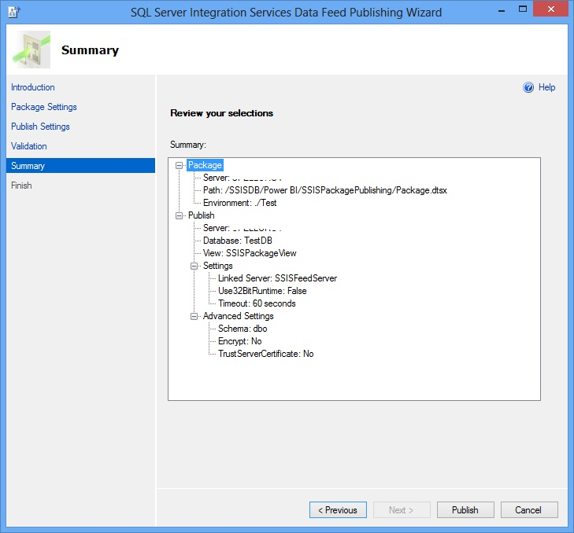

# Walkthrough: Publish an SSIS Package as a SQL View
  This walkthrough provides detailed steps to publish an SSIS package as a SQL view in a [!INCLUDE[ssNoVersion](../../includes/ssnoversion-md.md)] database.  
  
## Prerequisites  
 You must have the following software installed on your computer to perform this walkthrough.  
  
1.  [!INCLUDE[ssCurrent](../../includes/sscurrent-md.md)] or later with [!INCLUDE[ssNoVersion](../../includes/ssnoversion-md.md)] [!INCLUDE[ssISnoversion](../../includes/ssisnoversion-md.md)].  
  
2.  [SQL Server Data Tools](../../ssdt/download-sql-server-data-tools-ssdt.md).  
  
## Step 1: Build and Deploy SSIS Project to the SSIS Catalog  
 In this step, you create an SSIS package that extracts data from an SSIS supported data source - in this example, we use a [!INCLUDE[ssNoVersion](../../includes/ssnoversion-md.md)] database - and outputs the data using a Data Streaming Destination component. Then you build and deploy the SSIS project to the SSIS catalog.  
  
1.  Launch **SQL Server Data Tools**. On the **Start** menu, point to **All Programs**, point to **Microsoft SQL Server**, and click **SQL Server Data Tools**.  
  
2.  Create a new [!INCLUDE[ssISnoversion](../../includes/ssisnoversion-md.md)] project.  
  
    1.  Click **File** on the menu bar, point to **New**, and click **Project**.  
  
    2.  Expand **Business Intelligence** in the left pane and click **Integration Services** in the tree view.  
  
    3.  Select **Integration Services Project** if it is not already selected.  
  
    4.  Specify **SSISPackagePublishing** for the **project name**.  
  
    5.  Specify a location for the project.  
  
    6.  Click **OK** to close the **New Project** dialog box.  
  
3.  Drag the **Data Flow** component from **SSIS Toolbox** to the design surface of the **Control Flow** tab.  
  
4.  Double-click **Data Flow** component in the **Control Flow** to open **Data Flow Designer**.  
  
5.  Drag a **source component** from the toolbox to the **Data Flow Designer** and configure it to extract data from a data source.  
  
    1.  For the purpose of the walkthrough, create a test database: **TestDB** with a table: **Employee**. Create the table with three columns, **ID**, **FirstName** and **LastName**.  
  
    2.  Set **ID** as a primary key.  
  
    3.  Insert two records with the following data.  
  
        |ID|FIRSTNAME|LASTNAME|  
        |--------|---------------|--------------|  
        |1|John|Doe|  
        |2|Jane|Doe|  
  
    4.  Drag the **OLE DB Source** component from the **SSIS Toolbox** on to the **Data Flow Designer**.  
  
    5.  Configure the component to extract data from the **Employee** table in the **TestDB** database. Select **(local).TestDB** for **OLE DB connection manager**, **Table or view** for **Data access mode**, and **[dbo].[Employee]** for **Name of the table or the view**.  
  
           
  
6.  Now, drag the **Data Streaming Destination** from the toolbox to the data flow. You should find this component in the Common section of the toolbox.  
  
7.  Connect the **OLE DB Source** component in the data flow to the **Data Streaming Destination** component.  
  
8.  Build and deploy the SSIS project to SSIS Catalog.  
  
    1.  Click **Project** on the menu bar and click **Deploy**.  
  
    2.  Follow the instructions on the wizard to deploy the project to the SSIS Catalog in the local database server. The following example uses **Power BI** as the folder name and **SSISPackagePublishing** as the project name in the SSIS catalog.  
  
## Step 2: Use the SSIS Data Feed Publishing Wizard to Publish SSIS Package as a SQL View  
 In this step, you will use the SQL Server Integration Services (SSIS) Data Feed Publishing Wizard to publish the SSIS package as a view in a SQL Server database. The output data of the package can be consumed by querying this view.  
  
 The SSIS Data Feed Publishing Wizard creates a linked server using the OLE DB Provider for SSIS (SSISOLEDB) and then creates a SQL view that consists of a query on the linked server. This query includes folder name, project name, and package name in the SSIS catalog.  
  
 At runtime, the view sends the query to the OLE DB Provider for SSIS via the linked server you created. The OLE DB Provider for SSIS executes the package you specified in the query and returns the tabular result set to the query.  
  
1.  Launch **SSIS Data Feed Publishing Wizard** by running ISDataFeedPublishingWizard.exe from C:\Program Files\Microsoft SQL Server\130\DTS\Binn or by clicking Microsoft SQL Server 2016\SQL Server 2016 Data Feed Publishing Wizard under Start\All Programs.  
  
2.  Click **Next** on the **Introduction** page.  
  
       
  
3.  On the **Package Settings** page, perform the following tasks:  
  
    1.  Type the **name** of the SQL Server instance that contains the SSIS catalog or click **Browse** to select the server.  
  
           
  
    2.  Click **Browse** next to Path field, browse the SSIS catalog, select the SSIS package you want to publish (for example: **SSISDB**->**SSISPackagePublishing**->**Package.dtsx**), and click **OK**.  
  
           
  
    3.  Using the Package Parameters, Project Parameters, and Connection Managers tabs at the bottom of the page, enter values for any package parameters, project parameters, or connection manager settings for the package. You can also indicate an environment reference to be used for the package execution and bind project/package parameters to environment variables.  
  
         We recommend that you bind sensitive parameters to environment variables. This is to ensure that the value of a sensitive parameter is not stored in the plain text format in the SQL view created by the wizard.  
  
    4.  Click **Next** to switch the **Publish Settings** page.  
  
4.  On the **Publish Settings** page, perform the following tasks:  
  
    1.  Select the **database** for the view to be created.  
  
           
  
    2.  Type a **name** for the **view**. You can also select an existing view from the drop-down list.  
  
    3.  In the **Settings** list, specify a **name** of the **linked server** to be associated with the view. If linked server does not already exist, the wizard will create the linked server before creating the view. You can also set values for **User32BitRuntime** and **Timeout** values here.  
  
    4.  Click the **Advanced** button. You should see the **Advanced Settings** dialog box.  
  
    5.  On the **Advanced Settings** dialog box, do the following:  
  
        1.  Specify the database schema in which you want the view to be created (Schema field).  
  
        2.  Specify whether data should be encrypted before sending it over the network (Encrypt field). See [Using Encryption Without Validation](../../relational-databases/native-client/features/using-encryption-without-validation.md) topic for more details about this setting and the TrustServerCertificate setting.  
  
        3.  Specify whether a self-signed server certificate can be used when the encryption setting is enabled (**TrustServerCertificate** field).  
  
        4.  Click **OK** to close the **Advanced Settings** dialog box.  
  
    6.  Click **Next** to switch to the **Validation** page.  
  
5.  On the **Validation** page, review the results from the validating the values for all the settings. In the following example, you see a **warning** on the existence of linked server because the linked server does not exist on the selected SQL Server instance. If you see **Error** for **Result**, hover the mouse over **Error** and you will see the details about the error. For example, if you had not enabled the Allow inprocess option for the SSISOLEDB provider, you will get an error on the Configuration of Linked Server action.  
  
       
  
6.  To save this report as an XML file, click Save Report.  
  
7.  Click **Next** on the **Validation** page to switch to the **Summary** page.  
  
8.  Review your selection in the **Summary** page and click **Publish** to start the publishing process, which will create the linked server if it does not exist already on the server and then create the view using the linked server.  
  
       
  
     The output data of the package can now be queried by executing the following SQL statement against the TestDB database: SELECT * FROM [SSISPackageView].  
  
9. To save this report as an XML file, click **Save Report**.  
  
10. Review the results from the publishing process and click **Finish** to close the wizard.  
  
    > [!NOTE]  
    >  The following data types are not supported : text, ntext, image, nvarchar(max), varchar(max), and varbinary(max).  
  
## Step 3: Test the SQL view  
 In this, you will run the SQL view created by the SSIS Data Feed Publishing Wizard.  
  
1.  Launch SQL Server Management Studio.  
  
2.  Expand \<**machine name**>, **Databases**, \<**database you selected in the wizard**>, and **Views**.  
  
3.  Right-click the \<**view created by the wizard**> created by the wizard and click **Select top 1000 rows**.  
  
4.  Confirm that you see results from the SSIS package.  
  
## Step 4: Verify the SSIS Package Execution  
 In this step, you will verify that the SSIS package was executed.  
  
1.  In SQL Server Management Studio, expand **Integration Services Catalogs**, expand **SSISDB**, expand **folder** in which your SSIS project exists, expand **Projects**, expand your project node, and expand **Packages**.  
  
2.  Right-click on the SSIS package, and click point to **Reports**, point to **Standard Reports**, and click **All Executions**.  
  
3.  You should see the SSIS package execution in the report.  
  
    > [!NOTE]  
    >  On a Windows Vista Service Pack 2 computer, you may see two SSIS package executions in the report, a successful one and a failed one. Ignore the failed one as it is caused by a known issue in this release.  
  
## More info  
 The Data Feed Publish Wizard performs the following important steps:  
  
1.  Creates a linked server and configures it to use the OLE DB Provider for SSIS.  
  
2.  Creates a SQL view in the specified database, which queries the linked server with catalog information for the selected package.  
  
 This section has procedures for creating a linked server and a SQL view without using the Data Feed Publish Wizard. It also has additional information about using the OPENQUERY function with the OLE DB Provider for SSIS.  
  
### Create a Linked Server using the OLE DB Provider for SSIS  
 Create a linked server using the OLE DB Provider for SSIS (SSISOLEDB) by running the following query in SQL Server Management Studio.  
  
```sql 
  
USE [master]  
GO  
  
EXEC sp_addlinkedserver  
@server = N'SSISFeedServer',  
@srvproduct = N'Microsoft',  
@provider = N'SSISOLEDB',  
@datasrc = N'.'  
GO  
  
```  
  
### Create a View using Linked Server and SSIS Catalog Information  
 In this step, you will create a SQL view that runs a query on the linked server you created in the previous section. The query will include folder name, project name, and package name in the SSIS Catalog.  
  
 At runtime, when the view is executed, the linked server query that is defined in the view starts the SSIS package specified in the query and receives the package output as a tabular result set.  
  
1.  Before creating the view, type and run the following query in the new query window. OPENQUERY is a rowset function supported by SQL Server. It executes the specified pass-through query on the specified linked server using the OLE DB Provider associated with the linked server. OPENQUERY can be referenced in the FROM clause of a query as if it were a table name. See [OPENQUERY documentation on MSDN Library](../../t-sql/functions/openquery-transact-sql.md) for more information.  
  
    ```sql
    SELECT * FROM OPENQUERY(SSISFeedServer,N'Folder=Eldorado;Project=SSISPackagePublishing;Package=Package.dtsx')   
    GO  
    ```  
  
    > [!IMPORTANT]  
    >  Update folder name, project name, and package name if needed. If the OPENQUERY function fails, in the **SQL Server Management Studio**, expand **Server Objects**, expand **Linked Servers**, expand **Providers**, and double click **SSISOLEDB** provider, and ensure that the **Allow inprocess** option is enabled.  
  
2.  Create a view in the database **TestDB** for the purpose of this walkthrough) by running the following query.  
  
    ```sql
  
    USE [TestDB]   
    GO   
  
    CREATE VIEW SSISPackageView AS   
    SELECT * FROM OPENQUERY(SSISFeedServer, 'Folder=Eldorado;Project=SSISPackagePublishing;Package=Package.dtsx')   
    GO  
  
    ```  
  
3.  Test the view by running the following query.  
  
    ```sql
    SELECT * FROM SSISPackageView  
    ```  
  
### OPENQUERY Function  
 The syntax for OPENQUERY function is:  
  
```sql 
SELECT * FROM OPENQUERY(<LinkedServer Name>, N'Folder=<Folder Name from SSIS Catalog>; Project=<SSIS Project Name>; Package=<SSIS Package Name>; Use32BitRuntime=[True | False];Parameters="<parameter_name_1>=<value1>; parameter_name_2=<value2>";Timeout=<Number of Seconds>;')  
```  
  
 Folder, Project, and Package parameters are mandatory. Use32BitRuntime, Timeout and Parameters are optional.  
  
 The value of Use32BitRuntime can be 0, 1, true, or false. It indicates whether the package should run with 32-bit runtime (1 or true) when the platform of SQL Server is 64-bit.  
  
 Timeout indicates the number of seconds that the OLE DB provider for SSIS can wait before new data arrives from the SSIS package. By default, the timeout is 60 seconds. You can specify an integer value for the timeout between 20 and 32000.  
  
 Parameters contain the value of both package parameters and project parameters. The rules for parameters are same as parameters in [DTExec](https://msdn.microsoft.com/library/hh231187.aspx).  
  
 The following list specifies the special characters allowed in the query clause:  
  
-   Single Quote (') - This is supported by the standard OPENQUERY. If you want to use the single quote in the query clause, use two single quotes ('').  
  
-   Double-Quote (") - The parameters part of the query is enclosed in double-quotes. If a parameter value itself contains a double-quote, use the escape character. For example: \".  
  
-   Left and right square brackets ([ and ]) - These characters are used to indicate leading/rear spaces. For example, "[ some spaces ]" represents the string " some spaces " with one leading space and one trailing space. If these characters themselves are used in the query clause, they must be escaped. For example: \\[ and \\].  
  
-   Forward Slash (\\) - Every \ used in the query clause must use escape character. For example, \\\ is evaluated as \ in the query clause.  
  
 Forward Slash (\\) - Every \ used in the query clause must use escape character. For example, \\\ is evaluated as \ in the query clause.  
  
## See Also  
 [Data Streaming Destination](../../integration-services/data-flow/data-streaming-destination.md)   
 [Configure Data Streaming Destination](../../integration-services/data-flow/configure-data-streaming-destination.md)  
  
  
