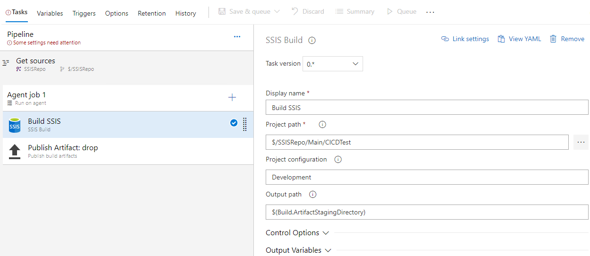
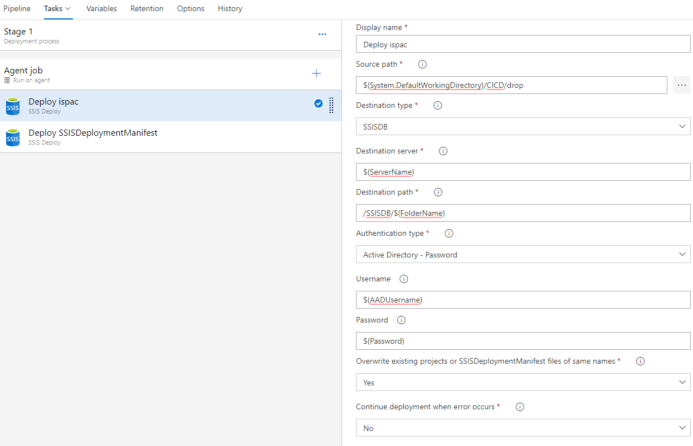
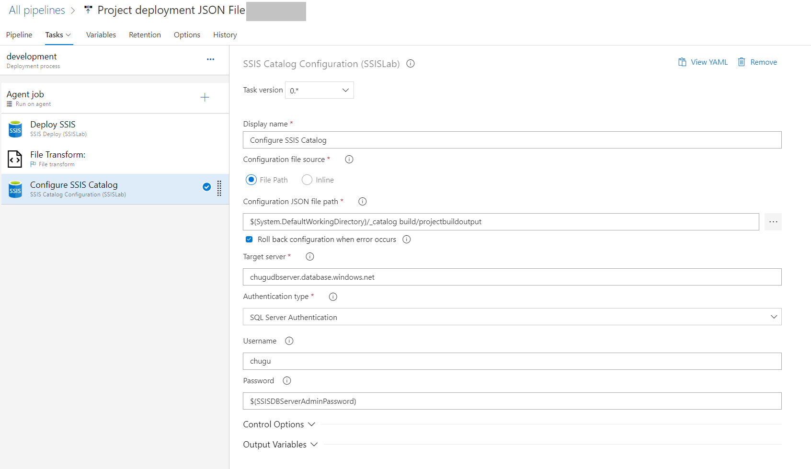
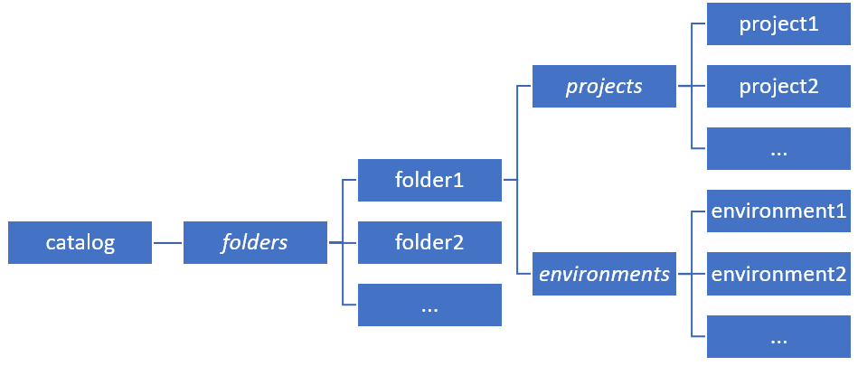

# SQL Server Integration Services (SSIS) DevOps Tools Azure DevOps extension

[SSIS DevOps Tools](https://marketplace.visualstudio.com/items?itemName=SSIS.ssis-devops-tools) extension is available in **Azure DevOps** Marketplace. SSIS DevOps supports **Azure DevOps Services**, **Azure DevOps Server 2019** and above.

If you do not have an **Azure DevOps** organization, firstly sign up for [Azure Pipelines](/azure/devops/pipelines/get-started/pipelines-sign-up?view=azure-devops&preserve-view=true), then add **SSIS DevOps Tools** extension following [the steps](/azure/devops/marketplace/overview?tabs=browser&view=azure-devops&preserve-view=true#add-an-extension).

**SSIS DevOps Tools** includes **SSIS Build** task, **SSIS Deploy** release task, and **SSIS Catalog Configuration task**.

- **[SSIS Build](#ssis-build-task)** task supports building dtproj files in project deployment model or package deployment model.

- **[SSIS Deploy](#ssis-deploy-task)** task supports deploying single or multiple ispac files to on-premises SSIS catalog and Azure-SSIS IR, or SSISDeploymentManifest files and their associated files to on-premises or Azure file share.

- **[SSIS Catalog Configuration](#ssis-catalog-configuration-task)** task supports configuring folder/project/environment of SSIS Catalog with a configuration file in JSON format. This task supports following scenarios:
    - Folder
        - Create folder.
        - Update folder description.
    - Project
        - Configure value of parameters, both literal value and referenced value are supported.
        - Add environment references.
    - Environment
        - Create environment.
        - Update environment description.
        - Create or update environment variable.

## SSIS Build task



### Properties

#### Project path

Path of the project folder or file to be built. If a folder path is specified, SSIS Build task will search all dtproj files recursively under this folder and build them all.

Project path cannot be *empty*, set as **.** to build from the root folder of the repository.

#### Project configuration

Name of the project configuration to be used for build. If not supplied, it defaults to the first defined project configuration in each dtproj file.

#### Output path

Path of a separate folder to save build results, which can be published as build artifact via [publish build artifacts task](/azure/devops/pipelines/tasks/utility/publish-build-artifacts?view=azure-devops&preserve-view=true).

### Limitations and known issues

- SSIS Build task relies on Visual Studio and SSIS designer, which is mandatory on build agents. Thus, to run SSIS Build task in the pipeline:
    - for Microsoft-hosted agents, you must choose an available image that includes Visual Studio and SQL Server Integration Services extension, for example, **windows-2019**. Details refer to [Microsoft-hosted agents documentation](/azure/devops/pipelines/agents/hosted) for softwares included in available images.
    - for self-hosted agents, install Visual Studio and SSIS designer (either VS2017 + SSDT2017, or VS2019 + SSIS Projects extension) on self-hosted agents.

- To build SSIS projects using any out-of-box components (including SSIS Azure feature pack, and other third-party components), those out-of-box components must be installed on the machine where the pipeline agent is running.  For Microsoft-hosted agent, user can add a [PowerShell Script task](/azure/devops/pipelines/tasks/utility/powershell?view=azure-devops&preserve-view=true) or [Command Line Script task](/azure/devops/pipelines/tasks/utility/command-line?view=azure-devops&preserve-view=true) to download and install the components before SSIS Build task  is executed. Below is the sample PowerShell script to install Azure Feature Pack: 

```powershell
wget -Uri https://download.microsoft.com/download/E/E/0/EE0CB6A0-4105-466D-A7CA-5E39FA9AB128/SsisAzureFeaturePack_2017_x86.msi -OutFile AFP.msi

start -Wait -FilePath msiexec -Args "/i AFP.msi /quiet /l* log.txt"

cat log.txt
```

- Protection level **EncryptSensitiveWithPassword** and **EncryptAllWithPassword** are not supported in SSIS Build task. Make sure all SSIS projects in codebase are not using these two protection levels, or SSIS Build task will stop responding and time out during execution.

## SSIS Build task version 1.* 

Enhancements in version 1.*:

- Remove the dependency on Visual Studio and SSIS designer. Build task can run on Microsoft-hosted agent or self-hosted agent with Windows OS and .NET framework 4.6.2 or higher.

- No need of installing out-of-box components.

- Support protection level EncryptionWithPassword and EncryptionAllWithPassword.

### Version 1.* only properties

#### Project Password

Password of the SSIS project and its packages. This argument is only valid when the protection level of the SSIS project and packages is EncryptSensitiveWithPassword or EncryptAllWithPassword. For package deployment model, all packages must share the same password specified by this argument.

#### Strip Sensitive Data

Convert the protection level of the SSIS project to DontSaveSensitve if this value is true. When protection level is EncryptSensitiveWithPassword or EncryptAllWithPassword, the argument Project Password must be correctly set. This option is only valid for project deployment model.

## SSIS Deploy task



### Properties

#### Source path

Path of source ISPAC or SSISDeploymentManifest files you want to deploy. This path could be a folder path or a file path.

#### Destination type

Type of the destination. Currently SSIS Deploy task supports two types:

- *File System*: Deploy SSISDeploymentManifest files and their associated files to a specified file system. Both on-premises and Azure file share are supported.
- *SSISDB*: Deploy ISPAC files to a specified SSIS catalog, which can be hosted on on-premises SQL Server or Azure-SSIS Integration Runtime.

#### Destination server

Name of destination SQL server. It can be the name of an on-premises SQL Server, Azure SQL Database, or Azure SQL Managed Instance. This property is only visible when destination type is SSISDB.

#### Destination path

Path of the destination folder where the source file will be deployed to. For example:

- /SSISDB/\<folderName\>
- \\\\\<machineName\>\\\<shareFolderName\>\\\<optionalSubfolderName\>

SSIS Deploy task will create the folder and subfolder if they don't exist.

#### Authentication type

Authentication type to access the specified destination server. This property is only visible when Destination type is SSISDB. In general below authentication types are supported:

- Windows Authentication
- SQL Server Authentication
- Active Directory - Password
- Active Directory - Integrated

But whether a specific authentication type is supported depends on destination server type and agent type. Detail support matrix is listed in below table.

|Destination server type|Microsoft-hosted agent|Self-hosted agent|
|---------|---------|---------|
|SQL server on-premises or VM |N/A|Windows Authentication|
|Azure SQL|SQL Server Authentication <br> Active Directory - Password|SQL Server Authentication <br> Active Directory - Password <br> Active Directory - Integrated|

#### Domain name

Domain name to access the specified file system. This property is only visible when Destination type is File System.
You can leave it empty when the user account to run the self-hosted agent has been granted read/write access to the specified destination path.

#### Username

Username to access the specified file system or SSISDB. This property is visible when Destination type is File System or Authentication type is SQL Server Authentication or Active Directory - Password.
You can leave it empty when the destination type is file system, and the user account to run the self-hosted agent has been granted read/write access to the specified destination path.

#### Password

Password to access the specified file system or SSISDB. This property is visible when destination type is file system or authentication type is SQL Server authentication or Active Directory - password.
You can leave it empty when destination type is file system, and the user account to run the self-hosted agent has been granted read/write access to the specified destination path.

#### Overwrite existing projects or SSISDeploymentManifest files of the same names

Specify whether overwrite the existing projects or SSISDeploymentManifest files of the same names. If 'No', SSIS Deploy task will skip deploying those projects or files.

#### Continue deployment when error occurs

Specify whether to continue deployment for remaining projects or files when an error occurs. If 'No', SSIS Deploy task will stop immediately when error occurs.

### Limitations and known issues

SSIS Deploy task currently doesn't support the following scenarios:

- Configuring the environment in the SSIS catalog.
- Deploying ISPAC to Azure SQL Server or Azure SQL Managed Instance, which allow only multifactor authentication.
- Deploying packages to MSDB or SSIS Package Store.
- If you install the SSIS DevOps Tools extension in Azure DevOps Server, you might see the message "The extension package size exceeds the maximum package size." To resolve the issue, complete the following steps: 
  1. Connect to the on-premises SQL Server instance and select the database **Gallery_Configuration**.
  1. Run the query `INSERT INTO dbo.tbl_RegistryItems VALUES (1,'#\Configuration\Service\Gallery\LargeExtensionUpload\SSIS\','MaxPackageSizeMB\',50)`. Change `50` to a higher number if the extension is larger than 50 MBs.
  1. After you run the query, restart Internet Information Services. Try again to upload the extension.
  1. If the error persists, please contact the SQL Server support team. 


## SSIS Deploy task version 1.* 

Enhancements in version 1.*:

- Support protection level EncryptionWithPassword and EncryptionAllWithPassword.

### Version 1.* only properties

#### Project Password

Password to decrypt the ISPAC or DTSX files. This argument is only valid when the protection level is EncryptSensitiveWithPassword or EncryptAllWithPassword.

## SSIS Catalog Configuration task



### Properties

#### Configuration file source

Source of the SSIS catalog configuration JSON file. It can be "File path" or "Inline".

Refer to details on how to [define configuration JSON](#define-configuration-json):

- Refer to [a sample inline configuration JSON](#a-sample-inline-configuration-json).
- Check [JSON schema](#json-schema).

#### Configuration JSON file path

Path of the SSIS catalog configuration JSON file. This property is only visible when selecting "File path" as configuration file source.

To use [pipeline variables](/azure/devops/pipelines/process/variables) in configuration JSON file, you need to add a [File Transform task](/azure/devops/pipelines/tasks/utility/file-transform?view=azure-devops&preserve-view=true) before this task to substitute configuration values with pipeline variables. For more information, see [JSON variable substitution](/azure/devops/pipelines/tasks/transforms-variable-substitution?tabs=Classic&view=azure-devops&preserve-view=true#json-variable-substitution).

#### Inline configuration JSON

Inline JSON of the SSIS catalog configuration. This property is only visible when selecting "Inline" as configuration file source. Pipeline variables can be directly used.

#### Roll back configuration when error occurs

Whether to roll back the configuration made by this task when error occurs.

#### Target server

Name of target SQL server. It can be the name of an on-premises SQL Server, Azure SQL Database, or Azure SQL Managed Instance.

#### Authentication type

Authentication type to access the specified target server. In general below authentication types are supported:

- Windows Authentication
- SQL Server Authentication
- Active Directory - Password
- Active Directory - Integrated

But whether a specific authentication type is supported depends on destination server type and agent type. Detail support matrix is listed in below table.

|Destination server type|Microsoft-hosted agent|Self-hosted agent|
|---------|---------|---------|
|SQL server on-premises or VM |N/A|Windows Authentication|
|Azure SQL|SQL Server Authentication <br> Active Directory - Password|SQL Server Authentication <br> Active Directory - Password <br> Active Directory - Integrated|

#### Username

Username to access the target SQL Server. This property is only visible when Authentication type is SQL Server Authentication or Active Directory - Password.

#### Password

Password to access the target SQL Server. This property is only visible when Authentication type is SQL Server Authentication or Active Directory - Password.

### Define configuration JSON

The configuration JSON schema has three layers:

- catalog
- folder
- project and environment



#### A sample inline configuration JSON

```json
{
  "folders": [
    {
      "name": "devopsdemo",
      "description": "devops demo folder",
      "projects": [
        {
          "name": "catalog devops",
          "parameters": [
            {
              "name": "password",
              "container": "Package.dtsx",
              "value": "passwd",
              "valueType": "referenced"
            },
            {
              "name": "serverName",
              "container": "catalog devops",
              "value": "localhost",
              "valueType": "literal"
            }
          ],
          "references": [
            {
              "environmentName": "test",
              "environmentFolder": "devopsdemo"
            },
            {
              "environmentName": "test",
              "environmentFolder": "."
            }
          ]
        }
      ],
      "environments": [
        {
          "name": "test",
          "description": "test",
          "variables": [
            {
              "name": "passwd",
              "type": "string",
              "description": "",
              "value": "$(SSISDBServerAdminPassword)",
              "sensitive": true
            },
            {
              "name": "serverName",
              "type": "string",
              "description": "",
              "value": "$(TargetServerName)",
              "sensitive": false
            }
          ]
        }
      ]
    }
  ]
}
```

#### JSON schema

##### Catalog Attributes

|Property  |Description  |Notes  |
|---------|---------|---------|
|folders  |An array of folder objects. Each object contains configuration information for a catalog folder.|See *Folder Attributes* for the schema of a folder object.|

##### Folder Attributes

|Property  |Description  |Notes  |
|---------|---------|---------|
|name  |Name of the catalog folder.|Folder will be created if not exists.|
|description|Description of the catalog folder.|The value of *null* will be skipped.|
|projects|An array of project objects. Each object contains configuration information for a project.|See *Project Attributes* for the schema of a project object.|
|environments|An array of environment objects. Each object contains configuration information for an environment.|See *Environment Attributes* for the schema of an environment object.|

##### Project Attributes

|Property  |Description  |Notes  |
|---------|---------|---------|
|name|Name of the project. |Project object will be skipped if project does not exist in the parent folder.|
|parameters|An array of parameter objects. Each object contains configuration information for a parameter.|See *Parameter Attributes* the schema of a parameter object.|
|references|An array of reference objects. Each object represents an environment reference to the target project.|See *Reference Attributes* for the schema of a reference object.|

##### Parameter Attributes

|Property  |Description  |Notes  |
|---------|---------|---------|
|name|Name of the parameter.|<li>The parameter can be a project parameter or a package parameter. <li>The parameter is skipped if it doesn't exist. <li>If the parameter is a connection manager property, the name should be in the format **CM.\<Connection Manager Name>.\<Property Name>**. |
|container|Container of the parameter.|<li>If the parameter is a project parameter, the *container* should be the project name. <li>If it's a package parameter, the *container* should be the package name with **.dtsx** extension.|
|value|Value of the parameter.|<li>When *valueType* is *referenced*: The value is a reference to an environment variable in  *string* type. <li> When *valueType* is *literal*: This attribute supports any valid *boolean*, *number*, and *string* JSON values. <li> The value will be converted to the target parameter type. Error will occur if it cannot be converted.<li> The value of *null* is invalid. The task will skip this parameter object, and give a warning.|
|valueType|Type of the parameter value.|Valid types are: <br> *literal*: The *value* attribute represents a literal value. <br> *referenced*: The *value* attribute represents a reference to an environment variable.|

##### Reference Attributes

|Property  |Description  |Notes  |
|---------|---------|---------|
|environmentFolder|Folder name of the environment.|Folder will be created if not exists. <br> Value can be ".", which  represents parent folder of the project, which references the environment.|
|environmentName|Name of the referenced environment.|The specified environment will be created if not exists.|

##### Environment Attributes

|Property  |Description  |Notes  |
|---------|---------|---------|
|name|Name of the environment.|Environment will be created if not exists.|
|description|Description of the environment.|The value of *null* will be skipped.|
|variables|An array of variable objects.|Each object contains configuration information for an environment variable.see *Variable Attributes* for the schema of a variable object.|

##### Variable Attributes

|Property  |Description  |Notes  |
|---------|---------|---------|
|name|Name of the environment variable.|Environment variable will be created if not exists.|
|type|Data type of the environment variable.|Valid types are: <br> *boolean* <br> *byte* <br> *datetime* <br> decimal <br> *double* <br> *int16* <br> *int32* <br> *int64* <br> *sbyte* <br> *single* <br> *string* <br> *uint32* <br> *uint64*|
|description|Description of the environment variable.|The value of *null* will be skipped.|
|value|Value of the environment variable.|This attribute supports any valid boolean, number, and string JSON values.<br> The value will be converted to the type specified by **type** attribute. Error will occur if conversion fails.<br>The value of *null* is invalid. The task will skip this environment variable object, and give a warning.|
|sensitive|Whether the value of the environment variable is sensitive.|Valid inputs are: <br> *true* <br> *false*|

## Release notes

### Version 1.0.6

Release Date: September 1, 2021

- General Availability(GA) release.
    
### Version 1.0.5

Release Date: June 2, 2021

- Fixed an issue that sometimes SSIS Build Task of version 1.\* failed to build projects/packages with protection level EncryptSensitiveWithPassword or EncryptAllWithPassword with the error "Specified initialization vector (IV) does not match the block size for this algorithm."
- Removed the JSON content in the log of the SSIS Catalog Configuration task when "Configuration file source" is "File Path".

### Version 1.0.4

Release Date: April 21, 2021

- SSIS Build task version 1.* (Preview)
    - Remove the dependency on Visual Studio and SSIS designer. Build task can run on Microsoft-hosted agent or self-hosted agent with Windows OS and .NET framework 4.6.2 or higher.
    - No need of installing out-of-box components.
    - Support protection level EncryptionWithPassword and EncryptionAllWithPassword.
- SSIS Deploy task version 1.* (Preview)
    - Support protection level EncryptionWithPassword and EncryptionAllWithPassword.

### Version 1.0.3

Release Date: October 21, 2020

- Allow specifying connection string suffix for SSIS Deploy task and SSIS Catalog Configuration task.

### Version 1.0.2

Release Date: May 26, 2020

- Fixed an issue that SSIS Catalog Configuration task may fail in some case after configuration work is done.

### Version 1.0.1

Release Date: May 9, 2020

- Fixed an issue that SSIS Build task always build the whole solution even if only single dtproj file is specified as project path.

### Version 1.0.0

Release Date: May 8, 2020

- General Availability (GA) release.
- Added a restriction of minimum .NET framework version on agent. Currently the minimum .NET framework version is 4.6.2.
- Refined description of SSIS Build task and SSIS Deploy task.

### Version 0.2.0 Preview

Release Date: March 31, 2020

- Add SSIS Catalog Configuration task.

### Version 0.1.3 Preview

Release Date: January 19, 2020

- Fixed an issue that prevented ispac from being deployed if its original file name was changed.

### Version 0.1.2 Preview

Release Date: January 13, 2020

- Added more detailed exception information in the SSIS Deploy task log when the destination type is SSISDB.
- Fixed the example destination path in the help text of the property Destination path of SSIS Deploy task.

### Version 0.1.1 Preview

Release Date: January 6, 2020

- Added a restriction of minimal agent version requirement. Currently the minimal agent version of this product is 2.144.0.
- Fixed some incorrect display text for SSIS Deploy task.
- Refined some error messages.

### Version 0.1.0 Preview

Release Date: December 5, 2019

Initial release of SSIS DevOps Tools. This is a preview release.

## Next steps

- Get [SSIS DevOps extension](https://marketplace.visualstudio.com/items?itemName=SSIS.ssis-devops-tools)
