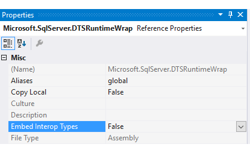

# Support multi-targeting in your custom components

[!INCLUDE[ssis-appliesto](../../includes/ssis-appliesto-ssvrpluslinux-asdb-asdw-xxx.md)]


 You can now use SSIS Designer in SQL Server Data Tools (SSDT) to create, maintain, and run packages that target SQL Server 2016, SQL Server 2014, or SQL Server 2012. To get SSDT for Visual Studio 2015, see [Download Latest SQL Server Data Tools](../../ssdt/download-sql-server-data-tools-ssdt.md). 

 In Solution Explorer, right-click on an Integration Services project and select **Properties** to open the property pages for the project. On the **General** tab of **Configuration Properties**, select the **TargetServerVersion** property,  and then choose SQL Server 2016, SQL Server 2014, or SQL Server 2012.  
   
   
 
 ## Multiple version support and multi-targeting for custom components
 
All five types of SSIS custom extensions support multi-targeting.
-   Connection managers
-   Tasks
-   Enumerators
-   Log providers
-   Data flow components

For managed extensions, SSIS Designer loads the version of the extension for the specified target version. For example:
-   When the target version is SQL Server 2012, the designer loads the 2012 version of the extension.
-   When the target version is SQL Server 2016, the designer loads the 2016 version of the extension.

COM extensions do not support multi-targeting. SSIS Designer always loads the COM extension for the current version of SQL Server, regardless of the specified target version.

## Add basic support for multiple versions and multi-targeting

For basic guidance, see [Getting your SSIS custom extensions to be supported by the multi-version support of SSDT 2015 for SQL Server 2016](https://blogs.msdn.microsoft.com/ssis/2016/04/19/getting-your-ssis-custom-extensions-to-be-supported-by-the-multi-version-support-of-ssdt-2015-for-sql-server-2016/). This blog post describes the following steps or requirements.

-   Deploy your assemblies to the appropriate folders.

-   Create an extension map file for SQL Server 2014 and high versions.

## Add code to switch versions

### Switch versions in a custom connection manager, task, enumerator, or log provider

For a custom connection manager, task, enumerator, or log provider, add downgrade logic in the **SaveToXML** method.

```csharp
public void SaveToXML(XmlDocument doc, IDTSInfoEvents events)
{
    if (TargetServerVersion == DTSTargetServerVersion.SQLServer2014)
    {
        // Add logic to downgrade from SQL Server 2016 to SQL Server 2014.
    }

    if (TargetServerVersion == DTSTargetServerVersion.SQLServer2012)
    {
         // Add logic to downgrade from SQL Server 2016 to SQL Server 2012.
    }
}
```

### Switch versions in a custom data flow component

For a custom connection manager, task, enumerator, or log provider, add downgrade logic in the new **PerformDowngrade** method.

```csharp
public override void PerformDowngrade(int pipelineVersion, DTSTargetServerVersion targetServerVersion)
{
    if (targetServerVersion == DTSTargetServerVersion.DTSTSV_SQLSERVER2014)
    {
        // Add logic to downgrade from SQL Server 2016 to SQL Server 2014.
        ComponentMetaData.Version = 8;
    }

    if (targetServerVersion == DTSTargetServerVersion.DTSTSV_SQLSERVER2012)
    {
          // Add logic to downgrade from SQL Server 2016 to SQL Server 2012.
        ComponentMetaData.Version = 6;
    }
}
```

## Common errors

### InvalidCastException

**Error message.** Unable to cast COM object of type 'System.__ComObject' to interface type 'Microsoft.SqlServer.Dts.Pipeline.Wrapper.IDTSComponentMetaData100'. This operation failed because the QueryInterface call on the COM component for the interface with IID '{BE8C48A3-155B-4810-BA5C-BDF68A659E9E}' failed due to the following error: No such interface supported (Exception from HRESULT: 0x80004002 (E_NOINTERFACE)). (Microsoft.SqlServer.DTSPipelineWrap).

**Solution.** If your custom extension references SSIS interop assemblies such as Microsoft.SqlServer.DTSPipelineWrap or Microsoft.SqlServer.DTSRuntimeWrap, set the value of the **Embed Interop Types** property to **False**.



### Unable to load some types when target version is SQL Server 2012

This issue affects certain types such as IErrorReportingService or IUserPromptService.

**Error message (example).** Could not load type 'Microsoft.DataWarehouse.Design.IErrorReportingService' from assembly 'Microsoft.DataWarehouse, Version=13.0.0.0, Culture=neutral, PublicKeyToken=89845dcd8080cc91'.

**Workaround.** Use a MessageBox instead of these interfaces when the target version is SQL Server 2012.

