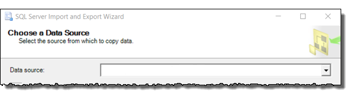

# Choose a Data Source (SQL Server Import and Export Wizard)

[!INCLUDE[sqlserver-ssis](../../includes/applies-to-version/sqlserver-ssis.md)]

  After the Welcome page, the [!INCLUDE[ssNoVersion](../../includes/ssnoversion-md.md)] Import and Export Wizard displays **Choose a Data Source**. On this page, you provide information about the source of your data and about how to connect to it.
  
For info about the data sources that you can use, see [What data sources and destinations can I use?](../../integration-services/import-export-data/import-and-export-data-with-the-sql-server-import-and-export-wizard.md#wizardSources)

> [!NOTE]
> The [!INCLUDE[ssNoVersion](../../includes/ssnoversion-md.md)] Import and Export Wizard utilizes SQL Server Integration Services (SSIS). Therefore the same limitations that apply to SSIS, also apply to the wizard.  For example ErrorCode and ErrorColumn columns, which are added by default as described in [Error handling in data](../../integration-services/data-flow/error-handling-in-data.md).

## Screen shot of the Choose a Data Source page 
The following image shows the first part of the **Choose a Data Source** page of the wizard. The rest of the  page has a variable number of options which depend on the data source that you choose here.

## Choose a data source
 **Data source**  
Specify the data source by selecting a data provider that can connect to the source.

-   **The data provider that you need is typically obvious from its name**, because the name of the provider typically contains the name of the data source - for example, *Flat File* Source, Microsoft *Excel*, Microsoft *Access*, .Net Framework Data Provider for *SqlServer*, .Net Framework Data Provider for *Oracle*.

-   **If you have an ODBC driver for your data source**, select the .Net Framework Data Provider for ODBC. Then enter the driver-specific info. ODBC drivers aren't listed in the drop-down list of data sources. The .Net Framework Data Provider for ODBC acts as a wrapper around the ODBC driver. For more info, see [Connect to an ODBC Data Source](../../integration-services/import-export-data/connect-to-an-odbc-data-source-sql-server-import-and-export-wizard.md).

-   **There may be more than one provider available for your data source.** Typically you can select any provider that works with your source. For example, to connect to Microsoft [!INCLUDE[ssNoVersion](../../includes/ssnoversion-md.md)], you can use the .NET Framework Data Provider for SQL Server or the SQL Server ODBC driver. (Other providers are also still in the list but are no longer supported.) 

## My data source isn't in the list
-   **You may have to download the data provider** from Microsoft or from a third party. The list of available data providers in the **Data source** list includes only the providers installed on your computer. For info about the data sources that you can use, see [What data sources and destinations can I use?](import-and-export-data-with-the-sql-server-import-and-export-wizard.md#wizardSources)

-   **Do you have an ODBC driver for your data source?** ODBC drivers aren't listed in the drop-down list of data sources. If you have an ODBC driver for your data source, select the .Net Framework Data Provider for ODBC. Then enter the driver-specific info. The .Net Framework Data Provider for ODBC acts as a wrapper around the ODBC driver. For more info, see [Connect to an ODBC Data Source](../../integration-services/import-export-data/connect-to-an-odbc-data-source-sql-server-import-and-export-wizard.md).

-   **64-bit and 32-bit providers.** If you're running the 64-bit wizard, you won't see data sources for which only a 32-bit provider is installed, and vice versa.

> [!NOTE]
> To use the 64-bit version of the SQL Server Import and Export Wizard, you have to install SQL Server. SQL Server Data Tools (SSDT) and SQL Server Management Studio (SSMS) are 32-bit applications and only install 32-bit files, including the 32-bit version of the wizard.

## After you choose a data source
After you choose a data source, the rest of the **Choose a Data Source** page has a variable number of options which depend on the data provider that you choose.

To connect to a commonly used data source, see one of the following pages.
-   [Connect to SQL Server](../../integration-services/import-export-data/connect-to-a-sql-server-data-source-sql-server-import-and-export-wizard.md)
-   [Connect to Oracle](../../integration-services/import-export-data/connect-to-an-oracle-data-source-sql-server-import-and-export-wizard.md)
-   [Connect to flat files (text files)](../../integration-services/import-export-data/connect-to-a-flat-file-data-source-sql-server-import-and-export-wizard.md)
-   [Connect to Excel](../../integration-services/import-export-data/connect-to-an-excel-data-source-sql-server-import-and-export-wizard.md)
-   [Connect to Access](../../integration-services/import-export-data/connect-to-an-access-data-source-sql-server-import-and-export-wizard.md)
-   [Connect with ODBC](../../integration-services/import-export-data/connect-to-an-odbc-data-source-sql-server-import-and-export-wizard.md)
-   [Connect to Azure Blob Storage](../../integration-services/import-export-data/connect-to-azure-blob-storage-sql-server-import-and-export-wizard.md)
-   [Connect to PostgreSQL](../../integration-services/import-export-data/connect-to-a-postgresql-data-source-sql-server-import-and-export-wizard.md)
-   [Connect to MySQL](../../integration-services/import-export-data/connect-to-a-mysql-data-source-sql-server-import-and-export-wizard.md)

For info about how to connect to a data source that's not listed here, see [The Connection Strings Reference](https://www.connectionstrings.com/). This third-party site contains sample connection strings and more info about data providers and the connection info they require.

## What's next?
 After you provide info about the source of your data and about how to connect to it, the next page is **Choose a Destination**. On this page, you provide info about the destination for your data and about how to connect to it. For more info, see [Choose a Destination](../../integration-services/import-export-data/choose-a-destination-sql-server-import-and-export-wizard.md).

## See also
[Get started with this simple example of the Import and Export Wizard](../../integration-services/import-export-data/get-started-with-this-simple-example-of-the-import-and-export-wizard.md)

[!INCLUDE[get-help-options](../../includes/paragraph-content/get-help-options.md)]

[!INCLUDE[contribute-to-content](../../includes/paragraph-content/contribute-to-content.md)]
