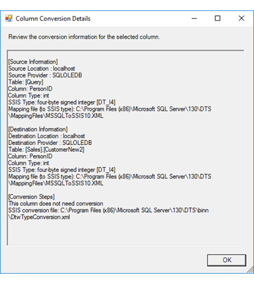

# Column Conversion Details Dialog Box (SQL Server Import and Export Wizard)

[!INCLUDE[sqlserver-ssis](../../includes/applies-to-version/sqlserver-ssis.md)]

  If you double-click the row for an individual column on the **Review Data Type Mapping** page, the [!INCLUDE[ssNoVersion](../../includes/ssnoversion-md.md)] Import and Export Wizard shows the **Column Conversion Details** dialog box. On this page you can review detailed conversion information for an individual column. This information includes the following items.
-   The data type of the column at the source and the destination.
-   The data type conversion that the wizard will perform, if a conversion is required.
-   The data type mapping files that the wizard uses to determine the required data type conversion. 

## Screen shot of the Column Conversion Details page 
 The following screen shot shows the **Column Conversion Details** dialog box of the Wizard after the user has double-clicked on a row  on the **Review Data Type Mapping** page. To take another look at the **Review Data Type Mapping** page, see [Review Data Type Mapping](../../integration-services/import-export-data/review-data-type-mapping-sql-server-import-and-export-wizard.md).
 
In this example, you see the following things.
-   The `PersonID` column in the source SQL Server table is of type `int`. The wizard maps this type to the SQL Server Integration Services (SSIS) `DT_I4` data type, which is a four-byte signed integer, by referring to the data type mapping file MSSQLToSSIS10.xml.
-   The `PersonID` column in the destination SQL Server table is also of type `int`. The wizard maps this type to the same SSIS data type.
-   The wizard concludes, *This column does not need conversion*.
 
  
  
  
## What's next?  
 After you review the column conversion details and click **OK**, the **Column Conversion Details** dialog box returns you to the **Review Data Type Mapping** page. For more info, see [Review Data Type Mapping](../../integration-services/import-export-data/review-data-type-mapping-sql-server-import-and-export-wizard.md).  

## See also
[Data Type Mapping in the SQL Server Import and Export Wizard](../../integration-services/import-export-data/data-type-mapping-in-the-sql-server-import-and-export-wizard.md)
