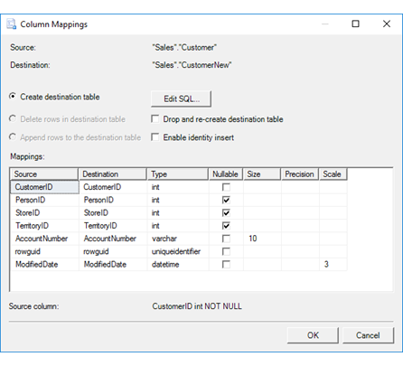
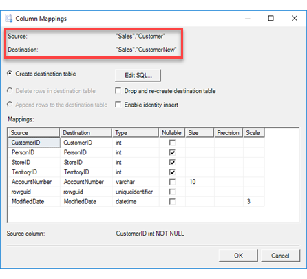
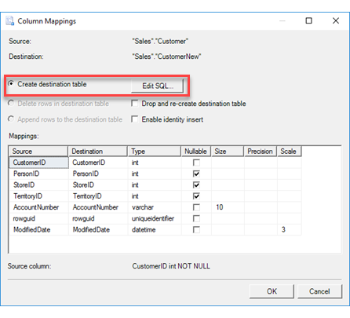
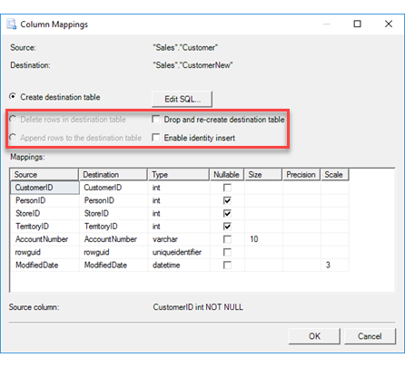
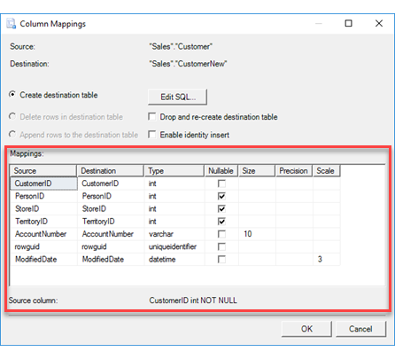

# Column Mappings (SQL Server Import and Export Wizard)
  After you select the existing tables and views to copy or review the query that you provided, if you click **Edit mappings**, the [!INCLUDE[ssNoVersion](../../includes/ssnoversion-md.md)] Import and Export Wizard shows the **Column Mappings** dialog box. On this page you specify and configure destination columns to receive the data copied from the source columns. Often you don't have to change anything on this page.
  
If you don't want to copy all the columns in the table you selected, one thing you can do on this page is exclude the columns you don't want. Select **ignore** in the **Destination** column of the **Mappings** list for columns that you don't want to copy.
 
## Screen shot of the Column Mappings page 
 The following screen shot shows an example of the **Column Mappings** dialog box of the wizard. 
 
 In this example, you see that the wizard is going to create a new destination table, because **Create destination table** is selected. By default, the wizard gives each column in the new destination table the same name, data type, and properties as the corresponding source column. 
  
   
  
## Review the source and destination 

 **Source**  
 The selected source table, view, or query.  
  
 **Destination**  
 The selected destination table or view.  

## Optionally, create a new destination table

 **Create destination table/file**  
 Create the destination table if it does not already exist.    
  
 **Edit SQL**  
Click **Edit SQL** to open the **Create Table SQL Statement** dialog box. Use the autogenerated CREATE TABLE statement, or modify it for your purposes. If you change this statement manually, you have to make sure that the list of column mappings recognizes your changes. For more info, see [Create Table SQL Statement](../../integration-services/import-export-data/create-table-sql-statement-sql-server-import-and-export-wizard.md).  

### Sometimes these options are disabled
The **Create destination table/file** option and the **Edit SQL** button are either automatically enabled or automatically disabled.

-   **Enabled.** If you specified a **new** destination table on the **Select Source Tables and Views** page, the **Create destination table** option is automatically selected and the **Edit SQL** button is enabled.

-   **Disabled.** If you selected an **existing** destination table on the **Select Source Tables and Views** page, the **Create destination table** option and the **Edit SQL** button are disabled. If you want to create a new destination table, go back to the **Select Source Tables and Views** page and enter the name of a **new** table in the **Destination** column.  

## What about existing data in the destination?

 **Delete rows in destination table/file**  
 Specify whether to clear the data from an existing table before loading the new data.  
  
 **Append rows to destination table/file**  
 Specify whether to append the new data to the data already present in an existing table.  
  
 **Drop and re-create destination table**  
 Choose this option to overwrite the destination table. This option is only available when you used the wizard to create the destination table. The destination table is only dropped and re-created if you save the package that the wizard creates and then run the package again. This is a convenient option when you want to test your settings more than once.
  
 **Enable identity insert**  
 Choose this option to allow existing identity values in the source data to be inserted into an identity column in the destination table. By default, the destination identity column typically does not allow this.  
  
> [!TIP]
> If your existing primary keys are in an identity column, an autonumber column, or the equivalent, you typically have to select this option to keep your existing primary key values.  Otherwise the destination identity column typically assigns new values.  

## Keep your autonumber or identity values
If you're exporting data that has an autonumber column or an identity column - for example, if you're exporting from Microsoft Access -  make sure you select **Enable identity insert** as described immediately above.

## Review column mappings

 **Mappings**  
 Displays how each column in the data source maps to a column in the destination.
 
The **Mappings** list has the following columns.  
  
-    **Source**  
     View each source column.  
  
-   **Destination**  
    View the mapped destination column or select a different column.
    
    You don't have to copy all the columns from the source table. Select **ignore** in this column for columns that you want to skip. Before you map columns, you must ignore all columns that will not be mapped.  
  
-   **Type**  
    View the data type for the destination column or select a different data type.
  
-   **Nullable**  
    Specify whether the destination column allows a null value.  
  
-   **Size**  
    Specify the number of characters in the destination column, if applicable.  
  
-    **Precision**  
    Specify the precision of numeric data in the destination column - that is, the number of digits - if applicable.  
  
 -   **Scale**  
    Specify the scale of numeric data in the destination column - that is, the number of decimal places - if applicable.  
  
## What's next?  
 After you review and configure destination columns to receive the data copied from the source columns and click **OK**, the **Column Mappings** dialog box returns you to the **Select Source Tables and Views** page or to the **Configure Flat File Destination** page. For more info, see [Select Source Tables and Views](../../integration-services/import-export-data/select-source-tables-and-views-sql-server-import-and-export-wizard.md) or [Configure Flat File Destination](../../integration-services/import-export-data/configure-flat-file-destination-sql-server-import-and-export-wizard.md).  
  
 If you specified a mapping that may not succeed in the **Mappings** list, then the **Column Mappings** dialog box takes you to the **Review Data Type Mapping** page. On this page, you review the warnings, specify conversion options, and also specify how to handle errors. For more info, see [Review Data Type Mapping](../../integration-services/import-export-data/review-data-type-mapping-sql-server-import-and-export-wizard.md).  
 
 ## See also
[Data Type Mapping in the SQL Server Import and Export Wizard](../../integration-services/import-export-data/data-type-mapping-in-the-sql-server-import-and-export-wizard.md)  
[Get started with this simple example of the Import and Export Wizard](../../integration-services/import-export-data/get-started-with-this-simple-example-of-the-import-and-export-wizard.md)

