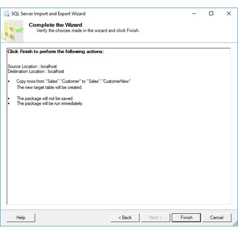

# Complete the Wizard (SQL Server Import and Export Wizard)
After you specify whether you want to run the copy operation immediately, and after you optionally save the package, the [!INCLUDE[ssNoVersion](../../includes/ssnoversion-md.md)] Import and Export Wizard shows **Complete the Wizard**. On this page, you review the choices that you made in the wizard, and then click **Finish** to start the copy operation.
 
## Screen shot of the Complete the Wizard page 
 The following screen shot shows the **Complete the Wizard** page of the Wizard.  
  
   
  
## Review the options you selected  
 
 View a summary that includes the following information:  
-   The source and destination of the data to copy.
-   The data to copy.
-   Whether the package will be saved.
-   Whether the package will be run immediately.  
  
## What's next?  
 After you review the choices that you made in the wizard and click **Finish**, the next page is **Performing Operation**. On this page, you see the progress and the result of the operation that you configured on the preceding pages. For more info, see [Performing Operation](../../integration-services/import-export-data/performing-operation-sql-server-import-and-export-wizard.md).
 
## See also
[Get started with this simple example of the Import and Export Wizard](../../integration-services/import-export-data/get-started-with-this-simple-example-of-the-import-and-export-wizard.md)
