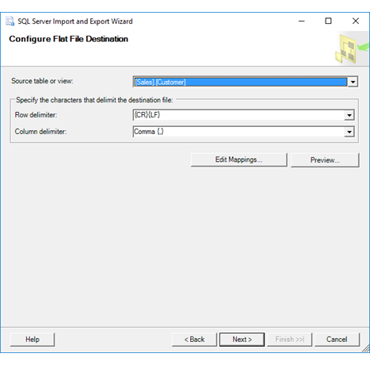

# Configure Flat File Destination (SQL Server Import and Export Wizard)

[!INCLUDE[ssis-appliesto](../../includes/ssis-appliesto-ssvrpluslinux-asdb-asdw-xxx.md)]

  If you selected a flat file destination, the [!INCLUDE[ssNoVersion](../../includes/ssnoversion-md.md)] Import and Export Wizard shows **Configure Flat File Destination** after you specify that you want to copy a table or after you provide a query. On this page, you specify formatting options for the destination flat file. Optionally, you review the mapping of individual columns and preview sample data.  
  
## Screen shot of the Configure Flat File Destination page  
 The following screen shot shows an example of the **Configure Flat File Destination** page of the wizard.
 
 In this example, the user has specified the following options to create a typical CSV (comma-separated values) file.
-   **Row delimiter**. Each row of data in the output ends with a carriage return-line feed combination.
-   **Column delimiter**. Columns of data within each row are separated with a comma.

 
  
## Pick a source table
 **Source table or view**  
-   If you specified on a previous page that you want to copy a table, select the source table or view from the drop-down list.
-   If you provided a query, `"Query"` is selected and is the only option.  

## Specify row and column delimiters for the output
 **Row delimiter**  
 Select from the list of delimiters to separate rows in the output. There is no option to specify a *custom* row delimiter.  
  
|Value|Description|  
|-----------|-----------------|  
|**{CR}{LF}**|Delimit rows with a carriage return-line feed combination.|  
|**{CR}**|Delimit rows with a carriage return.|  
|**{LF}**|Delimit rows with a line feed.|  
|**Semicolon {;}**|Delimit rows with a semicolon.|  
|**Colon {:}**|Delimit rows with a colon.|  
|**Comma {,}**|Delimit rows with a comma.|  
|**Tab {t}**|Delimit rows with a tab.|  
|**Vertical bar {&#124;}**|Delimit rows with a vertical bar.|  
  
 **Column delimiter**  
 Select from the list of delimiters to separate columns in the output. There is no option to specify a *custom* column delimiter.  
  
|Value|Description|  
|-----------|-----------------|  
|**{CR}{LF}**|Delimit columns with a carriage return-line feed combination.|  
|**{CR}**|Delimit columns with a carriage return.|  
|**{LF}**|Delimit columns with a line feed.|  
|**Semicolon {;}**|Delimit columns with a semicolon.|  
|**Colon {:}**|Delimit columns with a colon.|  
|**Comma {,}**|Delimit columns with a comma.|  
|**Tab {t}**|Delimit columns with a tab.|  
|**Vertical bar {&#124;}**|Delimit columns with a vertical bar.|  

## Optionally, review column mappings and preview data

**Edit mappings**   
Optionally, click **Edit mappings** to display the **Column Mappings** dialog box for the selected table. Use the **Column Mappings** dialog box to do the following things.
-   Review the mapping of individual columns between the source and the destination.
-   Copy only a subset of columns by selecting **ignore** for columns that you don't want to copy.

For more info, see [Column Mappings](../../integration-services/import-export-data/column-mappings-sql-server-import-and-export-wizard.md).  

**Preview**  
Optionally, click **Preview** to preview up to 200 rows of sample data in the **Preview Data** dialog box. This confirms that the wizard is going to copy the data that you want to copy. For more info, see [Preview Data](../../integration-services/import-export-data/preview-data-dialog-box-sql-server-import-and-export-wizard.md).  
  
After you preview the data, you may want to change the options that you selected on previous pages of the wizard. To make these changes, return to the **Configure Flat File Destination** page, and then click **Back** to return to previous pages where you can change your selections.  

## What's next?  
 After you specify formatting options for the destination flat file, the next page is **Save and Execute Package**. On this page, you specify whether you want to run the operation immediately. Depending on your configuration, you may also be able to save your settings as a [!INCLUDE[ssNoVersion](../../includes/ssnoversion-md.md)] [!INCLUDE[ssISnoversion](../../includes/ssisnoversion-md.md)] package to customize it and to reuse it later. For more info, see [Save and Run Package](../../integration-services/import-export-data/save-and-run-package-sql-server-import-and-export-wizard.md).  

