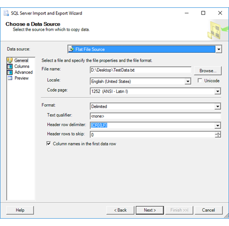
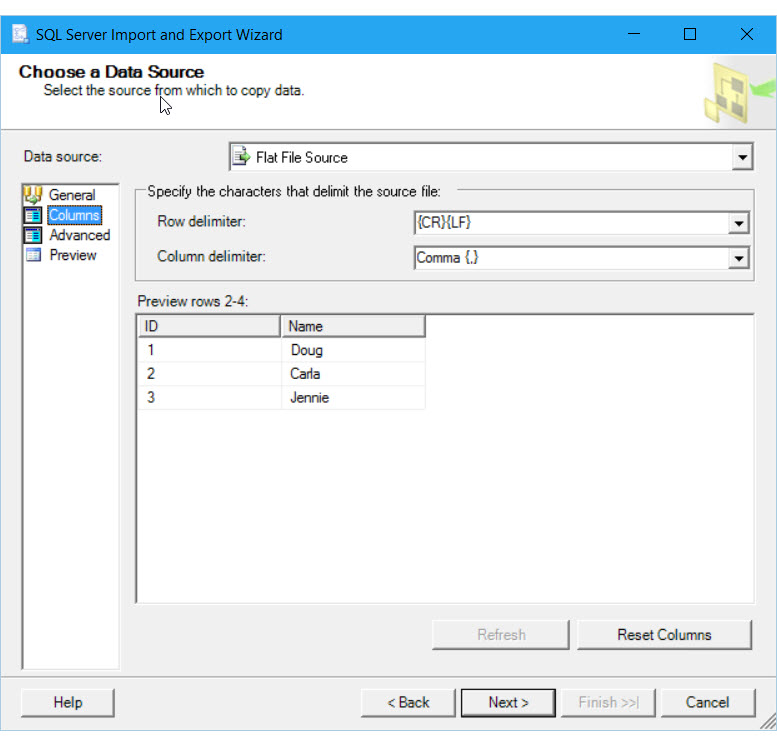
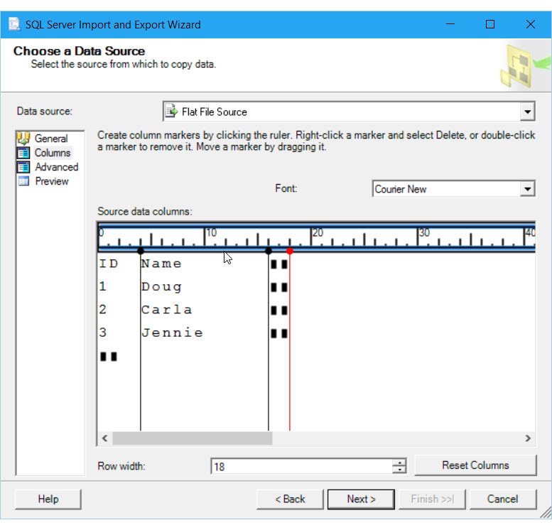
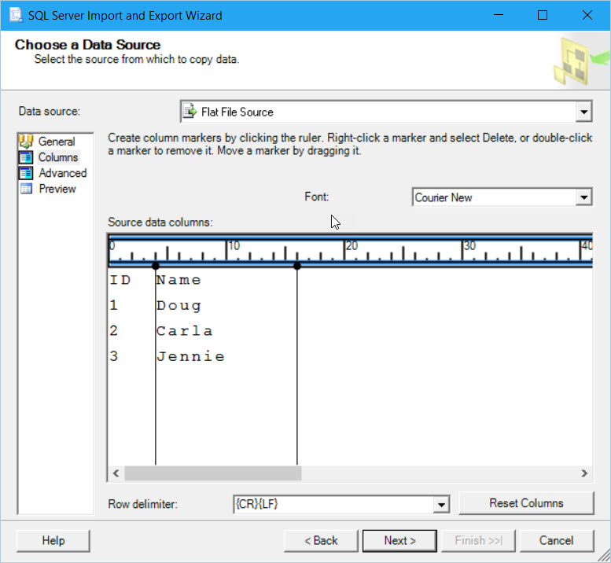
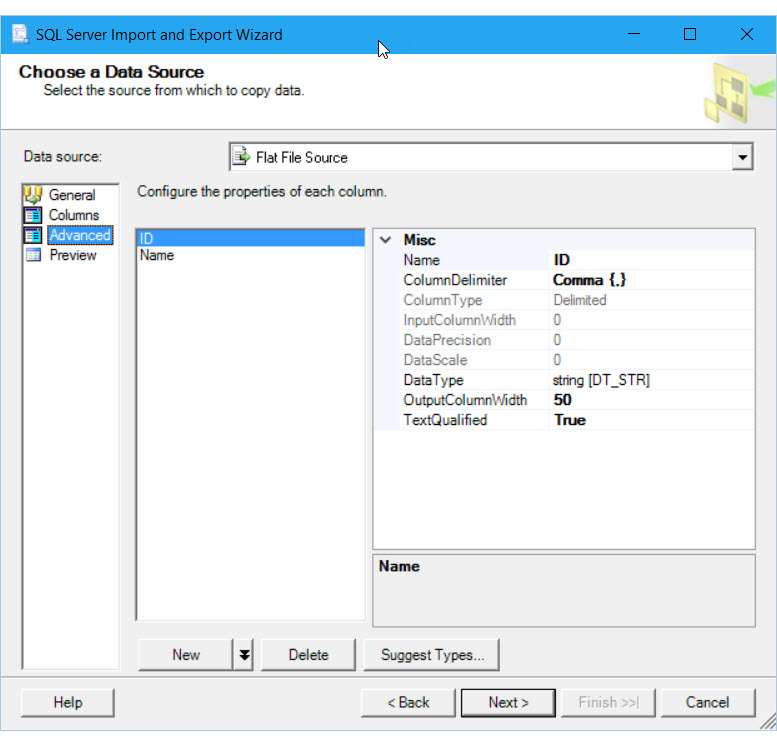
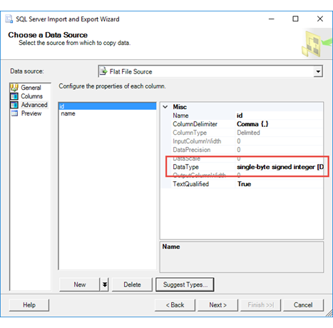
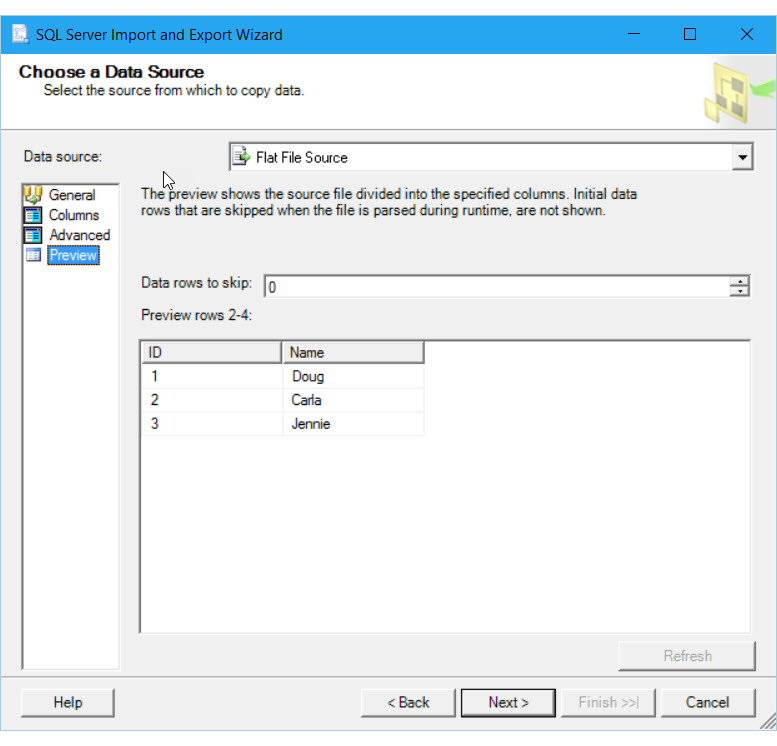
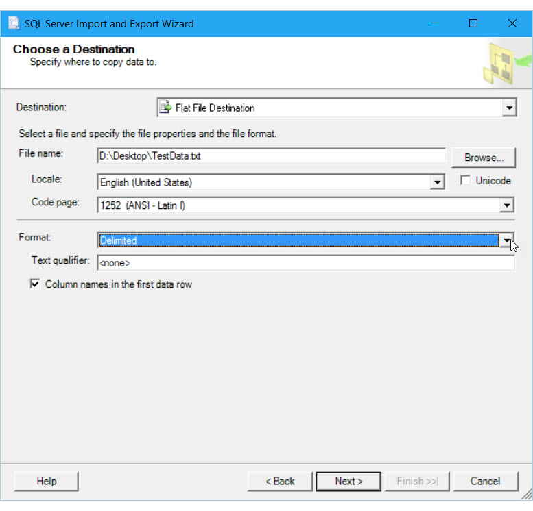

# Connect to a Flat File Data Source (SQL Server Import and Export Wizard)
This topic shows you how to connect to a **flat file** (text file) data source from the **Choose a Data Source** or **Choose a Destination** page of the SQL Server Import and Export Wizard. For flat files, these two pages of the wizard present different sets of options, so this topic describes the flat file source and the flat file destination separately.

## An alternative for simple text import
If you have to import a text file into SQL Server, and you don't need all the configuration options available in the Import and Export Wizard, consider using the **Import Flat File Wizard** in SQL Server Management Studio (SSMS). For more info, see the following articles:
- [What's new in SQL Server Management Studio 17.3
](https://blogs.technet.microsoft.com/dataplatforminsider/2017/10/10/whats-new-in-sql-server-management-studio-17-3/)
- [Introducing the new Import Flat File Wizard in SSMS 17.3](https://channel9.msdn.com/Shows/Data-Exposed/Introducing-the-new-Import-Flat-File-Wizard-in-SSMS-173)

## Connect to a flat file source
 
 There are four pages of options for flat file data sources. That's a lot of pages! But you don't have to spend a lot of time on each page. Here are the tasks to consider.
 
Page|Recommendation  |Type  
----|---------|---------
**General**|Make sure you update the options in the **Format** section.|Recommended    
**Columns**|Make sure you check the column and row delimiters (for a Delimited file) or mark the columns (for a Fixed Width file).|Recommended
**Advanced**|Optionally, check the data types and other properties assigned by default to the columns.|Optional
**Preview**|Optionally, preview a sample of the data, using the settings that you specified.|Optional

## General page (source)
 On the **General** page, browse to select the file, then verify the settings in the **Format** section.
 
   

### Options to specify (**General** page)

 **File name**  
 Enter the path and file name of the flat file.  
  
 **Browse**  
 Locate the flat file.  
  
 **Locale**  
 Specify the locale to provide language-specific information for sorting and for date and time formats.  
  
 **Unicode**  
 Specify whether the file uses Unicode. If you use Unicode, you can't specify a code page.  
  
 **Code page**  
 Specify the code page for non-Unicode text.  
  
 **Format**  
 Select whether the file uses delimited, fixed width, or ragged right formatting.  
  
|Value|Description|  
|-----------|-----------------|  
|Delimited|Columns are separated by delimiters. You specify the delimiter on the **Columns** page.|  
|Fixed width|Columns have a fixed width.|  
|Ragged right|Ragged right files are files in which every column has a fixed width, except for the last column, which is delimited by the row delimiter.|  
  
 **Text qualifier**  
 Specify the text qualifier, if any, used by the file. For example, you can specify that text fields are enclosed in quotation marks. (This property only applies to Delimited files.) 
  
> [!NOTE]
> After you select a text qualifier, you can't re-select the **None** option. Type **None** to de-select the text qualifier.  
  
 **Header row delimiter**  
 Select from the list of delimiters for header rows, or enter the delimiter text.  
  
|Value|Description|  
|-----------|-----------------|  
|**{CR}{LF}**|The header row is delimited by a carriage return-line feed combination.|  
|**{CR}**|The header row is delimited by a carriage return.|  
|**{LF}**|The header row is delimited by a line feed.|  
|**Semicolon {;}**|The header row is delimited by a semicolon.|  
|**Colon {:}**|The header row is delimited by a colon.|  
|**Comma {,}**|The header row is delimited by a comma.|  
|**Tab {t}**|The header row is delimited by a tab.|  
|**Vertical bar {&#124;}**|The header row is delimited by a vertical bar.|  
  
 **Header rows to skip**  
 Specify the number of rows to skip at the top of the file, if any.  
  
 **Column names in the first data row**  
 Specify whether the first row (after any skipped rows) contains column names.

## Columns page - Format = Delimited (source)
 On the **Columns** page, verify the list of columns and the delimiters that the wizard has identified. The following screen shot shows the page when you've selected **Delimited** as the flat file format.
 

### Options to specify (**Columns** page - Format = Delimited)

 **Row delimiter**  
 Select from the list of available row delimiters, or enter the delimiter text.  
  
|Value|Description|  
|-----------|-----------------|  
|**{CR}{LF}**|Rows are delimited by a carriage return-line feed combination.|  
|**{CR}**|Rows are delimited by a carriage return.|  
|**{LF}**|Rows are delimited by a line feed.|  
|**Semicolon {;}**|Rows are delimited by a semicolon.|  
|**Colon {:}**|Rows are delimited by a colon.|  
|**Comma {,}**|Rows are delimited by a comma.|  
|**Tab {t}**|Rows are delimited by a tab.|  
|**Vertical bar {&#124;}**|Rows are delimited by a vertical bar.|  
  
 **Column delimiter**  
 Select from the list of available column delimiters, or enter the delimiter text.  
  
|Value|Description|  
|-----------|-----------------|  
|**{CR}{LF}**|Columns are delimited by a carriage return-line feed combination.|  
|**{CR}**|Columns are delimited by a carriage return.|  
|**{LF}**|Columns are delimited by a line feed.|  
|**Semicolon {;}**|Columns are delimited by a semicolon.|  
|**Colon {:}**|Columns are delimited by a colon.|  
|**Comma {,}**|Columns are delimited by a comma.|  
|**Tab {t}**|Columns are delimited by a tab.|  
|**Vertical bar {&#124;}**|Columns are delimited by a vertical bar.|  
  
 **Preview rows**  
 View sample data in the flat file, divided into columns and rows by using the options selected.  
 
 **Refresh**  
 View the effect of changing the delimiters to skip by clicking **Refresh**. This button only becomes visible after you have changed other connection options.  
  
 **Reset Columns**  
 Restore the original columns.  

## Columns page - Format = Fixed Width (source)
On the **Columns** page, verify the list of columns and the delimiters that the wizard has identified. The following screen shot shows the page when you've selected **Fixed Width** as the flat file format.
  

### Options to specify (**Columns** page - Format = Fixed Width)

 **Font**  
 Select the font in which to display the preview data.  
  
 **Source data columns**  
 Adjust the width of the row by sliding the vertical red row marker, and adjust the width of the columns by clicking the ruler at the top of the preview window  
  
 **Row width**  
 Specify the length of the row before adding delimiters for individual columns. Or, drag the vertical red line in the preview window to mark the end of the row. The row width value is automatically updated.  
  
 **Reset Columns**  
 Restore the original columns.  
  
## Columns page - Format = Ragged Right (source)
On the **Columns** page, verify the list of columns and the delimiters that the wizard has identified. The following screen shot shows the page when you've selected **Ragged Right** as the flat file format.

> [!NOTE]
> Ragged right files are files in which every column has a fixed width, except for the last column, which is delimited by the row delimiter.  
 

### Options to specify (**Columns** page - Format = Ragged Right)
   
 **Font**  
 Select the font in which to display the preview data.  
  
 **Source data columns**  
 Adjust the width of the row by sliding the vertical red row marker, and adjust the width of the columns by clicking the ruler at the top of the preview window  
  
 **Row delimiter**  
 Select from the list of available row delimiters, or enter the delimiter text.  
  
|Value|Description|  
|-----------|-----------------|  
|**{CR}{LF}**|Rows are delimited by a carriage return-line feed combination.|  
|**{CR}**|Rows are delimited by a carriage return.|  
|**{LF}**|Rows are delimited by a line feed.|  
|**Semicolon {;}**|Rows are delimited by a semicolon.|  
|**Colon {:}**|Rows are delimited by a colon.|  
|**Comma {,}**|Rows are delimited by a comma.|  
|**Tab {t}**|Rows are delimited by a tab.|  
|**Vertical bar {&#124;}**|Rows are delimited by a vertical bar.|  
  
 **Reset Columns**  
 Restore the original columns.  

## Advanced page (source)
The **Advanced** page shows detailed info about each column in the data source, including its data type and size. The following screen shot shows the **Advanced** page for the first column in a delimited flat file.

In the screen shot, notice that the **id** column, which contains numbers, initially has a data type of string.

### Options to specify (**Advanced** page)

 **Configure the properties of each column**  
 Select a column in the left pane to view its properties in the right pane. See the following table for a description of column properties. Some of the properties listed are configurable only for certain flat file formats and for columns of certain data types.  
  
|Property|Description|  
|--------------|-----------------|  
|**Name**|Provide a descriptive column name. If you do not enter a name, [!INCLUDE[ssISnoversion](../../includes/ssisnoversion-md.md)] automatically creates a name in the format Column 0, Column 1, and so forth.|
|**ColumnDelimiter**|Select from the list of available column delimiters. Choose delimiters that are not likely to occur in the text. This value is ignored for fixed-width columns.   **{CR}{LF}**. Columns are delimited by a carriage return-line feed combination.   **{CR}**. Columns are delimited by a carriage return.   **{LF}**. Columns are delimited by a line feed.   **Semicolon {;}**. Columns are delimited by a semicolon.   **Colon {:}**. Columns are delimited by a colon.   **Comma {,}**. Columns are delimited by a comma.   **Tab {t}**. Columns are delimited by a tab.   **Vertical bar {&#124;}**. Columns are delimited by a vertical bar.|
|**ColumnType**|Denotes whether the column is delimited, fixed width, or ragged right. This property is read-only. Ragged right files are files in which every column has a fixed width, except for the last column. It is delimited by the row delimiter.|  
|**InputColumnWidth**|Specify a value to be stored as a count of bytes; for Unicode files, this value is a count of characters. This value is ignored for delimited columns.   **Note** In the object model, the name of this property is ColumnWidth.|
|**DataPrecision**|Specify the precision of numeric data. Precision refers to the number of digits.|
|**DataScale**|Specify the scale of numeric data. Scale refers to the number of decimal places.|
|**DataType**|Select from the list of available data types. For more information, see [Integration Services Data Types](../../integration-services/data-flow/integration-services-data-types.md).|
|**OutputColumnWidth**|Specify a value to be stored as a count of bytes; for Unicode files, this value corresponds to a count of characters. In the Data Flow task, this value is used to set the output column width for the Flat File source. In the object model, the name of this property is MaximumWidth.|  
|**TextQualified**|Indicate whether text data is surrounded by text qualifier characters such as quote characters.   True: Text data in the flat file is qualified. False: Text data in the flat file is NOT qualified.|  
  
**New**  
 Add a new column by clicking **New**. By default, the **New** button adds a new column at the end of the list. The button also has the following options, available in the drop-down list.  
  
|Value|Description|  
|-----------|-----------------|  
|**Add Column**|Add a new column at the end of the list.|  
|**Insert Before**|Insert a new column before the selected column.|  
|**Insert After**|Insert a new column after the selected column.|  
  
 **Delete**  
 Select a column, and then remove it by clicking **Delete**.  
  
 **Suggest Types**  
 Use the **Suggest Column Types** dialog box to evaluate sample data in the file and to obtain suggestions for the data type and length of each column.  
 
Click **Suggest types** to display the **Suggest Column Types** dialog box. 

After you choose options in the **Suggest Column Types** dialog box and click **OK**, the wizard may change the data types of some of the columns.

The following screen shot shows that, after you click **Suggest types**, the wizard has recognized that the **id** column in the data source is in fact a number and not a text string, and has changed the data type of the column from a string to an integer.

For more info, see [Suggest Column Types Dialog Box UI Reference](../../integration-services/connection-manager/suggest-column-types-dialog-box-ui-reference.md).

## Preview page (source)

On the **Preview** page, verify that the list of columns and the sample data are what you expect.

### Options to specify (**Preview** page)

 **Data rows to skip**  
 Specify how many rows to skip at the beginning of the flat file.  
  
 **Preview rows**  
 View sample data in the flat file, divided into columns and rows according to the options you have selected.
 
 **Refresh**  
 View the effect of changing the number of rows to skip by clicking **Refresh**. This button only becomes visible after you have changed other connection options.  
 
For more info about the **Preview** page, see the following Integration Services reference page - [Flat File Connection Manager Editor &#40;Preview Page&#41;](../../integration-services/connection-manager/flat-file-connection-manager-editor-preview-page.md).

## Connect to a flat file destination
For a flat file destination, there's only a single page of options, as shown in the following screen shot. Browse to select the file, then verify the settings in the **Format** section.

### Options to specify (**Choose a Destination** page)

 **File name**  
 Enter the path and file name of the flat file.  
  
 **Browse**  
 Locate the flat file.  
  
 **Locale**  
 Specify the locale to provide language-specific information for sorting and for date and time formats.  
  
 **Unicode**  
 Specify whether the file uses Unicode. If you use Unicode, you can't specify a code page.  
  
 **Code page**  
 Specify the code page for non-Unicode text.  
  
 **Format**  
 Select whether the file uses delimited, fixed width, or ragged right formatting.  
  
|Value|Description|  
|-----------|-----------------|  
|Delimited|Columns are separated by delimiters. You specify the delimiter on the **Columns** page.|  
|Fixed width|Columns have a fixed width.|  
|Ragged right|Ragged right files are files in which every column has a fixed width, except for the last column, which is delimited by the row delimiter.|  
  
 **Text qualifier**  
 Specify the text qualifier, if any, used by the file. For example, you can specify that text fields are enclosed in quotation marks. (This property only applies to Delimited files.) 
  
> [!NOTE] 
> After you select a text qualifier, you can't reselect the **None** option. Type **None** to de-select the text qualifier.  

## See also
[Choose a Data Source](../../integration-services/import-export-data/choose-a-data-source-sql-server-import-and-export-wizard.md)  
[Choose a Destination](../../integration-services/import-export-data/choose-a-destination-sql-server-import-and-export-wizard.md)

