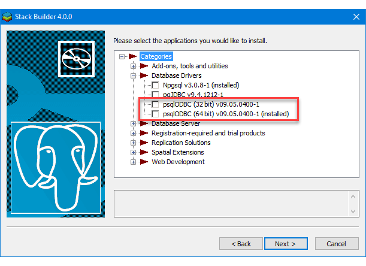

# Connect to a PostgreSQL Data Source (SQL Server Import and Export Wizard)
This topic shows you how to connect to a **PostgreSQL** data source from the **Choose a Data Source** or **Choose a Destination** page of the SQL Server Import and Export Wizard. 

> [!IMPORTANT]
> The detailed requirements and prerequisites for connecting to a PostgreSQL database are beyond the scope of this Microsoft article. This article assumes that you already have PostgreSQL client software installed and that you can already connect successfully to the target PostgreSQL database. For more info, consult your PostgreSQL database administrator or the PostgreSQL documentation.

## Get the PostgreSQL ODBC driver

### Install the ODBC driver with Stack Builder
Run Stack Builder to add the PostgreSQL ODBC driver (psqlODBC) to your installation of PostgreSQL.



### Or, download the latest ODBC driver
Or, download the Windows installer for the latest version of the PostgreSQL ODBC driver (psqlODBC) directly from this FTP site - [https://www.postgresql.org/ftp/odbc/versions/msi/](https://www.postgresql.org/ftp/odbc/versions/msi/). Extract the files from the .zip file and run the .msi file.

## Connect to PostgreSQL with the PostgreSQL ODBC driver (psqlODBC)
ODBC drivers aren't listed in the drop-down list of data sources. To connect with an ODBC driver, start by selecting the **.NET Framework Data Provider for ODBC** as the data source on the **Choose a Data Source** or **Choose a Destination** page. This provider acts as a wrapper around the ODBC driver.

Here's the generic screen that you see immediately after selecting the .NET Framework Data Provider for ODBC.


### Options to specify (PostgreSQL ODBC driver)

> [!NOTE]
> The connection options for this data provider and ODBC driver are the same whether PostgreSQL is your source or your destination. That is, the options you see are the same on both the **Choose a Data Source** and the **Choose a Destination** pages of the wizard.

To connect to PostgreSQL with the PostgreSQL ODBC driver, assemble a connection string that includes the following settings and their values. The format of a complete connection string immediately follows the list of settings.

> [!TIP]
> Get help assembling a connection string that's just right. Or, instead of providing a connection string, provide an existing DSN (data source name) or create a new one. For more info about these options, see [Connect to an ODBC Data Source](../../integration-services/import-export-data/connect-to-an-odbc-data-source-sql-server-import-and-export-wizard.md).

**Driver**  
The name of the ODBC driver - either **PostgreSQL ODBC Driver(UNICODE)** or **PostgreSQL ODBC Driver(ANSI)**.

**Server**  
The name of the PostgreSQL server. 

**Port**  
The port to use to connect to the PostgreSQL server.

**Database**  
The name of the PostgreSQL database.

**Uid** and **Pwd**   
The **Uid** (user id) and **Pwd** (password) to connect.

### Connection string format
Here's the format of a typical connection string. 

    ```
    Driver={PostgreSQL ODBC Driver(UNICODE)};Server=<server>;Port=<port>;Database=<database>;UID=<user id>;PWD=<password>
    ```

### Enter the connection string
Enter the connection string in the **ConnectionString** field, or enter the DSN name in the **Dsn** field, on the **Choose a Data Source** or **Choose a Destination** page. After you enter the connection string, the wizard parses the string and displays the individual properties and their values in the list.

The following example uses this connection string.

    ```
    Driver={PostgreSQL ODBC Driver(UNICODE)};Server=127.0.0.1;Port=5432;Database=postgres;UID=postgres;PWD=********
    ```

Here's the screen that you see after entering the connection string.


## Other data providers and more info
For info about how to connect to PostgreSQL with a data provider that's not listed here, see [PostgreSQL connection strings](https://www.connectionstrings.com/postgresql/). This third-party site also contains more info about the data providers and the connection parameters described on this page.

## See also
[Choose a Data Source](../../integration-services/import-export-data/choose-a-data-source-sql-server-import-and-export-wizard.md)  
[Choose a Destination](../../integration-services/import-export-data/choose-a-destination-sql-server-import-and-export-wizard.md)

