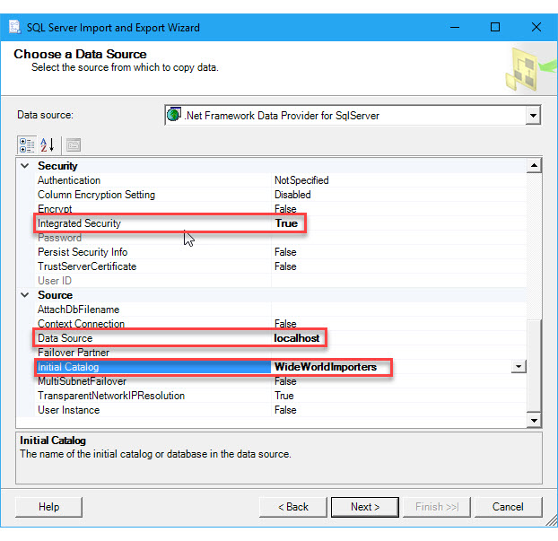

# Connect to a SQL Server Data Source (SQL Server Import and Export Wizard)

[!INCLUDE[sqlserver-ssis](../../includes/applies-to-version/sqlserver-ssis.md)]

This topic shows you how to connect to a **Microsoft SQL Server** data source from the **Choose a Data Source** or **Choose a Destination** page of the SQL Server Import and Export Wizard. There are several data providers that you can use to connect to SQL Server.

> [!TIP]
> If you're on a network with multiple servers, it may be easier to enter the server name rather than expand the drop-down list of servers. If you click the drop-down list, it may take a lot of time to query the network for all available servers, and the results may not even include the server you want.

## Connect to SQL Server with the .NET Framework Data Provider for SQL Server 
After you select **.NET Framework Data Provider for SQL Server** on the **Choose a Data Source** or **Choose a Destination** page of the wizard, the page displays a grouped list of options for the provider. Many of these are unfriendly names and unfamiliar settings. Fortunately, to connect to any enterprise database, you typically have to provide only a few pieces of information. You can ignore the default values for the other settings.

> [!NOTE]
> The connection options for this data provider are the same whether SQL Server is your source or your destination. That is, the options you see are the same on both the **Choose a Data Source** and the **Choose a Destination** pages of the wizard.

|Required info|.Net Framework Data Provider for SQL Server property|
|---|---|
|Authentication|Default **NotSpecified** as "Integrated Security", or choose other authentication mode. "Interactive Active Directory Authentication" is not supported. |
|Server name|**Data Source**|
|Authentication (login) info|**Integrated Security**; or, **User ID** and **Password** If you want to see a drop-down list of databases on the server, you first have to provide valid login info.|
|Database name|**Initial Catalog**|

### Options to specify (.NET Framework Data Provider for SQL Server)

> [!NOTE]
> The connection options for this data provider are the same whether SQL Server is your source or your destination. That is, the options you see are the same on both the **Choose a Data Source** and the **Choose a Destination** pages of the wizard.

**Data Source**  
 Enter the name or IP address of the source or destination server, or select a server from the drop-down list.  
 
 To specify a non-standard TCP port, enter a comma after the server name or IP address, then enter the port number.
 
 **Initial Catalog**  
 Enter the name of the source or destination database, or select a database from the drop-down list.  
  
 **Integrated Security**  
 Specify **True** to connect with Windows integrated authentication (recommended), or **False** to connect with [!INCLUDE[ssNoVersion](../../includes/ssnoversion-md.md)] authentication. If you specify **False**, you must enter a user ID and password. The default value is **False**.  
  
 **User ID**  
 Enter a user name if you're using [!INCLUDE[ssNoVersion](../../includes/ssnoversion-md.md)] authentication.  
  
 **Password**  
 Enter the password if you're using [!INCLUDE[ssNoVersion](../../includes/ssnoversion-md.md)] authentication.  

## Connect to SQL Server with the ODBC driver for SQL Server 
ODBC drivers aren't listed in the drop-down list of data sources. To connect with an ODBC driver, start by selecting the **.NET Framework Data Provider for ODBC** as the data source. This provider acts as a wrapper around the ODBC driver.

> [!TIP]
> **Get the latest driver**. Download the [Microsoft ODBC Driver for SQL Server](../../connect/odbc/download-odbc-driver-for-sql-server.md).

Here's the generic screen that you see immediately after selecting the .NET Framework Data Provider for ODBC.

### Options to specify (ODBC driver for SQL Server)

> [!NOTE]
> The connection options for the ODBC driver are the same whether SQL Server is your source or your destination. That is, the options you see are the same on both the **Choose a Data Source** and the **Choose a Destination** pages of the wizard.

To connect to SQL Server with the latest ODBC driver, assemble a connection string that includes the following settings and their values. The format of a complete connection string immediately follows the list of settings.

> [!TIP]
> Get help assembling a connection string that's just right. Or, instead of providing a connection string, provide an existing DSN (data source name) or create a new one. For more info about these options, see [Connect to an ODBC Data Source](../../integration-services/import-export-data/connect-to-an-odbc-data-source-sql-server-import-and-export-wizard.md).

**Driver**  
The name of the ODBC driver. The name is different for different versions of the driver.

**Server**  
The name of the SQL Server.

**Database**  
The name of the database.  

**Trusted_Connection**; or, **Uid** and **Pwd**  
Specify **Trusted_Connection=Yes** to connect with Windows integrated authentication; or, specify **Uid** (user id) and **Pwd** (password) to connect with SQL Server authentication.

### Connection string format
Here's the format of a connection string that uses Windows integrated authentication.

`Driver={ODBC Driver 13 for SQL Server};server=<server>;database=<database>;trusted_connection=Yes;`

Here's the format of a connection string that uses SQL Server authentication instead of Windows integrated authentication.

`Driver={ODBC Driver 13 for SQL Server};server=<server>;database=<database>;uid=<user id>;pwd=<password>;`

### Enter the connection string
Enter the connection string in the **ConnectionString** field, or enter the DSN name in the **Dsn** field, on the **Choose a Data Source** or **Choose a Destination** page. After you enter the connection string, the wizard parses the string and displays the individual properties and their values in the list.

The following example uses this connection string.

`Driver={ODBC Driver 13 for SQL Server};server=localhost;database=WideWorldImporters;trusted_connection=Yes;`

Here's the screen that you see after entering the connection string.

## Connect to SQL Server with the Microsoft OLE DB Provider for SQL Server or SQL Server Native Client

[Microsoft OLE DB Provider for SQL Server](../../connect/connect-history.md#ole-db) is the current OLE DB provider for SQL Server.

## Other data providers and more info
For info about how to connect to SQL Server with a data provider that's not listed here, see [SQL Server connection strings](https://www.connectionstrings.com/sql-server/). This third-party site also contains more info about the data providers and the connection parameters described on this page.

## See also
[Choose a Data Source](../../integration-services/import-export-data/choose-a-data-source-sql-server-import-and-export-wizard.md)  
[Choose a Destination](../../integration-services/import-export-data/choose-a-destination-sql-server-import-and-export-wizard.md)
