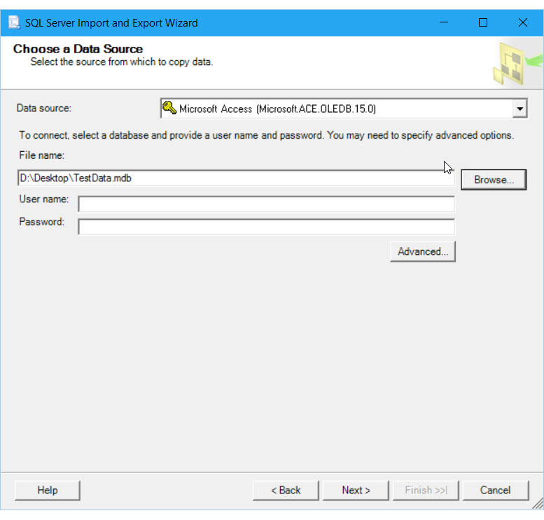
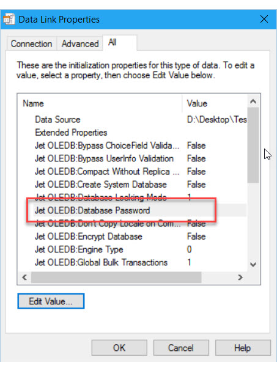
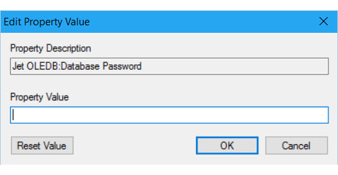

# Connect to an Access Data Source (SQL Server Import and Export Wizard)
This topic shows you how to connect to a **Microsoft Access** data source from the **Choose a Data Source** or **Choose a Destination** page of the SQL Server Import and Export Wizard.

The following screen shot shows a sample connection to a Microsoft Access database. In this example, you don't have to enter a user name and password, because the target database doesn't use a workgroup information file.

## Options to specify

> [!NOTE]
> The connection options for this data provider are the same whether Access is your source or your destination. That is, the options you see are the same on both the **Choose a Data Source** and the **Choose a Destination** pages of the wizard.

**Data source**  
The list of data providers may contain several entries for Microsoft Access. Select the latest installed version, or the version that corresponds to the version of Access that created the database file.

|Data source|Office version|
|-------|-------|
|Microsoft Access (Microsoft.ACE.OLEDB.16.0)|Office 2016|
|Microsoft Access (Microsoft.ACE.OLEDB.15.0)|Office 2013|
|Microsoft Access (Microsoft Access Database Engine)|Office 2010 and Office 2007|
|Microsoft Access (Microsoft Jet Database Engine)|Office versions earlier than Office 2007|

> [!IMPORTANT]
> You may have to download and install additional files to connect to the version of Access that you select. See [Get the files you need to connect to Access](#officeDownloads) on this page for more info.

If you have a problem when you specify a version, try specifying a different version, even an earlier version. For example, you may not be able to install the Office 2016 data providers because you have a Microsoft Office 365 subscription. You can only install the data providers for Access 2016 and Excel 2016 with a desktop version of Microsoft Office. In this case, you can specify Access 2013 instead of Access 2016. The two versions of the provider are functionally equivalent. This limitation of the Office 2016 runtime is mentioned in [this blog post](https://blogs.office.com/2015/12/16/access-2016-runtime-is-now-available-for-download/).

 **File name**  
Specify the path and file name for the Access file. For example, **C:\\MyData.mdb** for a file on the local computer, or **\\\\Sales\\Database\\Northwind.mdb** for a file on a network share. Or, click **Browse**. 

 >   [!NOTE] 
 > If you click **Browse** to locate the Access file, the **Open** dialog box filters for files with the older .MDB format and file extension by default. However the data provider can also open files with the newer .ACCDB format and file extension.
  
 **Browse**  
 Locate the database file by using the **Open** dialog box.  
  
 **User name**  
If a workgroup information file is associated with the database, provide a valid user name.  
  
 **Password**  
If a workgroup information file is associated with the database, provide the user's password here.
 
If the database is protected with a single password for all users, see [Is the database file password-protected?](#database_password).
  
 **Advanced**  
Specify advanced options, such as the database password or a non-default workgroup information file, in the **Data Link Properties** dialog box.  

## I don't see Access in the list of data sources
If you don't see Access in the list of data sources, are you running the 64-bit wizard? The providers for Excel and Access are typically 32-bit and aren't visible in the 64-bit wizard. Run the 32-bit wizard instead.
  
## Get the files you need to connect to Access  
You may have to download the connectivity components for Microsoft Office data sources, including Excel and Access, if they're not already installed.

Later versions of the components can open files created by earlier versions of the programs. In many cases, earlier versions of the components can also open files created by later versions of the programs. For example, if you can't install the Office 2016 components, use the Office 2013 components instead. The two versions of the provider are functionally equivalent. This limitation of the Office 2016 runtime is mentioned in [this blog post](https://blogs.office.com/2015/12/16/access-2016-runtime-is-now-available-for-download/).

If the computer has a 32-bit version of Office - this is typical, even on 64-bit computers - then you have to install the 32-bit version of the components. You also have to ensure that you run the 32-bit wizard, or run the SQL Server Integration Services package that the wizard creates in 32-bit mode.

|Microsoft Office version|Download|  
|------------------------------|--------------|  
|2016|[Microsoft Access 2016 Runtime](https://www.microsoft.com/download/details.aspx?id=50040)|
|2013|[Microsoft Access 2013 Runtime](http://www.microsoft.com/download/details.aspx?id=39358)|
|2010|[Microsoft Access 2010 Runtime](https://www.microsoft.com/download/details.aspx?id=10910)|  
|2007|[2007 Office System Driver: Data Connectivity Components](https://www.microsoft.com/download/details.aspx?id=23734)|    

##  Is the database file password-protected?
In some cases, an Access database is password-protected, but isn't using a workgroup information file. All users have to provide the same password, but don't have to enter a user name. To provide a database password, do the following.

1.  On the **Choose a Data Source** or **Choose a Destination** page, click the **Advanced** button to open the **Data Link Properties** dialog box.  
2.  In the **Data Link Properties** dialog box, select the **All** tab.  
3.  In the list of properties and values, select **Jet OLEDB:Database Password**.   
    
     
4.  Click **Edit Value** to open the **Edit Property Value** dialog box.  
    
    
5.  In the **Edit Property Value** dialog box, enter the database password.
6.  Click **OK** in each dialog box to return to the **Choose a Data Source** or **Choose a Destination** page of the wizard and continue.

## Keep your autonumber values when you export from Access
To allow existing identity values in the source data to be inserted into an identity column in the destination table, choose the **Enable identity insert** option in the **Column Mappings** dialog box. By default, the destination identity column typically doesn't let you insert existing values. To show the **Column Mappings** dialog box, select **Edit mappings** when you reach the **Select Source Tables and Views** page of the wizard. To look at these pages, see [Select Source Tables and Views](../../integration-services/import-export-data/select-source-tables-and-views-sql-server-import-and-export-wizard.md) and [Column Mappings](../../integration-services/import-export-data/column-mappings-sql-server-import-and-export-wizard.md).

If your existing primary keys are in an identity column, an autonumber column, or the equivalent, you typically have to select this option to keep your existing primary key values. Otherwise the destination identity column typically assigns new values.

## See also
[Choose a Data Source](../../integration-services/import-export-data/choose-a-data-source-sql-server-import-and-export-wizard.md)  
[Choose a Destination](../../integration-services/import-export-data/choose-a-destination-sql-server-import-and-export-wizard.md)

