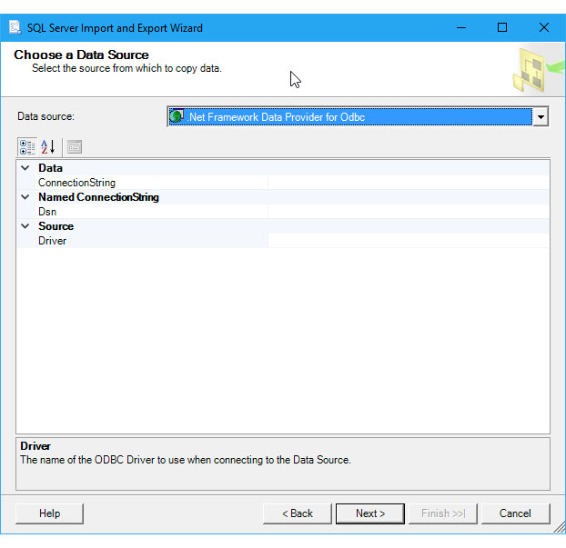
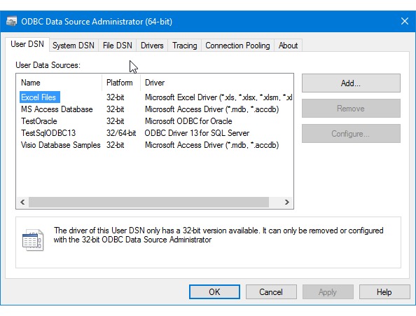
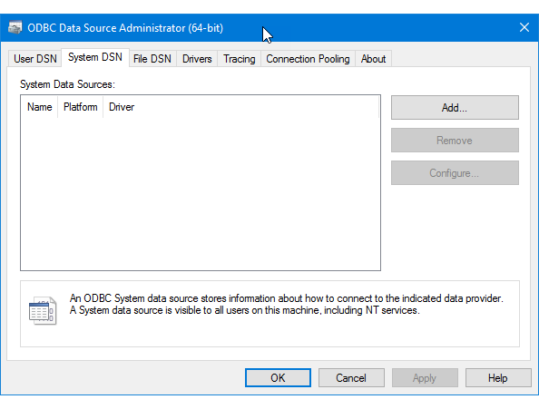
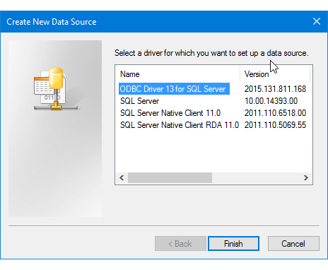
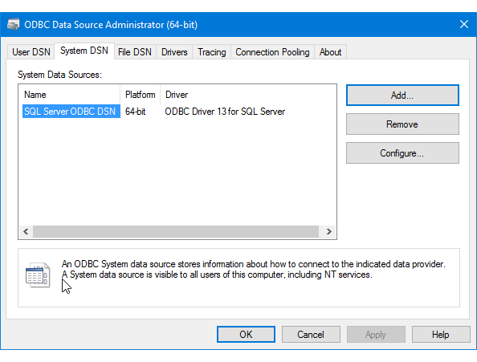
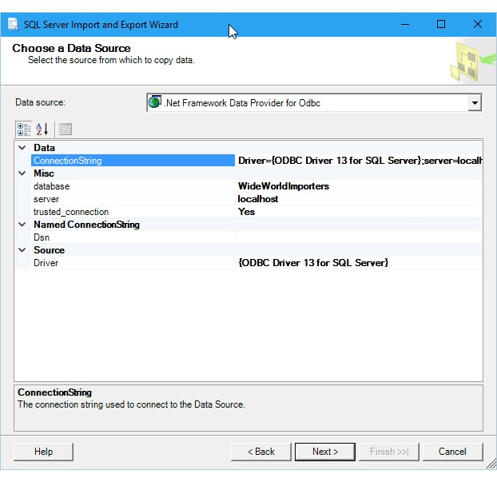
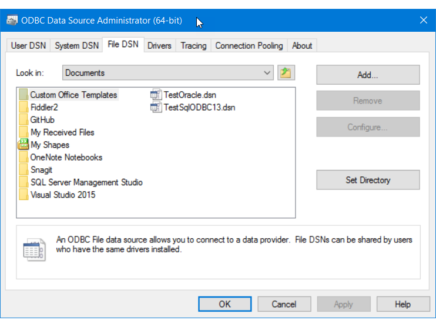
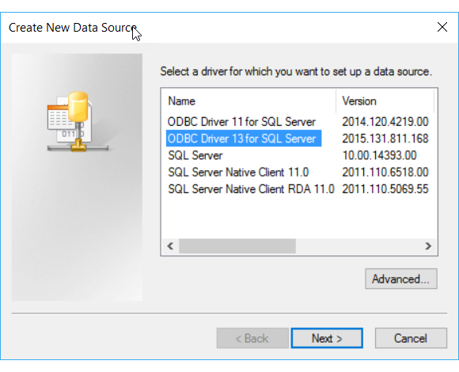
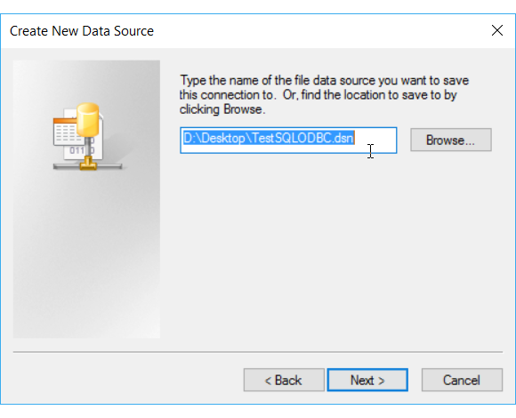

# Connect to an ODBC Data Source (SQL Server Import and Export Wizard)
This topic shows you how to connect to an **ODBC** data source from the **Choose a Data Source** or **Choose a Destination** page of the SQL Server Import and Export Wizard.

You may have to download the ODBC driver you need from Microsoft or from a third party.

You may also have to look up the required connection info that you have to provide. This third-party site - [The Connection Strings Reference](https://www.connectionstrings.com/) - contains sample connection strings and more info about data providers and the connection info they require.

## Make sure the driver you want is installed
1.  Search for or browse to the **ODBC Data Sources (64-bit)** applet in the Control Panel. If you only have a 32-bit driver, or you know that you have to use a 32-bit driver, search for or browse to **ODBC Data Sources (32-bit)** instead.
2.  Launch the applet. The **ODBC Data Source Administrator** window opens.
3.  On the **Drivers** tab, you can find a list of all the ODBC drivers installed on your computer. (The names of some of the drivers may be listed in multiple languages.)

    Here's an example of the list of installed 64-bit drivers.

    

> [!TIP]
> If you know that your driver's installed and you don't see it in the 64-bit applet, look in the 32-bit applet instead. This also tells you whether you have to run the 64-bit or 32-bit SQL Server Import and Export Wizard.
>
> To use the 64-bit version of the SQL Server Import and Export Wizard, you have to install SQL Server. SQL Server Data Tools (SSDT) and SQL Server Management Studio (SSMS) are 32-bit applications and only install 32-bit files, including the 32-bit version of the wizard.
    
## Step 1 - Select the data source
The ODBC drivers installed on your computer aren't listed in the drop-down list of data sources. To connect with an ODBC driver, start by selecting the **.NET Framework Data Provider for ODBC** as the data source on the **Choose a Data Source** or **Choose a Destination** page of the wizard. This provider acts as a wrapper around the ODBC driver.

Here's the generic screen that you see immediately after selecting the .NET Framework Data Provider for ODBC.



## Step 2 - Provide the connection info
The next step is to provide the connection info for your ODBC driver and your data source. You have two options.
1.  Provide a **DSN** (data source name) that already exists or that you create with the **ODBC Data Source Administrator** applet in the Control Panel. A DSN is the saved collection of settings required to connect to an ODBC data source.

    If you already know the DSN name, or know how to create a new DSN now, you can skip the rest of this page. Enter the DSN name in the **Dsn** field on the **Choose a Data Source** or **Choose a Destination** page, then continue to the next step of the wizard.

    [Provide a DSN](#odbc_dsn)
    
2.  Provide a **connection string**, which you can look up online, or create and test on your computer with the **ODBC Data Source Administrator** applet.

    If you already have the connection string or know how to create it, you can skip the rest of this page. Enter the connection string in the **ConnectionString** field on the **Choose a Data Source** or **Choose a Destination** page, then continue to the next step of the wizard.

    [Provide a connection string](#odbc_connstring)

If you provide a connection string, the **Choose a Data Source** or **Choose a Destination** page displays all the connection info that the wizard is going to use to connect to your data source, such as server and database name and authentication method. If you provide a DSN, this information isn't visible.

## <a name="odbc_dsn"></a> Option 1 - Provide a DSN
If you want to provide the connection information with a DSN (data source name), use the **ODBC Data Source Administrator** applet to find the name of the existing DSN, or to create a new DSN.
1.  Search for or browse to the **ODBC Data Sources (64-bit)** applet in the Control Panel. If you only have a 32-bit driver, or have to use a 32-bit driver, search for or browse to **ODBC Data Sources (32-bit)** instead.
2.  Launch the applet. The **ODBC Data Source Administrator** window opens. Here's what the applet looks like.

    
    
3.  If you want to **use an existing DSN** for your data source, you can use any DSN that you see on the **User DSN**, **System DSN**, or **File DSN** tab. Check the name, then go back to the wizard and enter it in the **Dsn** field on the **Choose a Data Source** or **Choose a Destination** page. Skip the rest of this page and continue to the next step of the wizard.
4.  If you want to **create a new DSN**, decide whether you want it to be visible only to you (User DSN), visible to all users of the computer including Windows services (System DSN), or saved in a file (File DSN). This example creates a new System DSN.
5. On the **System DSN** tab, click **Add**.

    
    
6.  In the **Create a New Data Source** dialog box, select the driver for your data source, then click **Finish**.

    
    
7. The driver now displays one or more driver-specific screens where you enter the info needed to connect to your data source. (For the SQL Server driver, for example, there are four pages of custom settings.) After you finish, the new system DSN appears in the list.

    
    
8.  Go back to the wizard and enter the DSN name in the **Dsn** field on the **Choose a Data Source** or **Choose a Destination** page. Continue to the next step of the wizard.

## <a name="odbc_connstring"></a> Option 2 - Provide a connection string
If you want to provide your connection information with a connection string, the rest of this topic helps you get the connection string you need.

This example is going to use the following connection string, which connects to Microsoft SQL Server.

    ```
    Driver={ODBC Driver 13 for SQL Server};server=localhost;database=WideWorldImporters;trusted_connection=Yes;
    ```

Enter the connection string in the **ConnectionString** field on the **Choose a Data Source** or **Choose a Destination** page. After you enter the connection string, the wizard parses the string and displays the individual properties and their values in the list.

Here's the screen that you see after entering the connection string.



> [!NOTE]
> The connection options for an ODBC driver are the same whether you're configuring your source or your destination. That is, the options you see are the same on both the **Choose a Data Source** and the **Choose a Destination** pages of the wizard.

## Get the connection string online
To find connection strings for your ODBC driver online, see [The Connection Strings Reference](https://www.connectionstrings.com/). This third-party site contains sample connection strings and more info about data providers and the connection info they require.

## Get the connection string with an app
To build and test the connection string for your ODBC driver on your own computer, you can use the **ODBC Data Source Administrator** applet in the Control Panel. Create a File DSN for your connection, then copy settings out of the File DSN to assemble the connection string. This requires several steps, but helps to make sure you have a valid connection string.

1.  Search for or browse to the **ODBC Data Sources (64-bit)** applet in the Control Panel. If you only have a 32-bit driver, or have to use a 32-bit driver, search for or browse to **ODBC Data Sources (32-bit)** instead.
2.  Launch the applet. The **ODBC Data Source Administrator** window opens.
3.  Now go to the **File DSN** tab of the applet. Click **Add**.

    For this example, create a File DSN rather than a User DSN or System DSN, because the File DSN saves the name-value pairs in the specific format required for the connection string.

    

4.  In the **Create New Data Source** dialog box, select your driver in the list, and then click **Next**. This example is going to create a DSN that contains the connection string arguments we need to connect to Microsoft SQL Server.

    
    
5.  Select a location and enter a filename for the new File DSN, and then click **Next**. Remember where you save the file so you can find it and open it in a subsequent step.

    

6.  Review the summary of your selections, and then click **Finish**.

7.  After you click **Finish**, the driver that you selected displays one or more proprietary screens to gather the info it needs to connect. Typically this info includes server, login info, and database for server-based data sources, and file, format, and version for file-based data sources.

8. After you configure your data source and click **Finish**, you typically see a summary of your selections and have an opportunity to test them.

    

9. After you test your data source and close the dialog boxes, find the File DSN where you saved it in the file system. If you didn't change the file extension, the default extension is .DSN.

10. Open the saved file with Notepad or another text editor. Here are the contents of our SQL Server example.

    ```   
    [ODBC]  
    DRIVER=ODBC Driver 13 for SQL Server  
    TrustServerCertificate=No  
    DATABASE=WideWorldImporters    
    WSID=<local computer name>  
    APP=Microsoft® Windows® Operating System  
    Trusted_Connection=Yes  
    SERVER=localhost   
    ```
        
11. Copy and paste the necessary values into a connection string in which the name-value pairs are separated by semi-colons.

    After you assemble the necessary values from the sample file DSN, you have the following connection string.
    
        ```
        DRIVER=ODBC Driver 13 for SQL Server;SERVER=localhost;DATABASE=WideWorldImporters;Trusted_Connection=Yes
        ```

    You don't typically need all the settings in a DSN created by the ODBC Data Source Administrator to create a connection string that works.  
    -   You always have to specify the ODBC driver.
    -   For a server-based data source like SQL Server, you typically need Server, Database, and login information. So in the sample DSN, you don't need TrustServerCertificate, WSID, or APP.
    -   For a file-based data source, you need at least file name and location.
    
12. Paste this connection string into the **ConnectionString** field on the **Choose a Data Source** or **Choose a Destination** page of the wizard. The wizard parses the string and you're ready to continue!

    

## See also
[Choose a Data Source](../../integration-services/import-export-data/choose-a-data-source-sql-server-import-and-export-wizard.md)  
[Choose a Destination](../../integration-services/import-export-data/choose-a-destination-sql-server-import-and-export-wizard.md)


