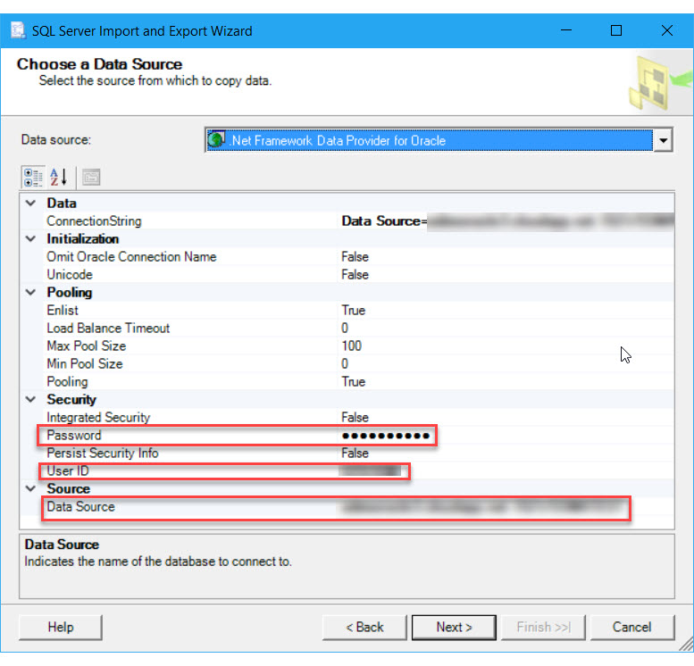
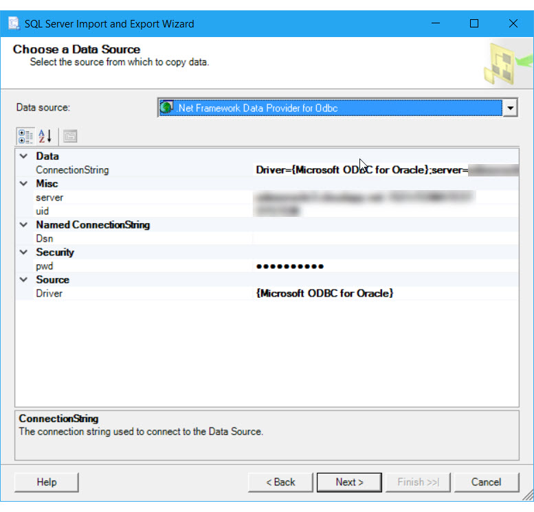

# Connect to an Oracle Data Source (SQL Server Import and Export Wizard)
This topic shows you how to connect to an **Oracle** data source from the **Choose a Data Source** or **Choose a Destination** page of the SQL Server Import and Export Wizard. There are several data providers that you can use to connect to Oracle.

> [!IMPORTANT]
> The detailed requirements and prerequisites for connecting to an Oracle database are beyond the scope of this Microsoft article. This article assumes that you already have Oracle client software installed and that you can already connect successfully to the target Oracle database. For more info, consult your Oracle database administrator or the Oracle documentation.

## Connect to Oracle with the .Net Framework Data Provider for Oracle
After you select **.NET Framework Data Provider for Oracle** on the **Choose a Data Source** or **Choose a Destination** page of the wizard, the page presents a grouped list of options for the provider. Many of these are unfriendly names and unfamiliar settings. Fortunately, you only have to provide two or three pieces of information. You can ignore the default values for the other settings.

> [!NOTE]
> The connection options for this data provider are the same whether Oracle is your source or your destination. That is, the options you see are the same on both the **Choose a Data Source** and the **Choose a Destination** pages of the wizard.

|Required info|.Net Framework Data Provider for Oracle property|
|---|---|
|Server name|**Data Source**|
|Authentication (login) info|**User ID** and **Password**; or, **Integrated Security**|

You don't have to enter the connection string in the **ConnectionString** field of the list. After you enter individual values for the Oracle server name (**Data Source**) and login info, the wizard assembles the connection string from the individual properties and their values. 



## Connect to Oracle with the Microsoft ODBC driver for Oracle
ODBC drivers aren't listed in the drop-down list of data sources. To connect with an ODBC driver, start by selecting the **.NET Framework Data Provider for ODBC** as the data source on the **Choose a Data Source** or **Choose a Destination** page. This provider acts as a wrapper around the ODBC driver.

Here's the generic screen that you see immediately after selecting the .NET Framework Data Provider for ODBC.


### Options to specify (ODBC Driver for Oracle)

> [!NOTE]
> The connection options for this data provider and ODBC driver are the same whether Oracle is your source or your destination. That is, the options you see are the same on both the **Choose a Data Source** and the **Choose a Destination** pages of the wizard.

To connect to Oracle with the ODBC Driver for Oracle, assemble a connection string that includes the following settings and their values. The format of a complete connection string immediately follows the list of settings.

> [!TIP]
> Get help assembling a connection string that's just right. Or, instead of providing a connection string, provide an existing DSN (data source name) or create a new one. For more info about these options, see [Connect to an ODBC Data Source](../../integration-services/import-export-data/connect-to-an-odbc-data-source-sql-server-import-and-export-wizard.md).

**Driver**  
The name of the ODBC driver, **Microsoft ODBC for Oracle**.

**Server**  
The name of the Oracle server. 

**Uid** and **Pwd**   
The user id and password to connect.

### Connection string format
Here's the format of a typical connection string.

    ```
    Driver={Microsoft ODBC for Oracle};Server=myServerAddress;Uid=myUsername;Pwd=myPassword;
    ```

### Enter the connection string
Enter the connection string in the **ConnectionString** field, or enter the DSN name in the **Dsn** field, on the **Choose a Data Source** or **Choose a Destination** page. After you enter the connection string, the wizard parses the string and displays the individual properties and their values in the list.

Here's the screen that you see after entering the connection string.



## What's my Oracle server name?
Run one of the following queries to get the name of your Oracle server.

`SELECT host_name FROM v$instance`

or

`SELECT sys_context('USERENV','SERVER_HOST') FROM dual`

## Other data providers and more info
For info about how to connect to Oracle with a data provider that's not listed here, see [Oracle connection strings](https://www.connectionstrings.com/oracle/). This third-party site also contains more info about the data providers and the connection parameters described on this page.

## See also
[Choose a Data Source](../../integration-services/import-export-data/choose-a-data-source-sql-server-import-and-export-wizard.md)  
[Choose a Destination](../../integration-services/import-export-data/choose-a-destination-sql-server-import-and-export-wizard.md)

