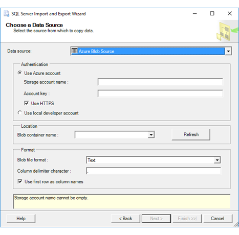

# Connect to Azure Blob Storage (SQL Server Import and Export Wizard)
This topic shows you how to connect to an **Azure Blob Storage** data source from the **Choose a Data Source** or **Choose a Destination** page of the SQL Server Import and Export Wizard.

> [!NOTE]
> To use the Azure Blob Source or Destination, you have to install the Azure Feature Pack for SQL Server Integration Services.
> - To download the Feature Pack, see [Microsoft SQL Server 2016 Integration Services Feature Pack for Azure](https://www.microsoft.com/download/details.aspx?id=49492).
> 
> - For more info, see [Azure Feature Pack for Integration Services &#40;SSIS&#41;](../../integration-services/azure-feature-pack-for-integration-services-ssis.md).

The following screen shot shows the options to configure for a connection to Azure Blob Storage.

## Options to specify

> [!NOTE]
> The connection options for this data provider are the same whether Azure Blob Storage is your source or your destination. That is, the options you see are the same on both the **Choose a Data Source** and the **Choose a Destination** pages of the wizard.

 **Use Azure account**  
 Specify whether to use an online account.
  
 **Storage account name**  
 Enter the name of the Azure storage account.  
  
**Account key**  
Enter the key for the Azure storage account.  
  
 **Use HTTPS**  
 Specify whether to use HTTP or HTTPS to connect to the storage account.  
  
 **Use local developer account**  
 Specify whether to use the storage emulator on the local computer.  
  
 **Blob container name**  
 Select from the list of storage containers available in the specified storage account.  
  
 **Blob file format**  
 Select Text or Avro file format.  
  
 **Column delimiter character**  
 If you selected Text format, enter the column delimiter character.  
  
 **Use first row as column names**  
 Specify whether the first row of data contains column names.  

## See also
[Choose a Data Source](../../integration-services/import-export-data/choose-a-data-source-sql-server-import-and-export-wizard.md)  
[Choose a Destination](../../integration-services/import-export-data/choose-a-destination-sql-server-import-and-export-wizard.md)

