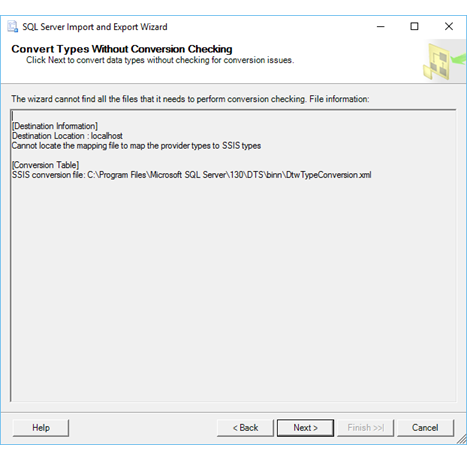

# Convert Types without Conversion Checking (SQL Server Import and Export Wizard)
  After you select the existing tables and views to copy or review the query that you provided, the [!INCLUDE[ssNoVersion](../../includes/ssnoversion-md.md)] Import and Export Wizard may show **Convert Types without Conversion Checking**. The wizard shows this page when it can't locate one or more of the data type conversion and mapping files that it needs to map data types between your source and destination. The page includes information that helps you to understand what's missing.
  
 Click **Next** to continue without knowing whether data type conversions will succeed. Otherwise, click **Back** to change your selections, or click **Cancel** to exit the wizard.

## Screen shot of the Convert Types page  
  
The following screen shot shows an example of the **Convert Types without Conversion Checking** page of the Wizard.

The problem here is that the wizard can't find a mapping file that maps data types for the destination you selected.

The info on this page doesn't include the name of the missing mapping file. Since the wizard doesn't know whether a file exists for the specified data provider, it can't provide a name for the missing file.

## What's next?  
 After you click **Next** to continue without knowing whether data type conversions will succeed, the next page is **Save and Run Package**. On this page, you specify whether you want to run the copy operation immediately. Depending on your configuration, you may also be able to save the [!INCLUDE[ssNoVersion](../../includes/ssnoversion-md.md)] [!INCLUDE[ssISnoversion](../../includes/ssisnoversion-md.md)] package created by the wizard  to customize it and to reuse it later. For more info, see [Save and Run Package](../../integration-services/import-export-data/save-and-run-package-sql-server-import-and-export-wizard.md).  

## See also
[Data Type Mapping in the SQL Server Import and Export Wizard](../../integration-services/import-export-data/data-type-mapping-in-the-sql-server-import-and-export-wizard.md)
