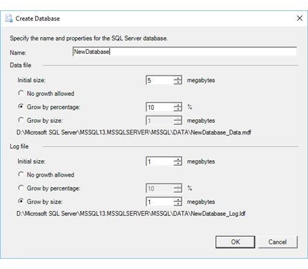

# Create Database (SQL Server Import and Export Wizard)

[!INCLUDE[ssis-appliesto](../../includes/ssis-appliesto-ssvrpluslinux-asdb-asdw-xxx.md)]

If you select **New** on the **Choose a Destination** page to create a new SQL Server destination database, the [!INCLUDE[ssNoVersion](../../includes/ssnoversion-md.md)] Import and Export Wizard shows the **Create Database** dialog box. On this page, you provide a name for the new database. Optionally you can also change the settings for the initial size and the automatic growth of the new database and its log file. 

The **Create Database** dialog box in the wizard offers only the basic options that are available for creating a new SQL Server database. To see and configure all the options for a new [!INCLUDE[ssNoVersion](../../includes/ssnoversion-md.md)] database, use [!INCLUDE[ssManStudioFull](../../includes/ssmanstudiofull-md.md)] to create the database, or to configure the database after the wizard creates it. 

> [!NOTE]
> If you're looking for info about the [!INCLUDE[tsql](../../includes/tsql-md.md)] CREATE DATABASE statement, and not about the **Create Database** dialog box of the [!INCLUDE[ssNoVersion](../../includes/ssnoversion-md.md)] Import and Export Wizard, see [CREATE DATABASE &#40;SQL Server Transact-SQL&#41;](../../t-sql/statements/create-database-sql-server-transact-sql.md).  

## Screen shot of the Create Database page  
The following screen shot shows the **Create Database** dialog box of the wizard.  

  

## Provide a name for the new database  
**Name**  
 Provide a name for the destination SQL Server database.
 
### Naming requirements
Make sure that you follow SQL Server naming conventions when you name the database.  
  
-   The database name must be unique within an instance of SQL Server.  
  
-   The database name can be a maximum of 123 characters. (This allows 5 characters for the suffixes that SQL Server appends to the data file and the log file, within the maximum of 128 characters.)  
  
-   The database name must comply with the rules for identifiers in SQL Server. Here are the most important requirements.  
  
    -   The first character must be a letter, underscore (_), at sign (@), or number sign (#).  
  
    -   Subsequent characters can be letters, numbers, the at sign, dollar sign ($), number sign, or underscore.  
  
    -   You can't use spaces or other special characters.  
  
For detailed info about these requirements, see [Database Identifiers](../../relational-databases/databases/database-identifiers.md).  

## Optionally specify data file and log file options

> [!TIP]
> You have to provide a name for the new database in the **Name** field, but typically you can leave the other settings for file size and file growth at their default values.

### Data file options  
 **Initial size**  
 Specify the number of megabytes for the initial size of the data file.  
  
 **No growth allowed**  
 Indicate whether the data file can grow beyond the specified initial size.  
  
 **Grow by percentage**  
 Specify a percentage by which the data file can grow.  
  
 **Grow by size**  
 Specify a number of megabytes by which the data file can grow.  
  
### Log file options  
 **Initial size**  
 Specify the number of megabytes for the initial size of the log file.  
  
 **No growth allowed**  
 Indicate whether the log file can grow beyond the specified initial size.  
  
 **Grow by percentage**  
 Specify a percentage by which the log file can grow.  
  
 **Grow by size**  
 Specify a number of megabytes by which the log file can grow.  

### More info
For more info about the file size options that you see on this page, see [CREATE DATABASE &#40;SQL Server Transact-SQL&#41;](../../t-sql/statements/create-database-sql-server-transact-sql.md). 

## What's next?  
 After you provide a name for the new database that the wizard will create and click **OK**, the **Create Database** dialog box returns you to the **Choose a Destination** page. For more info, see [Choose a Destination](../../integration-services/import-export-data/choose-a-destination-sql-server-import-and-export-wizard.md).  

