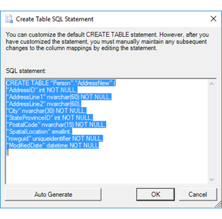

# Create Table SQL Statement (SQL Server Import and Export Wizard)

[!INCLUDE[sqlserver-ssis](../../includes/applies-to-version/sqlserver-ssis.md)]

If you select **Create destination table** and then select **Edit SQL** in the **Column Mappings** dialog box, the [!INCLUDE[ssNoVersion](../../includes/ssnoversion-md.md)] Import and Export Wizard shows the **Create Table SQL Statement** dialog box. On this page, you review and optionally customize the **CREATE TABLE** command that the wizard will run to create the new destination table.
  
> [!NOTE]
> If you're looking for info about the [!INCLUDE[tsql](../../includes/tsql-md.md)] CREATE TABLE statement, and not about the **Create Table SQL Statement** dialog box of the [!INCLUDE[ssNoVersion](../../includes/ssnoversion-md.md)] Import and Export Wizard, see [CREATE TABLE &#40;Transact-SQL&#41;](../../t-sql/statements/create-table-transact-sql.md). 
  
## Screen shot of the Create Table SQL Statement page  
 The following screen shot shows the **Create Table SQL Statement** dialog box of the Wizard.
 
In this example, the **SQL statement** box contains the default **CREATE TABLE** statement generated by the wizard. This statement creates a new destination table named **Person.AddressNew** that's a copy of the **Person.Address** source table. 
  
   
  
## Review or regenerate the CREATE TABLE statement  
 **SQL statement**  
Displays the auto-generated SQL statement and lets you customize it.
 
If you change the default CREATE TABLE command, you may also have to make changes to the associated column mappings when you return to the **Column Mappings** dialog box.  
  
To include a carriage return in the text of the SQL statement, press CTRL+ENTER. If you press ENTER alone, the dialog box closes.  
  
For more info about the CREATE TABLE statement and syntax, see [CREATE TABLE &#40;Transact-SQL&#41;](../../t-sql/statements/create-table-transact-sql.md).   
  
 **Autogenerate**  
 Restore the default SQL statement, if you've changed it, by clicking **Auto Generate**.  
  
## Create a table that includes a FILESTREAM column  
 The [!INCLUDE[ssNoVersion](../../includes/ssnoversion-md.md)] Import and Export Wizard generates a default CREATE TABLE statement based on the connected data source. This default CREATE TABLE statement does not include the FILESTREAM attribute even if the source table has a FILESTREAM column.
 1.  To copy a FILESTREAM column by using the wizard, first implement FILESTREAM storage on the destination database.
 2.  Then, add the FILESTREAM attribute manually to the CREATE TABLE statement in the **Create Table SQL Statement** dialog box.  

For more info about the syntax, see [CREATE TABLE &#40;Transact-SQL&#41;](../../t-sql/statements/create-table-transact-sql.md). For more info about FILESTREAM, see [Binary Large Object &#40;Blob&#41; Data &#40;SQL Server&#41;](../../relational-databases/blob/binary-large-object-blob-data-sql-server.md).  
  
## What's next?  
 After you review and customize the CREATE TABLE command and click **OK**, the **Create Table SQL Statement** dialog box returns you to the **Column Mappings** dialog box. For more info, see [Column Mappings](../../integration-services/import-export-data/column-mappings-sql-server-import-and-export-wizard.md).
 
 ## See also
[Get started with this simple example of the Import and Export Wizard](../../integration-services/import-export-data/get-started-with-this-simple-example-of-the-import-and-export-wizard.md)

