# Get started with this simple example of the Import and Export Wizard
Learn what to expect in the SQL Server Import and Export Wizard by walking through a common scenario - importing data from an Excel spreadsheet to a SQL Server database. Even if you plan to use a different source and a different destination, this topic shows you most of what you need to know about running the wizard.

## Prerequisite - Is the wizard installed on your computer?
If you want to run the wizard, but you don't have [!INCLUDE[msCoName](../../includes/msconame-md.md)] [!INCLUDE[ssNoVersion](../../includes/ssnoversion-md.md)] installed on your computer, you can install the [!INCLUDE[ssNoVersion](../../includes/ssnoversion-md.md)] Import and Export Wizard  by installing SQL Server Data Tools (SSDT). For more info, see [Download SQL Server Data Tools (SSDT)](https://msdn.microsoft.com/library/mt204009.aspx).

## Here's the Excel source data for this example
Here's the source data that you're going to copy - a small two-column table in the WizardWalkthrough worksheet of the WizardWalkthrough.xlsx Excel workbook.

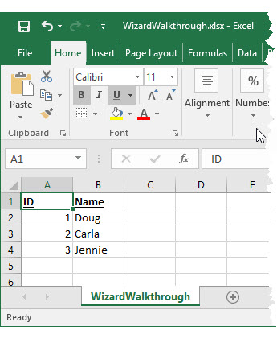

## Here's the SQL Server destination database for this example
Here (in SQL Server Management Studio) is the SQL Server destination database to which you're going to copy the source data. The destination table isn't there - you're going to let the wizard create the table for you.

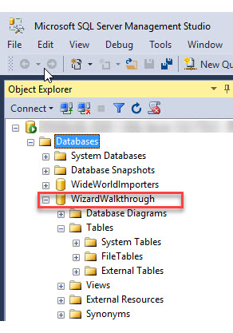

## Step 1 - Start the wizard
You start the wizard from the Microsoft SQL Server 2016 group on the Windows Start menu.

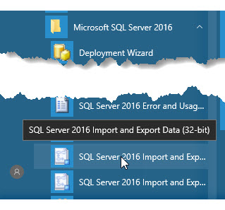

> [!NOTE]
> For this example, you pick the 32-bit wizard because you have the 32-bit version of Microsoft Office installed. As a result, you have to use the 32-bit data provider to connect to Excel. For many other data sources, you can typically pick the 64-bit wizard.
>
> To use the 64-bit version of the SQL Server Import and Export Wizard, you have to install SQL Server. SQL Server Data Tools (SSDT) and SQL Server Management Studio (SSMS) are 32-bit applications and only install 32-bit files, including the 32-bit version of the wizard.

For more info, see [Start the SQL Server Import and Export Wizard](../../integration-services/import-export-data/start-the-sql-server-import-and-export-wizard.md).

## Step 2 - View the Welcome page
The first page of the wizard is the **Welcome** page. 

You probably don't want to see this page again, so go ahead and click **Do not show this starting page again**.

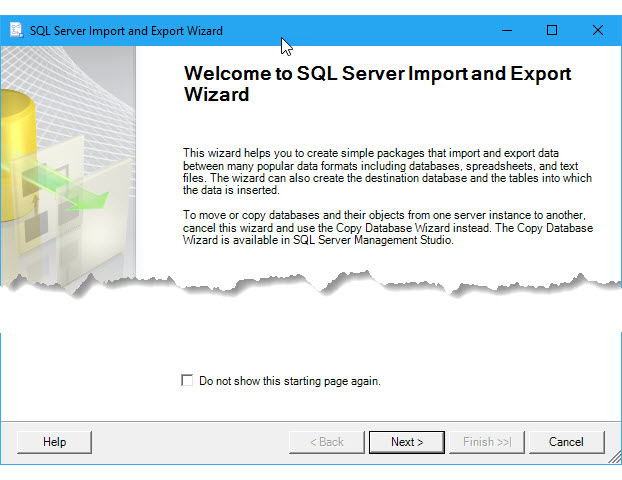

## Step 3 - Pick Excel as your data source
On the next page, **Choose a Data Source**, you pick Microsoft Excel as your data source. Then you browse to pick the Excel file. Finally you specify the Excel version that you used to create the file.

> [!IMPORTANT]
> For detailed info about connecting to Excel files, and about limitations and known issues for loading data from or to Excel files, see [Load data from or to Excel with SQL Server Integration Services (SSIS)](../load-data-to-from-excel-with-ssis.md).

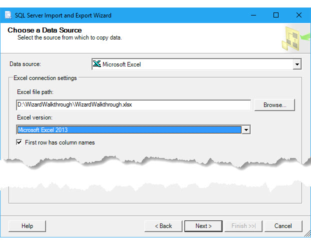

For more info about this page of the wizard, see [Choose a Data Source](../../integration-services/import-export-data/choose-a-data-source-sql-server-import-and-export-wizard.md).

## Step 4 - Pick SQL Server as your destination
On the next page, **Choose a Destination**, you pick Microsoft SQL Server as your destination by picking one of the data providers in the list that connects to SQL Server. In this example, you pick the **.Net Framework Data Provider for SQL Server**.

The page displays a list of provider properties. Many of these are unfriendly names and unfamiliar settings. Fortunately, to connect to any enterprise database, you typically have to provide only three pieces of information. You can ignore the default values for the other settings.

|Required info|.Net Framework Data Provider for SQL Server property|
|---|---|
|Server name|**Data Source**|
|Authentication (login) info|**Integrated Security**; or **User ID** and **Password** If you want to see a dropdown list of databases on the server, you first have to provide valid login info.|
|Database name|**Initial Catalog**|

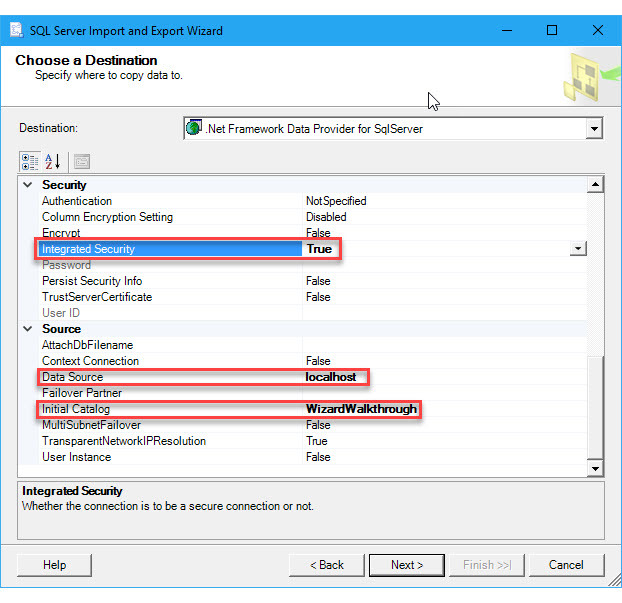

For more info about connecting to SQL Server, see [Connect to a SQL Server Data Source](../../integration-services/import-export-data/connect-to-a-sql-server-data-source-sql-server-import-and-export-wizard.md). For more info about this page of the wizard, see [Choose a Destination](../../integration-services/import-export-data/choose-a-destination-sql-server-import-and-export-wizard.md).

## Step 5 - Copy a table instead of writing a query
On the next page, **Specify Table Copy or Query**, you specify that you want to copy the entire table of source data. You don't want to write a query in the SQL language to select the data to copy.

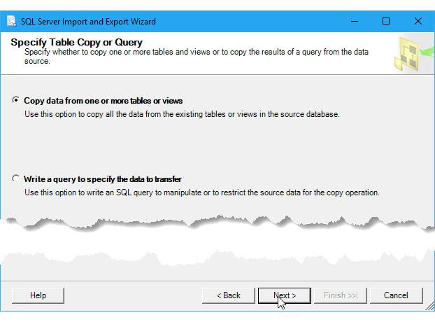

For more info about this page of the wizard, see [Specify Table Copy or Query](../../integration-services/import-export-data/specify-table-copy-or-query-sql-server-import-and-export-wizard.md).

## Step 6 - Pick the table to copy
On the next page, **Select Source Tables and Views**, you pick the table or tables that you want to copy from the data source. Then you map each selected source table to a new or existing destination table.

In this example, by default the wizard has mapped the **WizardWalkthrough$** worksheet in the **Source** column to a new table with the same name at the SQL Server destination. (The Excel workbook only contains a single worksheet.)
-   The dollar sign ($) on the name of the source table indicates an Excel worksheet. (A named range in Excel is represented by its name alone.)
-   The starburst on the destination table icon indicates that the wizard is going to create a new destination table.

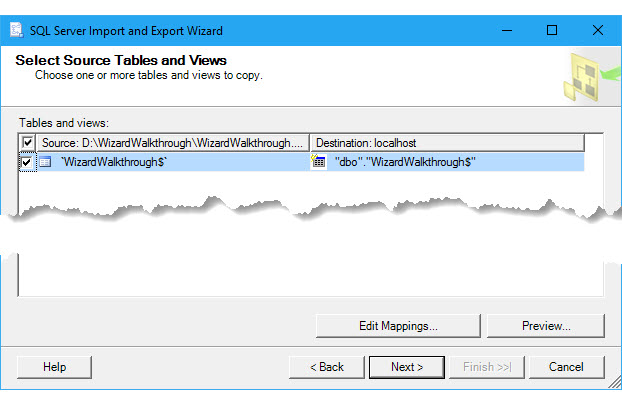

You probably want to remove the dollar sign ($) from the name of the new destination table.

For more info about this page of the wizard, see [Select Source Tables and Views](../../integration-services/import-export-data/select-source-tables-and-views-sql-server-import-and-export-wizard.md).

## Optional step 7 - Review the column mappings
Before you leave the **Select Source Tables and Views** page, optionally click the **Edit Mappings** button to open the **Column Mappings** dialog box. Here, in the **Mappings** table,  you see how the wizard is going to map columns in the source worksheet to columns in the new destination table.

For more info about this page of the wizard, see [Column Mappings](../../integration-services/import-export-data/column-mappings-sql-server-import-and-export-wizard.md).

## Optional step 8 - Review the CREATE TABLE statement
While the **Column Mappings** dialog box is open, optionally click the **Edit SQL** button to open the **Create Table SQL Statement** dialog box. Here you see the **CREATE TABLE** statement generated by the wizard to create the new destination table. Typically you don't have to change the statement.

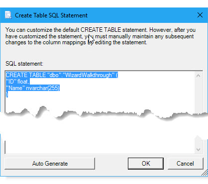

For more info about this page of the wizard, see [Create Table SQL Statement](../../integration-services/import-export-data/create-table-sql-statement-sql-server-import-and-export-wizard.md).

## Optional step 9 - Preview the data to copy
After you click **OK** to close the **Create Table SQL Statement** dialog box, then click **OK** again to close the **Column Mappings** dialog box, you're back on the **Select Source Tables and Views** page. Optionally click the **Preview** button to see a sample of the data that the wizard is going to copy. In this example, it looks OK.

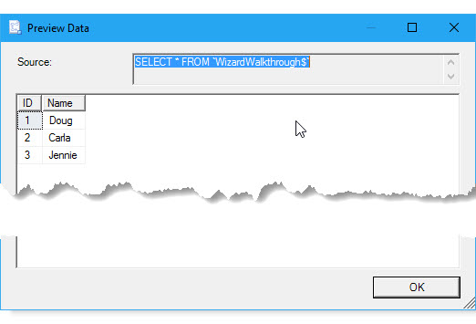

For more info about this page of the wizard, see [Preview Data](../../integration-services/import-export-data/preview-data-dialog-box-sql-server-import-and-export-wizard.md).

## Step 10 - Yes, you want to run the import-export operation
On the next page, **Save and Run Package**, you leave **Run immediately** enabled to copy the data as soon as you click **Finish** on the next page. Or you can skip the next page by clicking **Finish** on the **Save and Run Package** page.

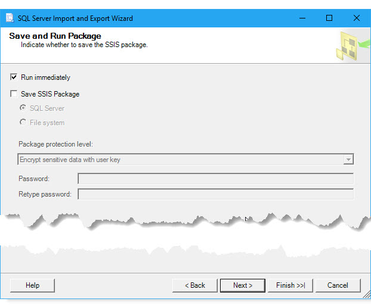

For more info about this page of the wizard, see [Save and Run Package](../../integration-services/import-export-data/save-and-run-package-sql-server-import-and-export-wizard.md).

## Step 11 - Finish the wizard and run the import-export operation
If you clicked **Next** instead of **Finish** on the **Save and Run Package** page, then on the next page, **Complete the Wizard**, you see a summary of what the wizard is going to do. Click **Finish** to run the import-export operation.

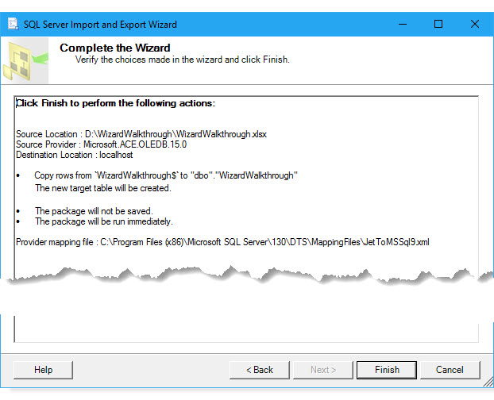

For more info about this page of the wizard, see [Complete the Wizard](../../integration-services/import-export-data/complete-the-wizard-sql-server-import-and-export-wizard.md).

## Step 12 - Review what the wizard did
On the final page, watch as the wizard finishes each task, then review the results. The highlighted line indicates that the wizard copied your data successfully. You're finished!

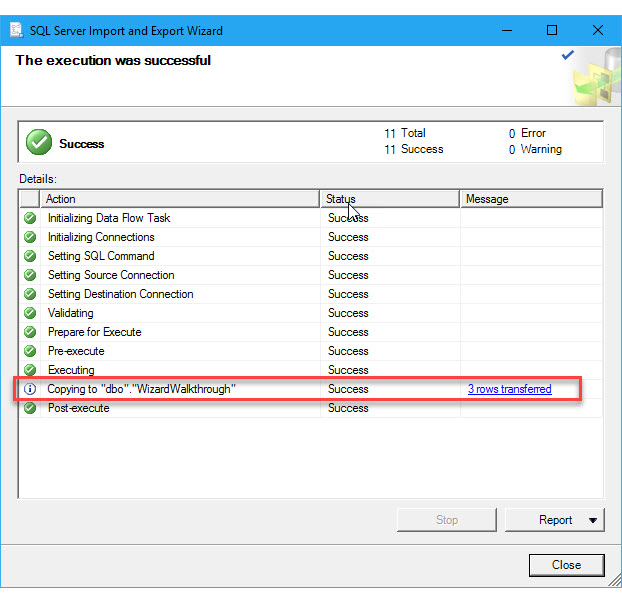

For more info about this page of the wizard, see [Performing Operation](../../integration-services/import-export-data/performing-operation-sql-server-import-and-export-wizard.md).

## Here's the new table of data copied to SQL Server
Here (in SQL Server Management Studio) you see the new destination table that the wizard created in SQL Server.

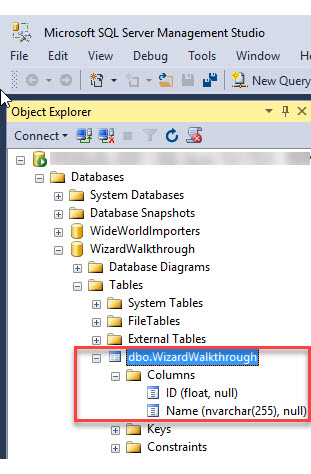

Here (again in SSMS) you see the data that the wizard copied to SQL Server.

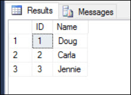

## Learn more  
Learn more about how the wizard works.
-   **Learn more about the wizard.** If you're looking for an overview of the wizard, see [Import and Export Data with the SQL Server Import and Export Wizard](../../integration-services/import-export-data/import-and-export-data-with-the-sql-server-import-and-export-wizard.md).

-   **Learn about the steps in the wizard.** If you're looking for info about the steps in the wizard, select the page you want from the list here - [Steps in the SQL Server Import and Export Wizard](../../integration-services/import-export-data/steps-in-the-sql-server-import-and-export-wizard.md). There's also a separate page of documentation for each page of the wizard.

-   **Learn how to connect to data sources and destinations.** If you're looking for info about how to connect to your data, select the page you want from the list here - [Connect to data sources with the SQL Server Import and Export Wizard](../../integration-services/import-export-data/connect-to-data-sources-with-the-sql-server-import-and-export-wizard.md). There's a separate page of documentation for each of several commonly used data sources.

-   **Learn more about loading data from and to Excel.** If you're looking for info about connecting to Excel files, and about limitations and known issues for loading data from or to Excel files, see [Load data from or to Excel with SQL Server Integration Services (SSIS)](../load-data-to-from-excel-with-ssis.md).
